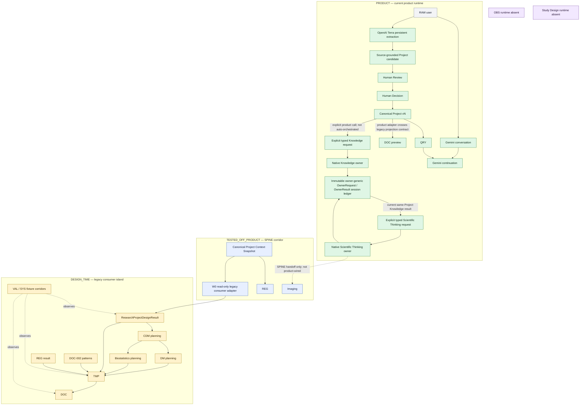
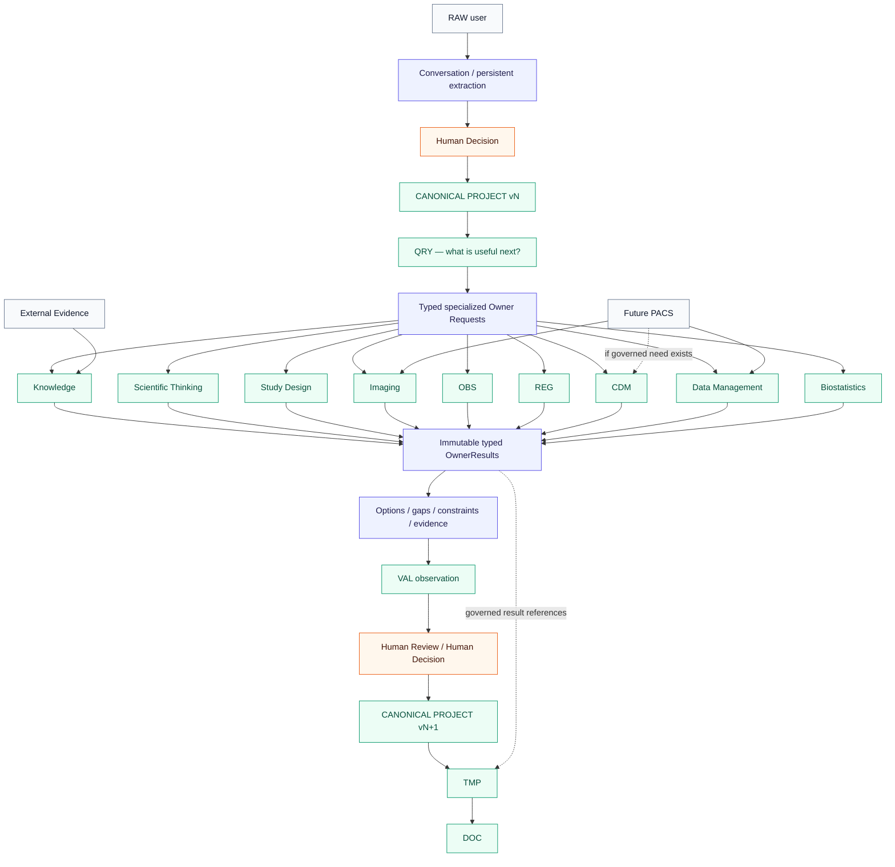

# NOXIA Engine Integration Roadmap

## Program cockpit for runtime convergence

| Field | Value |
|---|---|
| Control ID | `PROGRAM-CONTROL-01` |
| Classification | `LEVEL_3 — IMPLEMENTATION_CONTROL — NON_NORMATIVE` |
| Status | `CONTROLLED_LIVING_SNAPSHOT` |
| Snapshot date | 25 August 2026 |
| Verified baseline | `6fb7921c73a279bad7aa5e5ead473d793c6916c6` + W1ST01-01–28 |
| Working branch | `protocol-designer-canonical-ingestion` |
| Primary implementation input | `ENGINE-PORTFOLIO-01` |
| Portfolio diagnosis | `KNOWLEDGE_TO_SCIENTIFIC_THINKING_PRODUCT_WIRED_IMAGING_NOT_CONNECTED` |
| Superior authorities | NOXIA Founding Charter; Scientific Product Manifesto V2; applicable Level 1 specialized references |
| Documentary authority | None. This file does not amend, replace, or extend any authority. |

> This cockpit records verified implementation state, target state, gaps, sequencing, and proof requirements. If it diverges from a superior authority, the superior authority prevails and the divergence must be recorded. A target is not a runtime. A tested fixture corridor is not a product-wired corridor. An estimate is not a commitment.

## Two-minute control snapshot

| Control | Current value |
|---|---|
| Portfolio state | One canonical Project snapshot now feeds native Knowledge then native Scientific Thinking through typed product entrypoints and one immutable owner-generic session ledger; Imaging, VAL, REG and nominal owner selection remain outside this bounded product chain |
| Active wave | `WAVE_1_SCIENTIFIC_LOOP` |
| Current objective | Connect the retained Scientific Thinking result to Imaging while preserving the exact Project and Knowledge dependency chain. |
| Next wave | `WAVE_2_STUDY_DESIGN_TIME_CHAIN` after Wave 1 completion |
| Product corridor | Conversation + Terra extraction + Human Decision + Canonical Project + QRY + DOC preview; explicit canonical Project → Knowledge → Scientific Thinking invocation with immutable owner-result retention |
| Tested off-product corridor | Canonical Project Snapshot → REG; Scientific Thinking → Imaging; read-only adapter → CDM / DM / Biostatistics / TMP |
| Design-time island | Legacy `ResearchProjectDesignResult` consumers remain, but their tested input now derives from the same canonical owner snapshot through one fail-closed adapter |
| Main blocker | The product-callable Scientific Thinking result is not yet consumed by Imaging; broader owner selection remains absent from the nominal conversation loop. |
| Active engineering | One wave only; no engine development is authorized by this document itself. |

### Top quick wins queued in Wave 1

1. Imaging — consume the retained Scientific Thinking result while preserving the Knowledge lineage and OBS gap.
2. VAL — observe the typed scientific loop without repair or mutation.
3. REG — expose the existing contextual resolution or explicit gap as a conditional branch, without approval language.

### Top blockers

1. The nominal conversation loop does not yet select or invoke specialized owners automatically; Knowledge and Scientific Thinking require explicit product calls.
2. Scientific Thinking → Imaging remains tested only in the SPINE corridor and does not yet consume the retained product ST result.
3. No standalone Study Design runtime exists.
4. No OBS runtime exists.
5. Biostatistics calculation and realized-time Data Management are absent.

### Do not start now

- OBS runtime.
- Autonomous Study Design runtime.
- Biostatistics calculation.
- Realized-time Data Management.
- Decision Bundle UI.
- PACS integration.

## Status conventions

### Runtime state

| State | Meaning |
|---|---|
| `READY` | Runtime exists and its bounded current contract is demonstrated. |
| `AVAILABLE_WITH_LIMITATIONS` | Runtime exists, but material limitations remain explicit. |
| `PARTIAL` | Only a bounded subset of the capability is implemented. |
| `NORMATIVE_ONLY` | An authority defines the capability; no conforming runtime is demonstrated. |
| `HISTORICAL_ONLY` | Only a historical implementation or contract remains. |
| `BROKEN` | A previously expected runtime is currently non-functional. |
| `UNKNOWN` | Current evidence is insufficient to classify the runtime. |

### Integration maturity

| State | Meaning |
|---|---|
| `NOT_WIRED` | No executable connection to the governed product path. |
| `TESTED_OFF_PRODUCT` | Executable and tested in an isolated or fixture corridor only. |
| `CANONICAL_CALLABLE` | Callable from a canonical contract, outside the complete product loop. |
| `PRODUCT_CALLABLE` | Callable in a product surface, without complete hands-on proof of the end-to-end connection. |
| `INTERCONNECTED` | Participates in a typed multi-engine chain. |
| `HANDS_ON_VALIDATED` | The bounded connection was observed in a real product checkpoint. |

### Connection state

`NOT_PRESENT`, `NORMATIVE_TARGET`, `HISTORICAL`, `PARTIAL`, `TESTED_OFF_PRODUCT`, `PRODUCT_WIRED`, and `HANDS_ON_VALIDATED` describe only the demonstrated state of a handoff. They do not create a business lifecycle.

# View A — Engine map

## Current engine map — demonstrated implementation



Current-map qualification:

- The product Project is canonical and versioned, but the document path uses a compatibility projection before TMP/DOC.
- Knowledge and Scientific Thinking are product-callable through explicit typed requests from the exact same canonical Project snapshot. Their separate native results share one append-only owner-generic ledger, and the ST result retains references to the Knowledge result, assertions, evidence and sources without ownership transfer.
- REG and Imaging remain callable only in SPINE tests. The product Knowledge → Scientific Thinking chain is neither auto-triggered by QRY/conversation nor hands-on validated.
- CDM, DM, Biostatistics and TMP remain consumers of `ResearchProjectDesignResult`, but W0 now proves that this shape can be derived read-only from the same canonical snapshot; no product orchestration or realized-time capability follows from that proof.
- Study Design and OBS remain normative owners without standalone runtime.
- VAL has real deterministic runners and adapters, but no persisted transverse ValidationRun is part of the nominal current product corridor.

## Target engine map — not current capability



Target-map prohibitions:

- External Evidence enters Knowledge only; it never becomes Project truth directly.
- A future PACS contributes through Imaging, DM, or a justified CDM handoff; it never writes Project truth.
- OwnerResults remain immutable and referenced. Natural-language explanation never reconstructs the owner result.
- VAL observes and may block; it does not repair or mutate.
- Human Decision remains the only boundary from engaging candidate contribution to adopted Project state.

# View B — Engine matrix

The two tables below are one synchronized matrix split for readability. `A` describes runtime and integration; `B` describes governance, blockers, and completion control.

## Engine matrix A — runtime and integration

| Engine | Nature | Normative authority | Actual runtime state | Integration maturity | Current entrypoint | Actual capabilities | Current limitations | Current Project contract |
|---|---|---|---|---|---|---|---|---|
| Interaction / Conversation | Conversational mediation | Charter; Manifesto V2; PD-004; PD-005 | `READY` | `HANDS_ON_VALIDATED` | `executeProtocolDesignerBridge` / Protocol Designer workspace | One-turn natural response; concise post-adoption continuation; topic freedom | Not a scientific owner; no expert fallback authority | Product bridge context projection from adopted Project |
| Persistent extraction | Bounded compiler from free language to candidate Project contribution | Manifesto V2; PD-003 V2; SEM-002; PD-004 | `AVAILABLE_WITH_LIMITATIONS` | `HANDS_ON_VALIDATED` | `executeOpenAIPersistentDelta` then product bridge validation | Multi-object source-anchored changes, relations, temporal qualifications, Human Review candidate | OpenAI strict-schema hardening debt; provider output remains fallible and fail-closed | `PersistentProjectDeltaCandidate` → Project contribution against `ResearchProjectOwnerProjection` |
| QRY | Deterministic information-value navigator | PD-009; PD-004 | `AVAILABLE_WITH_LIMITATIONS` | `HANDS_ON_VALIDATED` | query-navigation engine and functional-reset progression | Recompute after adoption; select useful unresolved need; feed short Gemini continuation | Value-of-information product behavior still incomplete across all domains | Canonical adopted Project projection; legacy `ResearchProjectDesignResult` remains in older QRY adapters |
| Research Project | Canonical owner of adopted contextual truth | Manifesto V2; PD-003 V2; PRJ contracts | `READY` | `HANDS_ON_VALIDATED` | canonical backbone and contribution owner boundary | Typed objects, relations, roles, time, provenance, decisions, versions, supersession, reload | Legacy consumer shapes still exist as read projections | `ResearchProjectOwnerProjection` + `CanonicalResearchProjectState` → one `ProjectContextSnapshot`; selected legacy consumers use the W0 adapter |
| Knowledge | Global epistemic owner | KE-001; PD-003 V2 | `AVAILABLE_WITH_LIMITATIONS` | `PRODUCT_CALLABLE` | `invokeKnowledgeForProject` → `invokeKnowledgeOwnerFromSnapshot` → native Knowledge engine | Bounded assertions, sources, evidence, applicability, contradictions, gaps and native `KnowledgeResult`; immutable request/result retention and stale readback | Bounded local corpus; no automatic External Evidence; explicit product call only, not QRY/conversation orchestration or hands-on validation | Exact `ProjectContextSnapshot v0.3.0` + typed `KnowledgeRequest`; append-only product-session owner ledger outside Project truth |
| External Evidence | Governed evidence acquisition capability | KE-001; external-evidence contracts | `AVAILABLE_WITH_LIMITATIONS` | `PRODUCT_CALLABLE` | Knowledge external-evidence pipeline | Search observations, source status, provenance, partial/unavailable states | Does not admit Knowledge; source availability and coverage are external | Knowledge request context; no direct Project contract |
| Scientific Thinking | Specialized reasoning owner | RDE-001/002; PD-003 V2; ST implementation proof | `AVAILABLE_WITH_LIMITATIONS` | `PRODUCT_CALLABLE` | `invokeScientificThinkingForProject` → `invokeScientificThinkingOwnerFromSnapshot` → native ST engine | Questions, objectives, hypotheses, alternatives, unknowns, typed result and candidate contribution; native Knowledge dependencies retained without ownership transfer | Explicit product call only; no automatic adoption, Imaging handoff, QRY trigger or hands-on validation | Exact `ProjectContextSnapshot v0.3.0` + retained same-version Knowledge OwnerResult or explicit absence; shared append-only owner ledger |
| Study Design | Normative owner of study-strategy coherence | RDE-001/002; PD-003 V2 | `NORMATIVE_ONLY` | `NOT_WIRED` | explicit unavailable-owner path only | Honest `CALL_NONEXISTENT_ENGINE`/gap result | No standalone runtime | No runtime Project contract |
| Imaging | Specialized measurement-domain owner | RDE-003 v1.1; OBS-001; PD-003 V2 | `AVAILABLE_WITH_LIMITATIONS` | `TESTED_OFF_PRODUCT` | `invokeImagingOwnerFromScientificThinking` | Imaging design options, feasibility, limitations, quality/harmonization proposals, typed result | No executable acquisition protocol; OBS qualification absent; Knowledge chain not wired | `ProjectContextSnapshot` + Scientific Thinking result |
| OBS | Owner of general observability and measurement qualification | OBS-001; PD-003 V2 | `NORMATIVE_ONLY` | `NOT_WIRED` | capability inventory rejection | None beyond explicit absence | No standalone runtime or governed measurement catalogue | No runtime Project contract |
| REG | Specialized regulatory-resolution aid | REG-001; applicable corpus contracts | `AVAILABLE_WITH_LIMITATIONS` | `TESTED_OFF_PRODUCT` | `invokeRegulatoryOwnerFromProject` | Typed applicability resolution, unknown jurisdiction/context gaps, provenance and corpus version | Methodological aid only; not approval; corpus limitations | `ProjectContextSnapshot` adapter; legacy resolver also consumes `ResearchProjectDesignResult` projection |
| CDM | Study-data representation and planning owner | CDM-001; PD-003 V2; OBS-001 | `PARTIAL` | `TESTED_OFF_PRODUCT` | W0 snapshot adapter then data-analysis planning study-data contribution | Design-time DataNeeds, CanonicalVariables, ExpectedVariableOccasions | No realized occurrence runtime, storage, ingestion, or dataset execution | `ProjectContextSnapshot` → read-only `ResearchProjectDesignResult` projection → `DataAnalysisPlanningContext` |
| Data Management | Operational data lifecycle owner | DM-001; CDM-001 | `PARTIAL` | `TESTED_OFF_PRODUCT` | W0 snapshot adapter then data-management planning contribution | Logical design-time CRF, dictionary, schedule, governance plans | No ingestion, query, correction, reconciliation, freeze, lock, or release execution | Same canonical snapshot projection and planning context as CDM |
| Biostatistics | Analytic specification and inference owner | BIOSTATISTICS-001; CDM-001; DM-001 | `PARTIAL` | `TESTED_OFF_PRODUCT` | W0 snapshot adapter then biostatistics planning contribution | Design-time specifications, estimand/population/method needs, explicit numerical gaps | No calculation, sample-size result, `AnalysisExecution`, or `AnalysisResult` runtime | Same canonical snapshot projection and planning context as CDM/DM |
| TMP | Deterministic template composition consumer | TMP-001; PD-003 V2 | `AVAILABLE_WITH_LIMITATIONS` | `PRODUCT_CALLABLE` | functional-reset document boundary / `composeStudyTemplateInstance` | Template graph, requirements, unknowns, REG and documentary pattern integration | Current product path crosses a legacy Project projection; consumer only | `ResearchProjectDesignResult` compatibility projection |
| DOC-002 | Documentary knowledge pattern engine | DOC-002 implementation contract | `AVAILABLE_WITH_LIMITATIONS` | `TESTED_OFF_PRODUCT` | documentary pattern catalogue | Deterministic, versioned documentary patterns and provenance | Candidate/historical corpus limits; not a scientific or regulatory authority | No direct Project contract; consumed by TMP mappings |
| DOC | Read-only document projection engine | Manifesto V2; DOC-001/DOC-001B | `AVAILABLE_WITH_LIMITATIONS` | `HANDS_ON_VALIDATED` | functional-reset document portfolio / document projection | Project-derived preview, unknowns and gaps preserved, immutable projections | Protocol is the primary active definition; current adapter is not canonical-native | `ResearchProjectDesignResult` derived from canonical product Project |
| VAL | Read-only validation and diagnostic engine | VAL-000/VAL-001; PD-011 for qualification | `AVAILABLE_WITH_LIMITATIONS` | `TESTED_OFF_PRODUCT` | validation runners and product adapters | Deterministic invariant checks, findings, gates, human-review boundary | Live semantic reviewer disabled; no nominal persisted transverse run in product | Multiple typed adapters, including legacy Project and owner outputs |
| Cross-engine orchestration / SYS | Coordination and integration controls | RDE-001/002; PD-005; PD-009; SYS proofs | `PARTIAL` | `TESTED_OFF_PRODUCT` | SPINE chain, SYS fixtures, explicit product Knowledge and Scientific Thinking invocations | Typed off-product owner chains plus one bounded product Project → Knowledge → ST chain | No nominal scientific loop, Imaging/VAL product continuation or owner selection; no universal router is desired | Canonical snapshot and owner-generic ledger for Knowledge/ST; bounded legacy design-result projections for older consumers |

## Engine matrix B — ownership and completion control

| Engine | Typed owner result | Project contribution | Evidence / source capability | Stale protection | Human Decision required | Dependencies | Blocks | Next target | Next mission ID | Proof of completion | Last proof / test / commit |
|---|---|---|---|---|---|---|---|---|---|---|---|
| Interaction / Conversation | No | No direct contribution | Carries grounded context only | Project version supplied in context | Yes for any engaging mutation | Gemini server route; Product bridge | None for Wave 0 | Consume QRY/OwnerResult without ownership | Wave 4 | Hands-on owner-mediated dialogue with no hidden mutation | `be929dc2`, `9be06edc` |
| Persistent extraction | No; typed candidate instead | Yes, candidate only | Exact source anchors and provider artifact metadata | Validated against current Project refs | Yes | Terra server route; Project compiler | Strict schema debt | Remain the free-language compiler only | Wave 0 non-regression | Source-grounded candidate, complete review, fail-closed invalid output | `cae56c51`, `9ae7dba2`, `8fb7a999`, `9be06edc` |
| QRY | No; typed navigation result | No | Uses Project unknowns/gaps | Recomputed after adoption | No for navigation; yes for Project change | Canonical Project; Gemini mediation | Value-of-information gap | Route useful owner request, not only a question | Wave 4 | Real Project → appropriate owner request → short continuation | `f87006dc`, `be929dc2` |
| Research Project | No; owns canonical state | Sole adoption boundary | Preserves provenance and decisions | Version, digest, ledger, supersession | Always for engaging change | Contribution boundary; persistence | Multi-owner product orchestration | Supply the same Project/Knowledge/ST chain to Imaging | `W1-IMAGING-01_PRODUCT_SCIENTIFIC_THINKING_RESULT_HANDOFF` | Retained same-version ST result enters Imaging with its Knowledge dependencies and no Project mutation | `ee6102fa`; W0-PROJECT-01; W1K01-01–25; W1ST01-01–28 |
| Knowledge | Yes, native `KnowledgeResult` inside existing `SpecializedOwnerResult` | None in this bounded invocation; no automatic contribution | Native assertions, sources, applicability, contradictions, gaps | Product readback checks exact Project ID/version/digest; stale history retained | Yes for any later engaging Project adoption | Canonical snapshot; governed local corpus; product ST handoff | Nominal owner orchestration and downstream Imaging lineage | Preserve through Imaging | `W1-IMAGING-01_PRODUCT_SCIENTIFIC_THINKING_RESULT_HANDOFF` | Exact Knowledge result/assertion/evidence/source refs remain reconstructible through Imaging | `6fb7921c`; W1K01-01–25; W1ST01-01–28 / this commit |
| External Evidence | Typed evidence result, not owner result | No | Native source/evidence status | Provider/request identity; not Project stale guard | Knowledge admission remains governed | Network/source adapters; Knowledge | No direct Project use | Feed Knowledge only with governed admission | Wave 1 | Source → KnowledgeResult trace with applicability and limits | Current external-evidence tests |
| Scientific Thinking | Yes, native `ScientificThinkingOutput` inside existing `SpecializedOwnerResult` | Yes, candidate; never adopted here | Preserves Knowledge result/assertion/evidence/source refs and Project provenance | Project and exact Knowledge dependency stale checks; historical results retained | Yes for every engaging candidate | Canonical snapshot; retained Knowledge result or explicit gap | Imaging product handoff and nominal orchestration | Product-callable input to Imaging | `W1-IMAGING-01_PRODUCT_SCIENTIFIC_THINKING_RESULT_HANDOFF` | Retained ST result drives native Imaging while Knowledge/ST ownership and stale chain remain separate | `5413683d`; W1ST01-01–28 / this commit |
| Study Design | No runtime result | No runtime contribution | None | None | Would be required | RDE contracts; canonical Project; other owners | Runtime absent | Standalone coherent design owner | Later Wave 1 or explicit replan | Native result and contribution contract with no PRJ ownership transfer | Normative RDE-001/002 only |
| Imaging | Yes, `ImagingDesignResult` | Yes, candidate | Native provenance, limitations, Knowledge gaps | Yes | Yes | ST result; Knowledge; future OBS | Knowledge/OBS chain; product orchestration | Interconnected domain owner | Wave 1 | Real Project/ST/Knowledge → Imaging result → governed contribution | `5413683d` |
| OBS | No runtime result | No runtime contribution | None | None | Would be required | PD-003 V2; Knowledge; domain owners | Runtime absent | Minimal observability qualification | Wave 3 | Phenomenon/need → property → measurement definition with limits | OBS-001 normative admission only |
| REG | Yes, `RegulatoryResolutionResult` | Yes when legitimate; usually informational | Corpus refs, version/date, applicability, gaps | Yes in SPINE handoff | Yes for any Project strategy adoption | Canonical snapshot; REG corpus | Product orchestration and corpus limits | Product-callable conditional owner | Wave 1 | Real Project → REG result/gap; never approval | `7c9f012e` |
| CDM | Yes, planning contribution | Yes through the existing legacy adoption boundary | Project refs and planning provenance | Yes on source version/digest | Yes | Canonical snapshot adapter; Project DataNeeds | Wave-2 orchestration only | Canonical design-time planning | Wave 2 | Current canonical Project → typed CDM plan → governed adoption | DAI commits `c345bfc2`–`7501f66b`; W0P01-18 |
| Data Management | Yes, planning contribution | Yes through the existing legacy adoption boundary | Planning provenance and gaps | Yes on source version/digest | Yes | CDM plan; canonical snapshot adapter | No execution runtime | Canonical design-time planning | Wave 2 | CDM → DM plan → gaps/contribution with no execution claim | DAI commits `d3bd969f`–`7501f66b`; W0P01-19 |
| Biostatistics | Yes, planning contribution | Yes through the existing legacy adoption boundary | Explicit inputs, unknowns, provenance | Yes on source version/digest | Yes | Project endpoints; CDM/DM; canonical snapshot adapter | Calculation absent | Canonical planning only | Wave 2 | Plan reconstructible; every numeric value absent or sourced/adopted | DAI commits `aef67c80`–`7501f66b`; W0P01-20 |
| TMP | No; typed projection instance | No | Preserves Project/REG/pattern references | Input refs and digests | Project decisions must already exist | Canonical adapter; REG; DOC-002; planning results | Wave-2 orchestration only | Canonical-native template input | Wave 2 | Canonical Project + owner refs → stable TemplateInstance | TMP-001 tests; product document canaries; W0P01-21 |
| DOC-002 | No; typed pattern catalog | No | Native pattern evidence and provenance | Catalogue version/digest | No Project adoption | Documentary corpus | Corpus limitations | Remain passive evidence for TMP | Wave 2 | TMP mapping preserves status/source without making requirement mandatory | DOC-002 report/tests |
| DOC | No; typed projection | No | References authorized Project/owner facts | Source refs/digests; stale preview handling | No new decision; consumes adopted truth | TMP; canonical adapter | Projection coverage only | Canonical Project + governed owner refs | Wave 2 | Document facts remain subset of adopted Project and authorized owner facts | `deb79d53`; current DOC canaries |
| VAL | Yes, `ValidationResult` diagnostic | No | Typed findings/evidence/provenance | Run configuration and result digests | Human arbitration when required | All typed handoffs; domain validators | Not product-wired across owner loop | Observe Wave 1 loop | Wave 1 | Owner chain observed without repair or ownership transfer | `f69c8727`, `6f1fe1a0`, `103783e8`, `01d1d22e` |
| Cross-engine orchestration / SYS | No; execution metadata | No | Must preserve all referenced evidence | Must preserve Project and result versions/digests | Yes where downstream change engages Project | Canonical convergence; QRY; capabilities | No product owner loop | Typed, bounded orchestration | Wave 4 | QRY selects owner; result returns; no fallback or hidden mutation | `5413683d`; SYS integration tests |

# View C — Connection matrix

## Connection matrix A — current handoff evidence

| Producer | Output type | Consumer | Contract | Current state | Project contract generation | Tested | Product-wired | Version / digest preserved | Stale protection | Evidence preserved |
|---|---|---|---|---|---|---|---|---|---|---|
| RAW user | user turn | Conversation | Product bridge request | `HANDS_ON_VALIDATED` | Current product | Yes | Yes | Turn/session refs | N/A | Raw text retained in session |
| RAW user | user turn + source catalogue | Persistent extraction | OpenAI Responses function contract | `HANDS_ON_VALIDATED` | Current product | Yes | Yes | Turn, prompt/schema digests, provider refs | N/A | Exact source anchors/provider artifact metadata |
| Persistent extraction | `ProjectContributionCandidate` | Human Review → Project | candidate validation + review coverage + Human Decision | `HANDS_ON_VALIDATED` | Current product | Yes | Yes | Project refs/version/digest | Yes | Source text, provenance, review coverage |
| Project | QRY source state | QRY | query-navigation source adapter | `HANDS_ON_VALIDATED` | Current product plus older adapter | Yes | Yes | Project version | Recompute on adoption | Unknowns, decisions, gaps |
| QRY | bounded information need | Conversation | post-adoption mediation contract | `HANDS_ON_VALIDATED` | Current product | Yes | Yes | Project/QRY refs | Recomputed need | Need identity and context |
| Project | document source projection | DOC preview | functional-reset document boundary | `HANDS_ON_VALIDATED` | Current → legacy compatibility projection | Yes | Yes | Project and projection digests | Stale preview handling | Adopted facts only |
| Project | explicit typed `KnowledgeRequest` + exact snapshot | Knowledge | product `invokeKnowledgeForProject` + SPINE-03 native invocation | `PRODUCT_WIRED` | Current canonical `ProjectContextSnapshot v0.3.0` | Yes | Yes | Project ID/version/digest, request version and result identity | Yes; stale history remains readable | Native sources, evidence, applicability, contradictions, gaps and limitations |
| Project | `RegulatoryResolutionInput` | REG | SPINE-03 native invocation | `TESTED_OFF_PRODUCT` | Current canonical snapshot | Yes | No | Yes | Yes | Yes |
| Project | exact snapshot + typed ST request + optional retained Knowledge result | Scientific Thinking | product `invokeScientificThinkingForProject` + SPINE native invocation | `PRODUCT_WIRED` | Current canonical `ProjectContextSnapshot v0.3.0` | Yes | Yes | Project ID/version/digest and ST request/result versions | Yes; stale ST history remains readable | Native candidates, unknowns, limitations and Knowledge lineage |
| Scientific Thinking | typed ST-to-Imaging handoff | Imaging | `PROJECT_SPINE_04_ST_TO_IMAGING_HANDOFF` | `TESTED_OFF_PRODUCT` | Current canonical snapshot | Yes | No | Yes | Yes | Yes |
| Knowledge | retained `SpecializedOwnerResult<KnowledgeResult>` or explicit absence | Scientific Thinking | product owner-result dependency + native ST input `1.2.0` | `PRODUCT_WIRED` | Current canonical snapshot | Yes | Yes | Knowledge result identity/revision/digest and Project tuple | Fail closed on Project mismatch; dependent ST stale on Project or Knowledge change | Assertions remain Knowledge-owned; source/evidence refs, applicability, contradictions, gaps and limitations preserved |
| Knowledge | applicable `KnowledgeResult` | Imaging | Target owner-result reference | `NOT_PRESENT` | Target canonical | No | No | No runtime handoff | No | Current Imaging input preserves an explicit Knowledge gap only |
| Knowledge | evidence and measurement assertions | OBS | OBS-001 target handoff | `NORMATIVE_TARGET` | Target canonical | No | No | Required by target | Required by target | Required by target |
| Scientific Thinking | candidate design reasoning | Study Design | unavailable-owner handoff | `PARTIAL` | Current canonical snapshot | Unavailable path | No | Yes | Yes | Gap only; no Study Design result |
| Imaging | domain measurement proposal | OBS | OBS-001 target handoff | `NORMATIVE_TARGET` | Target canonical | No | No | Required by target | Required by target | Required by target |
| Imaging | `SpecializedOwnerResult<ImagingDesignResult>` | Project | SPINE-02 contribution boundary | `TESTED_OFF_PRODUCT` | Current canonical snapshot | Yes | No | Yes | Yes | Yes |
| Scientific Thinking | `SpecializedOwnerResult<ScientificThinkingOutput>` | Project | SPINE-02 contribution boundary | `TESTED_OFF_PRODUCT` | Current canonical snapshot | Yes | No | Yes | Yes | Yes |
| REG | `SpecializedOwnerResult<RegulatoryResolutionResult>` | Project | SPINE-02 contribution boundary | `TESTED_OFF_PRODUCT` | Current canonical snapshot | Yes | No | Yes | Yes | Yes |
| Project | canonical snapshot → legacy read projection → study-data planning context | CDM | W0 adapter + DAI planning adapter | `TESTED_OFF_PRODUCT` | Current canonical source; legacy read projection | Yes | No | Yes | Yes | Yes |
| Project | canonical snapshot → legacy read projection → DM planning context | Data Management | W0 adapter + DAI planning adapter | `TESTED_OFF_PRODUCT` | Current canonical source; legacy read projection | Yes | No | Yes | Yes | Yes |
| Project | canonical snapshot → legacy read projection → Biostatistics planning context | Biostatistics | W0 adapter + DAI planning adapter | `TESTED_OFF_PRODUCT` | Current canonical source; legacy read projection | Yes | No | Yes | Yes | Yes |
| OBS | qualified measurement refs | CDM | OBS/CDM target contract | `NORMATIVE_TARGET` | Target canonical | No | No | Required by target | Required by target | Required by target |
| OBS | qualified measurement refs | Biostatistics | OBS/Biostatistics target contract | `NORMATIVE_TARGET` | Target canonical | No | No | Required by target | Required by target | Required by target |
| CDM | study-data planning result | Data Management | DAI native planning context | `TESTED_OFF_PRODUCT` | Legacy `ResearchProjectDesignResult` | Yes | No | Yes | Yes | Yes |
| CDM | study-data planning result | Biostatistics | DAI native planning context | `TESTED_OFF_PRODUCT` | Legacy `ResearchProjectDesignResult` | Yes | No | Yes | Yes | Yes |
| Data Management | planning contribution | Project | DAI Human Decision boundary | `TESTED_OFF_PRODUCT` | Legacy `ResearchProjectDesignResult` | Yes | No | Yes | Yes | Yes |
| Biostatistics | planning contribution | Project | DAI Human Decision boundary | `TESTED_OFF_PRODUCT` | Legacy `ResearchProjectDesignResult` | Yes | No | Yes | Yes | Yes |
| Project | canonical snapshot → legacy read projection | TMP | W0 adapter + `composeStudyTemplateInstance` | `TESTED_OFF_PRODUCT` | Current canonical source; legacy read projection | Yes | No | Yes | Input version/digest checks | Unknowns, decisions, limitations and provenance preserved |
| Project | Project facts/unknowns | TMP | functional-reset compatibility adapter | `PRODUCT_WIRED` | Current → legacy projection | Yes | Yes | Yes | Preview freshness only | Yes |
| REG | applicable requirement set | TMP | TMP regulatory mapping | `TESTED_OFF_PRODUCT` | Legacy design-time | Yes | Indirectly | Yes | Input version check | Yes |
| DOC-002 | pattern mappings | TMP | TMP documentary pattern mapping | `TESTED_OFF_PRODUCT` | No direct Project generation | Yes | Indirectly | Catalogue version/digest | N/A | Yes |
| Data Management | planning result | TMP | design-time template input | `TESTED_OFF_PRODUCT` | Legacy design-time | Yes | No | Yes | Input refs | Yes |
| Biostatistics | planning result | TMP | design-time template input | `TESTED_OFF_PRODUCT` | Legacy design-time | Yes | No | Yes | Input refs | Yes |
| TMP | `StudyTemplateInstance` | DOC | DOC-001B template integration | `PRODUCT_WIRED` | Legacy projection derived from current Project | Yes | Yes | Yes | Template/source digest checks | Yes |
| VAL | `ValidationResult` / findings | Handoffs | VAL adapters and runners | `TESTED_OFF_PRODUCT` | Mixed generations | Yes | No nominal owner loop | Yes | Run/configuration digests | Yes |
| External Evidence | evidence search result | Knowledge | external-evidence pipeline | `PRODUCT_WIRED` | Knowledge context; no Project write | Yes | Knowledge surface only | Provider/source refs | Request-scoped | Yes |

## Connection matrix B — gaps and target control

| Connection | Known gap | Target state | Wave | Proof required |
|---|---|---|---|---|
| RAW → Conversation | No current blocking gap | `HANDS_ON_VALIDATED` | Non-regression | Concision, no ownership promotion, server-side provider |
| RAW → Persistent extraction | Strict schema hardening remains open | `HANDS_ON_VALIDATED` | Non-regression | Valid multi-object extraction and fail-closed invalid output |
| Extraction → Project | Human Review must remain exhaustive | `HANDS_ON_VALIDATED` | Non-regression | Candidate ≠ adopted; complete review; explicit decision |
| Project → QRY → Conversation | Value-of-information coverage is incomplete | `HANDS_ON_VALIDATED` across owner needs | Wave 4 | QRY selects owner-relevant need; Gemini only formulates it |
| Project → DOC | Compatibility projection crosses old Project generation | Canonical Project + governed owner refs → TMP → DOC | Waves 0 and 2 | Byte-stable facts/unknowns/refs; no transcript fallback |
| Project → Knowledge | Explicit product call is wired; no QRY/conversation auto-trigger and no hands-on proof | `HANDS_ON_VALIDATED` after later orchestration | Wave 1 / Wave 4 | User-visible bounded owner invocation preserves the same typed result and never mutates Project automatically |
| Project → REG | Not product invoked | `PRODUCT_WIRED` then `HANDS_ON_VALIDATED` | Wave 1 | Context/gap preserved; never approval |
| Project → Scientific Thinking | Explicit product call is wired; no QRY/conversation auto-trigger, Imaging continuation or hands-on proof | `HANDS_ON_VALIDATED` after later orchestration | Wave 1 / Wave 4 | Native ST result and candidate contribution remain separate and Project writes remain zero |
| Scientific Thinking → Imaging | Tested only off-product | `INTERCONNECTED` then hands-on | Wave 1 | ST result ref, Project version/digest, stale protection |
| Knowledge → Scientific Thinking | Explicit product handoff is wired; no Imaging continuation, nominal orchestration or hands-on proof | `HANDS_ON_VALIDATED` after later orchestration | Wave 1 / Wave 4 | Same-version KnowledgeResult influences ST without copying truth; exact dependency and stale chain remain reconstructible |
| Knowledge → Imaging | Current path supplies a gap, not a result | `INTERCONNECTED` | Wave 1 | Imaging input references applicable KnowledgeResult and limitations |
| Knowledge → OBS | OBS absent | `INTERCONNECTED` | Wave 3 | Typed evidence-to-measurement handoff |
| Scientific Thinking → Study Design | Owner absent; gap path only | `INTERCONNECTED` when runtime exists | Replan after Wave 1 | Standalone Study Design result and no PRJ ownership transfer |
| Imaging → OBS | OBS absent | `INTERCONNECTED` | Wave 3 | Domain proposal qualified by OBS, not auto-adopted |
| Imaging / ST / REG → Project | Off-product only | Governed product contribution path | Wave 1 | Complete review, stale rejection, Human Decision |
| Project → CDM / DM / Biostatistics | Adapter proven off-product; Wave-2 orchestration absent | Canonical-callable planning owners | Wave 2 | Same tested adapter plus governed owner-result/contribution corridor |
| OBS → CDM / Biostatistics | OBS absent | Typed canonical handoff | Wave 3 | Stable observable/measurement refs and limitations |
| CDM → DM / Biostatistics | Legacy design-time island | Canonical interconnected design-time chain | Wave 2 | Same Project version/digest and native payload preservation |
| DM / Biostatistics → Project | Legacy Project adoption only | Current canonical contribution boundary | Wave 2 | Stale-safe Human Decision creates Project vN+1 |
| Project / REG / DM / Biostatistics → TMP | Project adapter proven; planning-result orchestration absent | Canonical owner-result references | Wave 2 | Stable template instance with governed planning-owner references |
| TMP → DOC | Product wired through compatibility projection | Canonical-native document corridor | Wave 2 | Document facts subset of authorized upstream facts |
| VAL → handoffs | Not nominally persisted in owner product loop | `INTERCONNECTED` observer | Wave 1 | Findings/gates without repair, mutation, or false PASS |
| External Evidence → Knowledge | Not connected to Project owner loop | Governed evidence input to product Knowledge request | Wave 1 | Source/version/applicability preserved; Knowledge admission explicit |

# Shared knowledge and memory model

## A. Governed global Knowledge

Knowledge owns assertions, sources, evidence, contradictions, applicability, limitations, gaps, and versions. It does not own a Project decision. A source mention is not favorable evidence; an external search result is not admitted Knowledge until the Knowledge owner qualifies it.

## B. Research Project

The Research Project owns the adopted contextual truth of one project: question, objectives, population, choices, constraints, unknowns, trade-offs, relations, temporal qualifications, planned analyses, decisions, and authorized projections. It references global Knowledge and owner results without changing their epistemic force.

## C. Owner results

`KnowledgeResult`, `ScientificThinkingOutput`, `ImagingDesignResult`, `RegulatoryResolutionResult`, CDM/DM/Biostatistics planning results, and future specialized results are immutable, typed, versioned outputs. The Project may reference them. They do not become Project truth automatically and are never reconstructed from a Gemini explanation.

## D. Conversation and transcript

The transcript is a dialogue interface and provenance source for explicitly stated user content. It is neither global scientific memory, shared inter-engine state, nor adopted Project truth.

> `TRANSCRIPT ≠ SHARED_ENGINE_MEMORY`

# Active implementation rules

These are active implementation controls traced to superior authorities and current contracts; they do not add owners or scientific semantics.

1. No owner directly mutates another owner's state.
2. Engines communicate through typed handoffs with stable identities and versions.
3. Unknowns, contradictions, limitations, and provenance cross every boundary.
4. A `KnowledgeResult` is referenced, not copied as local truth.
5. An `OwnerResult` is never reconstructed from Gemini-generated prose.
6. The Research Project remains the adopted contextual memory.
7. Human Decision remains mandatory before any engaging Project mutation.
8. VAL observes or blocks; it never repairs source or target.
9. QRY determines **what** is useful next; Gemini formulates **how** to say it.
10. Terra compiles free user language into a candidate contribution; it does not adopt it.
11. Selection of an already typed NOXIA option does not require a Terra extraction call.

# Active implementation decisions

| ID | Decision | Reason | Source authority / evidence | Status | Date / commit |
|---|---|---|---|---|---|
| `IC-001` | Research Project is the adopted contextual memory. | Prevent transcript, projection, or owner output from becoming Project truth. | Manifesto V2 ch. 18; PD-003 V2; SPINE-01 | `ACTIVE` | 2026-08-25 / `ee6102fa` |
| `IC-002` | Knowledge is the governed global epistemic memory. | Preserve assertions, evidence, applicability, contradictions, and gaps outside Project ownership. | Manifesto V2 ch. 11; KE-001 | `ACTIVE` | 2026-08-25 |
| `IC-003` | Transcript is not shared inter-engine memory. | A dialogue projection cannot replace typed state. | Manifesto V2 ch. 39; PD-004; product evidence | `ACTIVE` | 2026-08-25 |
| `IC-004` | Owners communicate through typed handoffs. | Preserve identity, context, provenance, and ownership. | Manifesto V2 ch. 29–31; SPINE-02 | `ACTIVE` | 2026-08-25 / `8fc27d80` |
| `IC-005` | No owner silently mutates another owner's state. | Contribution is not ownership. | Manifesto V2 ch. 29; PD-003 V2 | `ACTIVE` | 2026-08-25 |
| `IC-006` | Human Decision precedes every engaging Project mutation. | Candidate does not equal adopted truth. | Manifesto V2 ch. 7 and 28; PD-004 | `ACTIVE` | 2026-08-25 |
| `IC-007` | Gemini is conversational mediation, not governed scientific source. | Natural expression must not replace an owner result. | Charter; Manifesto V2; product bridge | `ACTIVE` | 2026-08-25 / `be929dc2` |
| `IC-008` | Terra compiles free user language into a source-grounded candidate. | Separate linguistic compilation from Project adoption. | Manifesto V2; SEM-002; persistence evidence | `ACTIVE` | 2026-08-25 / `cae56c51`, `9be06edc` |
| `IC-009` | Selecting an existing typed option does not require Terra. | Avoid converting already governed state back through free-language extraction. | Charter ch. 6; typed handoff principle | `ACTIVE` | 2026-08-25 |
| `IC-010` | Only one integration wave is active at a time. | Keep dependencies, evidence, and stop conditions attributable. | `ENGINE-PORTFOLIO-01`; this Level 3 control | `ACTIVE_CONTROL` | 2026-08-25 |
| `IC-011` | Existing canonical Project contracts are reused; Wave 0 must not create a third Project ontology. | The demonstrated gap is consumer convergence, not absence of a canonical Project. | SPINE-01/02; current code audit | `ACTIVE_CONTROL` | 2026-08-25 / `9be06edc` |
| `IC-012` | Product owner requests/results are retained append-only outside Project truth. | Preserve immutable owner history and stale status without transferring scientific ownership or authorizing Project writes. | SPINE-02/03; W1K01-01–25 | `ACTIVE_CONTROL` | 2026-08-25 / this commit |
| `IC-013` | Scientific Thinking references the exact retained Knowledge result and governed evidence lineage; it never becomes owner of Knowledge assertions. | A typed dependency preserves explanations and stale detection without copying epistemic ownership or reconstructing sources from language. | RDE-001/002; KE-001; W1ST01-01–28 | `ACTIVE_CONTROL` | 2026-08-25 / this commit |

# Development waves

| Wave | Status | Objective | In scope | Definition of done | Explicitly not in scope |
|---|---|---|---|---|---|
| `WAVE_0_CANONICAL_CONVERGENCE` | `COMPLETE` | One existing canonical Project snapshot consumable by the engines and legacy consumers. | Canonical owner snapshot reuse; old-generation consumer adapter; minimal OwnerRequest/OwnerResult references; consumer convergence | Same Project ID/version/digest, stable refs, unknowns, time, provenance and decisions survive every selected adapter; no duplicate Project truth; no direct owner write | New OBS; Biostatistics calculation; DM realized-time; Decision Bundle UI; PACS |
| `WAVE_1_SCIENTIFIC_LOOP` | `ACTIVE` | Project → Knowledge → Scientific Thinking → Imaging → VAL → Project/QRY, with REG when applicable. | Product-callable native owners, owner-result references, validation observation, Human Review | A real Project produces versioned Knowledge/ST/Imaging/REG results and VAL observations without Gemini reconstruction or automatic adoption | Study Design reinvention; OBS runtime; statistical calculation |
| `WAVE_2_STUDY_DESIGN_TIME_CHAIN` | `PAUSED` | Project → CDM planning → DM planning → Biostatistics planning → TMP → DOC with gaps returned. | Canonicalize the existing design-time island | Current canonical Project drives native planning payloads and documents with governed return contributions | Realized-time DM; calculation/execution; full Study Design runtime unless separately authorized |
| `WAVE_3_OBS_MINIMAL` | `PAUSED` | Phenomenon/need → ObservableProperty → MeasurementDefinition → limitations. | Minimal OBS runtime and handoffs to Imaging/CDM/Biostatistics | Typed, evidence-bounded OBS result; no automatic BiomarkerRole adoption | Broad method catalogue; automatic biomarker qualification |
| `WAVE_4_CROSS_ENGINE_PRODUCT_ORCHESTRATION` | `PAUSED` | QRY → important decision → relevant owners → governed options/sources → Human Decision. | Product owner routing without a universal router | Correct owner invoked; absent capability remains absent; QRY owns next need | Decision Bundle UI |
| `WAVE_5_DECISION_BUNDLE_UX` | `PAUSED` | Multiple decisions in one message with selectable options, sources, free text, and Human Review. | User-facing grouped decision surface | Exhaustive review, optional selection where contract permits, no hidden adoption | New scientific owner or Project model |

## Wave control

`CURRENT_WAVE = WAVE_1_SCIENTIFIC_LOOP`

`CURRENT_OBJECTIVE = CONNECT_PRODUCT_SCIENTIFIC_THINKING_RESULT_TO_IMAGING_WITH_PRESERVED_KNOWLEDGE_LINEAGE`

`NEXT_WAVE = WAVE_2_STUDY_DESIGN_TIME_CHAIN_AFTER_WAVE_1_COMPLETION`

`PAUSED_WAVES = WAVE_2_STUDY_DESIGN_TIME_CHAIN, WAVE_3_OBS_MINIMAL, WAVE_4_CROSS_ENGINE_PRODUCT_ORCHESTRATION, WAVE_5_DECISION_BUNDLE_UX`

`DO_NOT_START = OBS_RUNTIME, AUTONOMOUS_STUDY_DESIGN, BIOSTATISTICS_CALCULATION, DM_REALIZED_TIME, DECISION_BUNDLE_UI, PACS_INTEGRATION`

# Next authorized mission

`NEXT_AUTHORIZED_MISSION = W1-IMAGING-01_PRODUCT_SCIENTIFIC_THINKING_RESULT_HANDOFF`

| Field | Contract |
|---|---|
| Mission goal | Feed one retained, current native Scientific Thinking result into the existing Imaging owner while preserving the exact Project tuple, Knowledge dependencies, owner boundaries and explicit OBS/Knowledge gaps. |
| Input | Current canonical Project snapshot; retained Knowledge and Scientific Thinking OwnerResults from the same Project ID/version/digest; existing native ST → Imaging handoff contract |
| Output | Typed native Imaging request/result retained in the shared owner ledger, with reconstructible ST and Knowledge dependencies and no automatic Project mutation |
| Definition of done | Same-version Project + Knowledge + ST chain invokes native Imaging; lineage, limitations and gaps survive; stale/mismatched ST or Knowledge fails closed; all historical results remain readable; Project writes remain zero |
| Engines / connections affected | Scientific Thinking → Imaging; Knowledge → Imaging lineage; Project → Imaging; owner-generic result ledger |
| Do not touch | OBS; Study Design runtime; Biostatistics calculation; realized-time DM; Decision Bundle UI; PACS; canonical Project ownership |

# Engine completion queue

| Order | Engine | From state | To state | Effort | Dependency | Wave | Blocked by | Notes |
|---:|---|---|---|---|---|---|---|---|
| 1 | Research Project consumer contracts | Mixed canonical + legacy | One canonical source with governed adapters | `M` | None | Wave 0 | None | Adapter ready off-product; legacy shapes remain projections, not truth. |
| 2 | Knowledge | `AVAILABLE_WITH_LIMITATIONS / PRODUCT_CALLABLE` | Hands-on through later orchestration | `M` | Wave 0 complete | Wave 1 / 4 | Nominal owner selection | Product Knowledge → ST handoff and immutable dependency readback are complete; hands-on remains later. |
| 3 | REG | `AVAILABLE_WITH_LIMITATIONS / TESTED_OFF_PRODUCT` | Product-callable conditional owner | `M` | Wave 0 | Wave 1 | Product owner orchestration | Preserve gaps and non-approval boundary. |
| 4 | Scientific Thinking | `AVAILABLE_WITH_LIMITATIONS / PRODUCT_CALLABLE` | Interconnected with Imaging | `M` | Knowledge + Wave 0 | Wave 1 | Product ST → Imaging handoff | Knowledge lineage is retained; no automatic adoption. |
| 5 | VAL | `AVAILABLE_WITH_LIMITATIONS / TESTED_OFF_PRODUCT` | Observer in scientific loop | `M` | Typed Wave 1 handoffs | Wave 1 | Product owner loop | Observe/block only. |
| 6 | Imaging | `AVAILABLE_WITH_LIMITATIONS / TESTED_OFF_PRODUCT` | Interconnected owner | `M` | Knowledge + ST | Wave 1 | OBS remains an explicit limitation | Quick win does not mean executable protocol. |
| 7 | CDM | `PARTIAL / TESTED_OFF_PRODUCT` | Canonical-callable design-time owner | `M` | Wave 0 | Wave 2 | Owner-result/contribution orchestration | Planning only. |
| 8 | Data Management | `PARTIAL / TESTED_OFF_PRODUCT` | Canonical-callable design-time owner | `M` | CDM | Wave 2 | Owner-result/contribution orchestration | Realized-time execution remains later/XL. |
| 9 | Biostatistics | `PARTIAL / TESTED_OFF_PRODUCT` | Canonical-callable planning owner | `L` | CDM + DM | Wave 2 | Calculation absent; orchestration pending | No invented effect size or sample size. |
| 10 | TMP / DOC | Mixed product adapter | Canonical-native projection chain | `M` | Wave 0 + planning owner refs | Wave 2 | Planning-result orchestration | Projection remains read-only. |
| 11 | Study Design | `NORMATIVE_ONLY / NOT_WIRED` | Native specialized owner | `L` | Wave 1 evidence and explicit authorization | Replan | Runtime absent | Do not conflate with PRJ ownership. |
| 12 | OBS | `NORMATIVE_ONLY / NOT_WIRED` | Minimal callable owner | `XL` | Knowledge/ST/Imaging handoffs | Wave 3 | Runtime absent | BiomarkerRole may remain a later slice. |

# Engineering estimates

These are `ENGINEERING_ESTIMATES — NON_CONTRACTUAL` copied from `ENGINE-PORTFOLIO-01`. Prompt counts are best / likely / worst. The available audit evidence retained active time only at portfolio level; no per-engine day count is invented here.

| Engine | To callable prompts | To product-usable additional prompts | Active time | Effort class |
|---|---:|---:|---|---|
| Interaction / Conversation | 0 / 0 / 1 | 1 / 2 / 4 | Included in portfolio aggregate | `XS` |
| Persistent extraction | 0 / 1 / 2 | 2 / 4 / 7 | Included in portfolio aggregate | `M` |
| QRY | 0 / 0 / 1 | 2 / 4 / 7 | Included in portfolio aggregate | `M` |
| Research Project | 0 / 0 / 1 | 1 / 2 / 4 | Included in portfolio aggregate | `S` |
| Knowledge | 0 / 1 / 2 | 2 / 4 / 7 | Included in portfolio aggregate | `M` |
| External Evidence | 0 / 1 / 2 | 2 / 4 / 7 | Included in portfolio aggregate | `M` |
| Scientific Thinking | 0 / 1 / 2 | 2 / 4 / 6 | Included in portfolio aggregate | `M` |
| Study Design | 4 / 6 / 8 | 4 / 7 / 10 | Included in portfolio aggregate | `L` |
| Imaging | 0 / 1 / 2 | 3 / 5 / 8 | Included in portfolio aggregate | `M` |
| OBS | 5 / 8 / 12 | 5 / 8 / 12 | Included in portfolio aggregate | `XL` |
| REG | 0 / 1 / 2 | 3 / 5 / 8 | Included in portfolio aggregate | `M` |
| CDM | 1 / 2 / 4 | 3 / 5 / 8 | Included in portfolio aggregate | `M` |
| Data Management | 1 / 2 / 4 | 3 / 5 / 8 | Included in portfolio aggregate | `M` design-time; `XL` realized-time |
| Biostatistics | 1 / 2 / 4 | 5 / 8 / 12 | Included in portfolio aggregate | `L` |
| TMP | 1 / 2 / 3 | 2 / 3 / 5 | Included in portfolio aggregate | `S` |
| DOC-002 | 0 / 0 / 1 | 1 / 2 / 4 | Included in portfolio aggregate | `S` |
| DOC | 0 / 1 / 2 | 2 / 4 / 7 | Included in portfolio aggregate | `M` |
| VAL | 0 / 1 / 2 | 2 / 4 / 7 | Included in portfolio aggregate | `M` |
| Cross-engine orchestration / SYS | 2 / 4 / 6 | 4 / 7 / 10 | Included in portfolio aggregate | `L` |

Portfolio totals retained from the audit:

- Gross to callable: `15 / 34 / 61` prompts.
- Gross additional to product-usable: `49 / 87 / 141` prompts.
- Gross total: `64 / 121 / 202` prompts.
- De-duplicated program estimate: `44 / 74 / 121` prompts.
- De-duplicated active engineering estimate: `22 / 38 / 65` engineer-days.

# Open implementation debts

| Debt | State | Impact | Blocks current wave | Target wave | Evidence |
|---|---|---|---|---|---|
| `VERCEL_SERVERLESS_TYPECHECK_GATE` | `OPEN_NON_BLOCKING_DEBT` | Deployment logs can surface serverless-only TypeScript gaps not covered by the local gate. | No | Operational hardening | Production/Preview deployment observations; intentionally deferred in 04R3 |
| `OPENAI_STRICT_SCHEMA_HARDENING_DEBT` | `OPEN` | Persistent extraction may require more provider-contract hardening while remaining fail-closed. | No | Product hardening | `api/protocol-designer-openai-extraction-provider.ts` |
| `QRY_VALUE_OF_INFORMATION_PRODUCT_GAP` | `OPEN` | QRY is in the loop, but owner-aware value-of-information coverage is incomplete. | No | Wave 4 | QRY production checkpoint and hands-on observations |
| `OWNER_ORCHESTRATION_PRODUCT_GAP` | `OPEN` | Knowledge and Scientific Thinking are explicitly product-callable, but QRY/conversation does not select owners and Imaging/VAL/REG are not in the nominal product loop. | No | Waves 1 and 4 | W1K01/W1ST01 product entrypoints vs nominal conversation loop |
| Study Design runtime | `ABSENT` | No standalone owner for study-strategy coherence. | No | Explicit replan after Wave 1 | Capability inventory; RDE-001/002 normative only |
| OBS runtime | `ABSENT` | Imaging cannot obtain complete general measurement qualification. | No | Wave 3 | OBS-001; capability inventory |
| Biostatistics calculation | `ABSENT` | No sample-size calculation or analytic execution. | No | Later explicit wave | Capability inventory; DAI tests keep values null |
| DM realized-time | `ABSENT` | No ingestion, queries, corrections, reconciliation, freeze/lock/release execution. | No | Later explicit wave | DM-001 vs planning runtime |
| Project contract generations | `CONVERGENCE_ADAPTER_READY` | Current and selected legacy consumers derive from one canonical owner snapshot; legacy shapes remain bounded read projections. | No | Wave 2 orchestration only | W0P01-01–25; W0 implementation report |

# Latest implementation proofs

| Checkpoint | Decision / SHA | Scope | What it proves | What it does not prove |
|---|---|---|---|---|
| W1-SCIENTIFIC-THINKING-01 | `W1_SCIENTIFIC_THINKING_01_PRODUCT_KNOWLEDGE_RESULT_HANDOFF_READY` / this commit | Product Knowledge → Scientific Thinking handoff | Same canonical Project and retained native Knowledge result invoke native ST; ownership, complete source/evidence lineage, applicability, gaps, contradictions and limitations survive a shared immutable ledger; stale dependencies fail closed; Project/provider writes are zero | Imaging/VAL/REG product wiring, QRY/automatic orchestration, hands-on scientific validity or Project adoption |
| W1-KNOWLEDGE-01 | `W1_KNOWLEDGE_01_PRODUCT_CANONICAL_OWNER_INVOCATION_READY` / `6fb7921c73a279bad7aa5e5ead473d793c6916c6` | Product canonical Knowledge invocation | Exact `ProjectContextSnapshot v0.3.0` invokes native local Knowledge; native result/gap, sources, applicability, contradictions and limitations survive an immutable session ledger; stale history is retained; Project writes and LLM/external calls are zero | QRY/automatic orchestration, downstream Imaging use, External Evidence execution, hands-on validity or broad corpus coverage |
| W0-PROJECT-01 | `W0_PROJECT_01_CANONICAL_PROJECT_CONSUMER_ADAPTER_READY` / `905de75d2223e10c3ce0da75c666dceba413fef2` | Canonical Project consumer convergence | One immutable snapshot supplies Knowledge/REG/ST/Imaging and read-only CDM/DM/Biostatistics/TMP projections with identical ID/version/digest and explicit gaps | Product owner orchestration, Wave-2 planning-result chain, calculation, realized-time execution |
| SPINE-01 | `ee6102fab386d916ac815f4f190dc583d25048f2` | Canonical Research Project backbone | Project identity, versions, temporal model, provenance, decisions, supersession, reload | Product owner orchestration or specialized engine availability |
| SPINE-02 | `8fc27d80fc3927813cb6614e2c47e8ac509d7128` | Specialized owner handoff backbone | Capability inventory, typed metadata, owner-result/contribution split, stale guard, no fallback | Real owner invocation or product wiring |
| SPINE-03 | `7c9f012e` | Native Knowledge/REG invocation and unavailable Biostatistics path | Real native owner calls from snapshot; absent calculation remains absent | Conversation product integration or broad scientific validity |
| SPINE-04 | `5413683d` | Scientific Thinking and Imaging owner chain | Typed ST → Imaging handoff, gaps, stale protection, contributions | Nominal product owner loop, OBS runtime, Study Design runtime |
| Persistence Terra | `cae56c51` | Specialized persistent extraction | Terra is the free-language Project candidate compiler in the product bridge | Specialized owner expertise or adoption authority |
| QRY production handoff | `f87006dc`, `be929dc2` | Post-adoption continuation | Adoption event recomputes QRY and displays a continuation | Owner-aware value-of-information completeness |
| Source-grounded ingestion | `9ae7dba2`, `8fb7a999`, `9be06edc` | Literal anchors and unknown temporal references | Source text is derived from RAW; unknown temporal reference remains unknown; validated Preview/production checkpoint | General semantic perfection or every scientific domain |
| Data-analysis planning | `c345bfc2` through `7501f66b` | CDM/DM/Biostatistics design-time island | Deterministic typed planning, Human Decision, stale checks, no numeric invention | Canonical current-Project convergence, calculation, or realized-time execution |
| VAL-001 | `f69c8727`, `6f1fe1a0`, `103783e8`, `01d1d22e` | Transverse validation capability | Read-only adapters, deterministic findings, Human Review boundary | Live semantic qualification or nominal persisted product owner-loop validation |
| ENGINE-PORTFOLIO-01 | `LEVEL_3_AUDIT — no dedicated commit` | Current portfolio inventory at baseline `9be06edc` | Runtime states, integration gaps, estimates, quick wins, convergence diagnosis | A new runtime, a product deployment, or normative authority |

# Roadmap synchronization rule

Every future mission that changes an engine, connection, Project contract, capability state, debt, or wave must update this file in the same commit. The update must describe evidence actually obtained; this file must never be edited merely to make the map match a desired result.

If a superior authority changes, this Level 3 cockpit must be reconciled after the authority is admitted. It must not pre-empt or silently reinterpret that authority.

# Future integration mission report contract

Every future engine-integration report must include:

```text
ROADMAP_UPDATED = YES / NO
CURRENT_WAVE = ...
ENGINE_STATE_CHANGES = ...
CONNECTION_STATE_CHANGES = ...
DEBTS_OPENED = ...
DEBTS_CLOSED = ...
NEXT_AUTHORIZED_MISSION = ...
```

If real implementation state changed and `ROADMAP_UPDATED = NO`, the mission is incomplete.

# PROGRAM-CONTROL-01 document gate

| Check | Result |
|---|---|
| Current map and target map are separate | `PASS` |
| Normative architecture and current runtime are separate | `PASS` |
| All 19 engines are accounted for | `PASS` |
| All critical current and target connections are accounted for | `PASS` |
| Quick wins and blockers are present | `PASS` |
| Important open debts are present | `PASS` |
| Exactly one wave is active | `PASS` |
| Exactly one next mission is authorized | `PASS` |
| No new philosophy, owner, scientific relation, or normative target is introduced | `PASS` |
| SOURCE-OF-TRUTH-INDEX modified | `NO` |
| Product code modified | `YES — explicit canonical Knowledge invocation and append-only owner-result retention; no automatic conversation/QRY trigger or Project write` |
