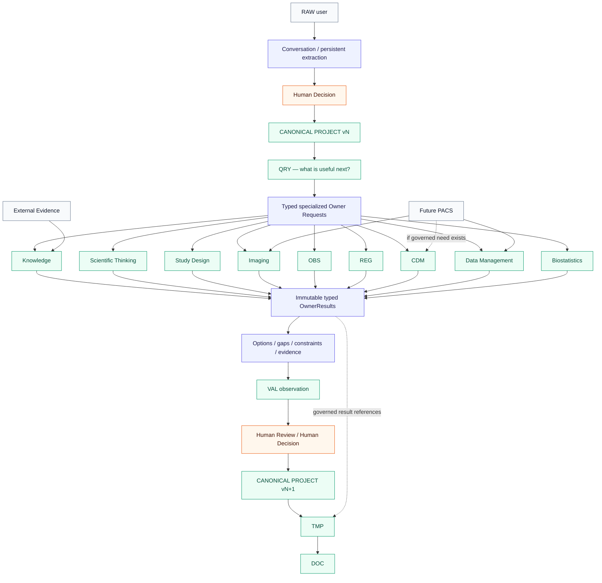

# NOXIA Engine Integration Roadmap

## Program cockpit for runtime convergence

| Field | Value |
|---|---|
| Control ID | `PROGRAM-CONTROL-01` |
| Classification | `LEVEL_3 — IMPLEMENTATION_CONTROL — NON_NORMATIVE` |
| Status | `CONTROLLED_LIVING_SNAPSHOT` |
| Snapshot date | 26 August 2026 |
| Verified baseline | `0b2474c21f69c22f441c98cd386826e5ad7e0eab` + W1-QUAL-02H1M2 fresh mechanistic human-review evidence recorded in the checkpoint commit containing this roadmap |
| Working branch | `protocol-designer-canonical-ingestion` |
| Primary implementation input | `ENGINE-PORTFOLIO-01` |
| Portfolio diagnosis | `SCIENTIFIC_THINKING_POST_REPAIR_MECHANISTIC_HUMAN_ADJUDICATION_PENDING` |
| Superior authorities | NOXIA Founding Charter; Scientific Product Manifesto V2; applicable Level 1 specialized references |
| Documentary authority | None. This file does not amend, replace, or extend any authority. |

> This cockpit records verified implementation state, target state, gaps, sequencing, and proof requirements. If it diverges from a superior authority, the superior authority prevails and the divergence must be recorded. A target is not a runtime. A tested fixture corridor is not a product-wired corridor. An estimate is not a commitment.

## Two-minute control snapshot

| Control | Current value |
|---|---|
| Portfolio state | One canonical Project snapshot now feeds native Knowledge, Scientific Thinking, Imaging and conditional REG through typed product entrypoints; native deterministic VAL observes the retained Knowledge/ST/Imaging chain through a separate append-only ValidationRun ledger; nominal owner selection remains outside this bounded product chain |
| Active wave | `WAVE_1_SCIENTIFIC_LOOP` |
| Current objective | Preserve the seven completed Campaign E human adjudications and expose one separately frozen, fresh mechanistic ST output for manual adjudication. |
| Next wave | `WAVE_2_STUDY_DESIGN_TIME_CHAIN` after Wave 1 completion |
| Product corridor | Conversation + Terra extraction + Human Decision + Canonical Project + QRY + DOC preview; explicit canonical Project → Knowledge → Scientific Thinking → Imaging → deterministic VAL observation, plus an explicit conditional Project → REG branch, with immutable owner-result and ValidationRun retention |
| Tested off-product corridor | Read-only adapter → CDM / DM / Biostatistics / TMP; historical SPINE and VAL fixture corridors |
| Design-time island | Legacy `ResearchProjectDesignResult` consumers remain, but their tested input now derives from the same canonical owner snapshot through one fail-closed adapter |
| Main blocker | Seven reviewable Campaign E outputs have been adjudicated by the human with no new critical ST defect; the lost original mechanistic case remains non-adjudicable. One fresh, related-but-distinct mechanistic case is now technically ready, but its H1–H8 scientific adjudication remains entirely pending. |
| Active engineering | One wave only; no engine development is authorized by this document itself. |

### Current Wave 1 checkpoint decisions after the bounded-human-review pivot

| Decision | Result | Evidence boundary |
|---|---|---|
| `W1_ARCHITECTURAL_CONVERGENCE_READY` | `YES` | Same canonical Project identity/snapshot, typed ownership and dependencies, immutable ledgers, stale guards, non-promotion and zero silent Project writes are demonstrated after the bounded Knowledge engine-version guard. Initial convergence was `FAILED`; post-repair convergence is `PASS`. |
| `W1_OBSERVABILITY_READY` | `YES` | A separate append-only trace ledger binds one `ScientificRun` to the exact Project snapshot and records ordered owner, handoff, persistence, stale and VAL events with request/result/dependency/digest/error refs; replay from event N is plan-only. |
| `W1_INDIVIDUAL_OWNER_CHARACTERIZATION_READY` | `NO` | Seven fresh post-repair Campaign E outputs have human dispositions, but the remaining mechanistic evidence gap is represented only by one fresh output whose H1–H8 fields are still pending. |
| `W1_CONTROLLED_LOOP_CHARACTERIZATION_READY` | `NO` | No controlled representative chain campaign with frozen inputs, explicit expectations and first-stage error attribution has been performed. |
| `WAVE_1_COMPLETE` | `NO` | Architectural convergence alone is necessary and insufficient. Wave 2 remains paused. |

`WAVE_2_AUTHORIZED = NO`

`HUMAN_SCIENTIFIC_ADJUDICATION_REQUIRED = YES`

`SCIENTIFIC_THINKING_CHARACTERIZATION = PENDING_FINAL_POST_REPAIR_HUMAN_ADJUDICATION`

`POST_REPAIR_MECHANISTIC_REASONING = PENDING_FRESH_HUMAN_ADJUDICATION`

`AUTOMATED_ST_CHARACTERIZATION_HARNESS = NOT_MATURE_FOR_SCIENTIFIC_ADJUDICATION`

`FURTHER_AUTOMATED_HARNESS_REPAIR = STOPPED_BY_HUMAN_PROGRAM_DECISION`

`FIRST_DIVERGENT_STAGE_DIAGNOSTIC_READINESS = YES`

`CONTROLLED_LOOP_CHARACTERIZATION = NOT_PERFORMED`

| Owner | Current characterization status | Bounded evidence |
|---|---|---|
| Knowledge | `CHARACTERIZED_WITHIN_BOUNDED_SCOPE` | 6/6 cases fully satisfied; honest gap, ambiguity and stale readback exercised; no critical violation observed. |
| Scientific Thinking | `PENDING_FINAL_POST_REPAIR_HUMAN_ADJUDICATION` | Engine `1.2.2` remains byte-identical. Seven Campaign E outputs received human dispositions: zero new `CRITICAL_ST_DEFECT`, six `ACCEPTABLE_WITH_LIMITATIONS`, one `ACCEPTABLE_WITHIN_TESTED_SCOPE`; the original mechanistic case remains technically non-adjudicable. W1-QUAL-02H1M2 adds one separately frozen fresh mechanistic output with three named candidate contributors, but H1–H8 remain pending and no Scientific PASS, PD-011 qualification or successful characterization is claimed. |
| Imaging | `CHARACTERIZED_WITHIN_BOUNDED_SCOPE` | 4/4 cases fully satisfied; candidate modality/acquisition, QA, Core Lab, unknown and OBS boundaries preserved. |
| REG | `CHARACTERIZED_WITHIN_BOUNDED_SCOPE` | 8/8 cases fully satisfied within REG-000 candidate corpus; unsupported jurisdiction and stale request fail closed; no approval claim. |
| VAL | `CHARACTERIZED_WITHIN_BOUNDED_SCOPE` | 13/13 structural cases fully satisfied, including clean-chain false-positive control; no repair or scientific qualification claim. |

### Top quick wins queued in Wave 1

The bounded ST owner repair remains complete. Seven recoverable Campaign E outputs were collected once and adjudicated by the human under the recorded Campaign E checker limitation. The unrecoverable first mechanistic output was never rerun. A separately frozen fresh mechanistic output is now ready for manual H1–H8 adjudication; no additional campaign or automated evaluator is authorized. Controlled-loop characterization remains unauthorized.

### Top blockers

1. The nominal conversation loop does not yet select or invoke specialized owners automatically; Knowledge and Scientific Thinking require explicit product calls.
2. No standalone Study Design runtime exists.
3. No OBS runtime exists.
4. Biostatistics calculation and realized-time Data Management are absent.

### Do not start now

- OBS runtime.
- Autonomous Study Design runtime.
- Biostatistics calculation.
- Realized-time Data Management.
- Decision Bundle UI.
- PACS integration.

## Status conventions

### Runtime state

| State | Meaning |
|---|---|
| `READY` | Runtime exists and its bounded current contract is demonstrated. |
| `AVAILABLE_WITH_LIMITATIONS` | Runtime exists, but material limitations remain explicit. |
| `PARTIAL` | Only a bounded subset of the capability is implemented. |
| `NORMATIVE_ONLY` | An authority defines the capability; no conforming runtime is demonstrated. |
| `HISTORICAL_ONLY` | Only a historical implementation or contract remains. |
| `BROKEN` | A previously expected runtime is currently non-functional. |
| `UNKNOWN` | Current evidence is insufficient to classify the runtime. |

### Integration maturity

| State | Meaning |
|---|---|
| `NOT_WIRED` | No executable connection to the governed product path. |
| `TESTED_OFF_PRODUCT` | Executable and tested in an isolated or fixture corridor only. |
| `CANONICAL_CALLABLE` | Callable from a canonical contract, outside the complete product loop. |
| `PRODUCT_CALLABLE` | Callable in a product surface, without complete hands-on proof of the end-to-end connection. |
| `INTERCONNECTED` | Participates in a typed multi-engine chain. |
| `HANDS_ON_VALIDATED` | The bounded connection was observed in a real product checkpoint. |

### Connection state

`NOT_PRESENT`, `NORMATIVE_TARGET`, `HISTORICAL`, `PARTIAL`, `TESTED_OFF_PRODUCT`, `PRODUCT_WIRED`, and `HANDS_ON_VALIDATED` describe only the demonstrated state of a handoff. They do not create a business lifecycle.

# View A — Engine map

## Current engine map — demonstrated implementation

```mermaid
flowchart TB
  classDef product fill:#dff6e5,stroke:#217a3c,color:#102a18
  classDef tested fill:#e7efff,stroke:#315da8,color:#17223a
  classDef design fill:#fff2cc,stroke:#997300,color:#332600
  classDef normative fill:#f2e8ff,stroke:#7040a0,color:#271534
  classDef boundary fill:#f3f4f6,stroke:#6b7280,color:#111827

  subgraph PRODUCT["PRODUCT — current product runtime"]
    RAW["RAW user"]:::boundary
    GEM["Gemini conversation"]:::product
    TERRA["OpenAI Terra persistent extraction"]:::product
    CAND["Source-grounded Project candidate"]:::product
    HR["Human Review"]:::product
    HD["Human Decision"]:::product
    CP["Canonical Project vN"]:::product
    QRY["QRY"]:::product
    CONT["Gemini continuation"]:::product
    DOCVIEW["DOC preview"]:::product
    KREQ["Explicit typed Knowledge request"]:::product
    KOWNER["Native Knowledge owner"]:::product
    OLEDGER["Immutable owner-generic OwnerRequest / OwnerResult session ledger"]:::product
    STREQ["Explicit typed Scientific Thinking request"]:::product
    STOWNER["Native Scientific Thinking owner"]:::product
    IMGREQ["Explicit typed Imaging request"]:::product
    IMGOWNER["Native Imaging owner"]:::product
    REGREQ["Explicit typed conditional REG request"]:::product
    REGOWNER["Native REG owner"]:::product
    VALREQ["Explicit structural-fidelity validation request"]:::product
    VALOWNER["Native deterministic VAL"]:::product
    VLEDGER["Immutable append-only ValidationRun ledger"]:::product
    RAW --> GEM --> CONT
    RAW --> TERRA --> CAND --> HR --> HD --> CP
    CP --> QRY --> CONT
    CP -->|"product adapter crosses legacy projection contract"| DOCVIEW
    CP -->|"explicit product call; not auto-orchestrated"| KREQ --> KOWNER --> OLEDGER
    OLEDGER -->|"current same-Project Knowledge result"| STREQ --> STOWNER --> OLEDGER
    OLEDGER -->|"current same-Project Knowledge + ST results"| IMGREQ --> IMGOWNER --> OLEDGER
    CP -->|"explicit conditional call; never auto-orchestrated"| REGREQ --> REGOWNER --> OLEDGER
    OLEDGER -->|"retained same-Project Knowledge + ST + Imaging results"| VALREQ --> VALOWNER --> VLEDGER
  end

  subgraph OFFPRODUCT["TESTED_OFF_PRODUCT — SPINE corridor"]
    SNAP["Canonical Project Context Snapshot"]:::tested
    ADAPTER["W0 read-only legacy consumer adapter"]:::tested
    SNAP --> ADAPTER
  end

  subgraph ISLAND["DESIGN_TIME — legacy consumer island"]
    RPD["ResearchProjectDesignResult"]:::design
    CDM["CDM planning"]:::design
    DM["DM planning"]:::design
    BIO["Biostatistics planning"]:::design
    REG2["REG result"]:::design
    DOC2["DOC-002 patterns"]:::design
    TMP["TMP"]:::design
    DOC["DOC"]:::design
    VAL["VAL / SYS fixture corridors"]:::design
    RPD --> CDM
    CDM --> DM
    CDM --> BIO
    RPD --> TMP
    REG2 --> TMP
    DOC2 --> TMP
    DM --> TMP
    BIO --> TMP
    TMP --> DOC
    VAL -. observes .-> RPD
    VAL -. observes .-> TMP
    VAL -. observes .-> DOC
  end

  ADAPTER --> RPD

  OBS["OBS runtime absent"]:::normative
  SD["Study Design runtime absent"]:::normative
```



Current-map qualification:

- The product Project is canonical and versioned, but the document path uses a compatibility projection before TMP/DOC.
- Knowledge, Scientific Thinking, Imaging and REG are product-callable through explicit typed requests from the exact same canonical Project snapshot. Their separate native results share one append-only owner-generic ledger; Imaging retains exact ST and Knowledge result dependencies while source/evidence ownership remains with Knowledge. Native deterministic VAL observes the retained Knowledge/ST/Imaging chain through a distinct append-only `ValidationRun` ledger.
- REG is conditional, caller-triggered and corpus-bounded. Missing jurisdiction/context remains explicit, unsupported jurisdictions fail closed, and no result is an approval or legal conclusion. No owner call is auto-triggered by QRY/conversation or hands-on validated.
- CDM, DM, Biostatistics and TMP remain consumers of `ResearchProjectDesignResult`, but W0 now proves that this shape can be derived read-only from the same canonical snapshot; no product orchestration or realized-time capability follows from that proof.
- Study Design and OBS remain normative owners without standalone runtime.
- VAL is product-callable through the bounded `SCIENTIFIC_OWNER_CHAIN_FIDELITY` profile. It preserves exact Project and owner-result refs, reports structural findings without repair or mutation, and makes no PD-011 scientific qualification claim. It is not auto-orchestrated or hands-on validated.

## Target engine map — not current capability



Target-map prohibitions:

- External Evidence enters Knowledge only; it never becomes Project truth directly.
- A future PACS contributes through Imaging, DM, or a justified CDM handoff; it never writes Project truth.
- OwnerResults remain immutable and referenced. Natural-language explanation never reconstructs the owner result.
- VAL observes and may block; it does not repair or mutate.
- Human Decision remains the only boundary from engaging candidate contribution to adopted Project state.

# View B — Engine matrix

The two tables below are one synchronized matrix split for readability. `A` describes runtime and integration; `B` describes governance, blockers, and completion control.

## Engine matrix A — runtime and integration

| Engine | Nature | Normative authority | Actual runtime state | Integration maturity | Current entrypoint | Actual capabilities | Current limitations | Current Project contract |
|---|---|---|---|---|---|---|---|---|
| Interaction / Conversation | Conversational mediation | Charter; Manifesto V2; PD-004; PD-005 | `READY` | `HANDS_ON_VALIDATED` | `executeProtocolDesignerBridge` / Protocol Designer workspace | One-turn natural response; concise post-adoption continuation; topic freedom | Not a scientific owner; no expert fallback authority | Product bridge context projection from adopted Project |
| Persistent extraction | Bounded compiler from free language to candidate Project contribution | Manifesto V2; PD-003 V2; SEM-002; PD-004 | `AVAILABLE_WITH_LIMITATIONS` | `HANDS_ON_VALIDATED` | `executeOpenAIPersistentDelta` then product bridge validation | Multi-object source-anchored changes, relations, temporal qualifications, Human Review candidate | OpenAI strict-schema hardening debt; provider output remains fallible and fail-closed | `PersistentProjectDeltaCandidate` → Project contribution against `ResearchProjectOwnerProjection` |
| QRY | Deterministic information-value navigator | PD-009; PD-004 | `AVAILABLE_WITH_LIMITATIONS` | `HANDS_ON_VALIDATED` | query-navigation engine and functional-reset progression | Recompute after adoption; select useful unresolved need; feed short Gemini continuation | Value-of-information product behavior still incomplete across all domains | Canonical adopted Project projection; legacy `ResearchProjectDesignResult` remains in older QRY adapters |
| Research Project | Canonical owner of adopted contextual truth | Manifesto V2; PD-003 V2; PRJ contracts | `READY` | `HANDS_ON_VALIDATED` | canonical backbone and contribution owner boundary | Typed objects, relations, roles, time, provenance, decisions, versions, supersession, reload | Legacy consumer shapes still exist as read projections | `ResearchProjectOwnerProjection` + `CanonicalResearchProjectState` → one `ProjectContextSnapshot`; selected legacy consumers use the W0 adapter |
| Knowledge | Global epistemic owner | KE-001; PD-003 V2 | `AVAILABLE_WITH_LIMITATIONS` | `PRODUCT_CALLABLE` | `invokeKnowledgeForProject` → `invokeKnowledgeOwnerFromSnapshot` → native Knowledge engine | Bounded assertions, sources, evidence, applicability, contradictions, gaps and native `KnowledgeResult`; immutable request/result retention and stale readback | Bounded local corpus; no automatic External Evidence; explicit product call only, not QRY/conversation orchestration or hands-on validation | Exact `ProjectContextSnapshot v0.3.0` + typed `KnowledgeRequest`; append-only product-session owner ledger outside Project truth |
| External Evidence | Governed evidence acquisition capability | KE-001; external-evidence contracts | `AVAILABLE_WITH_LIMITATIONS` | `PRODUCT_CALLABLE` | Knowledge external-evidence pipeline | Search observations, source status, provenance, partial/unavailable states | Does not admit Knowledge; source availability and coverage are external | Knowledge request context; no direct Project contract |
| Scientific Thinking | Specialized reasoning owner | RDE-001/002; PD-003 V2; ST implementation proof | `AVAILABLE_WITH_LIMITATIONS` | `PRODUCT_CALLABLE` | `invokeScientificThinkingForProject` → `invokeScientificThinkingOwnerFromSnapshot` → native ST engine `1.2.2` | Questions, objectives, hypotheses, exact Knowledge-derived candidate alternatives/mechanisms, structuring Project clarifications, owner-boundary refusals, typed result and candidate contribution; native Knowledge dependencies retained without ownership transfer | Explicit product call only; post-repair scientific characterization is not adjudicated; no automatic adoption, QRY trigger or hands-on validation | Exact `ProjectContextSnapshot v0.3.0` + retained same-version Knowledge OwnerResult or explicit absence; shared append-only owner ledger consumed by Imaging |
| Study Design | Normative owner of study-strategy coherence | RDE-001/002; PD-003 V2 | `NORMATIVE_ONLY` | `NOT_WIRED` | explicit unavailable-owner path only | Honest `CALL_NONEXISTENT_ENGINE`/gap result | No standalone runtime | No runtime Project contract |
| Imaging | Specialized measurement-domain owner | RDE-003 v1.1; OBS-001; PD-003 V2 | `AVAILABLE_WITH_LIMITATIONS` | `PRODUCT_CALLABLE` | `invokeImagingForProject` → `invokeImagingOwnerFromScientificThinking` → native Imaging engine | Imaging design options, alternatives, feasibility, limitations, quality/reading/Core Lab candidates and typed native result; exact Knowledge/ST dependencies retained | Explicit product call only; no executable acquisition protocol; OBS qualification absent; no automatic Project adoption or hands-on validation | Exact `ProjectContextSnapshot v0.3.0` + retained same-version Knowledge and ST OwnerResults; shared append-only owner ledger |
| OBS | Owner of general observability and measurement qualification | OBS-001; PD-003 V2 | `NORMATIVE_ONLY` | `NOT_WIRED` | capability inventory rejection | None beyond explicit absence | No standalone runtime or governed measurement catalogue | No runtime Project contract |
| REG | Specialized regulatory-resolution aid | REG-001; applicable corpus contracts | `AVAILABLE_WITH_LIMITATIONS` | `PRODUCT_CALLABLE` | `invokeRegulatoryForProject` → `invokeRegulatoryOwnerFromSnapshot` → native REG resolver | Typed applicability resolution, requirements, unknown jurisdiction/context gaps, unsupported-jurisdiction guard, provenance and exact corpus version | Explicit conditional call only; methodological aid, never approval/legal conclusion; REG-000 is candidate/non-admitted and bounded to FR, EU/EEA, US plus international guidance | Exact `ProjectContextSnapshot v0.3.0` + caller-supplied `RegulatoryResolutionInput`; shared append-only owner ledger outside Project truth |
| CDM | Study-data representation and planning owner | CDM-001; PD-003 V2; OBS-001 | `PARTIAL` | `TESTED_OFF_PRODUCT` | W0 snapshot adapter then data-analysis planning study-data contribution | Design-time DataNeeds, CanonicalVariables, ExpectedVariableOccasions | No realized occurrence runtime, storage, ingestion, or dataset execution | `ProjectContextSnapshot` → read-only `ResearchProjectDesignResult` projection → `DataAnalysisPlanningContext` |
| Data Management | Operational data lifecycle owner | DM-001; CDM-001 | `PARTIAL` | `TESTED_OFF_PRODUCT` | W0 snapshot adapter then data-management planning contribution | Logical design-time CRF, dictionary, schedule, governance plans | No ingestion, query, correction, reconciliation, freeze, lock, or release execution | Same canonical snapshot projection and planning context as CDM |
| Biostatistics | Analytic specification and inference owner | BIOSTATISTICS-001; CDM-001; DM-001 | `PARTIAL` | `TESTED_OFF_PRODUCT` | W0 snapshot adapter then biostatistics planning contribution | Design-time specifications, estimand/population/method needs, explicit numerical gaps | No calculation, sample-size result, `AnalysisExecution`, or `AnalysisResult` runtime | Same canonical snapshot projection and planning context as CDM/DM |
| TMP | Deterministic template composition consumer | TMP-001; PD-003 V2 | `AVAILABLE_WITH_LIMITATIONS` | `PRODUCT_CALLABLE` | functional-reset document boundary / `composeStudyTemplateInstance` | Template graph, requirements, unknowns, REG and documentary pattern integration | Current product path crosses a legacy Project projection; consumer only | `ResearchProjectDesignResult` compatibility projection |
| DOC-002 | Documentary knowledge pattern engine | DOC-002 implementation contract | `AVAILABLE_WITH_LIMITATIONS` | `TESTED_OFF_PRODUCT` | documentary pattern catalogue | Deterministic, versioned documentary patterns and provenance | Candidate/historical corpus limits; not a scientific or regulatory authority | No direct Project contract; consumed by TMP mappings |
| DOC | Read-only document projection engine | Manifesto V2; DOC-001/DOC-001B | `AVAILABLE_WITH_LIMITATIONS` | `HANDS_ON_VALIDATED` | functional-reset document portfolio / document projection | Project-derived preview, unknowns and gaps preserved, immutable projections | Protocol is the primary active definition; current adapter is not canonical-native | `ResearchProjectDesignResult` derived from canonical product Project |
| VAL | Read-only validation and diagnostic engine | VAL-000/VAL-001; PD-011 solely for the excluded scientific-qualification boundary | `AVAILABLE_WITH_LIMITATIONS` | `PRODUCT_CALLABLE` | `validateScientificOwnerChainForProject` → `runCheckpointValidation` | Deterministic structural-fidelity observations/findings over exact Project, Knowledge, ST and Imaging refs; immutable `ValidationRun` retention/readback; stale, lineage, ownership and epistemic-gap diagnostics | Explicit call only; no semantic reviewer, repair, automatic decision, PD-011 qualification or hands-on validation | Exact `ProjectContextSnapshot v0.3.0` + retained owner-result ledger → validation-only snapshots and separate append-only ValidationRun ledger |
| Cross-engine orchestration / SYS | Coordination and integration controls | RDE-001/002; PD-005; PD-009; SYS proofs | `PARTIAL` | `TESTED_OFF_PRODUCT` | SPINE chain, SYS fixtures, explicit product Knowledge, ST, Imaging, REG and VAL invocations | Typed off-product owner chains plus one bounded product Project → Knowledge → ST → Imaging → VAL chain and a conditional Project → REG branch | No nominal QRY/conversation owner selection; no universal router is desired | Canonical snapshot, owner-generic ledger for Knowledge/ST/Imaging/REG and separate validation ledger; bounded legacy design-result projections for older consumers |

## Engine matrix B — ownership and completion control

| Engine | Typed owner result | Project contribution | Evidence / source capability | Stale protection | Human Decision required | Dependencies | Blocks | Next target | Next mission ID | Proof of completion | Last proof / test / commit |
|---|---|---|---|---|---|---|---|---|---|---|---|
| Interaction / Conversation | No | No direct contribution | Carries grounded context only | Project version supplied in context | Yes for any engaging mutation | Gemini server route; Product bridge | None for Wave 0 | Consume QRY/OwnerResult without ownership | Wave 4 | Hands-on owner-mediated dialogue with no hidden mutation | `be929dc2`, `9be06edc` |
| Persistent extraction | No; typed candidate instead | Yes, candidate only | Exact source anchors and provider artifact metadata | Validated against current Project refs | Yes | Terra server route; Project compiler | Strict schema debt | Remain the free-language compiler only | Wave 0 non-regression | Source-grounded candidate, complete review, fail-closed invalid output | `cae56c51`, `9ae7dba2`, `8fb7a999`, `9be06edc` |
| QRY | No; typed navigation result | No | Uses Project unknowns/gaps | Recomputed after adoption | No for navigation; yes for Project change | Canonical Project; Gemini mediation | Value-of-information gap | Route useful owner request, not only a question | Wave 4 | Real Project → appropriate owner request → short continuation | `f87006dc`, `be929dc2` |
| Research Project | No; owns canonical state | Sole adoption boundary | Preserves provenance and decisions | Version, digest, ledger, supersession | Always for engaging change | Contribution boundary; persistence | Multi-owner product orchestration | Verify Wave 1 convergence | `W1-CLOSURE-01_SCIENTIFIC_LOOP_CONVERGENCE_CHECKPOINT` | All bounded Wave 1 owners consume the exact Project tuple without ownership transfer, approval language or mutation | `ee6102fa`; W0-PROJECT-01; W1K01-01–25; W1ST01-01–28; W1IMG01-01–34; W1VAL01-01–35; W1REG01-01–35 / this commit |
| Knowledge | Yes, native `KnowledgeResult` inside existing `SpecializedOwnerResult` | None in this bounded invocation; no automatic contribution | Native assertions, sources, applicability, contradictions, gaps | Product readback checks exact Project ID/version/digest; dependent ST/Imaging stale on exact dependency change | Yes for any later engaging Project adoption | Canonical snapshot; governed local corpus; product ST/Imaging/VAL handoff | Nominal owner orchestration | Later hands-on orchestration | Wave 4 | Exact Knowledge result/assertion/evidence/source refs remain reconstructible through VAL findings | `6fb7921c`; W1K01-01–25; W1ST01-01–28; W1IMG01-01–34; W1VAL01-01–35 / this commit |
| External Evidence | Typed evidence result, not owner result | No | Native source/evidence status | Provider/request identity; not Project stale guard | Knowledge admission remains governed | Network/source adapters; Knowledge | No direct Project use | Feed Knowledge only with governed admission | Wave 1 | Source → KnowledgeResult trace with applicability and limits | Current external-evidence tests |
| Scientific Thinking | Yes, native `ScientificThinkingOutput` inside existing `SpecializedOwnerResult` | Yes, candidate; never adopted here | Preserves Knowledge result/assertion/evidence/source refs and Project provenance | Project and exact Knowledge dependency stale checks; dependent Imaging stale on exact ST change | Yes for every engaging candidate | Canonical snapshot; retained Knowledge result or explicit gap | Nominal orchestration | Later hands-on orchestration | Wave 4 | VAL sees ST candidates and dependencies without ownership transfer or repair | `218715fc`; W1ST01-01–28; W1IMG01-01–34; W1VAL01-01–35 / this commit |
| Study Design | No runtime result | No runtime contribution | None | None | Would be required | RDE contracts; canonical Project; other owners | Runtime absent | Standalone coherent design owner | Later Wave 1 or explicit replan | Native result and contribution contract with no PRJ ownership transfer | Normative RDE-001/002 only |
| Imaging | Yes, native `ImagingDesignResult` inside existing `SpecializedOwnerResult` | No Project contribution in this read-only product invocation; native candidates remain pending | Native provenance, Knowledge evidence lineage, ST dependencies, limitations and distinct Knowledge/OBS gaps | Project and exact Knowledge/ST dependency stale checks; history retained | Yes before any engaging use/adoption | Same Project snapshot; retained Knowledge and ST results; future OBS | Nominal orchestration; OBS remains absent | Later hands-on orchestration | Wave 4 | VAL observes native Imaging result, executable-protocol refusal, unknown equipment and OBS gap without repair | `5cdc625c`, `ecb4bc85`; W1IMG01-01–34; W1VAL01-01–35 / this commit |
| OBS | No runtime result | No runtime contribution | None | None | Would be required | PD-003 V2; Knowledge; domain owners | Runtime absent | Minimal observability qualification | Wave 3 | Phenomenon/need → property → measurement definition with limits | OBS-001 normative admission only |
| REG | Yes, native `RegulatoryResolutionResult` inside existing `SpecializedOwnerResult` | None in this bounded invocation; findings remain informational owner output | Requirement/source refs, corpus version/digest, applicability, gaps, missing context and limitations | Product readback checks exact Project ID/version/digest; historical stale result remains readable | Yes for any later engaging Project adoption; never bypassed here | Exact canonical snapshot; explicit typed request/purpose; local REG-000 corpus | Candidate/non-admitted corpus; nominal owner selection absent | Later hands-on orchestration | Wave 4 | Explicit conditional product call returns native result/gap, rejects unsupported jurisdiction, preserves sources and never becomes approval | `7c9f012e`; W1REG01-01–35 / this commit |
| CDM | Yes, planning contribution | Yes through the existing legacy adoption boundary | Project refs and planning provenance | Yes on source version/digest | Yes | Canonical snapshot adapter; Project DataNeeds | Wave-2 orchestration only | Canonical design-time planning | Wave 2 | Current canonical Project → typed CDM plan → governed adoption | DAI commits `c345bfc2`–`7501f66b`; W0P01-18 |
| Data Management | Yes, planning contribution | Yes through the existing legacy adoption boundary | Planning provenance and gaps | Yes on source version/digest | Yes | CDM plan; canonical snapshot adapter | No execution runtime | Canonical design-time planning | Wave 2 | CDM → DM plan → gaps/contribution with no execution claim | DAI commits `d3bd969f`–`7501f66b`; W0P01-19 |
| Biostatistics | Yes, planning contribution | Yes through the existing legacy adoption boundary | Explicit inputs, unknowns, provenance | Yes on source version/digest | Yes | Project endpoints; CDM/DM; canonical snapshot adapter | Calculation absent | Canonical planning only | Wave 2 | Plan reconstructible; every numeric value absent or sourced/adopted | DAI commits `aef67c80`–`7501f66b`; W0P01-20 |
| TMP | No; typed projection instance | No | Preserves Project/REG/pattern references | Input refs and digests | Project decisions must already exist | Canonical adapter; REG; DOC-002; planning results | Wave-2 orchestration only | Canonical-native template input | Wave 2 | Canonical Project + owner refs → stable TemplateInstance | TMP-001 tests; product document canaries; W0P01-21 |
| DOC-002 | No; typed pattern catalog | No | Native pattern evidence and provenance | Catalogue version/digest | No Project adoption | Documentary corpus | Corpus limitations | Remain passive evidence for TMP | Wave 2 | TMP mapping preserves status/source without making requirement mandatory | DOC-002 report/tests |
| DOC | No; typed projection | No | References authorized Project/owner facts | Source refs/digests; stale preview handling | No new decision; consumes adopted truth | TMP; canonical adapter | Projection coverage only | Canonical Project + governed owner refs | Wave 2 | Document facts remain subset of adopted Project and authorized owner facts | `deb79d53`; current DOC canaries |
| VAL | Yes, native `ValidationRun` diagnostic | No | Typed observations/findings/evidence and exact owner-result refs | Run, profile, Project and owner-ledger digests; stale/mismatch findings fail closed | Human arbitration when a future engaging action requires it; never bypassed here | Retained same-Project Knowledge/ST/Imaging chain; deterministic native engine | Hands-on/automatic orchestration only | Product-callable read-only observer | Wave 4 hands-on | Exact chain produces immutable replayable run; no repair, Project write, scientific PASS or PD-011 claim | W1VAL01-01–35 / this commit; historical VAL proofs retained |
| Cross-engine orchestration / SYS | No; execution metadata | No | Must preserve all referenced evidence | Must preserve Project and result versions/digests | Yes where downstream change engages Project | Canonical convergence; QRY; capabilities | No product owner loop | Typed, bounded orchestration | Wave 4 | QRY selects owner; result returns; no fallback or hidden mutation | `5413683d`; SYS integration tests |

# View C — Connection matrix

## Connection matrix A — current handoff evidence

| Producer | Output type | Consumer | Contract | Current state | Project contract generation | Tested | Product-wired | Version / digest preserved | Stale protection | Evidence preserved |
|---|---|---|---|---|---|---|---|---|---|---|
| RAW user | user turn | Conversation | Product bridge request | `HANDS_ON_VALIDATED` | Current product | Yes | Yes | Turn/session refs | N/A | Raw text retained in session |
| RAW user | user turn + source catalogue | Persistent extraction | OpenAI Responses function contract | `HANDS_ON_VALIDATED` | Current product | Yes | Yes | Turn, prompt/schema digests, provider refs | N/A | Exact source anchors/provider artifact metadata |
| Persistent extraction | `ProjectContributionCandidate` | Human Review → Project | candidate validation + review coverage + Human Decision | `HANDS_ON_VALIDATED` | Current product | Yes | Yes | Project refs/version/digest | Yes | Source text, provenance, review coverage |
| Project | QRY source state | QRY | query-navigation source adapter | `HANDS_ON_VALIDATED` | Current product plus older adapter | Yes | Yes | Project version | Recompute on adoption | Unknowns, decisions, gaps |
| QRY | bounded information need | Conversation | post-adoption mediation contract | `HANDS_ON_VALIDATED` | Current product | Yes | Yes | Project/QRY refs | Recomputed need | Need identity and context |
| Project | document source projection | DOC preview | functional-reset document boundary | `HANDS_ON_VALIDATED` | Current → legacy compatibility projection | Yes | Yes | Project and projection digests | Stale preview handling | Adopted facts only |
| Project | explicit typed `KnowledgeRequest` + exact snapshot | Knowledge | product `invokeKnowledgeForProject` + SPINE-03 native invocation | `PRODUCT_WIRED` | Current canonical `ProjectContextSnapshot v0.3.0` | Yes | Yes | Project ID/version/digest, request version and result identity | Yes; stale history remains readable | Native sources, evidence, applicability, contradictions, gaps and limitations |
| Project | explicit `RegulatoryResolutionInput` + exact snapshot | REG | product `invokeRegulatoryForProject` + SPINE-03 native invocation | `PRODUCT_WIRED` | Current canonical `ProjectContextSnapshot v0.3.0` | Yes | Yes | Project ID/version/digest, request digest/version, result and corpus identity | Yes; stale history remains readable | Native requirements, applicability, source refs, missing context, gaps and limitations |
| Project | exact snapshot + typed ST request + optional retained Knowledge result | Scientific Thinking | product `invokeScientificThinkingForProject` + SPINE native invocation | `PRODUCT_WIRED` | Current canonical `ProjectContextSnapshot v0.3.0` | Yes | Yes | Project ID/version/digest and ST request/result versions | Yes; stale ST history remains readable | Native candidates, unknowns, limitations and Knowledge lineage |
| Scientific Thinking | retained `SpecializedOwnerResult<ScientificThinkingOutput>` + typed ST-to-Imaging handoff | Imaging | product `invokeImagingForProject` + `PROJECT_SPINE_04_ST_TO_IMAGING_HANDOFF` | `PRODUCT_WIRED` | Current canonical snapshot | Yes | Yes | Exact ST identity/version/native digest and Project tuple | Fail closed on Project, Knowledge or ST dependency change | ST candidates/alternatives remain ST-owned and pending |
| Knowledge | retained `SpecializedOwnerResult<KnowledgeResult>` or explicit absence | Scientific Thinking | product owner-result dependency + native ST input `1.2.2` | `PRODUCT_WIRED` | Current canonical snapshot | Yes | Yes | Knowledge result identity/revision/digest and Project tuple | Fail closed on Project mismatch; dependent ST stale on Project or Knowledge change | Exact read-only assertion text, applicability, evidence/source refs, contradictions, gaps and limitations remain Knowledge-owned and are available to ST candidate reasoning without transfer or promotion |
| Knowledge | retained `SpecializedOwnerResult<KnowledgeResult>` | Imaging | product owner-result dependency + native `ImagingDesignInput` Knowledge projection | `PRODUCT_WIRED` | Current canonical snapshot | Yes | Yes | Exact Knowledge identity/version/native digest and Project tuple | Fail closed on Project or exact Knowledge dependency change | Assertions, applicability, gaps, source/evidence refs and limitations preserved without ownership transfer |
| Project + Knowledge + Scientific Thinking + Imaging | exact snapshot + retained owner-result refs | VAL | `SCIENTIFIC_OWNER_CHAIN_FIDELITY@0.1.0` → native `runCheckpointValidation` → append-only ValidationRun ledger | `PRODUCT_WIRED` | Current canonical `ProjectContextSnapshot v0.3.0` | Yes | Yes | Exact Project ID/version/digest, owner result identity/version/native digest, owner-ledger and run digests | Mismatch/stale dependency yields blocking deterministic finding; history remains readable | Ownership, source/evidence lineage, unknowns, limitations, contradictions and expected OBS gap preserved without repair |
| Knowledge | evidence and measurement assertions | OBS | OBS-001 target handoff | `NORMATIVE_TARGET` | Target canonical | No | No | Required by target | Required by target | Required by target |
| Scientific Thinking | candidate design reasoning | Study Design | unavailable-owner handoff | `PARTIAL` | Current canonical snapshot | Unavailable path | No | Yes | Yes | Gap only; no Study Design result |
| Imaging | domain measurement proposal | OBS | OBS-001 target handoff | `NORMATIVE_TARGET` | Target canonical | No | No | Required by target | Required by target | Required by target |
| Imaging | `SpecializedOwnerResult<ImagingDesignResult>` | Project | SPINE-02 contribution boundary | `TESTED_OFF_PRODUCT` | Current canonical snapshot | Yes | No | Yes | Yes | Yes |
| Scientific Thinking | `SpecializedOwnerResult<ScientificThinkingOutput>` | Project | SPINE-02 contribution boundary | `TESTED_OFF_PRODUCT` | Current canonical snapshot | Yes | No | Yes | Yes | Yes |
| REG | `SpecializedOwnerResult<RegulatoryResolutionResult>` | Project | SPINE-02 contribution boundary | `TESTED_OFF_PRODUCT` | Current canonical snapshot | Yes | No | Yes | Yes | Yes |
| Project | canonical snapshot → legacy read projection → study-data planning context | CDM | W0 adapter + DAI planning adapter | `TESTED_OFF_PRODUCT` | Current canonical source; legacy read projection | Yes | No | Yes | Yes | Yes |
| Project | canonical snapshot → legacy read projection → DM planning context | Data Management | W0 adapter + DAI planning adapter | `TESTED_OFF_PRODUCT` | Current canonical source; legacy read projection | Yes | No | Yes | Yes | Yes |
| Project | canonical snapshot → legacy read projection → Biostatistics planning context | Biostatistics | W0 adapter + DAI planning adapter | `TESTED_OFF_PRODUCT` | Current canonical source; legacy read projection | Yes | No | Yes | Yes | Yes |
| OBS | qualified measurement refs | CDM | OBS/CDM target contract | `NORMATIVE_TARGET` | Target canonical | No | No | Required by target | Required by target | Required by target |
| OBS | qualified measurement refs | Biostatistics | OBS/Biostatistics target contract | `NORMATIVE_TARGET` | Target canonical | No | No | Required by target | Required by target | Required by target |
| CDM | study-data planning result | Data Management | DAI native planning context | `TESTED_OFF_PRODUCT` | Legacy `ResearchProjectDesignResult` | Yes | No | Yes | Yes | Yes |
| CDM | study-data planning result | Biostatistics | DAI native planning context | `TESTED_OFF_PRODUCT` | Legacy `ResearchProjectDesignResult` | Yes | No | Yes | Yes | Yes |
| Data Management | planning contribution | Project | DAI Human Decision boundary | `TESTED_OFF_PRODUCT` | Legacy `ResearchProjectDesignResult` | Yes | No | Yes | Yes | Yes |
| Biostatistics | planning contribution | Project | DAI Human Decision boundary | `TESTED_OFF_PRODUCT` | Legacy `ResearchProjectDesignResult` | Yes | No | Yes | Yes | Yes |
| Project | canonical snapshot → legacy read projection | TMP | W0 adapter + `composeStudyTemplateInstance` | `TESTED_OFF_PRODUCT` | Current canonical source; legacy read projection | Yes | No | Yes | Input version/digest checks | Unknowns, decisions, limitations and provenance preserved |
| Project | Project facts/unknowns | TMP | functional-reset compatibility adapter | `PRODUCT_WIRED` | Current → legacy projection | Yes | Yes | Yes | Preview freshness only | Yes |
| REG | applicable requirement set | TMP | TMP regulatory mapping | `TESTED_OFF_PRODUCT` | Legacy design-time | Yes | Indirectly | Yes | Input version check | Yes |
| DOC-002 | pattern mappings | TMP | TMP documentary pattern mapping | `TESTED_OFF_PRODUCT` | No direct Project generation | Yes | Indirectly | Catalogue version/digest | N/A | Yes |
| Data Management | planning result | TMP | design-time template input | `TESTED_OFF_PRODUCT` | Legacy design-time | Yes | No | Yes | Input refs | Yes |
| Biostatistics | planning result | TMP | design-time template input | `TESTED_OFF_PRODUCT` | Legacy design-time | Yes | No | Yes | Input refs | Yes |
| TMP | `StudyTemplateInstance` | DOC | DOC-001B template integration | `PRODUCT_WIRED` | Legacy projection derived from current Project | Yes | Yes | Yes | Template/source digest checks | Yes |
| VAL | native `ValidationRun` / findings | Scientific-loop handoff diagnostics | explicit product profile + native VAL engine | `PRODUCT_WIRED` | Current canonical owner chain; historical adapters remain | Yes | Yes for explicit product call | Project, owner result, profile, run and ledger digests | Yes; fail closed, no auto-recompute | Exact typed observations/evidence; no corrected payload |
| External Evidence | evidence search result | Knowledge | external-evidence pipeline | `PRODUCT_WIRED` | Knowledge context; no Project write | Yes | Knowledge surface only | Provider/source refs | Request-scoped | Yes |

## Connection matrix B — gaps and target control

| Connection | Known gap | Target state | Wave | Proof required |
|---|---|---|---|---|
| RAW → Conversation | No current blocking gap | `HANDS_ON_VALIDATED` | Non-regression | Concision, no ownership promotion, server-side provider |
| RAW → Persistent extraction | Strict schema hardening remains open | `HANDS_ON_VALIDATED` | Non-regression | Valid multi-object extraction and fail-closed invalid output |
| Extraction → Project | Human Review must remain exhaustive | `HANDS_ON_VALIDATED` | Non-regression | Candidate ≠ adopted; complete review; explicit decision |
| Project → QRY → Conversation | Value-of-information coverage is incomplete | `HANDS_ON_VALIDATED` across owner needs | Wave 4 | QRY selects owner-relevant need; Gemini only formulates it |
| Project → DOC | Compatibility projection crosses old Project generation | Canonical Project + governed owner refs → TMP → DOC | Waves 0 and 2 | Byte-stable facts/unknowns/refs; no transcript fallback |
| Project → Knowledge | Explicit product call is wired; no QRY/conversation auto-trigger and no hands-on proof | `HANDS_ON_VALIDATED` after later orchestration | Wave 1 / Wave 4 | User-visible bounded owner invocation preserves the same typed result and never mutates Project automatically |
| Project → REG | Explicit product call is wired; no QRY/conversation auto-trigger or hands-on proof; REG-000 remains candidate and bounded | `HANDS_ON_VALIDATED` after later orchestration | Wave 1 / Wave 4 | Exact Project/request/corpus refs, unsupported jurisdiction fail-closed, context gaps preserved and never approval |
| Project → Scientific Thinking | Explicit product call is wired; no QRY/conversation auto-trigger or hands-on proof | `HANDS_ON_VALIDATED` after later orchestration | Wave 1 / Wave 4 | Native ST result and candidate contribution remain separate and Project writes remain zero |
| Scientific Thinking → Imaging | Explicit product handoff and VAL observation are wired; no QRY/conversation auto-trigger or hands-on proof | `HANDS_ON_VALIDATED` after later orchestration | Wave 1 / Wave 4 | Exact ST result ref/version/digest, Project tuple and stale dependency protection |
| Knowledge → Scientific Thinking | Explicit product handoff is wired; no nominal orchestration or hands-on proof | `HANDS_ON_VALIDATED` after later orchestration | Wave 1 / Wave 4 | Same-version KnowledgeResult influences ST without copying truth; exact dependency and stale chain remain reconstructible |
| Knowledge → Imaging | Explicit product handoff is wired through the retained ST dependency; OBS remains absent | `HANDS_ON_VALIDATED` after later orchestration | Wave 1 / Wave 4 | Imaging input references exact applicable KnowledgeResult; sources, applicability, gaps and limitations remain Knowledge-owned |
| Knowledge → OBS | OBS absent | `INTERCONNECTED` | Wave 3 | Typed evidence-to-measurement handoff |
| Scientific Thinking → Study Design | Owner absent; gap path only | `INTERCONNECTED` when runtime exists | Replan after Wave 1 | Standalone Study Design result and no PRJ ownership transfer |
| Imaging → OBS | OBS absent | `INTERCONNECTED` | Wave 3 | Domain proposal qualified by OBS, not auto-adopted |
| Imaging / ST / REG → Project | Off-product only | Governed product contribution path | Wave 1 | Complete review, stale rejection, Human Decision |
| Project → CDM / DM / Biostatistics | Adapter proven off-product; Wave-2 orchestration absent | Canonical-callable planning owners | Wave 2 | Same tested adapter plus governed owner-result/contribution corridor |
| OBS → CDM / Biostatistics | OBS absent | Typed canonical handoff | Wave 3 | Stable observable/measurement refs and limitations |
| CDM → DM / Biostatistics | Legacy design-time island | Canonical interconnected design-time chain | Wave 2 | Same Project version/digest and native payload preservation |
| DM / Biostatistics → Project | Legacy Project adoption only | Current canonical contribution boundary | Wave 2 | Stale-safe Human Decision creates Project vN+1 |
| Project / REG / DM / Biostatistics → TMP | Project adapter proven; planning-result orchestration absent | Canonical owner-result references | Wave 2 | Stable template instance with governed planning-owner references |
| TMP → DOC | Product wired through compatibility projection | Canonical-native document corridor | Wave 2 | Document facts subset of authorized upstream facts |
| Scientific owner loop → VAL | Explicit product observation and immutable ValidationRun persistence are wired; no automatic trigger or hands-on proof | `HANDS_ON_VALIDATED` after later orchestration | Wave 1 / Wave 4 | Findings/gates preserve exact refs and gaps without repair, mutation, false scientific PASS or PD-011 claim |
| External Evidence → Knowledge | Not connected to Project owner loop | Governed evidence input to product Knowledge request | Wave 1 | Source/version/applicability preserved; Knowledge admission explicit |

# Shared knowledge and memory model

## A. Governed global Knowledge

Knowledge owns assertions, sources, evidence, contradictions, applicability, limitations, gaps, and versions. It does not own a Project decision. A source mention is not favorable evidence; an external search result is not admitted Knowledge until the Knowledge owner qualifies it.

## B. Research Project

The Research Project owns the adopted contextual truth of one project: question, objectives, population, choices, constraints, unknowns, trade-offs, relations, temporal qualifications, planned analyses, decisions, and authorized projections. It references global Knowledge and owner results without changing their epistemic force.

## C. Owner results

`KnowledgeResult`, `ScientificThinkingOutput`, `ImagingDesignResult`, `RegulatoryResolutionResult`, CDM/DM/Biostatistics planning results, and future specialized results are immutable, typed, versioned outputs. The Project may reference them. They do not become Project truth automatically and are never reconstructed from a Gemini explanation.

## D. Conversation and transcript

The transcript is a dialogue interface and provenance source for explicitly stated user content. It is neither global scientific memory, shared inter-engine state, nor adopted Project truth.

> `TRANSCRIPT ≠ SHARED_ENGINE_MEMORY`

# Active implementation rules

These are active implementation controls traced to superior authorities and current contracts; they do not add owners or scientific semantics.

1. No owner directly mutates another owner's state.
2. Engines communicate through typed handoffs with stable identities and versions.
3. Unknowns, contradictions, limitations, and provenance cross every boundary.
4. A `KnowledgeResult` is referenced, not copied as local truth.
5. An `OwnerResult` is never reconstructed from Gemini-generated prose.
6. The Research Project remains the adopted contextual memory.
7. Human Decision remains mandatory before any engaging Project mutation.
8. VAL observes or blocks; it never repairs source or target.
9. QRY determines **what** is useful next; Gemini formulates **how** to say it.
10. Terra compiles free user language into a candidate contribution; it does not adopt it.
11. Selection of an already typed NOXIA option does not require a Terra extraction call.

# Active implementation decisions

| ID | Decision | Reason | Source authority / evidence | Status | Date / commit |
|---|---|---|---|---|---|
| `IC-001` | Research Project is the adopted contextual memory. | Prevent transcript, projection, or owner output from becoming Project truth. | Manifesto V2 ch. 18; PD-003 V2; SPINE-01 | `ACTIVE` | 2026-08-25 / `ee6102fa` |
| `IC-002` | Knowledge is the governed global epistemic memory. | Preserve assertions, evidence, applicability, contradictions, and gaps outside Project ownership. | Manifesto V2 ch. 11; KE-001 | `ACTIVE` | 2026-08-25 |
| `IC-003` | Transcript is not shared inter-engine memory. | A dialogue projection cannot replace typed state. | Manifesto V2 ch. 39; PD-004; product evidence | `ACTIVE` | 2026-08-25 |
| `IC-004` | Owners communicate through typed handoffs. | Preserve identity, context, provenance, and ownership. | Manifesto V2 ch. 29–31; SPINE-02 | `ACTIVE` | 2026-08-25 / `8fc27d80` |
| `IC-005` | No owner silently mutates another owner's state. | Contribution is not ownership. | Manifesto V2 ch. 29; PD-003 V2 | `ACTIVE` | 2026-08-25 |
| `IC-006` | Human Decision precedes every engaging Project mutation. | Candidate does not equal adopted truth. | Manifesto V2 ch. 7 and 28; PD-004 | `ACTIVE` | 2026-08-25 |
| `IC-007` | Gemini is conversational mediation, not governed scientific source. | Natural expression must not replace an owner result. | Charter; Manifesto V2; product bridge | `ACTIVE` | 2026-08-25 / `be929dc2` |
| `IC-008` | Terra compiles free user language into a source-grounded candidate. | Separate linguistic compilation from Project adoption. | Manifesto V2; SEM-002; persistence evidence | `ACTIVE` | 2026-08-25 / `cae56c51`, `9be06edc` |
| `IC-009` | Selecting an existing typed option does not require Terra. | Avoid converting already governed state back through free-language extraction. | Charter ch. 6; typed handoff principle | `ACTIVE` | 2026-08-25 |
| `IC-010` | Only one integration wave is active at a time. | Keep dependencies, evidence, and stop conditions attributable. | `ENGINE-PORTFOLIO-01`; this Level 3 control | `ACTIVE_CONTROL` | 2026-08-25 |
| `IC-011` | Existing canonical Project contracts are reused; Wave 0 must not create a third Project ontology. | The demonstrated gap is consumer convergence, not absence of a canonical Project. | SPINE-01/02; current code audit | `ACTIVE_CONTROL` | 2026-08-25 / `9be06edc` |
| `IC-012` | Product owner requests/results are retained append-only outside Project truth. | Preserve immutable owner history and stale status without transferring scientific ownership or authorizing Project writes. | SPINE-02/03; W1K01-01–25 | `ACTIVE_CONTROL` | 2026-08-25 / this commit |
| `IC-013` | Scientific Thinking references the exact retained Knowledge result and governed evidence lineage; it never becomes owner of Knowledge assertions. | A typed dependency preserves explanations and stale detection without copying epistemic ownership or reconstructing sources from language. | RDE-001/002; KE-001; W1ST01-01–28 | `ACTIVE_CONTROL` | 2026-08-25 / this commit |
| `IC-014` | Imaging consumes exact retained Knowledge and Scientific Thinking results and preserves both dependencies without claiming OBS qualification. | Imaging owns domain candidates; it does not acquire Knowledge/ST ownership, invent a measurement qualification, or authorize executable acquisition. | RDE-003 v1.1; OBS-001; W1IMG01-01–34 | `ACTIVE_CONTROL` | 2026-08-25 / this commit |
| `IC-015` | Product VAL observes an exact retained owner-result chain through a separate immutable ValidationRun ledger and never repairs, mutates, auto-decides or makes a PD-011 qualification claim. | Validation fidelity must remain diagnostic and reconstructible without becoming a scientific owner or a second Project truth. | Charter; Manifesto V2; VAL-000/001; W1VAL01-01–35 | `ACTIVE_CONTROL` | 2026-08-25 / this commit |
| `IC-016` | Product REG is an explicitly invoked, jurisdiction- and corpus-bounded owner; missing context remains missing, unsupported jurisdictions fail closed, and its result is never approval or legal advice. | Conditional applicability resolution must remain separate from Project truth, VAL fidelity and competent-authority decisions. | Charter; Manifesto V2; PD-005; REG-001 Level 3 evidence; W1REG01-01–35 | `ACTIVE_CONTROL` | 2026-08-25 / this commit |
| `IC-017` | Scientific execution tracing is passive, derived, append-only and non-authoritative; it references exact Project snapshots, OwnerResults and ValidationRuns but never replaces or mutates them. | Cross-owner diagnosis and replay planning require ordered technical evidence without creating an orchestrator, scientific owner, repair path, decision authority, OBS runtime or private-reasoning store. | Charter; Manifesto V2; PD-003 V2; RDE-002; W1-TRACE-01 tests/report | `ACTIVE_CONTROL` | 2026-08-25 / this commit |
| `IC-018` | Supported typed Project and Knowledge context may make a scientific question eligible for candidate reasoning without requiring legacy lexical triggers; insufficient, unknown or out-of-owner inputs remain allowed to produce no candidate. | Candidate coverage must not become forced generation, evidence promotion or Project adoption. | Charter; Manifesto V2; RDE-001/002; W1-ST-REPAIR-01 probes/report | `ACTIVE_CONTROL` | 2026-08-25 / checkpoint commit |

# Development waves

| Wave | Status | Objective | In scope | Definition of done | Explicitly not in scope |
|---|---|---|---|---|---|
| `WAVE_0_CANONICAL_CONVERGENCE` | `COMPLETE` | One existing canonical Project snapshot consumable by the engines and legacy consumers. | Canonical owner snapshot reuse; old-generation consumer adapter; minimal OwnerRequest/OwnerResult references; consumer convergence | Same Project ID/version/digest, stable refs, unknowns, time, provenance and decisions survive every selected adapter; no duplicate Project truth; no direct owner write | New OBS; Biostatistics calculation; DM realized-time; Decision Bundle UI; PACS |
| `WAVE_1_SCIENTIFIC_LOOP` | `ACTIVE` | Project → Knowledge → Scientific Thinking → Imaging → VAL → Project/QRY, with REG when applicable. | Product-callable native owners, owner-result references, validation observation, Human Review | A real Project produces versioned Knowledge/ST/Imaging/REG results and VAL observations without Gemini reconstruction or automatic adoption | Study Design reinvention; OBS runtime; statistical calculation |
| `WAVE_2_STUDY_DESIGN_TIME_CHAIN` | `PAUSED` | Project → CDM planning → DM planning → Biostatistics planning → TMP → DOC with gaps returned. | Canonicalize the existing design-time island | Current canonical Project drives native planning payloads and documents with governed return contributions | Realized-time DM; calculation/execution; full Study Design runtime unless separately authorized |
| `WAVE_3_OBS_MINIMAL` | `PAUSED` | Phenomenon/need → ObservableProperty → MeasurementDefinition → limitations. | Minimal OBS runtime and handoffs to Imaging/CDM/Biostatistics | Typed, evidence-bounded OBS result; no automatic BiomarkerRole adoption | Broad method catalogue; automatic biomarker qualification |
| `WAVE_4_CROSS_ENGINE_PRODUCT_ORCHESTRATION` | `PAUSED` | QRY → important decision → relevant owners → governed options/sources → Human Decision. | Product owner routing without a universal router | Correct owner invoked; absent capability remains absent; QRY owns next need | Decision Bundle UI |
| `WAVE_5_DECISION_BUNDLE_UX` | `PAUSED` | Multiple decisions in one message with selectable options, sources, free text, and Human Review. | User-facing grouped decision surface | Exhaustive review, optional selection where contract permits, no hidden adoption | New scientific owner or Project model |

## Wave control

`CURRENT_WAVE = WAVE_1_SCIENTIFIC_LOOP`

`CURRENT_OBJECTIVE = AWAIT_MANUAL_ADJUDICATION_OF_FRESH_POST_REPAIR_MECHANISTIC_CASE`

`NEXT_WAVE = WAVE_2_STUDY_DESIGN_TIME_CHAIN_AFTER_WAVE_1_COMPLETION`

`PAUSED_WAVES = WAVE_2_STUDY_DESIGN_TIME_CHAIN, WAVE_3_OBS_MINIMAL, WAVE_4_CROSS_ENGINE_PRODUCT_ORCHESTRATION, WAVE_5_DECISION_BUNDLE_UX`

`DO_NOT_START = OBS_RUNTIME, AUTONOMOUS_STUDY_DESIGN, BIOSTATISTICS_CALCULATION, DM_REALIZED_TIME, DECISION_BUNDLE_UI, PACS_INTEGRATION`

# Next authorized mission

`NEXT_AUTHORIZED_MISSION = NONE_PENDING_MANUAL_MECHANISTIC_ADJUDICATION`

`NEXT_RECOMMENDED_MISSION = NONE_PENDING_MANUAL_MECHANISTIC_ADJUDICATION`

| Field | Contract |
|---|---|
| Mission goal | None authorized while the human manually adjudicates the single W1-QUAL-02H1M2 mechanistic output. |
| Input | Immutable W1-QUAL-02H1M2 freeze, ST output, pre-authored HumanReviewEnvelope and H1–H8 fields |
| Output | A later explicit human disposition only; this roadmap does not authorize another automated mission |
| Definition of done | The human records H1–H8 and a final disposition without mutating the frozen case, input, envelope or output |
| Engines / connections affected | None while adjudication is pending |
| Do not touch | Frozen Campaign D, E or M2 evidence; any rerun; ST runtime; controlled full-loop qualification; Wave 2; QRY/orchestration; Project truth; OBS; Study Design; Biostatistics calculation; realized-time DM; Decision Bundle UI; PACS |

# Engine completion queue

| Order | Engine | From state | To state | Effort | Dependency | Wave | Blocked by | Notes |
|---:|---|---|---|---|---|---|---|---|
| 1 | Research Project consumer contracts | Mixed canonical + legacy | One canonical source with governed adapters | `M` | None | Wave 0 | None | Adapter ready off-product; legacy shapes remain projections, not truth. |
| 2 | Knowledge | `AVAILABLE_WITH_LIMITATIONS / PRODUCT_CALLABLE` | Hands-on through later orchestration | `M` | Wave 0 complete | Wave 1 / 4 | Nominal owner selection | Product Knowledge → ST handoff and immutable dependency readback are complete; hands-on remains later. |
| 3 | REG | `AVAILABLE_WITH_LIMITATIONS / PRODUCT_CALLABLE` | Hands-on through later orchestration | `M` | Wave 0 | Wave 1 / 4 | Nominal owner selection | Explicit conditional invocation and immutable result retention are complete; corpus admission/coverage and hands-on remain bounded gaps. |
| 4 | Scientific Thinking | `AVAILABLE_WITH_LIMITATIONS / PRODUCT_CALLABLE / REPAIRED_PENDING_FRESH_HUMAN_RECHARACTERIZATION` | Fresh human-adjudicated post-repair recharacterization if explicitly authorized | `M` | W1-ST-REPAIR-02 + human program decision | Wave 1 | No fresh post-repair human adjudication | Engine `1.2.2`; 12 fresh development probes and five exposed-case non-regressions are technical evidence only. |
| 5 | VAL | `AVAILABLE_WITH_LIMITATIONS / PRODUCT_CALLABLE` | Hands-on through later orchestration | `M` | Typed retained K/ST/Imaging handoffs | Wave 1 / 4 | Automatic owner-loop trigger | Explicit read-only observation and immutable run retention are complete; observe/block only. |
| 6 | Imaging | `AVAILABLE_WITH_LIMITATIONS / PRODUCT_CALLABLE` | Hands-on through later orchestration | `M` | Knowledge + ST | Wave 1 / 4 | Nominal owner selection; OBS remains an explicit limitation | Product-callable and VAL-observed do not mean executable protocol or hands-on validation. |
| 7 | CDM | `PARTIAL / TESTED_OFF_PRODUCT` | Canonical-callable design-time owner | `M` | Wave 0 | Wave 2 | Owner-result/contribution orchestration | Planning only. |
| 8 | Data Management | `PARTIAL / TESTED_OFF_PRODUCT` | Canonical-callable design-time owner | `M` | CDM | Wave 2 | Owner-result/contribution orchestration | Realized-time execution remains later/XL. |
| 9 | Biostatistics | `PARTIAL / TESTED_OFF_PRODUCT` | Canonical-callable planning owner | `L` | CDM + DM | Wave 2 | Calculation absent; orchestration pending | No invented effect size or sample size. |
| 10 | TMP / DOC | Mixed product adapter | Canonical-native projection chain | `M` | Wave 0 + planning owner refs | Wave 2 | Planning-result orchestration | Projection remains read-only. |
| 11 | Study Design | `NORMATIVE_ONLY / NOT_WIRED` | Native specialized owner | `L` | Wave 1 evidence and explicit authorization | Replan | Runtime absent | Do not conflate with PRJ ownership. |
| 12 | OBS | `NORMATIVE_ONLY / NOT_WIRED` | Minimal callable owner | `XL` | Knowledge/ST/Imaging handoffs | Wave 3 | Runtime absent | BiomarkerRole may remain a later slice. |

# Engineering estimates

These are `ENGINEERING_ESTIMATES — NON_CONTRACTUAL` copied from `ENGINE-PORTFOLIO-01`. Prompt counts are best / likely / worst. The available audit evidence retained active time only at portfolio level; no per-engine day count is invented here.

| Engine | To callable prompts | To product-usable additional prompts | Active time | Effort class |
|---|---:|---:|---|---|
| Interaction / Conversation | 0 / 0 / 1 | 1 / 2 / 4 | Included in portfolio aggregate | `XS` |
| Persistent extraction | 0 / 1 / 2 | 2 / 4 / 7 | Included in portfolio aggregate | `M` |
| QRY | 0 / 0 / 1 | 2 / 4 / 7 | Included in portfolio aggregate | `M` |
| Research Project | 0 / 0 / 1 | 1 / 2 / 4 | Included in portfolio aggregate | `S` |
| Knowledge | 0 / 1 / 2 | 2 / 4 / 7 | Included in portfolio aggregate | `M` |
| External Evidence | 0 / 1 / 2 | 2 / 4 / 7 | Included in portfolio aggregate | `M` |
| Scientific Thinking | 0 / 1 / 2 | 2 / 4 / 6 | Included in portfolio aggregate | `M` |
| Study Design | 4 / 6 / 8 | 4 / 7 / 10 | Included in portfolio aggregate | `L` |
| Imaging | 0 / 1 / 2 | 3 / 5 / 8 | Included in portfolio aggregate | `M` |
| OBS | 5 / 8 / 12 | 5 / 8 / 12 | Included in portfolio aggregate | `XL` |
| REG | 0 / 1 / 2 | 3 / 5 / 8 | Included in portfolio aggregate | `M` |
| CDM | 1 / 2 / 4 | 3 / 5 / 8 | Included in portfolio aggregate | `M` |
| Data Management | 1 / 2 / 4 | 3 / 5 / 8 | Included in portfolio aggregate | `M` design-time; `XL` realized-time |
| Biostatistics | 1 / 2 / 4 | 5 / 8 / 12 | Included in portfolio aggregate | `L` |
| TMP | 1 / 2 / 3 | 2 / 3 / 5 | Included in portfolio aggregate | `S` |
| DOC-002 | 0 / 0 / 1 | 1 / 2 / 4 | Included in portfolio aggregate | `S` |
| DOC | 0 / 1 / 2 | 2 / 4 / 7 | Included in portfolio aggregate | `M` |
| VAL | 0 / 1 / 2 | 2 / 4 / 7 | Included in portfolio aggregate | `M` |
| Cross-engine orchestration / SYS | 2 / 4 / 6 | 4 / 7 / 10 | Included in portfolio aggregate | `L` |

Portfolio totals retained from the audit:

- Gross to callable: `15 / 34 / 61` prompts.
- Gross additional to product-usable: `49 / 87 / 141` prompts.
- Gross total: `64 / 121 / 202` prompts.
- De-duplicated program estimate: `44 / 74 / 121` prompts.
- De-duplicated active engineering estimate: `22 / 38 / 65` engineer-days.

# Open implementation debts

| Debt | State | Impact | Blocks current wave | Target wave | Evidence |
|---|---|---|---|---|---|
| `VERCEL_SERVERLESS_TYPECHECK_GATE` | `OPEN_NON_BLOCKING_DEBT` | Deployment logs can surface serverless-only TypeScript gaps not covered by the local gate. | No | Operational hardening | Production/Preview deployment observations; intentionally deferred in 04R3 |
| `OPENAI_STRICT_SCHEMA_HARDENING_DEBT` | `OPEN` | Persistent extraction may require more provider-contract hardening while remaining fail-closed. | No | Product hardening | `api/protocol-designer-openai-extraction-provider.ts` |
| `QRY_VALUE_OF_INFORMATION_PRODUCT_GAP` | `OPEN` | QRY is in the loop, but owner-aware value-of-information coverage is incomplete. | No | Wave 4 | QRY production checkpoint and hands-on observations |
| `OWNER_ORCHESTRATION_PRODUCT_GAP` | `OPEN` | Knowledge, Scientific Thinking, Imaging, REG and VAL are explicitly product-callable, but QRY/conversation does not select owners. | No | Wave 4 | W1K01/W1ST01/W1IMG01/W1REG01/W1VAL01 product entrypoints vs nominal conversation loop |
| `REGULATORY_CORPUS_ADMISSION_AND_COVERAGE` | `OPEN_BOUNDED_DEBT` | REG-000 is candidate/non-admitted and locally covers only FR, EU/EEA, US and international methodological/reporting guidance; other jurisdictions fail closed and no current-law completeness is claimed. | No | Separate corpus governance authorization | REG-000 v1.0.0, verified 2026-08-10; W1REG01-10–23 |
| `SCIENTIFIC_EXECUTION_TRACE_GAP` | `CLOSED_W1_TRACE_01` | A distinct session-persisted ledger now retains exact run/Project binding, ordered owner/handoff/persistence/stale/VAL events, integrity and logical digests, bounded references, technical errors, comparator output and event-N replay plans. It remains optional, passive and non-authoritative; no replay executor was created. | No | Closed in W1-TRACE-01 | W1TRACE01 unit/corridor/diagnostic fixtures; implementation report and machine manifest |
| `INDIVIDUAL_OWNER_CHARACTERIZATION_GAP` | `POST_REPAIR_MECHANISTIC_HUMAN_ADJUDICATION_PENDING_WAVE_1_BLOCKER` | Knowledge, Imaging, REG and VAL remain bounded-characterized. Seven fresh Campaign E ST outputs have human dispositions with no new critical defect, while the original mechanistic output remains non-adjudicable. The separately frozen W1-QUAL-02H1M2 output closes the technical evidence-availability gap only; its scientific relevance, omissions, mechanistic plurality, epistemic discipline and utility remain pending human adjudication. | Yes | None pending manual mechanistic adjudication | W1-QUAL-02H1M human dispositions; W1-QUAL-02H1M2 freeze/output/envelope; W1-ST-REPAIR-02 development probes/non-regression; preserved H1/H1T/H2 evidence |
| `SCIENTIFIC_THINKING_HUMAN_ADJUDICATED_REASONING_DEFECTS` | `BOUNDED_REPAIR_COMPLETE_RECHARACTERIZATION_REQUIRED` | The five H2 generic classes are addressed by exact read-only Knowledge/Project projections, explicit candidate branches/clarifications and generic owner-boundary refusal. This is technical repair evidence, not scientific characterization. | No | Repair closed in W1-ST-REPAIR-02; fresh human recharacterization remains a separate Wave 1 blocker | 12/12 development probes; 5/5 exposed-case non-regressions; ST `1.2.2`; zero provider/network/Project writes |
| `SCIENTIFIC_THINKING_CRITICAL_REASONING_CANDIDATE_COVERAGE` | `CLOSED_BY_BOUNDED_REPAIR_RECHARACTERIZATION_REQUIRED` | Engine `1.2.1` accepts structurally supported current Project questions without depending exclusively on narrow legacy lexemes; independent probes demonstrate positive coverage, fail-closed negative paths, contradiction/gap preservation and zero Project write. | No | Closed in W1-ST-REPAIR-01; independently recharacterize next | Five independent probes reproduced the defect pre-repair; 9/9 post-repair checks pass; cardiac/neuro are non-regression only |
| `CONTROLLED_LOOP_CHARACTERIZATION_GAP` | `OPEN_WAVE_1_BLOCKER` | The assembled Project → Knowledge → ST → Imaging → VAL loop has not undergone a controlled representative campaign with frozen inputs, explicit expectations, replay and first-stage attribution. | Yes | W1-LOOP-QUAL-01 candidate after individual characterization | `CONTROLLED_LOOP_CHARACTERIZATION = NOT_PERFORMED` |
| `PREEXISTING_HISTORICAL_FIXTURE_DEBT` | `OPEN_NON_BLOCKING_DEBT` | Four IMG-001B freeze expectations, one downstream PRJ fixture and three SYS expectations (ST version, DOC decision propagation, Imaging freeze status) remain red; they concern historical interactive/freeze and SYS fixture contracts, not W1 owner convergence. | No | Historical fixture maintenance | W1-CLOSURE-01 fresh isolated runs reproduce 4/60 IMG failures, 1/73 PRJ failure and 3/34 SYS failures, matching the prior eight-failure baseline classification |
| Study Design runtime | `ABSENT` | No standalone owner for study-strategy coherence. | No | Explicit replan after Wave 1 | Capability inventory; RDE-001/002 normative only |
| OBS runtime | `ABSENT` | Imaging cannot obtain complete general measurement qualification. | No | Wave 3 | OBS-001; capability inventory |
| Biostatistics calculation | `ABSENT` | No sample-size calculation or analytic execution. | No | Later explicit wave | Capability inventory; DAI tests keep values null |
| DM realized-time | `ABSENT` | No ingestion, queries, corrections, reconciliation, freeze/lock/release execution. | No | Later explicit wave | DM-001 vs planning runtime |
| Project contract generations | `CONVERGENCE_ADAPTER_READY` | Current and selected legacy consumers derive from one canonical owner snapshot; legacy shapes remain bounded read projections. | No | Wave 2 orchestration only | W0P01-01–25; W0 implementation report |

# Latest implementation proofs

| Checkpoint | Decision / SHA | Scope | What it proves | What it does not prove |
|---|---|---|---|---|
| W1-QUAL-02H1M2 | `W1_QUAL_02H1M2_FRESH_MECHANISTIC_CASE_READY_FOR_HUMAN_ADJUDICATION` / checkpoint commit containing this roadmap | One fresh post-repair mechanistic gap-closure case | A related-but-distinct Fabry tissue-composition case, Project/Knowledge inputs and HumanReviewEnvelope were frozen before one local ST `1.2.2` invocation; three named mechanism candidates, an immutable OwnerResult and seven TRACE events are readable with unchanged runtime/freeze, zero Project writes, zero adoption and zero provider/network calls | Any H1–H8 scientific judgment, Scientific PASS, successful ST characterization, PD-011 qualification, controlled-loop authorization, Wave 1 completion or Wave 2 authorization |
| W1-QUAL-02H1M | `W1_QUAL_02H1M_HUMAN_REVIEW_PACKET_READY_WITH_TECHNICAL_LIMITATIONS` / `0b2474c21f69c22f441c98cd386826e5ad7e0eab` | Campaign E manual evidence collection and human review | Seven frozen Campaign E outputs were made reviewable and subsequently received human dispositions: zero new critical defect, six acceptable with limitations and one acceptable within tested scope; the first lost mechanistic output remains non-adjudicable and was not rerun | Fresh human adjudication of mechanistic reasoning, Scientific PASS, successful ST characterization, checker repair, PD-011 qualification, controlled-loop characterization, Wave 1 completion or Wave 2 authorization |
| W1-QUAL-02H1 | `W1_QUAL_02H1_HUMAN_REVIEW_PACKET_NOT_READY` / checkpoint commit containing this roadmap | Eight-case fresh post-repair packet attempt | Eight A–H cases, Project/Knowledge inputs, parentage and HumanReviewEnvelopes were frozen before observation; Campaign E stopped after one unique ST invocation when the deterministic collector read a non-contract top-level limitations field; the first divergence is `DETERMINISTIC_CHECKER`; no rerun, provider, network or scientific adjudication occurred | A reviewable ST output, complete deterministic/TRACE evidence, a runtime ST defect, scientific characterization, Scientific PASS, PD-011 qualification, controlled-loop authorization, Wave 1 completion or Wave 2 authorization |
| W1-ST-REPAIR-02 | `W1_ST_REPAIR_02_COMPLETED_READY_FOR_FRESH_HUMAN_RECHARACTERIZATION` / checkpoint commit containing this roadmap | Bounded human-adjudicated ST owner repair | Five generic H2 defect classes reproduced on 12 fresh development probes; ST `1.2.2` makes exact Knowledge statements available read-only, materializes candidate mechanisms/alternatives/conflict branches, makes explicitly impact-qualified Project unknowns govern clarification, and refuses generic specialized-owner signals; 12/12 probes and 5/5 exposed-case non-regressions pass with zero Project/provider/network writes | Fresh human scientific adjudication, Scientific PASS, successful ST characterization, PD-011 qualification, controlled-loop characterization, Wave 1 completion or Wave 2 authorization |
| W1-QUAL-01H2 | `W1_QUAL_01H2_HUMAN_ADJUDICATION_RECORDED_ST_REPAIR_REQUIRED` / checkpoint commit containing this roadmap | Literal recording of Charles's completed human adjudication of immutable Campaign D evidence | 12/12 adjudications are complete; among 11 scientific ST outputs, 5 are critical defects and 6 acceptable with limitations; the stale case is a technical N/A control; five bounded generic defect classes require ST owner repair; all engine/provider/network/campaign/replay counters remain zero | Scientific PASS, PD-011 qualification, successful ST characterization, owner repair, controlled-loop characterization, Wave 1 completion or Wave 2 authorization |
| W1-QUAL-01H1T | `W1_QUAL_01H1T_HUMAN_REVIEW_PACKET_RELEASED_FOR_MANUAL_ADJUDICATION` / checkpoint commit containing this roadmap | Post-hoc technical readback of immutable Campaign D evidence | A distinct checker `1.1.0` matches the current original-expression, TRACE persistence and typed-conflict contracts; 10/10 generic tests pass before readback; all 25 historical FAIL entries reconcile to PASS; corrected readback is 203 PASS, 0 FAIL, 25 N/A; ST and the H1 packet remain byte-identical with zero ST/provider/LLM/network calls | A rewritten H1 result, scientific adjudication, ST characterization verdict, H2 authorization, controlled-loop characterization, PD-011 qualification, Wave 1 completion or Wave 2 authorization |
| W1-QUAL-01H1 | `W1_QUAL_01H1_REVIEW_PACKET_NOT_READY` / checkpoint commit containing this roadmap | Bounded human-review Campaign D preparation and one-pass execution | Twelve fresh cases, envelopes and frozen Project+Knowledge packs passed parentage and input gates; ST `1.2.1` remained byte-identical; 11 OwnerResults and one expected stale rejection were retained with zero Project/provider/LLM/network calls; three preselected replays were stable; the first divergence is the frozen deterministic checker, whose 25 failures are attributable to three contract-expectation mismatches | A ready human-review packet, a runtime ST defect, a scientific verdict, H2 authorization, controlled-loop characterization, PD-011 qualification, Wave 1 completion or Wave 2 authorization |
| W1-QUAL-01R2 | `W1_QUAL_01R2_BLOCKED_BY_CHARACTERIZATION_HARNESS` / checkpoint commit containing this roadmap | Expected pre-owner rejection repair, R2 harness freeze and third independent ST restart | Harness `2.1.0` correctly represents valid pre-owner rejection without request, ST invocation or OwnerResult; 18/18 harness tests passed; 13 new Campaign C cases were frozen and executed once; the stale case and its replay rejected identically with zero ST invocation; the post-campaign audit localizes two terminal-unaware Project-question false positives to the frozen harness | An admissible ST characterization, an ST owner defect, owner-repair authorization, controlled-loop characterization, PD-011 qualification, Wave 1 completion or Wave 2 authorization |
| W1-QUAL-01R1 | `W1_QUAL_01R1_BLOCKED_BY_CHARACTERIZATION_HARNESS` / checkpoint commit containing this roadmap | Campaign A harness forensics, revised harness freeze, Campaign B authoring and pre-execution fail-closed adjudication | The six known Campaign A harness defects are represented by distinct status/taxonomy/gate/TRACE/negative/mechanistic contracts; 11/11 synthetic tests passed; 13 new Campaign B cases, envelopes and inputs passed parentage and Knowledge gates and were frozen. A deterministic static preflight localized a new frozen evaluator defect before any ST call and prevented false owner attribution. | Independent ST characterization, any Campaign B owner observation, candidate/negative/epistemic-safety rates, replay, ST repair authorization, controlled-loop characterization, Wave 1 completion or Wave 2 authorization |
| W1-QUAL-01R | `W1_QUAL_01R_BLOCKED_BY_CHARACTERIZATION_HARNESS` / checkpoint commit containing this roadmap | Fresh ST-only campaign plus post-campaign harness adjudication | 12 frozen fresh cases were executed once with 8/8 supported candidate opportunities, 3/3 stable preselected replays, preserved contradictions/gaps/lineage and zero Project writes/provider calls/adoptions; it identifies specific frozen-harness defects and retains the C7 observation as non-adjudicable | An admissible independent ST characterization, a generic ST owner defect, runtime-repair authorization, controlled-loop characterization, PD-011 qualification, Wave 1 completion or Wave 2 authorization |
| W1-SCIENTIFIC-THINKING-REPAIR-01 | `W1_ST_REPAIR_01_CRITICAL_REASONING_CANDIDATE_COVERAGE_REPAIRED` / repair + checkpoint commits | Bounded ST owner repair | First internal divergence is `ST_CANDIDATE_ELIGIBILITY`; five independent probes reproduce the generic omission before repair; engine `1.2.1` restores supported candidate coverage while insufficient, unknown and out-of-owner paths remain fail-closed; contradictions, gaps, Knowledge lineage, pending state, determinism and zero Project write are preserved | Independent ST characterization, universal scientific validity, controlled-loop characterization, PD-011 qualification, Wave 1 completion or Wave 2 authorization |
| W1-QUAL-01 | `W1_QUAL_01_OWNER_REPAIR_REQUIRED` / checkpoint commit containing this roadmap | Independent bounded characterization of Knowledge, Scientific Thinking, Imaging, REG and VAL | 35 frozen owner-isolated cases, 35 acceptance envelopes, 43 passive trace runs and 8 stable replays; Knowledge 6/6, Imaging 4/4, REG 8/8 and VAL 13/13 fully satisfy the bounded envelopes; ST demonstrates two critical reasoning omissions at `SCIENTIFIC_THINKING_ENGINE` | Universal scientific validity, corpus completeness, repaired ST behavior, controlled-loop characterization, PD-011 qualification, Wave 1 completion or Wave 2 authorization |
| W1-TRACE-01 | `W1_TRACE_01_SCIENTIFIC_EXECUTION_TRACE_READY` / checkpoint commit containing this roadmap | Passive cross-owner observability and replay planning | Exact run/Project binding, immutable ordered events, request/result/dependency/persistence correlation, stale and error visibility, conditional REG, separate VAL references, first-observable-stage localization, trace ON/OFF output equivalence and zero TRACE writes/LLM calls | Scientific answer quality, corpus completeness, individual owner characterization, controlled loop characterization, executable replay engine, orchestration, OBS, PD-011 qualification, Wave 1 completion or Wave 2 authorization |
| W1-CLOSURE-01 | `W1_ARCHITECTURAL_CONVERGENCE_READY_FURTHER_EVIDENCE_REQUIRED` / repair `09358e5724e08c5f9620124dd055cac2f090d829` + checkpoint commit | Wave 1 architectural convergence, observability, replay and characterization gap checkpoint | Post-repair exact Project identity/snapshot propagation, owner separation, immutable OwnerResult/ValidationRun retention, dependency/stale guards, provenance/unknown/limitation/contradiction preservation, non-promotion and zero silent Project writes; identifies TRACE as the first remaining Wave 1 blocker | Scientific performance, corpus completeness, sufficient individual characterization, controlled loop characterization, PD-011 qualification, production readiness or Wave 2 authorization |
| W1-REG-01 | `W1_REG_01_PRODUCT_CANONICAL_REGULATORY_OWNER_INVOCATION_READY` / this commit | Conditional product canonical Project → native REG | Exact snapshot and caller-supplied typed request invoke native local REG; requirements/applicability/source and corpus refs, missing context and limitations survive an immutable shared ledger; unsupported jurisdiction and stale Project fail closed; Project/provider/network writes are zero | Regulatory approval, legal advice, admitted/current-law corpus status, QRY/automatic orchestration, hands-on validation, VAL profile extension or Project adoption |
| W1-VAL-01 | `W1_VAL_01_PRODUCT_SCIENTIFIC_LOOP_OBSERVATION_READY` / this commit | Product scientific owner loop → native deterministic VAL | Exact canonical Project and retained Knowledge/ST/Imaging results produce an immutable replayable `ValidationRun`; ownership, evidence lineage, unknowns, limitations, contradictions and expected OBS gap are observed; stale/mismatch cases fail closed; Project/provider/repair writes are zero | PD-011 scientific qualification, semantic reviewer, automatic orchestration, hands-on validation, OBS runtime, REG product wiring or Project adoption |
| W1-IMAGING-01 | `W1_IMAGING_01_PRODUCT_SCIENTIFIC_THINKING_RESULT_HANDOFF_READY` / `5cdc625c`, corrected exact-snapshot baseline `ecb4bc85` | Product Knowledge → Scientific Thinking → Imaging handoff | Same canonical Project and exact retained Knowledge/ST results invoke native Imaging; sources/evidence, alternatives, unknown equipment, Knowledge/OBS gaps and stale dependencies survive one immutable ledger; Project/provider/OBS writes are zero | VAL/REG product wiring, QRY/automatic orchestration, executable acquisition, OBS qualification, hands-on validation or Project adoption |
| W1-SCIENTIFIC-THINKING-01 | `W1_SCIENTIFIC_THINKING_01_PRODUCT_KNOWLEDGE_RESULT_HANDOFF_READY` / `218715fc` | Product Knowledge → Scientific Thinking handoff | Same canonical Project and retained native Knowledge result invoke native ST; ownership, complete source/evidence lineage, applicability, gaps, contradictions and limitations survive a shared immutable ledger; stale dependencies fail closed; Project/provider writes are zero | Imaging/VAL/REG product wiring, QRY/automatic orchestration, hands-on scientific validity or Project adoption |
| W1-KNOWLEDGE-01 | `W1_KNOWLEDGE_01_PRODUCT_CANONICAL_OWNER_INVOCATION_READY` / `6fb7921c73a279bad7aa5e5ead473d793c6916c6` | Product canonical Knowledge invocation | Exact `ProjectContextSnapshot v0.3.0` invokes native local Knowledge; native result/gap, sources, applicability, contradictions and limitations survive an immutable session ledger; stale history is retained; Project writes and LLM/external calls are zero | QRY/automatic orchestration, downstream Imaging use, External Evidence execution, hands-on validity or broad corpus coverage |
| W0-PROJECT-01 | `W0_PROJECT_01_CANONICAL_PROJECT_CONSUMER_ADAPTER_READY` / `905de75d2223e10c3ce0da75c666dceba413fef2` | Canonical Project consumer convergence | One immutable snapshot supplies Knowledge/REG/ST/Imaging and read-only CDM/DM/Biostatistics/TMP projections with identical ID/version/digest and explicit gaps | Product owner orchestration, Wave-2 planning-result chain, calculation, realized-time execution |
| SPINE-01 | `ee6102fab386d916ac815f4f190dc583d25048f2` | Canonical Research Project backbone | Project identity, versions, temporal model, provenance, decisions, supersession, reload | Product owner orchestration or specialized engine availability |
| SPINE-02 | `8fc27d80fc3927813cb6614e2c47e8ac509d7128` | Specialized owner handoff backbone | Capability inventory, typed metadata, owner-result/contribution split, stale guard, no fallback | Real owner invocation or product wiring |
| SPINE-03 | `7c9f012e` | Native Knowledge/REG invocation and unavailable Biostatistics path | Real native owner calls from snapshot; absent calculation remains absent | Conversation product integration or broad scientific validity |
| SPINE-04 | `5413683d` | Scientific Thinking and Imaging owner chain | Typed ST → Imaging handoff, gaps, stale protection, contributions | Nominal product owner loop, OBS runtime, Study Design runtime |
| Persistence Terra | `cae56c51` | Specialized persistent extraction | Terra is the free-language Project candidate compiler in the product bridge | Specialized owner expertise or adoption authority |
| QRY production handoff | `f87006dc`, `be929dc2` | Post-adoption continuation | Adoption event recomputes QRY and displays a continuation | Owner-aware value-of-information completeness |
| Source-grounded ingestion | `9ae7dba2`, `8fb7a999`, `9be06edc` | Literal anchors and unknown temporal references | Source text is derived from RAW; unknown temporal reference remains unknown; validated Preview/production checkpoint | General semantic perfection or every scientific domain |
| Data-analysis planning | `c345bfc2` through `7501f66b` | CDM/DM/Biostatistics design-time island | Deterministic typed planning, Human Decision, stale checks, no numeric invention | Canonical current-Project convergence, calculation, or realized-time execution |
| VAL-001 | `f69c8727`, `6f1fe1a0`, `103783e8`, `01d1d22e` | Transverse validation capability | Read-only adapters, deterministic findings, Human Review boundary | Live semantic qualification or nominal persisted product owner-loop validation |
| ENGINE-PORTFOLIO-01 | `LEVEL_3_AUDIT — no dedicated commit` | Current portfolio inventory at baseline `9be06edc` | Runtime states, integration gaps, estimates, quick wins, convergence diagnosis | A new runtime, a product deployment, or normative authority |

# Roadmap synchronization rule

Every future mission that changes an engine, connection, Project contract, capability state, debt, or wave must update this file in the same commit. The update must describe evidence actually obtained; this file must never be edited merely to make the map match a desired result.

If a superior authority changes, this Level 3 cockpit must be reconciled after the authority is admitted. It must not pre-empt or silently reinterpret that authority.

# Future integration mission report contract

Every future engine-integration report must include:

```text
ROADMAP_UPDATED = YES / NO
CURRENT_WAVE = ...
ENGINE_STATE_CHANGES = ...
CONNECTION_STATE_CHANGES = ...
DEBTS_OPENED = ...
DEBTS_CLOSED = ...
NEXT_AUTHORIZED_MISSION = ...
```

If real implementation state changed and `ROADMAP_UPDATED = NO`, the mission is incomplete.

# PROGRAM-CONTROL-01 document gate

| Check | Result |
|---|---|
| Current map and target map are separate | `PASS` |
| Normative architecture and current runtime are separate | `PASS` |
| All 19 engines are accounted for | `PASS` |
| All critical current and target connections are accounted for | `PASS` |
| Quick wins and blockers are present | `PASS` |
| Important open debts are present | `PASS` |
| Exactly one wave is active | `PASS` |
| Exactly one next mission is authorized | `PASS` |
| No new philosophy, owner, scientific relation, or normative target is introduced | `PASS` |
| SOURCE-OF-TRUTH-INDEX modified | `NO` |
| Product code modified | `YES — explicit canonical Knowledge/ST/Imaging/REG invocation, deterministic VAL observation and append-only result retention; no automatic conversation/QRY trigger or Project write` |
