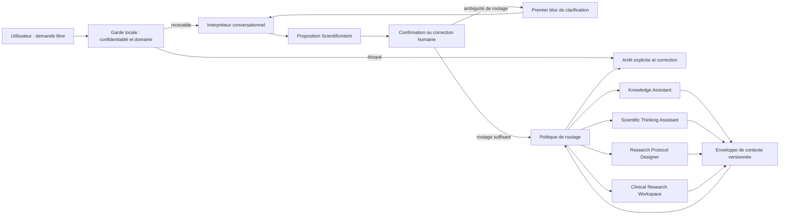

# P-WEB-05 — Intelligent Scientific Entry

## Conversational Routing & Scientific Intent Orchestrator

**Statut documentaire :** `CANDIDATE_NON_ADMIS`

**Nature :** architecture cible produit et UX, sans implémentation

**Niveau documentaire :** `NIVEAU_3`

**Version :** 1.0

**Source maîtresse :** présent fichier Markdown

**Date de référence :** 8 août 2026

**Baseline observée :** branche `main`, commit `c4857de0d70013374bbaaed9a1eefb7822ef296e`

**Domaine de responsabilité :** point d'entrée conversationnel, compréhension linguistique, intention de routage, continuité de contexte et orientation vers les surfaces NOXIA

**Documents supérieurs :** Charte fondatrice, Scientific Product Manifesto, Product Specification, PD-003, PD-004, PD-005, PD-009 et PD-011

**Documents de preuve spécialisés :** P-WEB-01, P-WEB-03/P-WEB-03C, P-WEB-04R, implémentation et tests courants

**Modèle conversationnel cible :** modèle fourni par `GEMINI_MODEL` ; le libellé « Gemini 3.5 Flash Lite » reste une préférence de mission, pas une capacité démontrée par le présent document

> Ce document définit une architecture à soumettre à arbitrage. Il ne crée aucun moteur, aucune route, aucun objet métier canonique, aucune connaissance, aucun protocole, aucun PASS PD-011 et aucune autorisation de publication.

---

## 0. Décision documentaire et règle de lecture

### 0.1 Nature exacte de la mission

P-WEB-05 transforme conceptuellement le Guided Scientific Intake en point d'entrée conversationnel spécialisé. Il définit comment NOXIA doit :

- accueillir une demande exprimée librement ;
- comprendre ce que l'utilisateur cherche réellement à accomplir ;
- préserver ses termes scientifiques exacts ;
- distinguer mentions explicites, normalisations, interprétations prudentes et informations absentes ;
- proposer une intention principale et des intentions secondaires ;
- demander uniquement les clarifications nécessaires au routage ou à la prochaine décision ;
- faire confirmer ou corriger cette compréhension ;
- transmettre un contexte structuré à la surface NOXIA appropriée ;
- conserver le contexte lors d'un changement de surface ;
- s'arrêter honnêtement lorsqu'un routage ou une capacité n'est pas disponible.

La mission est exclusivement une mission d'architecture conversationnelle et de routage. Elle ne modifie ni la science de NOXIA, ni la logique scientifique du Protocol Designer, ni les autorités documentaires existantes.

### 0.2 Plans de vérité séparés

| Plan | Contenu applicable | Conséquence pour P-WEB-05 |
|---|---|---|
| Principes établis | intention avant technique ; science avant technologie ; contexte conservé ; chercheur décisionnaire ; incertitude visible ; droit à l'arrêt | Invariants non négociables |
| Références normatives | Product Specification ; PD-003 ; PD-004 ; PD-005 ; PD-009 ; PD-011 | Contrats que cette architecture ne peut pas redéfinir |
| Corpus scientifiques | aucun corpus n'est créé ni modifié ; les corpus admis restent les seules sources scientifiques autorisées | L'interpréteur conversationnel ne produit aucune connaissance |
| Cible | entrée conversationnelle multi-intentions, objet de transfert `ScientificIntent`, routage transparent et surfaces spécialisées | Architecture décrite ici, non livrée |
| État réellement implémenté | Guided Scientific Intake P-WEB-04R, interprétation linguistique bornée, validation humaine, matching lexical de trois scénarios, cinq questions locales, session locale et rapport contextualisé | Point de départ vérifié ; ne prouve pas P-WEB-05 |
| Hypothèses | taxonomie de six intentions, adaptation au niveau d'expertise, regroupement décisionnel, estimation dynamique du nombre d'échanges et nouvelles surfaces | À tester avant admission ou implémentation |

### 0.3 Documents et preuves consultés

La consultation a suivi l'ordre hiérarchique suivant :

1. `0. NOXIA — SOURCE-OF-TRUTH-INDEX.md` ;
2. `output/documents/noxia-la-charte-fondatrice-edition-editoriale.docx` ;
3. `output/documents/noxia-protocol-designer-scientific-product-manifesto-edition-editoriale.docx` ;
4. `output/documents/noxia-protocol-designer-product-specification-v1.0.docx` ;
5. `docs/pd-003-research-object-model.md` ;
6. `docs/pd-004-ux-manifesto.md` ;
7. `docs/pd-009-decision-engine-architecture.md` ;
8. `docs/pd-005-prompt-library-architecture.md` ;
9. `docs/pd-011-evaluation-framework.md` ;
10. `docs/p-web-01-protocol-designer-web-demonstrator-architecture.md` ;
11. `docs/p-web-03-protocol-designer-web-demonstrator-audit-and-correction-report.md` ;
12. `docs/p-web-04r-guided-scientific-intake-implementation-report.md` ;
13. routes, vues, objets d'intake, règles de session, questions, matching, confidentialité et tests présents dans la baseline indiquée.

### 0.4 Contradictions, écarts et arbitrages explicites

| ID | Éléments concernés | Qualification | Décision P-WEB-05 |
|---|---|---|---|
| E01 | Le mandat demande un nouvel objet `ScientificIntent` ; PD-003 est l'autorité exclusive sur les objets métier | Risque de seconde ontologie | `ScientificIntent` est une enveloppe conversationnelle de session et de transfert. Il ne devient pas un objet métier canonique. Toute admission comme objet métier exigerait une évolution séparée de PD-003. |
| E02 | Le mandat appelle `primaryIntent` une intention ; PD-003 définit déjà l'Intention scientifique | Homonymie, pas équivalence | Les six valeurs P-WEB-05 sont des intentions de routage produit. Elles proposent un parcours ; elles ne remplacent pas l'Intention scientifique canonique construite et confirmée dans le moteur concerné. |
| E03 | Six intentions sont supportées ; PD-004 limite les points d'entrée initiaux à cinq | Contradiction si six cartes sont affichées ensemble | Le premier écran ne présente aucune grille de six cartes. Il pose une question libre. La correction utilise regroupement, recherche ou dévoilement progressif, avec au plus cinq choix visibles. |
| E04 | Le mandat demande des blocs regroupant plusieurs informations ; PD-004 exige une question principale ; PD-009 autorise un regroupement seulement pour une unité décisionnelle indissociable | Tension de présentation | Un bloc conserve une question principale. Ses sous-champs ne sont affichés ensemble que s'ils servent la même décision et si les séparer augmenterait la charge ou créerait une incohérence. |
| E05 | Le mandat affiche « Question 2 sur environ 6 » ; PD-004 interdit le faux pourcentage d'avancement | Différence entre estimation de charge et état scientifique | L'interface peut afficher une estimation dynamique du nombre d'échanges. Elle ne l'assimile jamais à la complétude du raisonnement et explique que le nombre peut évoluer. |
| E06 | Le mandat fixe quatre destinations, mais pas celles de `ANALYZE_RESULTS` et `INTERPRET_DOCUMENT` | Routage incomplet dans la demande | Aucune destination unique n'est inventée. P-WEB-05 définit des règles conditionnelles de clarification en section 8. Ces règles restent une proposition d'architecture à arbitrer. |
| E07 | Le mandat parle de plusieurs « moteurs » ; le Manifesto impose un moteur scientifique unique et plusieurs projections | Divergence de vocabulaire | Knowledge Assistant, Scientific Thinking Assistant, Research Protocol Designer et Clinical Research Workspace sont des espaces de travail ou modes d'usage. Ils ne deviennent pas des sources scientifiques indépendantes. |
| E08 | Le contexte doit être « intégralement » conservé ; la confidentialité impose minimisation et exclusion des données sensibles | Limite légitime au transfert | L'intégralité signifie tout le contexte autorisé, structuré, utile et traçable. Elle exclut les données sensibles interdites, la réponse brute du fournisseur et les éléments sans nécessité pour la surface destinataire. |
| E09 | Le mandat cite Gemini 3.5 Flash Lite ; P-WEB-04R documente `gemini-3.5-flash` et un test réel complet non résolu | Différence cible/état courant | L'architecture dépend de `GEMINI_MODEL`, non d'un identifiant figé. Aucun modèle n'est déclaré validé pour P-WEB-05. |
| E10 | Le Protocol Designer doit rester inchangé ; le point d'entrée et le contexte qui lui sont transmis évoluent | Différence d'enveloppe, pas modification du moteur | Le contrat d'entrée et la transition externe peuvent évoluer. Les objets, décisions et règles internes du Protocol Designer restent sous PD-003/PD-009 et hors périmètre de P-WEB-05. |
| E11 | `FORMALIZE_IDEA` accompagne les hypothèses ; PD-009 réserve les décisions structurantes à l'humain | Risque d'hypothèse adoptée par l'assistant | Le Scientific Thinking Assistant peut proposer, comparer et clarifier. Toute hypothèse structurante reste une proposition jusqu'à décision humaine explicite. |

### 0.5 Décision de classification

Le présent fichier reste `CANDIDATE_NON_ADMIS`. Sa présence dans `docs/` ne lui confère aucune autorité sur les niveaux 0, 1 ou 2. Son admission éventuelle exige une décision documentaire explicite, la résolution des points d'arbitrage de la section 19 et la mise à jour simultanée du SOURCE-OF-TRUTH-INDEX.

---

## 1. Résumé exécutif

L'entrée cible de NOXIA commence par une seule question :

> Que souhaitez-vous faire ?

L'utilisateur répond librement, dans ses propres mots. Le modèle conversationnel traite ce texte comme une donnée à comprendre. Il préserve les termes scientifiques, repère les entités mentionnées, propose des relations uniquement lorsqu'elles sont linguistiquement ancrées, identifie les ambiguïtés et estime l'intention de routage principale.

Le système présente ensuite une compréhension contestable :

> Je pense que vous cherchez principalement à…

L'utilisateur peut confirmer, corriger, choisir « Je ne sais pas » ou préciser une intention secondaire. Le routage n'est exécuté qu'après cette validation ou après une clarification minimale explicitement justifiée.

Le modèle conversationnel n'accède pas au statut de moteur scientifique. Il ne choisit ni biomarqueur, ni modalité, ni acquisition, ni hypothèse scientifique, ni conclusion. Il ne décide pas non plus de la prochaine action scientifique interne au Protocol Designer : cette responsabilité reste celle de PD-009. Il produit une enveloppe de transfert bornée ; les capacités scientifiques de NOXIA commencent après le routage.

La cible introduit quatre espaces de travail spécialisés :

- **Knowledge Assistant** pour comprendre des connaissances documentées ;
- **Scientific Thinking Assistant** pour formaliser une idée et explorer des hypothèses sans produire immédiatement un protocole ;
- **Research Protocol Designer** pour construire un projet selon les contrats existants ;
- **Clinical Research Workspace** pour accompagner l'exécution d'une étude existante, lorsque cette capacité existera et sera admise.

Deux intentions exigent un routage conditionnel : analyser des résultats et interpréter un document. Leur destination dépend du type de tâche réellement demandé et ne peut pas être déduite honnêtement du seul libellé.

---

## 2. État courant et cible

| Capacité | État courant vérifié | Cible P-WEB-05 | Statut |
|---|---|---|---|
| Saisie libre | Question scientifique de 24 à 4 000 caractères | Question ouverte « Que souhaitez-vous faire ? » | Extension cible |
| Compréhension linguistique | 19 champs, reformulation, ambiguïtés, manques et contradictions | Compréhension conversationnelle multi-tour avec intention de routage | Extension cible |
| Préservation des termes | Ancrage de chaque champ non vide sur un extrait contigu | Registre dédié des termes exacts et de leurs normalisations séparées | Extension cible |
| Validation humaine | Revue champ par champ avant matching | Confirmation synthétique, correction locale puis approfondissement à la demande | Évolution UX cible |
| Orientation | Matching lexical local vers RB-003, RB-004 ou RB-005 | Routage vers une surface NOXIA selon l'intention et le contexte | Remplacement cible de l'orientation initiale |
| Questions adaptatives | Cinq questions locales versionnées | Blocs décisionnels sélectionnés par impact et disponibilité | Extension cible |
| Knowledge Explorer | Route `/connaissances`, projection courante bornée | Réintégration comme surface du Knowledge Assistant | Surface existante, assistant non implémenté |
| Scientific Thinking Assistant | Aucun élément probant identifié | Nouvel espace de réflexion scientifique | Non implémenté |
| Research Protocol Designer | Démonstrateur guidé local, corpus et matching bornés | Destination `DESIGN_STUDY`, logique interne inchangée | Partiellement présent, cible complète non démontrée |
| Clinical Research Workspace | Aucun élément probant identifié | Destination `OPERATE_STUDY` | Non implémenté |
| Analyse de résultats | R26 décrit dans PD-005 comme rôle futur et conditionnel | Routage conditionnel, sans interprétation de résultats par le LLM | Non implémenté |
| Interprétation de document | Parcours cibles S60/S61/S65 dans la Product Specification | Routage conditionnel selon comprendre, reproduire ou auditer | Non implémenté comme orchestrateur |
| Gemini réel | Contrat P-WEB-04R complet non validé ; activation publique bloquée | Modèle conversationnel configurable et évalué | Non démontré |

La cible P-WEB-05 ne doit donc jamais être présentée comme une description de la version actuellement accessible.

---

## 3. Périmètre et non-périmètre

### 3.1 Inclus

- architecture du dialogue d'entrée ;
- taxonomie des intentions de routage ;
- contrat conceptuel de `ScientificIntent` ;
- préservation des termes et ancrage au texte original ;
- détection linguistique d'entités et de relations ;
- validation et correction humaines ;
- sélection de la première clarification utile ;
- blocs décisionnels de clarification ;
- règles de routage vers les surfaces NOXIA ;
- continuité et versionnement du contexte entre surfaces ;
- nouvelles vues nécessaires ;
- états non heureux, refus et reprise ;
- exigences de confidentialité, sécurité, accessibilité et validation.

### 3.2 Hors périmètre

- texte détaillé des prompts ;
- implémentation du modèle conversationnel ;
- implémentation d'une route, d'une API, d'une session ou d'une interface ;
- choix définitif d'un fournisseur ou d'un identifiant de modèle ;
- création d'un moteur scientifique ;
- modification du Decision Engine PD-009 ;
- modification des rôles PD-005 ;
- création ou modification d'un corpus, d'une assertion, d'une preuve ou d'une relation scientifique ;
- modification d'un Reasoning Book ou d'un Scientific Program ;
- modification du Scientific Territory Model, du Scientific Knowledge Catalog, de la Scientific Assertion Layer ou du Scientific Knowledge Graph ;
- modification ou intégration de l'Editorial Engine ;
- production de protocole clinique, d'acquisition constructeur ou de recommandation patient ;
- interprétation automatique de résultats réels sans les conditions prévues par PD-005 et PD-011 ;
- ingestion générale de documents ;
- publication, déploiement ou activation publique.

---

## 4. Principes d'architecture

### 4.1 Le dialogue est une interface, pas le produit

La conversation aide à exprimer et clarifier l'intention. Les décisions, objets, preuves, limites et états utiles doivent être consultables dans des vues structurées. Aucune information importante ne doit exister uniquement dans un ancien message.

### 4.2 Le modèle comprend le langage ; NOXIA porte la science

Le modèle conversationnel peut :

- reformuler sans changer le sens ;
- préserver et localiser les termes exacts ;
- classer provisoirement une demande dans la taxonomie de routage ;
- détecter des mentions d'entités ;
- proposer des relations linguistiques ancrées ;
- repérer ambiguïtés, contradictions textuelles et manques nécessaires au routage ;
- rédiger une question de clarification déjà autorisée par la politique de routage.

Il ne peut pas :

- produire ou compléter une connaissance scientifique ;
- transformer une mention en fait ;
- transformer une relation exprimée par l'utilisateur en relation du Knowledge Graph ;
- choisir un biomarqueur, une modalité, une acquisition ou un protocole ;
- interpréter un résultat scientifique réel ;
- sélectionner la prochaine action scientifique interne à un projet ;
- prendre une décision humaine ;
- présenter une inférence comme validation.

### 4.3 Le routage est gouverné après la compréhension

Le LLM propose un classement. Une politique de routage bornée vérifie ensuite :

1. la sécurité et le domaine ;
2. l'ancrage des termes et entités ;
3. les corrections explicites de l'utilisateur ;
4. les ambiguïtés qui changent de destination ;
5. la disponibilité réelle de la surface cible ;
6. les règles de transition et les contrats de contexte.

La sortie du LLM n'ouvre jamais directement une surface sans cette vérification.

### 4.4 L'intention de routage n'est pas une décision scientifique

Choisir `DESIGN_STUDY` signifie « entrer dans l'espace de conception ». Cela ne signifie ni « produire un protocole maintenant », ni « la question est suffisamment cadrée », ni « la stratégie est validée ».

### 4.5 Une surface, une intention dominante

Une demande peut porter plusieurs intentions. Une seule surface devient principale à un instant donné. Les intentions secondaires sont conservées et proposées comme transitions, sans lancer plusieurs espaces concurrents ni dupliquer le raisonnement.

### 4.6 La continuité est structurée et réversible

Une transition conserve le texte original, la compréhension validée, les termes scientifiques, les décisions humaines, les inconnues et la provenance. Elle crée une nouvelle projection de contexte ; elle ne réécrit pas le contexte source.

### 4.7 L'arrêt est une destination valide

Si la demande est hors domaine, sensible, insuffisamment comprise, non couverte ou dirigée vers une surface absente, le système conserve ce qui est acquis, explique la limite et indique la condition de reprise. Il ne simule jamais un moteur indisponible.

---

## 5. Architecture conversationnelle de référence



### 5.1 Couches et responsabilités

| Couche | Mission | Entrées | Sorties | Interdit principal |
|---|---|---|---|---|
| Garde d'entrée | bloquer données sensibles, contenu interdit ou taille invalide | texte libre, métadonnées minimales | texte recevable ou arrêt | transmettre un contenu interdit au fournisseur |
| Interpréteur conversationnel | comprendre le langage et produire une proposition structurée | texte recevable, contexte de conversation autorisé | `ScientificIntent` proposé | produire de la science |
| Vue de confirmation | rendre l'inférence visible et corrigeable | objet proposé | objet corrigé ou besoin de clarification | masquer une inférence |
| Clarification de routage | obtenir l'information minimale qui change la destination | ambiguïté, destinations candidates | réponse structurée et nouvel objet proposé | dérouler un questionnaire fixe |
| Politique de routage | choisir une surface admissible et disponible | objet validé, état des surfaces, règles versionnées | décision de routage expliquée | déléguer la décision au LLM seul |
| Enveloppe de transition | transporter le contexte autorisé | contexte validé, origine, destination | paquet versionné reçu par la surface | transférer la réponse brute du fournisseur |
| Surface spécialisée | poursuivre la tâche selon ses propres autorités | paquet de contexte | objets, vues ou décisions de son domaine | dépasser sa responsabilité |

### 5.2 Cycle conversationnel

1. L'utilisateur formule son besoin sans choisir de moteur.
2. La garde locale bloque les données interdites avant tout appel distant.
3. Le modèle produit une compréhension linguistique ancrée.
4. NOXIA affiche le texte original et la proposition de sens.
5. L'utilisateur confirme, corrige ou indique qu'il ne sait pas.
6. Si une ambiguïté change la destination, une seule question principale est posée.
7. La politique de routage explique la destination proposée et ses conséquences.
8. L'utilisateur poursuit, corrige l'intention ou reste dans l'espace d'entrée.
9. La surface cible reçoit le contexte structuré et affiche ce qu'elle a repris.
10. Une future transition conserve l'historique et crée une nouvelle projection.

---

## 6. Moteur d'intentions

### 6.1 Taxonomie de routage

| Intention | Sens opérationnel | Exemples recevables | Ne signifie pas |
|---|---|---|---|
| `UNDERSTAND` | comprendre un concept, une méthode, une modalité, un biomarqueur ou une technologie | « Quelle différence entre OEF et CMRO₂ ? » ; « Comment fonctionne le photon counting ? » | construire automatiquement une étude |
| `FORMALIZE_IDEA` | transformer une intuition en problème, objectif ou hypothèses de travail | « Je pense que le no-reflow dépend de plusieurs mécanismes » | adopter une hypothèse comme vraie |
| `DESIGN_STUDY` | cadrer, construire, améliorer, comparer ou auditer une stratégie d'étude | « Comment étudier l'obstruction microvasculaire après reperfusion ? » | générer immédiatement un protocole |
| `OPERATE_STUDY` | suivre ou coordonner une étude déjà définie | « Je dois suivre les écarts entre les centres » | inventer un workspace ou une capacité absente |
| `ANALYZE_RESULTS` | examiner des résultats disponibles ou préparer leur interprétation méthodologique | « Que permet réellement de conclure ce résultat ? » | interpréter un patient ou contourner le plan d'analyse |
| `INTERPRET_DOCUMENT` | comprendre, reproduire ou auditer un document scientifique fourni ou identifié | « Aidez-moi à comprendre cette méthode publiée » | considérer le document comme preuve suffisante ou connaissance admise |

### 6.2 Multi-intention et hiérarchie

- `primaryIntent` désigne l'action immédiate la plus utile.
- `secondaryIntent` contient une liste ordonnée de zéro à plusieurs intentions secondaires.
- Une intention secondaire ne déclenche pas une exécution parallèle.
- Si deux intentions conduisent à des surfaces différentes et qu'aucune ne domine, l'état devient `ROUTING_REQUIRES_CLARIFICATION`.
- Une correction explicite de l'utilisateur prime sur la classification automatique, sauf si elle demande une action interdite.
- Le système conserve l'intention originale et la correction ; il ne remplace pas silencieusement l'historique.

### 6.3 Signaux autorisés

Le moteur peut utiliser :

- les verbes d'action explicites ;
- le type d'objet mentionné : idée, protocole, étude, résultats, article, concept ;
- l'existence déclarée ou non d'une étude ;
- la présence déclarée de résultats ;
- la demande de compréhension, comparaison, construction, suivi ou audit ;
- les corrections précédentes de l'utilisateur ;
- le contexte de session autorisé.

Il ne peut pas utiliser :

- un diagnostic supposé ;
- une intention déduite d'un profil démographique ;
- une préférence commerciale ou constructeur ;
- une connaissance externe non fournie par NOXIA ;
- une donnée sensible ;
- une prédiction de personnalité ;
- un score de confiance non calibré présenté comme certitude.

### 6.4 Niveau d'expertise

`userExpertise` adapte uniquement la projection conversationnelle. Il peut prendre les états :

- `UNKNOWN` ;
- `DISCOVERING` ;
- `INFORMED` ;
- `DOMAIN_EXPERT`.

Cette qualification reste locale à la tâche et au domaine. Elle n'est jamais affichée comme un jugement sur la personne. Le système demande le niveau d'explication souhaité lorsqu'une inférence serait fragile. L'utilisateur peut le modifier à tout moment sans changer la science ni le routage déjà confirmé, sauf si le niveau d'assistance demandé modifie explicitement l'usage.

### 6.5 Préservation des termes scientifiques

Le contrat de préservation est obligatoire :

1. `originalRequest` reste immuable.
2. Chaque terme scientifique conservé pointe vers son extrait exact.
3. Une forme normalisée est stockée séparément de la forme originale.
4. Une expansion d'acronyme n'est affichée comme équivalence que si elle est linguistiquement certaine ou confirmée.
5. Une catégorie plus générale ne remplace jamais le terme original.
6. Une correction de l'utilisateur crée une nouvelle version sans supprimer le terme antérieur.

Exemples :

| Forme originale | Traitement autorisé | Traitement interdit |
|---|---|---|
| `no-reflow` | conserver `no-reflow` ; proposer éventuellement « phénomène de no-reflow » | remplacer par « complication cardiaque » |
| `obstruction microvasculaire` | conserver la formulation exacte | la fusionner automatiquement avec tout usage de `no-reflow` |
| `stent` | conserver le terme et son contexte grammatical | déduire une stratégie de reperfusion |
| `FFR` | conserver `FFR` ; demander le sens si le contexte est ambigu | inventer sa valeur ou sa méthode |
| `OEF` | conserver `OEF` et l'extrait source | conclure à une mesure directe sans source NOXIA |
| `CMRO₂` | préserver le caractère `₂` ; normaliser séparément pour la recherche | remplacer silencieusement par un autre construit |
| `T1 mapping` | préserver la forme mixte | réduire à « IRM cardiaque » |

### 6.6 Entités et relations détectées

Une entité détectée est une mention conversationnelle, pas un objet de connaissance. Elle porte :

- une forme originale ;
- une forme normalisée éventuelle ;
- une catégorie linguistique provisoire ;
- un extrait source ;
- un statut `EXPLICIT_USER_STATEMENT`, `NORMALIZED_FROM_USER_TERM` ou `TENTATIVE_INTERPRETATION` ;
- une validation humaine ;
- une destination potentielle dans le contexte canonique, sans création automatique.

Une relation détectée porte :

- les deux mentions concernées ;
- la formulation relationnelle exacte ;
- la direction seulement si elle est explicitement portée par la phrase ;
- le statut `EXPLICIT` ou `TENTATIVE` ;
- les alternatives possibles ;
- la confirmation ou correction humaine.

Une relation détectée ne peut jamais être écrite dans le Scientific Knowledge Graph par P-WEB-05.

### 6.7 Ambiguïtés et informations critiques

Une ambiguïté est critique pour le routage si ses interprétations plausibles conduisent à des surfaces différentes ou à des frontières de responsabilité différentes.

`missingCriticalInformation` ne signifie pas « tout ce qui manque pour construire une étude ». Il contient uniquement l'information sans laquelle le routage ou la première action de la surface cible serait trompeur. Toute autre lacune est transmise comme contexte inconnu et sera traitée par l'autorité de la surface concernée.

---

## 7. Objet de transfert `ScientificIntent`

### 7.1 Statut de l'objet

`ScientificIntent` est une projection conversationnelle versionnée. Il sert à la confirmation, au routage et au transfert entre surfaces. Il n'est ni une Intention scientifique de PD-003, ni une preuve, ni une stratégie, ni un état du Knowledge Graph.

### 7.2 Contrat conceptuel

| Champ | Cardinalité | Sémantique | Règle de sûreté |
|---|---:|---|---|
| `originalRequest` | 1 | texte exact fourni par l'utilisateur | immuable ; jamais réécrit |
| `reformulatedRequest` | 1 | reformulation prudente de l'action recherchée | aucune causalité, population ou finalité ajoutée sans ancrage |
| `preservedScientificTerms` | 0..n | termes exacts, extraits et normalisations séparées | aucune généralisation silencieuse |
| `detectedEntities` | 0..n | mentions linguistiques structurées | ne crée aucun objet de connaissance |
| `detectedRelationships` | 0..n | relations exprimées ou interprétées avec statut | ne crée aucune relation du Knowledge Graph |
| `primaryIntent` | 0..1 | intention de routage principale proposée ou validée | peut rester indéterminée |
| `secondaryIntent` | 0..n | intentions secondaires ordonnées | aucune exécution parallèle automatique |
| `userExpertise` | 1 | niveau d'accompagnement local, `UNKNOWN` par défaut | ne qualifie pas la compétence globale |
| `scientificContext` | 1 | contexte explicitement déclaré ou prudemment interprété | chaque élément porte origine et validation |
| `ambiguities` | 0..n | lectures concurrentes et impact sur le routage | jamais résolues par choix silencieux |
| `missingCriticalInformation` | 0..n | informations nécessaires au routage ou à la première action | aucune collecte « au cas où » |
| `suggestedEngine` | 0..1 | destination proposée ou `ROUTING_REQUIRES_CLARIFICATION` | la disponibilité réelle est vérifiée hors LLM |
| `firstAdaptiveQuestion` | 0..1 | première clarification de routage utile | raison et influence obligatoires |

L'enveloppe comporte également les métadonnées de gouvernance nécessaires : version de schéma, langue, date, numéro de tour, version de politique de routage, statut de validation humaine, origine de chaque élément et identifiant de l'objet remplacé le cas échéant.

### 7.3 Structure de `scientificContext`

Le contexte conversationnel peut contenir, lorsqu'ils sont explicitement présents :

- domaine et sous-domaine ;
- phénomène ou question d'intérêt ;
- population ou groupe ;
- étude existante ou envisagée ;
- document ou résultats disponibles ;
- temporalité déjà imposée ;
- contraintes organisationnelles ;
- technologies, équipements ou données déclarés ;
- niveau d'accompagnement souhaité ;
- limites de confidentialité ou de partage.

Chaque élément possède une origine, un extrait, un statut de validation et une portée. Aucun champ absent n'est complété par une valeur habituelle.

### 7.4 Structure de `firstAdaptiveQuestion`

La première question contient :

- la formulation principale ;
- le `decisionBlockId` ;
- la raison de la question ;
- les intentions ou destinations qu'elle discrimine ;
- ce qu'une réponse changera ;
- le traitement d'une réponse inconnue ;
- les réponses suggérées, au plus quatre plus « Autre » et « Je ne sais pas » lorsque l'espace est borné ;
- la possibilité de texte libre ;
- l'estimation dynamique du nombre d'échanges restants ;
- les informations sensibles qu'il est interdit de saisir.

### 7.5 Cycle de vie

```text
DRAFT
  → PROPOSED
  → HUMAN_CORRECTED ou HUMAN_CONFIRMED
  → ROUTING_READY
  → ROUTED
  → SUPERSEDED
```

États transverses possibles : `ROUTING_REQUIRES_CLARIFICATION`, `ROUTING_BLOCKED`, `ENGINE_UNAVAILABLE`, `OUT_OF_SCOPE` et `SENSITIVE_INPUT_BLOCKED`.

Le cycle de vie appartient à l'enveloppe de conversation. Il ne remplace aucun cycle de vie de PD-003.

### 7.6 Projection vers les objets canoniques

| Élément conversationnel | Candidat canonique éventuel | Condition |
|---|---|---|
| texte original | Situation de recherche | création dans un projet et conservation du verbatim |
| finalité comprise | Intention scientifique | traitement par la capacité compétente et confirmation humaine |
| contexte déclaré | Contribution puis Information de projet | provenance et état épistémique explicites |
| ambiguïté | Besoin d'information ou Incertitude | impact méthodologique démontré |
| question de clarification | Échange adaptatif | sélection conforme à PD-009 dans un projet |
| relation mentionnée | Contribution | jamais Énoncé de connaissance automatique |
| choix de surface | aucune équivalence métier directe | trace de navigation produit seulement |

---

## 8. Moteur de routage

### 8.1 Principe

Le routage est une décision produit explicable. Il ne constitue ni une décision scientifique, ni une sélection de corpus, ni une action de PD-009 à l'intérieur d'un projet.

La politique applique cet ordre :

1. blocage de sécurité ou de confidentialité ;
2. vérification du domaine et de l'action interdite ;
3. application de la correction humaine la plus récente ;
4. détection des ambiguïtés changeant la destination ;
5. sélection de l'intention principale ;
6. application des règles conditionnelles ;
7. vérification de la disponibilité de la surface ;
8. production d'une justification de routage ;
9. confirmation ou poursuite par l'utilisateur ;
10. transfert versionné.

### 8.2 Routages directs

| Intention principale | Surface proposée | Garde d'entrée | Première action de la surface |
|---|---|---|---|
| `UNDERSTAND` | Knowledge Assistant | sujet recevable et corpus ou état d'absence explicite | comprendre, choisir, comparer ou vérifier sans créer automatiquement un projet |
| `FORMALIZE_IDEA` | Scientific Thinking Assistant | idée ou intuition à structurer ; aucune urgence de protocole imposée | décrire le problème, les mécanismes possibles et les hypothèses candidates |
| `DESIGN_STUDY` | Research Protocol Designer | volonté explicite de construire, améliorer, comparer, reproduire ou auditer une étude | reprendre la Situation de recherche ; clarifier avant toute projection protocolaire |
| `OPERATE_STUDY` | Clinical Research Workspace | étude existante et responsabilité opérationnelle déclarées | reprendre l'état de l'étude, ses décisions et actions ; sinon expliquer l'indisponibilité |

### 8.3 Routage conditionnel de `ANALYZE_RESULTS`

Le mandat ne désigne pas de surface unique. P-WEB-05 propose l'arbitrage suivant :

| Situation détectée | Destination candidate | Condition de sûreté |
|---|---|---|
| résultats réels d'une étude existante, avec plan, QC et contexte disponibles | Clinical Research Workspace | capacité réellement disponible ; données autorisées ; aucune conclusion patient |
| question méthodologique sur ce que des résultats permettraient de conclure | Scientific Thinking Assistant | aucune interprétation réelle tant que les entrées exigées par R26 ne sont pas réunies |
| compréhension d'un résultat publié dans un document | `INTERPRET_DOCUMENT`, puis Knowledge Assistant ou autre route conditionnelle | conserver le document comme source à qualifier, pas comme vérité |
| résultat isolé sans contexte, protocole ou qualité | arrêt ou clarification | demander le type de résultat et l'usage attendu ; ne pas conclure |

Tant que le cas n'est pas discriminé, `suggestedEngine` vaut `ROUTING_REQUIRES_CLARIFICATION`.

### 8.4 Routage conditionnel de `INTERPRET_DOCUMENT`

| Besoin réel | Destination candidate | Condition de sûreté |
|---|---|---|
| comprendre concepts, méthodes, preuves ou limites d'un document | Knowledge Assistant | document identifié ; provenance visible ; absence de corpus signalée |
| reproduire ou adapter une étude publiée | Research Protocol Designer, parcours reproduction | distinguer explicitement décrit, absent et inféré |
| auditer un protocole existant | Research Protocol Designer, parcours audit | ne pas présenter le texte comme preuve de validité |
| extraire des résultats pour les analyser | reclasser vers `ANALYZE_RESULTS` | préciser nature, contexte et données disponibles |
| document non fourni, illisible ou sans droit d'usage | arrêt ou demande de document | aucune reconstruction inventée |

Ces deux tables sont des propositions P-WEB-05. Elles doivent être arbitrées avant admission, car aucune référence supérieure ne fixe actuellement une destination unique pour ces deux intentions.

### 8.5 Intentions secondaires

Les intentions secondaires sont conservées dans l'ordre. Le système peut proposer :

- « Commencer par comprendre, puis transformer cette compréhension en projet » ;
- « Formaliser l'idée avant d'ouvrir le Protocol Designer » ;
- « Auditer d'abord le document, puis préparer une reproduction » ;
- « Examiner la méthode avant d'analyser les résultats ».

Une transition secondaire n'est proposée qu'après une étape stable ou à la demande explicite de l'utilisateur. Elle ne doit pas interrompre une tâche principale en cours ni créer un projet sans consentement.

### 8.6 Surface indisponible

Lorsqu'une surface cible n'est pas implémentée ou n'est pas autorisée :

- l'intention validée reste conservée ;
- le système nomme la capacité indisponible ;
- il distingue « architecture prévue » et « fonctionnalité présente » ;
- il propose uniquement une alternative qui respecte la même intention ;
- il n'affiche aucun faux workspace ;
- il indique la condition de reprise.

---

## 9. Questions adaptatives et blocs décisionnels

### 9.1 Règle de sélection

Une question est admissible seulement si sa réponse peut :

- changer la surface cible ;
- lever une ambiguïté de responsabilité ;
- éviter une action interdite ;
- permettre à la surface cible de commencer honnêtement ;
- réduire une charge disproportionnée immédiatement après le transfert.

Une information scientifique nécessaire plus tard dans un projet n'est pas automatiquement nécessaire au routage.

### 9.2 Anatomie d'un bloc

Chaque bloc comporte :

- une question principale ;
- une explication « Pourquoi cette question ? » ;
- une explication « Ce que cela influence » ;
- les sous-informations strictement liées à la même décision ;
- texte libre ;
- réponses suggérées ;
- « Je ne sais pas » ;
- « Autre » ;
- la conséquence d'une absence de réponse ;
- un résumé avant confirmation.

### 9.3 Conditions de regroupement

Les champs modalité → champ → constructeur → version → disponibilité peuvent être présentés dans une seule interaction uniquement lorsque :

1. l'environnement technique est nécessaire à la même décision immédiate ;
2. les informations déjà connues ne sont pas redemandées ;
3. les champs dépendants apparaissent progressivement ;
4. l'utilisateur peut déclarer l'ensemble inconnu ou partiel ;
5. aucune réponse n'est préremplie par habitude ;
6. le bloc reste utilisable au clavier, au zoom et sur mobile ;
7. le résumé distingue déclaré, supposé et inconnu.

La même logique s'applique aux blocs population, organisation, contraintes et technologies.

### 9.4 Exemples de blocs

| Bloc | Question principale | Sous-informations conditionnelles | Décision influencée |
|---|---|---|---|
| Contexte d'étude | « Parlez-vous d'une idée, d'une étude existante ou de résultats déjà disponibles ? » | état de l'étude, document, résultats | route réflexion, conception, opération ou analyse |
| Environnement technique | « Quels moyens sont réellement disponibles pour cette tâche ? » | modalité, champ, constructeur, version, disponibilité | faisabilité de la première étape, pas choix scientifique |
| Population | « Qui ou quoi souhaitez-vous étudier ? » | population, groupes, stade, contexte | besoin de formalisation ou de conception |
| Organisation | « La demande concerne-t-elle un centre ou plusieurs ? » | nombre de centres, coordination, Core Lab | surface opérationnelle et niveau d'accompagnement |
| Document | « Que souhaitez-vous faire avec ce document ? » | comprendre, reproduire, auditer, extraire des résultats | routage conditionnel du document |

### 9.5 Estimation dynamique du nombre de questions

L'affichage cible peut prendre la forme :

> Question 2 sur environ 6

Le mot « environ » reste visible. Le nombre est recalculé à partir des blocs encore éligibles, non du nombre de champs vides. L'interface explique qu'une réponse peut ouvrir ou fermer un bloc. Elle n'utilise ni barre de complétude scientifique, ni pourcentage, ni promesse de fin exacte.

Si l'incertitude sur le parcours est trop élevée, l'affichage devient :

> Encore quelques précisions peuvent être nécessaires.

---

## 10. Parcours utilisateur cible

### 10.1 Parcours nominal

| Étape | Vue | Action utilisateur | Sortie |
|---:|---|---|---|
| 1 | Entrée conversationnelle | décrire librement ce qu'il souhaite faire | demande originale recevable |
| 2 | Compréhension proposée | lire « Je pense que… » et les termes conservés | intention proposée visible |
| 3 | Correction | confirmer, modifier, « Je ne sais pas » ou ajouter une intention secondaire | compréhension humaine validée ou clarification requise |
| 4 | Bloc adaptatif | répondre à la seule question qui change le routage | ambiguïté réduite |
| 5 | Orientation | lire la destination, sa raison et ce qui sera transmis | routage compréhensible |
| 6 | Transition | poursuivre vers la surface ou modifier l'intention | contexte transféré ou parcours révisé |
| 7 | Accueil de la surface | vérifier le résumé repris et la prochaine action | continuité confirmée |

### 10.2 Exemple multi-intention

Demande :

> Je veux comprendre le no-reflow après reperfusion et voir si je peux construire une étude comparant deux stratégies.

Compréhension cible :

- `primaryIntent` : `UNDERSTAND` ou `DESIGN_STUDY` selon l'urgence exprimée ;
- `secondaryIntent` : l'autre intention ;
- termes conservés : `no-reflow`, `reperfusion` ;
- relation explicite : étude envisagée pour comparer deux stratégies ;
- ambiguïté : commencer par la compréhension ou par le cadrage de l'étude ;
- question : « Souhaitez-vous d'abord clarifier le phénomène de no-reflow, ou commencer à structurer l'étude ? » ;
- influence : choix entre Knowledge Assistant et Research Protocol Designer ;
- réponse « Je ne sais pas » : commencer par une synthèse de compréhension, sans créer de projet.

### 10.3 Reprise

Au retour, l'utilisateur voit :

- sa demande originale ;
- l'intention confirmée ;
- les corrections apportées ;
- la dernière surface utilisée ;
- les transitions disponibles ;
- les changements intervenus depuis ;
- la prochaine action proposée.

Le dialogue ne redémarre jamais comme si la session était continue. Une réponse déjà fournie n'est pas reposée sans raison visible.

---

## 11. Nouvelles vues

### V01 — Intelligent Entry

**Question principale :** « Que souhaitez-vous faire ? »

**Contenu :** zone libre, exemples facultatifs, avertissement de confidentialité, état de disponibilité du service.

**Action principale :** « Comprendre ma demande ».

**États :** vide, saisie, contenu sensible bloqué, service indisponible, reprise proposée.
**Interdit :** six cartes d'intention, modalité, biomarqueur, constructeur ou corpus au niveau initial.

### V02 — Intent Understanding

**Question principale :** « Est-ce bien ce que vous cherchez à faire ? »

**Contenu :** original, reformulation, intention principale, intentions secondaires, termes conservés, ambiguïtés déterminantes.

**Action principale :** « Confirmer cette compréhension ».

**États :** proposé, corrigé, indéterminé, contradictoire, hors domaine.
**Interdit :** validation globale qui masque les éléments interprétés.

### V03 — Intent Correction

**Question principale :** « Que faut-il corriger ? »

**Contenu :** correction de l'action, des termes, du contexte ou de l'intention secondaire.

**Action principale :** « Appliquer mes corrections ».
**Règle de choix :** au plus cinq options visibles ; « Autre » ouvre une recherche ou une saisie.

### V04 — Adaptive Decision Block

**Question principale :** question de clarification unique.

**Contenu :** pourquoi, influence, sous-champs conditionnels, réponses suggérées, texte libre, inconnue et autre.

**Action principale :** « Enregistrer cette précision ».
**États :** partiel, inconnu, non applicable, contradictoire, différé.

### V05 — Conversation Map

**Mission :** rendre la conversation relisible sans en faire la navigation principale.

**Contenu :** intention, blocs déjà traités, contexte structuré, inconnues et destination candidate.
**Règle :** l'estimation du nombre d'échanges est distincte de l'état scientifique.

### V06 — Routing Proposal

**Question principale :** « Souhaitez-vous poursuivre dans cet espace ? »

**Contenu :** destination, raison, éléments transmis, éléments non transmis, intentions secondaires et alternatives.

**Action principale :** libellé par résultat, par exemple « Poursuivre dans le Scientific Thinking Assistant ».
**États :** prêt, clarification requise, surface indisponible, refus.

### V07 — Handoff Summary

**Mission :** confirmer la continuité après changement de surface.

**Contenu :** « Voici ce que j'ai repris », contexte, termes, ambiguïtés, décisions et prochaine action.

**Actions :** « Continuer », « Corriger le contexte », « Revenir à l'entrée ».
**Interdit :** demander à nouveau les informations reçues sans événement de changement.

### V08 — Knowledge Assistant

**Mission :** projeter Explorer les connaissances dans un dialogue orienté compréhension.

**Contenu :** synthèse, concepts liés, limites, désaccords, preuves et possibilité de transformer une question en projet.
**Frontière courante :** la route `/connaissances` existe, mais cela ne prouve pas un Knowledge Assistant conversationnel ni une couverture générale.

### V09 — Scientific Thinking Assistant

**Mission :** accompagner idée, intuition, mécanismes, hypothèses concurrentes et question ouverte sans forcer un protocole.

**Contenu :** idée originale, reformulations candidates, mécanismes envisagés, hypothèses proposées, inconnues, contradictions, alternatives et transitions.

**Action principale :** « Continuer la réflexion » ou, après décision humaine, « Transformer en projet ».
**Interdit :** biomarqueur ou protocole prématuré ; hypothèse présentée comme établie.

### V10 — Engine Switcher

**Mission :** proposer une transition à partir d'une intention secondaire ou d'une nouvelle demande.

**Contenu :** surface actuelle, destination, contexte conservé, éléments à revoir et conséquence.
**Règle :** aucune bascule silencieuse ; retour possible ; historique conservé.

### V11 — Unavailable or Refusal State

**Mission :** expliquer pourquoi le routage ne peut pas être exécuté.

**Contenu :** cause, contexte préservé, ce qui reste possible, condition de reprise, expertise ou surface nécessaire.
**Interdit :** faux résultat, faux workspace ou solution de secours scientifique inventée.

---

## 12. Scientific Thinking Assistant

### 12.1 Mission

Le Scientific Thinking Assistant est l'espace intermédiaire entre compréhension documentaire et conception d'étude. Il aide l'utilisateur à :

- exprimer une intuition ;
- séparer observation, supposition et hypothèse ;
- explorer plusieurs mécanismes possibles ;
- formuler des questions candidates ;
- identifier les informations manquantes ;
- rendre visibles les hypothèses concurrentes ;
- décider humainement si une idée mérite de devenir un projet.

### 12.2 Entrées

- `ScientificIntent` validé ;
- demande originale ;
- termes et contexte autorisés ;
- ambiguïtés et inconnues ;
- connaissances NOXIA consultables dans le domaine, si disponibles ;
- historique des transitions.

### 12.3 Sorties

Les sorties sont des propositions de travail :

- reformulations candidates ;
- questions ouvertes ;
- hypothèses candidates et concurrentes ;
- mécanismes à explorer ;
- limites de connaissance ;
- informations à rechercher ;
- proposition de transition vers Knowledge Assistant ou Research Protocol Designer.

Elles ne deviennent des objets canoniques qu'après traitement par les capacités et décisions prévues dans les autorités existantes.

### 12.4 Conditions d'arrêt

L'assistant s'arrête ou demande une expertise lorsque :

- le sujet sort du territoire documenté ;
- la demande devient clinique ou individuelle ;
- l'utilisateur demande une conclusion que les connaissances ne soutiennent pas ;
- une controverse critique ne peut pas être résumée honnêtement ;
- une hypothèse nécessite des données absentes ;
- la conversation exige une décision réservée à un acteur habilité.

### 12.5 Passage vers un projet

Le passage au Research Protocol Designer exige une action humaine explicite. Le paquet transmis distingue :

- formulation originale ;
- question candidate ;
- hypothèses proposées, jamais adoptées implicitement ;
- mécanismes et relations à vérifier ;
- inconnues ;
- contradictions ;
- sources NOXIA éventuellement consultées ;
- décisions encore ouvertes.

Le Protocol Designer reprend ensuite sous ses propres règles. Il peut reformuler, demander une précision, refuser une projection ou maintenir le projet à l'état d'idée.

---

## 13. Transitions entre surfaces

### 13.1 Contrat de transition

Toute transition contient :

- identifiant et version de la transition ;
- surface source et surface cible ;
- motif explicite ;
- demande originale immuable ;
- `ScientificIntent` validé et sa version ;
- contexte autorisé ;
- termes scientifiques préservés ;
- contributions humaines ;
- ambiguïtés, inconnues et contradictions ;
- décisions prises et responsabilités ;
- éléments non transférés et raison ;
- version des politiques appliquées ;
- condition de retour ou de réouverture.

### 13.2 Réflexion vers protocole

```text
Scientific Thinking Assistant
  → décision humaine « Transformer en projet »
  → résumé des hypothèses candidates et inconnues
  → création ou sélection explicite d'un projet
  → Research Protocol Designer
  → clarification selon PD-009
```

Le passage ne convertit aucune hypothèse candidate en hypothèse adoptée et ne produit aucun protocole à l'entrée.

### 13.3 Protocole vers exploration

```text
Research Protocol Designer
  → demande « Explorer ce point scientifique »
  → projection de la question, du contexte et de la décision concernée
  → Knowledge Assistant ou Scientific Thinking Assistant
  → retour avec contribution et provenance
  → analyse d'impact dans le projet, sans réécriture silencieuse
```

### 13.4 Étude vers analyse

Le passage d'une étude opérée vers l'analyse exige la présence des résultats autorisés, du plan d'analyse, des contrôles qualité, des déviations, des données manquantes et du mandat humain approprié. En leur absence, la transition produit une liste de prérequis ; elle ne simule aucune interprétation.

### 13.5 Retour et divergence

Si le contexte a changé dans la surface secondaire :

- les différences sont montrées avant réintégration ;
- les éléments ajoutés, modifiés, retirés et inchangés sont distingués ;
- les décisions aval sont marquées à revoir ;
- aucune décision humaine n'est remplacée automatiquement ;
- une contradiction reste ouverte jusqu'à arbitrage.

---

## 14. Mémoire conversationnelle et continuité de contexte

### 14.1 Trois mémoires distinctes

| Mémoire | Contenu | Usage |
|---|---|---|
| verbatim | demande originale et contributions exactes | provenance et correction |
| contexte structuré | termes, entités, intentions, ambiguïtés, inconnues, décisions | routage et transfert |
| transcript | ordre des échanges et formulations | audit secondaire et reprise, jamais navigation principale |

### 14.2 Principe de minimisation

Chaque surface reçoit uniquement ce qui est utile à sa mission. La minimisation ne doit pas retirer une limite, une contradiction, une provenance ou une décision nécessaire à l'interprétation.

Ne sont jamais transférés :

- réponse brute du fournisseur ;
- instructions système ;
- contenu sensible bloqué ;
- donnée sans nécessité pour la destination ;
- inférence supprimée ou rejetée par l'utilisateur ;
- connaissance non admise.

### 14.3 Révision et invalidation

Une modification de la demande, de l'intention principale ou d'un terme structurant invalide les routages et transitions qui en dépendent. Le système conserve la version précédente, explique l'impact et demande une nouvelle confirmation.

---

## 15. Confidentialité, sécurité et sûreté

### 15.1 Avant le modèle

- avertissement explicite avant la saisie ;
- interdiction de données patient, personnelles, confidentielles ou identifiables ;
- détection locale et blocage avant transfert ;
- taille et format bornés ;
- contenu utilisateur traité comme donnée non fiable ;
- aucune instruction utilisateur autorisée à changer le rôle ou le format du modèle.

### 15.2 Après le modèle

- validation structurelle stricte ;
- ancrage des champs non vides au texte original ;
- rejet des clés, objets ou catégories inattendus ;
- normalisation déterministe séparée ;
- aucune réponse brute dans l'état scientifique ;
- confirmation humaine des inférences structurantes ;
- routage distinct de la génération du modèle.

### 15.3 Limites obligatoires

Une détection heuristique n'est ni une anonymisation certifiée, ni un DLP, ni une base juridique. Une absence de stockage applicatif ne prouve pas l'absence de traitement par les infrastructures utilisées. Toute activation publique exige une revue dédiée de confidentialité, de rétention, d'observabilité et de contrôle d'abus.

---

## 16. Accessibilité et règles UX

### 16.1 Contrats

- une question principale par zone ;
- une action principale visuellement dominante ;
- quatre réponses rapides au plus, plus « Autre » et « Je ne sais pas » ;
- intitulés d'action décrivant leur résultat ;
- aucune intention, relation ou criticité portée par la couleur seule ;
- focus visible et restauré ;
- mises à jour annoncées sans déplacement inattendu ;
- fonctionnement complet au clavier ;
- reflow sans perte d'information ;
- vue narrative équivalente à tout regroupement dense ;
- blocage visible au niveau 0 ;
- niveau d'accompagnement modifiable sans changer la science.

### 16.2 Conversation et choix

Le système ne doit pas multiplier les messages pour paraître conversationnel. Un bloc structuré est préférable à une succession de questions qui portent sur la même décision. Inversement, un formulaire long ne doit pas être déguisé en message.

### 16.3 Microcopie

Formulations cibles :

- « Je pense que vous cherchez principalement à… » ;
- « Voici les termes que j'ai conservés exactement » ;
- « Cette question m'aide à choisir le bon espace de travail » ;
- « Cette précision influencera… » ;
- « Je ne peux pas encore choisir honnêtement entre ces deux parcours » ;
- « Cet espace n'est pas disponible dans la version actuelle » ;
- « NOXIA conserve votre contexte, mais ne crée pas de projet sans votre accord ».

Formulations interdites :

- « J'ai compris avec certitude » ;
- « Le meilleur moteur est… » ;
- « Votre protocole est prêt » ;
- « Votre hypothèse est validée » ;
- « Analyse scientifique terminée » ;
- « 80 % du raisonnement complété » ;
- toute personnification suggérant que le LLM est la source de la science.

---

## 17. États non heureux et conditions de refus

| État | Cause | Réponse attendue | Interdit |
|---|---|---|---|
| `SENSITIVE_INPUT_BLOCKED` | donnée sensible détectée | conserver localement le texte pour correction ; nommer la catégorie | transmettre au fournisseur |
| `LANGUAGE_SERVICE_UNAVAILABLE` | modèle absent, quota, timeout ou erreur | conserver la demande ; proposer reprise ou mode local borné | inventer une compréhension |
| `INVALID_INTERPRETATION` | sortie non conforme ou non ancrée | rejeter ; conserver le texte ; permettre de réessayer | utiliser partiellement la sortie brute |
| `ROUTING_REQUIRES_CLARIFICATION` | plusieurs destinations plausibles | poser une question discriminante | choisir la plus probable silencieusement |
| `OUT_OF_SCOPE` | action clinique, domaine non documenté ou responsabilité interdite | expliquer la limite et orienter vers expertise humaine | produire une réponse coûte que coûte |
| `ENGINE_UNAVAILABLE` | surface cible absente ou suspendue | conserver le contexte et nommer la condition de reprise | simuler la surface |
| `DOCUMENT_UNAVAILABLE` | document absent, illisible ou non autorisé | demander le document ou arrêter | reconstruire son contenu |
| `RESULTS_CONTEXT_INSUFFICIENT` | résultats sans plan, QC ou contexte | demander les prérequis utiles | interpréter le résultat isolé |
| `CONTEXT_CONFLICT` | versions de contexte incompatibles | afficher le différentiel et demander arbitrage | garder seulement la version la plus récente |
| `NO_ADMISSIBLE_ROUTE` | aucune surface ne peut répondre dans le périmètre | arrêt explicatif, contexte conservé | forcer Knowledge Assistant ou Protocol Designer |

---

## 18. Contrats préservés

| Contrat | Autorité | Préservation dans P-WEB-05 |
|---|---|---|
| Intention avant technique | Charte, Manifesto, PD-003, PD-004 | question ouverte sans modalité ou corpus au premier écran |
| Science avant technologie | Charte | modèle présenté comme composant remplaçable, jamais comme valeur centrale |
| Une stratégie scientifique | Manifesto, PD-003 | aucune stratégie parallèle créée par les surfaces |
| Chercheur décisionnaire | Charte, PD-003, PD-009 | correction du routage et transition explicites ; aucune hypothèse adoptée automatiquement |
| Incertitude conservée | Charte, PD-003, PD-004 | intention indéterminée, ambiguïtés et inconnues restent visibles |
| Objet métier unique | PD-003 | `ScientificIntent` limité à une projection de session |
| Navigation scientifique | PD-009 | l'orchestrateur route entre surfaces ; il ne choisit pas la prochaine action scientifique interne |
| Prompt Library | PD-005 | aucune redéfinition des rôles ; R02/R04 restent subordonnés à leurs contrats |
| Question utile | PD-009 | clarification seulement si elle change le routage ou la première action |
| Question principale unique | PD-004 | bloc décisionnel avec un titre-question unique |
| Regroupement borné | PD-009 §11.4 | sous-informations regroupées seulement si indissociables pour une décision |
| Budget de choix | PD-004 | aucune grille de six intentions ; au plus cinq choix visibles et quatre réponses rapides plus autre/inconnu |
| Pas de faux progrès | PD-004 | estimation d'échanges distincte de la complétude scientifique |
| Transcript secondaire | PD-004 | contexte structuré et vues dédiées restent la mémoire principale |
| Projection adaptée | PD-003, PD-004 | expertise modifie la forme, jamais le contenu scientifique |
| Arrêt honnête | Manifesto, PD-004, PD-009 | états d'indisponibilité, hors domaine et absence de route explicites |
| Knowledge Graph invisible et gouverné | Manifesto, Product Specification | entités et relations conversationnelles n'y sont jamais écrites |
| Aucun PASS implicite | PD-011 | validations proposées, aucune performance scientifique revendiquée |
| Corpus inchangés | mandat P-WEB-05 | aucune mutation de corpus, RB, Program, Territory ou Graph |
| Protocol Designer inchangé | mandat P-WEB-05 | transition d'entrée seulement ; logique scientifique interne hors périmètre |
| Editorial Engine séparé | index et mandat | aucune lecture fonctionnelle, dépendance ou modification |

---

## 19. Points d'arbitrage avant admission ou implémentation

1. **Nom de l'objet.** Confirmer que `ScientificIntent` reste une enveloppe de projection et n'entre pas dans PD-003.
2. **Taxonomie.** Confirmer les six intentions de routage et leur relation avec les intentions produit existantes.
3. **`ANALYZE_RESULTS`.** Choisir si la destination principale future est le Clinical Research Workspace, le Scientific Thinking Assistant ou une surface dédiée, en conservant les conditions de R26.
4. **`INTERPRET_DOCUMENT`.** Confirmer le routage conditionnel entre comprendre, reproduire, auditer et analyser.
5. **Statut des surfaces.** Nommer ce qui est un espace UX, une capacité de la Prompt Library ou une projection du moteur scientifique unique.
6. **Knowledge Assistant.** Définir la couverture réelle au-delà de l'Explorer actuellement présent.
7. **Scientific Thinking Assistant.** Définir son contrat détaillé sans créer une voie parallèle de décision scientifique.
8. **Clinical Research Workspace.** Définir son autorité, ses objets et son état d'implémentation avant de l'exposer comme destination disponible.
9. **Modèle.** Qualifier le modèle autorisé via `GEMINI_MODEL` et prouver son contrat réel ; ne pas figer une architecture sur un nom non vérifié.
10. **Persistance et confidentialité.** Arbitrer rétention, reprise, suppression, observabilité et contrôle d'abus avant activation publique.
11. **Comptage dynamique.** Valider la compréhension utilisateur du terme « environ » et l'absence de confusion avec une complétude scientifique.
12. **Blocs décisionnels.** Tester la frontière entre regroupement utile et formulaire dense, en particulier sur mobile et lecteur d'écran.

---

## 20. Plan de validation

### 20.1 Validation documentaire de la présente architecture

| Contrôle | Critère | État à la création |
|---|---|---|
| Classification | niveau, statut, source maîtresse et limites déclarés | `PASS_DOCUMENTAIRE` — en-tête et sections 0, 3 et 22 |
| Autorités | documents supérieurs identifiés | `PASS_DOCUMENTAIRE` — chaîne de consultation consignée en §0.3 |
| Contradictions | écarts E01 à E11 visibles et non résolus silencieusement | `PASS_DOCUMENTAIRE` — matrice §0.4 et arbitrages ouverts §19 |
| Périmètre | aucun corpus, RB, Program, Territory, Graph ou Editorial Engine modifié | `PASS_GIT` — seul le présent fichier est nouveau |
| Livrable | un seul fichier Markdown créé | `PASS_GIT` — chemin demandé exact |
| Forme | titres, tableaux, diagrammes et espaces parasites contrôlés | `PASS_STRUCTUREL` — inventaire des titres et contrôle de diff sans anomalie |

Aucun test logiciel n'a été exécuté : aucune implémentation n'a été créée ou modifiée. Les validations des sections suivantes sont des exigences futures et ne doivent pas être lues comme des résultats obtenus.

### 20.2 Tests de contrat à prévoir pour l'implémentation

#### Compréhension et intention

- classer correctement des demandes mono-intention ;
- conserver plusieurs intentions sans lancer plusieurs surfaces ;
- accepter une intention indéterminée ;
- faire primer la correction humaine ;
- rester stable sous reformulations non décisives ;
- changer de route lorsqu'une information décisive change ;
- ne pas inférer une étude existante, des résultats ou un document absent.

#### Préservation scientifique

- conserver exactement `no-reflow`, `obstruction microvasculaire`, `stent`, `reperfusion`, `FFR`, `OEF`, `CMRO₂` et `T1 mapping` ;
- conserver ponctuation, casse et caractères significatifs dans le registre original ;
- séparer original et normalisation ;
- refuser toute entité ou relation sans extrait source ;
- empêcher toute écriture dans le Knowledge Graph ;
- ne transformer aucune mention en preuve.

#### Routage

- `UNDERSTAND` vers Knowledge Assistant lorsque la surface est recevable ;
- `FORMALIZE_IDEA` vers Scientific Thinking Assistant ;
- `DESIGN_STUDY` vers Research Protocol Designer sans protocole immédiat ;
- `OPERATE_STUDY` vers un workspace réellement disponible ou vers un état d'indisponibilité ;
- demander une clarification pour les cas `ANALYZE_RESULTS` ambigus ;
- distinguer comprendre, reproduire et auditer un document ;
- ne jamais forcer une route si aucune n'est admissible ;
- conserver la justification et l'alternative principale.

#### Questions et blocs

- expliquer pourquoi chaque question est posée ;
- indiquer ce qu'elle influence ;
- accepter texte libre, suggestions, « Je ne sais pas » et « Autre » ;
- ne pas reposer une information connue ;
- regrouper uniquement les sous-informations d'une même décision ;
- fermer les blocs rendus inutiles ;
- mettre à jour l'estimation sans faux pourcentage ;
- préserver une réponse partielle, inconnue ou contradictoire.

#### Transitions

- réflexion vers projet uniquement après action humaine ;
- projet vers exploration avec contexte et décision source ;
- retour avec différentiel ;
- aucune réécriture silencieuse ;
- aucune perte de termes, inconnues, contradictions, provenance ou décisions ;
- aucune duplication d'une stratégie ;
- surface indisponible traitée sans simulation.

#### Sûreté et confidentialité

- blocage local des données sensibles avant appel ;
- prompt injection, changement de rôle, demande de prompt et format alternatif refusés ;
- sortie hors schéma rejetée ;
- réponse non ancrée rejetée ;
- réponse brute jamais persistée dans le contexte scientifique ;
- absence de clé ou quota gérée sans perte du texte ;
- limitation d'abus adaptée au déploiement avant exposition publique ;
- politique de rétention et suppression évaluée explicitement.

#### Accessibilité et compréhension

- parcours complet au clavier ;
- focus visible, logique et restauré ;
- lecteur d'écran sur propositions, corrections, blocs et transitions ;
- reflow 320 px et zoom 400 % ;
- absence de sens porté par la couleur seule ;
- compréhension de l'intention proposée, de la raison du routage et des limites ;
- tests distincts avec profils débutant, standard, expert et méthodologiste ;
- absence de confusion entre nombre d'échanges et progression scientifique.

### 20.3 Jeux de cas PD-011 applicables

Une future revendication de valeur doit inclure :

- cas de référence ;
- cas multi-intentions ;
- cas contradictoires ;
- cas impossibles ;
- cas incomplets ;
- cas ambigus ou indéterminés ;
- cas hors domaine ;
- paires de changement décisif ;
- paires de perturbation non décisive ;
- cas d'indisponibilité d'une surface ;
- cas de transition et de retour ;
- cas de données sensibles et d'injection.

Les résultats doivent mesurer exactitude du routage, stabilité, sensibilité, questions sans impact, perte de contexte, compréhension, charge de correction et arrêts corrects. Aucun score global ne peut compenser une erreur critique.

### 20.4 Gates d'implémentation proposées

| Gate | Exigence minimale | Effet d'un échec |
|---|---|---|
| G0 — Gouvernance | arbitrages de la section 19 résolus ; document admis si nécessaire | pas d'implémentation structurante |
| G1 — Contrat | schéma versionné, termes ancrés, politique de routage déterministe | pas de branche produit |
| G2 — Modèle réel | plusieurs sorties réelles valides, stables et bornées sur les cas prévus | maintien du mode interne ou local |
| G3 — Sûreté | confidentialité, injection, abus et erreurs recevables | aucune activation publique |
| G4 — UX | clavier, lecteur d'écran, reflow, blocs et compréhension validés | pas de recette UX |
| G5 — Transitions | contexte conservé, différentiel et retour démontrés | pas de changement de surface |
| G6 — Surfaces | destination réellement disponible et honnêtement déclarée | route désactivée |
| G7 — Évaluation | dossier proportionné au claim ; aucun PASS implicite | aucune revendication de valeur |

La réussite de ces gates produit une preuve d'implémentation bornée. Elle ne vaut pas automatiquement PASS PD-011 ni autorisation de publication.

---

## 21. Limites et risques

| Risque ou limite | Impact | Maîtrise architecturale | Statut |
|---|---|---|---|
| Modèle conversationnel non validé pour le contrat cible | routage instable ou sorties invalides | configuration remplaçable, schéma strict, ancrage et correction humaine | Bloquant avant exposition |
| Confusion `ScientificIntent` / Intention scientifique | seconde ontologie | projection explicitement non canonique | Arbitrage requis |
| Faux sentiment d'intelligence scientifique | surconfiance | frontières langage/science, explications et absence de claims | Permanent |
| Six intentions affichées comme menu | violation du budget UX | question libre et correction progressive | Maîtrisé par contrat |
| Blocs trop denses | retour au formulaire amélioré | unité décisionnelle, sous-champs progressifs et tests | À valider |
| Nombre de questions trompeur | faux sentiment de complétude | estimation « environ », sans pourcentage | À valider |
| Perte de contexte entre surfaces | répétition et décisions incohérentes | enveloppe versionnée et accusé de réception | À démontrer |
| Surfaces non implémentées | promesse produit trompeuse | état `ENGINE_UNAVAILABLE` | Courant |
| Knowledge Explorer pris pour couverture générale | extrapolation hors corpus | provenance, version, état sans données | Courant |
| Analyse de résultats sans contexte | conclusion invalide | route conditionnelle et prérequis R26 | Permanent |
| Document pris comme preuve de validité | biais d'autorité | distinguer écrit, inféré, absent et preuve qualifiée | Permanent |
| Détection sensible imparfaite | exposition de données | double barrière, politique dédiée, revue privacy | Bloquant public |
| Personnalisation par expertise | étiquetage de l'utilisateur | expertise locale à la tâche, modifiable | À valider |
| Intentions secondaires multipliant les projets | fragmentation du raisonnement | une surface dominante et transitions explicites | Maîtrisé par contrat |

---

## 22. Conditions d'évolution

P-WEB-05 doit évoluer lorsqu'une décision modifie :

- la taxonomie des intentions de routage ;
- la nature ou l'autorité de `ScientificIntent` ;
- la frontière entre interprétation linguistique et science ;
- la destination d'une intention ;
- les responsabilités d'une surface ;
- le contrat de contexte ou de transition ;
- les règles de regroupement des questions ;
- les conditions de refus, de reprise ou de confidentialité ;
- les relations d'autorité avec PD-003, PD-004, PD-005, PD-009 ou PD-011.

Il ne doit pas évoluer uniquement pour :

- changer de modèle ou de fournisseur ;
- reformuler une microcopie sans changement de sens ;
- ajouter une question conforme à une règle existante ;
- corriger une implémentation ponctuelle ;
- ajouter un corpus scientifique sans changer la logique de routage ;
- accélérer le parcours en masquant une inconnue.

P-WEB-05 ne doit jamais servir à modifier :

- la Charte ou le Manifesto ;
- le modèle métier PD-003 ;
- la logique scientifique de PD-009 ;
- les rôles de PD-005 ;
- les critères de PASS PD-011 ;
- un Reasoning Book, un Scientific Program ou un corpus ;
- le Territory Model, le Knowledge Graph ou l'Editorial Engine ;
- une décision scientifique ou humaine existante.

---

## 23. Checklist de préparation d'une mission d'implémentation

### Gouvernance

- [ ] arbitrer les douze points de la section 19 ;
- [ ] décider si P-WEB-05 doit être admis et mettre à jour l'index dans la même décision ;
- [ ] confirmer la séparation projection conversationnelle / objets PD-003 ;
- [ ] nommer les propriétaires produit, UX, sécurité, confidentialité, évaluation et surfaces ;
- [ ] vérifier l'état courant du modèle et des surfaces avant toute affirmation.

### Contrats

- [ ] versionner `ScientificIntent` et la politique de routage ;
- [ ] définir les statuts, transitions, erreurs et règles de remplacement ;
- [ ] définir l'ancrage exact des termes, entités et relations ;
- [ ] définir le paquet de transition et son accusé de réception ;
- [ ] limiter les champs requis à ce qui change réellement le routage.

### UX

- [ ] prototyper V01 à V11 ;
- [ ] tester l'entrée libre sans six cartes ;
- [ ] tester correction et multi-intention ;
- [ ] tester blocs décisionnels et estimation dynamique ;
- [ ] vérifier reprise, retour, différentiel et états indisponibles ;
- [ ] réaliser clavier, lecteur d'écran, mobile, zoom et compréhension.

### Modèle et sûreté

- [ ] évaluer le modèle réel configuré par `GEMINI_MODEL` ;
- [ ] tester ancrage, stabilité, sensibilité et sorties interdites ;
- [ ] empêcher le LLM de choisir seul la route finale ;
- [ ] valider confidentialité, rétention, suppression et observabilité ;
- [ ] mettre en place un contrôle d'abus adapté à l'architecture de déploiement ;
- [ ] conserver un mode dégradé honnête.

### Surfaces et transitions

- [ ] qualifier précisément le Knowledge Assistant ;
- [ ] définir et faire admettre le Scientific Thinking Assistant ;
- [ ] vérifier le contrat d'entrée du Research Protocol Designer sans le modifier scientifiquement ;
- [ ] ne rendre `OPERATE_STUDY` actif qu'avec un Clinical Research Workspace réel ;
- [ ] arbitrer les deux routages conditionnels ;
- [ ] démontrer conservation et invalidation ciblée du contexte.

### Validation

- [ ] transformer les exigences de la section 20 en cas versionnés ;
- [ ] séparer tests mockés, tests réels fournisseur, tests UX et évaluation PD-011 ;
- [ ] inclure cas ambigus, impossibles, hors domaine et non décisifs ;
- [ ] documenter toute erreur critique et tout arrêt ;
- [ ] ne revendiquer aucune valeur générale à partir d'une recette locale.

---

## 24. Décision de clôture

P-WEB-05 définit une architecture cible cohérente pour une entrée scientifique conversationnelle, un moteur d'intentions de routage, une politique de destination, un objet de transfert non canonique, des blocs décisionnels, des transitions réversibles et les nouvelles vues nécessaires.

Il préserve la frontière fondamentale : le modèle conversationnel comprend le langage ; NOXIA porte la science ; l'utilisateur conserve la décision.

La cible n'est pas implémentée par la création de ce document. Le Guided Scientific Intake P-WEB-04R reste l'état courant probant, avec ses trois scénarios locaux, ses cinq questions et ses limites d'activation publique. Knowledge Assistant, Scientific Thinking Assistant, Clinical Research Workspace, routage multi-intentions et transitions inter-surfaces ne sont pas déclarés livrés.

Les destinations de `ANALYZE_RESULTS` et `INTERPRET_DOCUMENT`, le statut de `ScientificIntent`, la qualification des surfaces et les conditions de confidentialité doivent être arbitrés avant admission ou implémentation.

**Décision documentaire : `P_WEB_05_ARCHITECTURE_DEFINED_NOT_IMPLEMENTED_NOT_ADMITTED`.**
