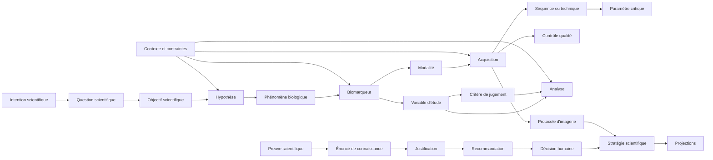

# PD-003 — Research Object Model

## Référence métier du Protocol Designer

**Statut :** référence conceptuelle normative

**Périmètre :** conception d’un projet de recherche en imagerie médicale quantitative

**Principe directeur :** une seule stratégie scientifique, plusieurs projections

---

## 1. Finalité du modèle

Le Research Object Model définit les objets que le Protocol Designer manipule pour transformer une situation de recherche encore ambiguë en une stratégie scientifique cohérente, argumentée, révisable et traçable.

Il décrit :

- ce que chaque objet signifie dans le raisonnement scientifique ;
- les responsabilités propres à chaque objet ;
- les relations autorisées entre les objets ;
- les dépendances qui conditionnent leur existence ou leur validité ;
- leur cycle de vie ;
- leur mode de versionnement ;
- les traces nécessaires pour reconstruire le raisonnement ;
- les formes sous lesquelles ils peuvent être projetés.

Le modèle ne confond jamais le projet, la stratégie, le protocole et le rapport :

- le **projet de recherche** porte la continuité du travail collectif ;
- la **stratégie scientifique** est le réseau cohérent des choix proposés ou adoptés ;
- le **protocole d’imagerie** est la partie opératoire de cette stratégie ;
- le **rapport scientifique** est une projection explicative d’un état de la stratégie.

---

## 2. Axiomes métier

### 2.1 Comprendre avant de construire

Le point de départ est toujours une intention ou une question scientifique, jamais une modalité, une séquence ou un paramètre.

### 2.2 Une seule stratégie scientifique

Un projet possède une stratégie cohérente à un instant donné. Des options concurrentes peuvent rester ouvertes, mais elles appartiennent au même espace d’arbitrage. Elles ne deviennent pas artificiellement plusieurs projets ou plusieurs vérités.

### 2.3 Le chercheur reste décisionnaire

Le Protocol Designer peut proposer, comparer, expliquer, alerter et documenter. Il n’adopte jamais une décision scientifique au nom du chercheur, du promoteur, du comité scientifique, du méthodologiste ou du Core Lab.

### 2.4 Le protocole est une conséquence

Une acquisition n’est retenue que si une chaîne de justification permet de la relier à une question, un objectif, une hypothèse, un phénomène, un biomarqueur ou un critère de jugement.

### 2.5 L’incertitude est conservée

Une information inconnue, supposée, controversée ou contradictoire ne doit jamais être transformée silencieusement en certitude.

### 2.6 Toute recommandation est contextualisée

Une recommandation n’existe qu’avec son domaine de validité, son niveau de confiance, ses limites, ses alternatives et les preuves qui la soutiennent.

### 2.7 La qualité commence à la conception

Les contrôles qualité, la reproductibilité, la faisabilité et l’harmonisation sont conçus en même temps que les acquisitions et les analyses.

### 2.8 Toute évolution est explicable

Une nouvelle information peut modifier la stratégie, mais elle ne réécrit jamais l’histoire. Le changement, sa cause, son auteur, ses impacts et l’état antérieur restent reconstructibles.

### 2.9 Une projection ne modifie pas le fond

Le rôle, l’expérience, le temps disponible ou le format souhaité modifient la présentation, jamais le contenu scientifique de référence.

### 2.10 Une preuve soutient un raisonnement

Une source ne produit pas directement une décision. Elle soutient une preuve, qui alimente un énoncé de connaissance, qui participe à une justification, laquelle peut soutenir une recommandation puis une décision.

---

## 3. Vue d’ensemble

Deux réseaux se rejoignent dans la stratégie :

1. le **réseau scientifique**, qui relie la question aux mesures, aux acquisitions et aux analyses ;
2. le **réseau argumentatif**, qui relie les connaissances et les preuves aux recommandations et aux décisions.

---

## 4. Règles transversales

### 4.1 Identité

Chaque objet possède une identité conceptuelle stable. Une reformulation éditoriale ne crée pas un nouvel objet ; un changement de sens, de portée ou de responsabilité en crée une nouvelle révision.

### 4.2 États épistémiques

Toute affirmation relative au projet est qualifiée par l’un des états suivants :

- **connu** : explicitement confirmé pour le projet ;
- **supposé** : retenu provisoirement et signalé comme tel ;
- **inconnu** : nécessaire mais non renseigné ;
- **non applicable** : explicitement exclu par le contexte ;
- **contradictoire** : plusieurs informations incompatibles coexistent ;
- **obsolète** : vrai pour un état antérieur, remplacé depuis.

### 4.3 Niveaux de confiance

Les connaissances, preuves, recommandations et interprétations utilisent une qualification explicite :

- établie ;
- probable ;
- contextuelle ;
- controversée ;
- insuffisamment documentée.

Cette qualification ne remplace pas l’explication qui la justifie.

### 4.4 Familles de cycles de vie

Les objets suivent l’une des familles suivantes :

- **objets de projet** : proposé → confirmé → révisé → remplacé ou retiré → archivé ;
- **objets de décision** : ouvert → instruit → recommandé → adopté, rejeté ou différé → rouvert ou remplacé ;
- **objets de connaissance** : brouillon → en revue → publié et effectif → remplacé, déprécié ou rétracté ;
- **objets de vigilance** : détecté → qualifié → accepté, atténué ou résolu → clos ou rouvert ;
- **projections** : demandée → produite → relue → diffusée → remplacée ou archivée.

Le mot « confirmé » décrit une information reconnue par un acteur habilité. Il ne signifie jamais que le Protocol Designer assume la responsabilité scientifique finale.

### 4.5 Règles de versionnement

- Une version publiée ou utilisée dans une décision reste immuable dans l’historique.
- Une correction crée une nouvelle révision et désigne explicitement ce qu’elle remplace.
- Une version de stratégie fige les objets, les relations, les décisions, les connaissances effectives et les incertitudes qui ont conduit à cet état.
- Une évolution des connaissances ne modifie pas silencieusement une version de stratégie existante ; elle ouvre une analyse d’impact.
- Une projection indique toujours la version de stratégie et l’état des connaissances dont elle dérive.
- Les objets partagés conservent leur identité au fil de leurs révisions ; les objets propres au projet conservent leur filiation au fil des versions de stratégie.

### 4.6 Trace minimale commune

Chaque objet ou relation doit permettre de retrouver :

- son origine ;
- son auteur ou son responsable ;
- la date de son apparition et de ses révisions ;
- son statut épistémique ou décisionnel ;
- sa justification ;
- les sources et connaissances mobilisées ;
- les objets dont il dépend ;
- les objets qu’il influence ;
- la version de stratégie dans laquelle il est utilisé ;
- le motif de son remplacement, de son retrait ou de son maintien.

---

## 5. Objets de projet et de gouvernance

### 5.1 Dossier de recherche

- **Rôle :** représenter la continuité d’un projet scientifique, de sa formulation initiale à ses états successifs.
- **Responsabilités :** définir le périmètre, réunir les acteurs, les contributions, les versions de stratégie, les revues et les projections ; distinguer le travail actif de l’historique.
- **Relations :** contient une situation de recherche, une ou plusieurs intentions successives, un contexte, des acteurs, une stratégie courante et ses versions antérieures.
- **Dépendances :** peut naître d’une idée, d’une question, d’une publication à reproduire, d’une stratégie à comparer ou d’un besoin de compréhension.
- **Cycle de vie :** initié → en clarification → en conception → en revue → stratégie proposée → suivi ou révision → clos → archivé ; il peut être rouvert.
- **Versionnement :** son identité reste stable ; ses états scientifiques sont portés par des versions de stratégie, sans écrasement de l’historique.
- **Traçabilité :** origine, initiateur, propriétaires scientifiques, contributeurs, événements majeurs, décisions, versions et livrables.
- **Projections possibles :** tableau de bord du projet, chronologie, synthèse d’avancement, dossier scientifique complet, liste des décisions ouvertes.

### 5.2 Acteur du projet

- **Rôle :** représenter une personne, un groupe ou une instance participant au projet.
- **Responsabilités :** contribuer, proposer, relire, arbitrer, adopter ou recevoir une projection selon son mandat ; ne pas confondre rôle professionnel et niveau d’accompagnement.
- **Relations :** participe au dossier, produit des contributions, possède des mandats, assume certaines décisions, revues ou actions de mitigation.
- **Dépendances :** son pouvoir d’action dépend du contexte du projet et d’un mandat explicite.
- **Cycle de vie :** invité → actif → temporairement indisponible ou remplacé → retiré du projet ; son historique de contribution demeure.
- **Versionnement :** les changements de rôle ou de mandat prennent effet à une date donnée et ne réinterprètent pas rétroactivement les décisions passées.
- **Traçabilité :** identité déclarée, rôle au moment de l’action, mandat applicable, contribution ou arbitrage signé.
- **Projections possibles :** matrice des responsabilités, journal des contributions, vues personnalisées par rôle, circuit de revue.

### 5.3 Mandat décisionnel

- **Rôle :** définir qui peut proposer, recommander, adopter, rejeter ou rouvrir une décision.
- **Responsabilités :** protéger la responsabilité scientifique humaine et rendre explicite l’autorité applicable à chaque catégorie de choix.
- **Relations :** relie un acteur ou une instance à un périmètre de décision, pendant une période et dans un dossier donné.
- **Dépendances :** dépend de la gouvernance du projet, du promoteur, du comité scientifique, du Core Lab ou des règles locales.
- **Cycle de vie :** défini → actif → modifié, suspendu ou révoqué → expiré.
- **Versionnement :** toute modification crée une nouvelle période d’effet ; les décisions antérieures restent associées au mandat alors actif.
- **Traçabilité :** auteur du mandat, bénéficiaire, périmètre, date d’effet, motif de modification ou de révocation.
- **Projections possibles :** matrice de gouvernance, liste des arbitrages attendus, preuve de responsabilité d’une décision.

### 5.4 Situation de recherche

- **Rôle :** conserver la formulation initiale, encore libre et potentiellement ambiguë, du besoin exprimé.
- **Responsabilités :** préserver les mots du demandeur, le contexte d’apparition du besoin et les ambiguïtés initiales sans les transformer prématurément en solution.
- **Relations :** donne naissance à une intention scientifique et à des besoins d’information ; peut être reliée à une publication, un constat clinique ou un problème méthodologique.
- **Dépendances :** aucune connaissance technique n’est requise pour son expression.
- **Cycle de vie :** capturée → reformulée → clarifiée → conservée comme origine ; elle peut être complétée mais pas réécrite rétroactivement.
- **Versionnement :** les compléments sont de nouvelles formulations reliées à l’original ; la citation initiale demeure intacte.
- **Traçabilité :** auteur, date, contexte, formulation originale, reformulations et accords ou désaccords sur ces reformulations.
- **Projections possibles :** verbatim d’entrée, reformulation courte, comparaison avant/après clarification, introduction du rapport.

### 5.5 Intention scientifique

- **Rôle :** exprimer ce que le chercheur veut accomplir avant de choisir comment le faire.
- **Responsabilités :** orienter le parcours de raisonnement : comprendre, explorer, mesurer, comparer, suivre, prédire, valider, reproduire, harmoniser ou préparer une publication.
- **Relations :** dérive de la situation de recherche ; cadre la question, les objectifs et le type d’étude sans imposer de modalité.
- **Dépendances :** dépend uniquement du besoin scientifique exprimé et de son contexte général.
- **Cycle de vie :** proposée → clarifiée → confirmée → affinée ou remplacée ; plusieurs intentions peuvent être hiérarchisées dans un même projet.
- **Versionnement :** toute modification de finalité crée une révision majeure ; une précision de formulation crée une révision mineure.
- **Traçabilité :** formulation source, reformulations, acteur confirmant, conséquences sur la question et la stratégie.
- **Projections possibles :** point d’entrée du parcours, résumé exécutif, objectif général, fil conducteur pédagogique.

### 5.6 Contexte du projet

- **Rôle :** décrire les circonstances dans lesquelles une proposition scientifique doit être pertinente et réalisable.
- **Responsabilités :** réunir le cadre clinique, scientifique, temporel, organisationnel, matériel, réglementaire et multicentrique ; rendre visibles les éléments connus ou inconnus.
- **Relations :** contextualise tous les objets ; contient notamment pathologie, population, sites, ressources, contraintes et conditions d’usage.
- **Dépendances :** se construit à partir des contributions du projet et peut évoluer pendant la conception.
- **Cycle de vie :** esquissé → renseigné → confirmé → révisé ; une modification significative déclenche une analyse d’impact.
- **Versionnement :** chaque version de stratégie référence l’état exact du contexte utilisé pour raisonner.
- **Traçabilité :** origine de chaque information, statut épistémique, date d’effet, portée locale ou globale, objets affectés.
- **Projections possibles :** fiche de contexte, profil de faisabilité, tableau multicentrique, hypothèses de travail, conditions d’applicabilité.

### 5.7 Stratégie scientifique

- **Rôle :** représenter le réseau cohérent des choix qui relie la question scientifique aux acquisitions, contrôles, analyses et interprétations.
- **Responsabilités :** maintenir la cohérence globale ; distinguer les choix adoptés, proposés, rejetés et encore ouverts ; exposer les justifications, compromis, risques et inconnues.
- **Relations :** agrège objectifs, hypothèses, phénomènes, biomarqueurs, critères de jugement, protocole, contrôles qualité, analyses, décisions et preuves.
- **Dépendances :** dépend d’une question suffisamment comprise, d’un contexte explicite et des connaissances effectives retenues.
- **Cycle de vie :** ébauche → en construction → prête pour revue → proposée → adoptée par les responsables, renvoyée en révision ou abandonnée → remplacée.
- **Versionnement :** chaque état cohérent significatif produit une version immuable ; une version nouvelle désigne la précédente et explique ses différences.
- **Traçabilité :** chaîne complète des décisions et dépendances, acteurs, connaissances effectives, alertes, éléments non résolus et raisons de changement.
- **Projections possibles :** rapport scientifique, protocole, synthèse, comparaison, arbre décisionnel, plan d’analyse, guide opératoire, support pédagogique.

### 5.8 Version de stratégie

- **Rôle :** figer un état cohérent et reconstructible du raisonnement à un moment donné.
- **Responsabilités :** garantir qu’une projection, une revue ou une décision puisse être relue avec les mêmes objets, relations, connaissances, statuts et incertitudes.
- **Relations :** photographie une stratégie ; succède éventuellement à une version antérieure ; porte un bilan de changement et une analyse d’impact.
- **Dépendances :** ne peut être créée que lorsque l’état capturé est cohérent ou explicitement qualifié d’incomplet.
- **Cycle de vie :** préparée → figée → utilisée → remplacée → archivée ; elle ne redevient jamais modifiable.
- **Versionnement :** possède une identité ordonnée ; une évolution majeure change la logique ou la portée, une évolution mineure précise sans modifier les décisions structurantes.
- **Traçabilité :** auteur du gel, date, motif, version précédente, différences, décisions ouvertes, état des connaissances et projections produites.
- **Projections possibles :** historique comparatif, rapport daté, note de changement, état de référence pour une revue ou une publication.

### 5.9 Contribution

- **Rôle :** représenter toute information, proposition, correction, commentaire ou arbitrage apporté par un acteur ou une source externe.
- **Responsabilités :** préserver l’origine des contenus sans confondre contribution et vérité adoptée ; permettre leur qualification et leur intégration explicite.
- **Relations :** émane d’un acteur ou d’une source ; cible un ou plusieurs objets ; peut créer une information, une option, une contradiction ou une décision.
- **Dépendances :** nécessite un auteur ou une origine identifiable, une date et un périmètre.
- **Cycle de vie :** soumise → qualifiée → intégrée, rejetée, différée ou remplacée.
- **Versionnement :** la contribution originale reste intacte ; toute correction est une contribution nouvelle qui la remplace ou la complète.
- **Traçabilité :** contenu original, auteur, rôle, cible, traitement, justification du traitement et version de stratégie concernée.
- **Projections possibles :** journal de travail, fil de discussion méthodologique, historique des arbitrages, accusé de prise en compte.

---

## 6. Objets de cadrage scientifique

### 6.1 Question scientifique

- **Rôle :** formuler le problème auquel le projet cherche à répondre, sans préjuger de la solution.
- **Responsabilités :** identifier population, phénomène ou effet d’intérêt, comparaison éventuelle et contexte ; rester compréhensible, falsifiable ou investigable.
- **Relations :** dérive de l’intention ; commande objectifs et hypothèses ; est contextualisée par la pathologie, la population et le plan d’étude.
- **Dépendances :** dépend d’une clarification suffisante de l’intention et des ambiguïtés critiques.
- **Cycle de vie :** esquissée → reformulée → confirmée → affinée ou remplacée.
- **Versionnement :** une modification qui change ce que l’étude cherche à démontrer est majeure ; une amélioration rédactionnelle est mineure.
- **Traçabilité :** situation d’origine, reformulations, ambiguïtés résolues, acteur confirmant, conséquences méthodologiques.
- **Projections possibles :** titre scientifique, question structurée, résumé exécutif, introduction, critère de cohérence du rapport.

### 6.2 Objectif scientifique

- **Rôle :** traduire la question en résultats scientifiques attendus et organisés.
- **Responsabilités :** distinguer objectif principal, objectifs secondaires et exploratoires ; rester lié à des hypothèses et critères de jugement évaluables.
- **Relations :** répond à la question ; justifie hypothèses, variables, critères de jugement, analyses et priorités d’acquisition.
- **Dépendances :** dépend de la question, de la population et du périmètre du projet.
- **Cycle de vie :** proposé → classé → confirmé → révisé, déclassé ou retiré.
- **Versionnement :** tout changement de priorité ou de portée crée une révision et déclenche une analyse d’impact.
- **Traçabilité :** origine, rang, justification, décisions associées, éléments de stratégie qui le servent.
- **Projections possibles :** objectifs principal et secondaires, matrice objectif–mesure, résumé, plan d’analyse, section méthodologique.

### 6.3 Hypothèse

- **Rôle :** exprimer une proposition scientifique que le projet cherche à examiner.
- **Responsabilités :** préciser le sens attendu, les conditions, la population, le comparateur et le degré de formalisation ; distinguer hypothèse scientifique et hypothèse de travail.
- **Relations :** découle d’un objectif ; porte sur des phénomènes, biomarqueurs ou effets ; est examinée par des variables, critères et analyses.
- **Dépendances :** dépend des connaissances disponibles, du plan d’étude et des informations du projet.
- **Cycle de vie :** suggérée → argumentée → retenue → testable, exploratoire, rejetée ou non évaluable → révisée.
- **Versionnement :** la formulation et le statut sont versionnés ; une modification du sens attendu crée une nouvelle hypothèse liée à l’ancienne.
- **Traçabilité :** auteur, justification, connaissances de soutien, objections, critères permettant de l’examiner.
- **Projections possibles :** hypothèses principales et secondaires, schéma causal, plan statistique, justification des acquisitions.

### 6.4 Pathologie ou condition clinique

- **Rôle :** représenter la maladie, l’état clinique ou la condition dans laquelle le phénomène est étudié.
- **Responsabilités :** préciser définition, stade, sous-type, critères diagnostiques pertinents et effets attendus sur les mesures.
- **Relations :** caractérise la population ; modifie le domaine de validité des biomarqueurs, valeurs attendues, risques et interprétations.
- **Dépendances :** dépend d’une définition clinique reconnue et du contexte d’usage.
- **Cycle de vie :** identifiée → précisée → confirmée → révisée si les critères ou la population changent.
- **Versionnement :** la définition de référence et son état des connaissances sont identifiés ; le choix propre au projet est figé dans chaque version de stratégie.
- **Traçabilité :** terme source, définition retenue, critères d’inclusion associés, alternatives terminologiques et références.
- **Projections possibles :** contexte clinique, critères d’éligibilité, guide pédagogique, domaine d’interprétation.

### 6.5 Structure anatomique

- **Rôle :** définir l’organe, le tissu, la région ou la structure sur laquelle porte l’observation.
- **Responsabilités :** préciser le niveau anatomique pertinent, les conventions de repérage et les éventuelles subdivisions d’analyse.
- **Relations :** est affectée par une pathologie ou un phénomène ; est observée par une acquisition et délimitée par une procédure de lecture ou d’analyse.
- **Dépendances :** dépend de la question, du biomarqueur et de la résolution nécessaire.
- **Cycle de vie :** proposée → précisée → retenue → révisée ou étendue.
- **Versionnement :** un changement de territoire ou de granularité est une révision scientifique et peut modifier acquisitions, lectures et analyses.
- **Traçabilité :** définition, nomenclature, justification, objets dépendants et conventions retenues.
- **Projections possibles :** fiche anatomique, consignes de couverture, plans de coupe, procédure de segmentation ou de lecture.

### 6.6 Population d’étude

- **Rôle :** définir les personnes ou unités auxquelles la question et les conclusions se rapportent.
- **Responsabilités :** expliciter critères d’inclusion et d’exclusion, caractéristiques pertinentes, recrutement, représentativité et sous-populations.
- **Relations :** porte pathologies, phénotypes, expositions et contraintes ; se répartit éventuellement en groupes ; conditionne critères, analyses et validité externe.
- **Dépendances :** dépend de la question, du plan d’étude, de la faisabilité et du contexte éthique ou réglementaire.
- **Cycle de vie :** esquissée → définie → évaluée pour faisabilité → retenue → amendée ou fermée.
- **Versionnement :** tout changement d’éligibilité ou de périmètre crée une révision et exige une analyse d’impact.
- **Traçabilité :** source des critères, justification, hypothèses de recrutement, exclusions, conséquences sur la généralisation.
- **Projections possibles :** fiche population, critères d’éligibilité, diagramme des groupes, section méthodes, limites de généralisation.

### 6.7 Phénotype

- **Rôle :** représenter un ensemble observable de caractéristiques cliniques, biologiques ou d’imagerie pertinent pour le projet.
- **Responsabilités :** distinguer le phénotype recherché d’une pathologie, préciser ses critères et éviter les catégories implicites.
- **Relations :** caractérise une population ou un sous-groupe ; peut être expliqué par des phénomènes et mesuré par plusieurs biomarqueurs.
- **Dépendances :** dépend de critères explicites, de variables disponibles et d’un domaine de validité.
- **Cycle de vie :** proposé → défini → qualifié → utilisé, révisé ou abandonné.
- **Versionnement :** les changements de définition, seuil ou combinaison de critères créent une nouvelle révision.
- **Traçabilité :** origine de la définition, critères, seuils, preuves, incertitudes et groupes concernés.
- **Projections possibles :** définition de cohorte, règle de classification, tableau de phénotypage, aide à l’interprétation.

### 6.8 Phénomène biologique

- **Rôle :** représenter le processus biologique que le projet cherche à comprendre ou approcher.
- **Responsabilités :** maintenir la distinction entre le phénomène et ses mesures indirectes ; préciser mécanismes, temporalité et contexte.
- **Relations :** est impliqué dans une pathologie ; motive des biomarqueurs ; soutient hypothèses, interprétations et limites.
- **Dépendances :** dépend d’une question et de connaissances scientifiques contextualisées.
- **Cycle de vie :** identifié → caractérisé → retenu → précisé, contesté ou retiré du raisonnement.
- **Versionnement :** la définition scientifique suit l’évolution des connaissances ; son usage dans une stratégie reste figé avec cette stratégie.
- **Traçabilité :** connaissances de support, relations avec pathologies et biomarqueurs, controverses et domaine de validité.
- **Projections possibles :** synthèse physiopathologique, schéma mécanistique, justification des biomarqueurs, support pédagogique.

### 6.9 Plan d’étude

- **Rôle :** décrire la structure méthodologique générale permettant d’examiner les objectifs et hypothèses.
- **Responsabilités :** préciser temporalité, observation ou intervention, rétrospectif ou prospectif, mono- ou multicentrique, comparaison, randomisation éventuelle et unité d’analyse.
- **Relations :** organise population, groupes, visites, expositions, critères de jugement, acquisitions et analyses.
- **Dépendances :** dépend de la question, des objectifs, de l’éthique, de la faisabilité et du niveau de preuve recherché.
- **Cycle de vie :** optionnel → comparé → retenu → détaillé → amendé ou remplacé.
- **Versionnement :** tout changement de structure produit une révision majeure de la stratégie.
- **Traçabilité :** options examinées, justification du choix, compromis, connaissances et contraintes déterminantes.
- **Projections possibles :** synopsis, schéma d’étude, calendrier, section méthodes, matrice des dépendances.

### 6.10 Groupe d’étude

- **Rôle :** représenter une cohorte, un bras, un groupe comparateur ou une strate prévue par le plan d’étude.
- **Responsabilités :** définir appartenance, rôle analytique, intervention ou exposition et comparabilité attendue.
- **Relations :** sous-ensemble de la population ; participe à des visites, acquisitions, analyses et comparaisons.
- **Dépendances :** dépend du plan d’étude et de critères d’affectation explicites.
- **Cycle de vie :** proposé → défini → retenu → modifié, fusionné, scindé ou retiré.
- **Versionnement :** les critères d’affectation et le rôle analytique sont versionnés ; une fusion ou scission conserve la filiation.
- **Traçabilité :** définition, justification, taille attendue, comparateur, évolution et analyses affectées.
- **Projections possibles :** tableau des groupes, diagramme d’étude, calendrier par groupe, plan d’analyse.

### 6.11 Visite ou temps d’observation

- **Rôle :** situer les observations, acquisitions et évaluations dans le temps scientifique du projet.
- **Responsabilités :** préciser repère, fenêtre temporelle, ordre, répétitions, conditions et tolérances.
- **Relations :** appartient au plan d’étude ; concerne un ou plusieurs groupes ; porte acquisitions, prélèvements, variables et contrôles.
- **Dépendances :** dépend de l’évolution biologique attendue, des objectifs, des contraintes et du plan d’analyse.
- **Cycle de vie :** proposée → ordonnée → retenue → ajustée, ajoutée ou supprimée.
- **Versionnement :** tout changement de calendrier conserve la version précédente et expose ses impacts.
- **Traçabilité :** justification temporelle, fenêtre, dépendances, changement et conséquences sur critères et analyses.
- **Projections possibles :** calendrier, tableau des visites, fiche opératoire, plan de collecte, recherche d’examens compatibles.

### 6.12 Intervention ou exposition

- **Rôle :** représenter un traitement, une procédure, un événement ou une exposition susceptible d’influencer les observations.
- **Responsabilités :** préciser nature, dose ou intensité pertinente, temporalité, comparateur et mécanisme attendu.
- **Relations :** concerne un groupe et des visites ; modifie hypothèses, phénomènes, variables, risques et interprétations.
- **Dépendances :** dépend du plan d’étude et du contexte clinique.
- **Cycle de vie :** identifiée → définie → retenue → modifiée, interrompue ou retirée.
- **Versionnement :** toute modification substantielle crée une nouvelle révision et déclenche une analyse d’impact.
- **Traçabilité :** origine, responsable, conditions, justification, risques et objets influencés.
- **Projections possibles :** synopsis, calendrier, consignes de visite, modèle d’interprétation, limites.

---

## 7. Objets de mesure, d’acquisition et d’analyse

### 7.1 Biomarqueur

- **Rôle :** représenter un indicateur mesurable qui approche un phénomène biologique, un état ou une réponse.
- **Responsabilités :** préciser ce qu’il reflète et ne reflète pas, son domaine de validité, ses facteurs de confusion, sa reproductibilité et son niveau de preuve.
- **Relations :** approche un ou plusieurs phénomènes ; est opérationnalisé par des variables ; dépend de modalités, acquisitions, conditions et analyses.
- **Dépendances :** ne peut être retenu sans objectif ou hypothèse, justification scientifique et faisabilité minimale.
- **Cycle de vie :** candidat → évalué → recommandé → retenu, rejeté ou exploratoire → réévalué.
- **Versionnement :** la définition et les connaissances évoluent ; le choix contextuel du projet est versionné dans la stratégie.
- **Traçabilité :** phénomène ciblé, justification, alternatives, limites, preuves, paramètres et analyses nécessaires.
- **Projections possibles :** fiche biomarqueur, tableau comparatif, justification scientifique, plan d’acquisition, plan d’analyse.

### 7.2 Variable d’étude

- **Rôle :** définir une donnée conceptuelle attendue, observée ou dérivée pour répondre aux objectifs.
- **Responsabilités :** préciser nature, unité, méthode d’obtention, temporalité, qualité attendue et traitement des valeurs non évaluables.
- **Relations :** opérationnalise un biomarqueur ou une caractéristique ; alimente un critère de jugement, une analyse ou une règle d’interprétation.
- **Dépendances :** dépend d’une acquisition, d’une lecture, d’un prélèvement ou d’un calcul défini.
- **Cycle de vie :** proposée → définie → retenue → collectable ou dérivable → révisée ou retirée.
- **Versionnement :** changements d’unité, définition, méthode ou règle de calcul créent une nouvelle révision.
- **Traçabilité :** objectif servi, méthode d’obtention, provenance, contrôles, transformation et usages analytiques.
- **Projections possibles :** dictionnaire des variables, plan de collecte, tableau de mesures, section méthodes, plan statistique.

### 7.3 Critère de jugement

- **Rôle :** traduire un objectif scientifique en évaluation opérationnelle priorisée.
- **Responsabilités :** préciser variable, population, temps d’observation, règle de calcul, sens d’interprétation et caractère principal, secondaire ou exploratoire.
- **Relations :** répond à un objectif ; s’appuie sur variables, visites et analyses ; conditionne plan d’étude et parfois dimensionnement.
- **Dépendances :** dépend d’une hypothèse, d’une mesure réalisable et d’une analyse cohérente.
- **Cycle de vie :** proposé → qualifié → hiérarchisé → retenu → modifié ou retiré.
- **Versionnement :** tout changement de priorité ou définition est majeur et exige une justification explicite.
- **Traçabilité :** objectif associé, formule ou règle, fenêtre, justification, changement et impact.
- **Projections possibles :** synopsis, tableau des critères, plan d’analyse, rapport, grille de cohérence.

### 7.4 Modalité d’imagerie

- **Rôle :** représenter une famille de moyens d’observation, jamais un objectif scientifique.
- **Responsabilités :** expliciter capacités, limites, contraintes, risques, coûts, artefacts et dépendances matérielles.
- **Relations :** rend accessibles certains biomarqueurs ; contient des techniques ou séquences ; dépend du contexte et des sites.
- **Dépendances :** ne peut être retenue qu’après identification du besoin de mesure et comparaison des options raisonnables.
- **Cycle de vie :** candidate → comparée → recommandée → retenue ou rejetée → réévaluée.
- **Versionnement :** ses connaissances de référence évoluent ; le choix dans le projet est figé par version de stratégie.
- **Traçabilité :** biomarqueurs servis, alternatives, justification, contraintes, risques et preuves.
- **Projections possibles :** comparaison de modalités, protocole, fiche de faisabilité, justification, guide pédagogique.

### 7.5 Acquisition

- **Rôle :** représenter l’acte d’obtenir une information d’imagerie dans un groupe, une visite et un contexte déterminés.
- **Responsabilités :** préciser finalité, couverture, ordre, durée, conditions, technique, paramètres critiques et critères d’acceptation.
- **Relations :** appartient au protocole ; utilise une modalité et une séquence ou technique ; produit des variables ; est couverte par des contrôles qualité.
- **Dépendances :** doit servir au moins un objectif, biomarqueur, critère, contrôle de confusion ou besoin d’interprétation explicite.
- **Cycle de vie :** candidate → justifiée → spécifiée → retenue, optionnelle ou rejetée → révisée ou retirée.
- **Versionnement :** toute modification scientifique ou opératoire significative crée une révision ; les paramètres mineurs restent historisés.
- **Traçabilité :** chaîne de justification, décision, conditions, paramètres, contrôles, alternatives et conséquences d’un retrait.
- **Projections possibles :** fiche d’acquisition, protocole opératoire, calendrier, check-list, critères de recherche d’examens.

### 7.6 Séquence ou technique d’acquisition

- **Rôle :** définir la méthode physique et opératoire utilisée pour réaliser une acquisition.
- **Responsabilités :** préciser capacité de mesure, dépendances, variantes, artefacts, limites et conditions de comparabilité.
- **Relations :** spécialise une acquisition dans une modalité ; porte des paramètres ; contribue à un ou plusieurs biomarqueurs.
- **Dépendances :** dépend du matériel, de la version disponible, de la population, du temps et du niveau de qualité attendu.
- **Cycle de vie :** candidate → évaluée → retenue → adaptée localement, remplacée ou retirée.
- **Versionnement :** la famille scientifique, la variante et l’adaptation locale restent distinguées et versionnées.
- **Traçabilité :** biomarqueurs servis, variante, raison du choix, alternatives, paramètres critiques, limites et preuves.
- **Projections possibles :** protocole, guide manipulateur, comparaison technique, fiche d’harmonisation, support de formation.

### 7.7 Paramètre critique

- **Rôle :** représenter une valeur ou une règle dont la variation peut modifier la validité, la qualité ou l’interprétation d’une acquisition ou d’une analyse.
- **Responsabilités :** préciser valeur cible, plage acceptable, unité, dépendances, marge d’adaptation et conséquence d’un écart.
- **Relations :** configure une séquence, un contrôle, une analyse ou une lecture ; peut varier selon site sous règle d’harmonisation.
- **Dépendances :** dépend de la technique, du matériel, de la population, du biomarqueur et des preuves disponibles.
- **Cycle de vie :** proposé → qualifié comme critique ou adaptable → retenu → ajusté ou remplacé.
- **Versionnement :** chaque changement de valeur, plage ou criticité est historisé et relié à son motif.
- **Traçabilité :** origine, justification, domaine d’effet, écarts acceptés, décision et impacts.
- **Projections possibles :** tableau de paramètres, fiche opératoire, check-list, règles de conformité, matrice multicentrique.

### 7.8 Condition de mesure

- **Rôle :** définir les conditions physiologiques, temporelles, cliniques ou procédurales nécessaires à l’interprétation d’une mesure.
- **Responsabilités :** préciser préparation, respiration, rythme, contraste, traitement concomitant, délai, positionnement ou autre condition pertinente.
- **Relations :** contextualise acquisitions, variables et interprétations ; peut devenir critère qualité ou facteur de confusion.
- **Dépendances :** dépend du biomarqueur, de la population, de la visite et de la méthode.
- **Cycle de vie :** identifiée → spécifiée → retenue → adaptée, non satisfaite ou retirée.
- **Versionnement :** toute modification est historisée avec son impact attendu sur comparabilité et interprétation.
- **Traçabilité :** justification, source, responsable, mode de vérification, écarts et conséquences.
- **Projections possibles :** consignes patient, fiche de visite, protocole opératoire, contrôle de conformité, limites.

### 7.9 Protocole d’imagerie

- **Rôle :** organiser les acquisitions et conditions nécessaires à l’exécution de la stratégie d’imagerie.
- **Responsabilités :** assurer ordre, durée, cohérence, couverture des objectifs, faisabilité, qualité et gestion des variantes autorisées.
- **Relations :** compose des acquisitions par visite et groupe ; dépend des décisions, contraintes, sites, contrôles et règles d’harmonisation.
- **Dépendances :** ne peut exister sans stratégie scientifique suffisamment construite ; il n’est jamais la racine du projet.
- **Cycle de vie :** ébauche → construit → revu → proposé → adopté par les responsables, révisé ou abandonné → remplacé.
- **Versionnement :** chaque version est liée à une version de stratégie ; les variantes locales restent rattachées à une version commune.
- **Traçabilité :** justification de chaque acquisition, ordre, changements, décisions, variantes, critères qualité et impacts.
- **Projections possibles :** fiche protocole, guide par site, check-list, calendrier, tableau de paramètres, critères de compatibilité d’examens.

### 7.10 Site et environnement technique

- **Rôle :** représenter le contexte local dans lequel une stratégie doit pouvoir être exécutée.
- **Responsabilités :** décrire équipements, constructeur, modèle, version, champ, accessoires, compétences, capacités, disponibilité et pratiques locales pertinentes.
- **Relations :** appartient au contexte ; porte des contraintes et variantes ; exécute le protocole sous règles d’harmonisation.
- **Dépendances :** dépend des informations déclarées et de leur date de validité.
- **Cycle de vie :** recensé → qualifié → compatible, partiellement compatible ou incompatible → mis à jour ou retiré.
- **Versionnement :** l’état de l’environnement est daté ; les évolutions n’altèrent pas les évaluations antérieures.
- **Traçabilité :** source de l’information, date de vérification, capacités, écarts, décisions d’adaptation et responsables.
- **Projections possibles :** fiche site, matrice de compatibilité, protocole local, plan d’harmonisation, liste d’actions préalables.

### 7.11 Contrainte

- **Rôle :** représenter une limite imposée au projet ou une condition qui restreint les options possibles.
- **Responsabilités :** préciser nature, portée, dureté, temporalité, négociabilité et conséquences.
- **Relations :** appartient au contexte ; exclut, dégrade ou favorise des options ; peut générer compromis, risques et adaptations.
- **Dépendances :** provient d’un acteur, d’un site, d’une règle, d’une ressource, de la population ou du calendrier.
- **Cycle de vie :** identifiée → qualifiée → confirmée → satisfaite, contournée, acceptée ou levée.
- **Versionnement :** toute évolution de portée ou de sévérité est historisée et réévalue les décisions dépendantes.
- **Traçabilité :** origine, responsable, objets affectés, alternatives, décision et date d’effet.
- **Projections possibles :** registre des contraintes, fiche de faisabilité, comparaison d’options, synthèse des compromis.

### 7.12 Règle d’harmonisation

- **Rôle :** définir comment préserver la comparabilité lorsque les sites ou conditions diffèrent.
- **Responsabilités :** distinguer exigences communes, plages tolérées, adaptations locales, contrôles et règles de gestion des écarts.
- **Relations :** s’applique aux sites, techniques, paramètres, conditions, lectures, contrôles et analyses.
- **Dépendances :** dépend des sources de variabilité connues, du niveau de comparabilité requis et de la faisabilité locale.
- **Cycle de vie :** proposée → négociée → retenue → appliquée → surveillée → révisée ou retirée.
- **Versionnement :** les règles communes et variantes locales sont versionnées ensemble avec leurs périodes d’effet.
- **Traçabilité :** justification, écarts ciblés, sites concernés, responsables, contrôles et conséquences de non-respect.
- **Projections possibles :** manuel multicentrique, matrice site–exigence, check-list de qualification, protocole local.

### 7.13 Contrôle qualité

- **Rôle :** vérifier qu’une acquisition, une lecture, une mesure ou une analyse est apte à l’usage scientifique prévu.
- **Responsabilités :** définir objet contrôlé, moment, méthode, seuils, résultat attendu, action en cas d’écart et responsabilité.
- **Relations :** couvre acquisitions, paramètres, variables, lectures, analyses et harmonisation ; peut produire une alerte ou rendre un résultat non évaluable.
- **Dépendances :** dépend de l’usage prévu, des risques, de la reproductibilité attendue et des moyens disponibles.
- **Cycle de vie :** conçu → spécifié → appliqué → conforme, avec réserve ou non conforme → action ou clôture.
- **Versionnement :** les critères et actions sont versionnés ; les résultats restent liés à la version appliquée.
- **Traçabilité :** méthode, seuil, responsable, résultat, écart, décision, action corrective et justification.
- **Projections possibles :** plan qualité, check-list, critères d’acceptation, tableau de suivi, guide Core Lab.

### 7.14 Procédure de lecture

- **Rôle :** définir comment une observation humaine ou assistée doit être produite de manière reproductible.
- **Responsabilités :** préciser lecteur, qualification, aveugle éventuel, ordre, conventions, répétitions, arbitrage et contrôle de variabilité.
- **Relations :** produit des variables à partir d’acquisitions ; dépend de critères qualité ; alimente analyses et interprétations.
- **Dépendances :** dépend du biomarqueur, du plan d’étude, du niveau de reproductibilité et des compétences.
- **Cycle de vie :** proposée → spécifiée → qualifiée → utilisée → révisée ou remplacée.
- **Versionnement :** les conventions et procédures d’arbitrage sont versionnées ; les résultats indiquent la version utilisée.
- **Traçabilité :** auteur, qualification, conventions, changement, contrôles, écarts et décisions d’arbitrage.
- **Projections possibles :** manuel de lecture, fiche lecteur, plan de formation, grille d’acceptation, section méthodes.

### 7.15 Analyse

- **Rôle :** transformer des variables ou images en résultats capables d’examiner un objectif ou une hypothèse.
- **Responsabilités :** préciser entrées, population analysée, méthode, comparaisons, ajustements, valeurs manquantes, sorties et limites.
- **Relations :** utilise variables, critères, groupes et visites ; peut dépendre d’une procédure de lecture ou d’un pipeline ; produit des résultats interprétables.
- **Dépendances :** dépend du plan d’étude, des hypothèses, de la qualité des données et des conditions d’applicabilité.
- **Cycle de vie :** envisagée → spécifiée → revue → retenue → adaptée, remplacée ou abandonnée.
- **Versionnement :** tout changement de méthode, population ou règle de traitement crée une révision clairement qualifiée.
- **Traçabilité :** objectif servi, entrées, méthode, choix, alternatives, hypothèses, contrôles et limitations.
- **Projections possibles :** plan d’analyse, fiche méthode, section statistique, guide d’exécution, arbre d’interprétation.

### 7.16 Dimensionnement

- **Rôle :** déterminer le nombre d’unités, d’examens ou de participants nécessaire pour répondre aux objectifs avec une précision ou une puissance justifiée.
- **Responsabilités :** expliciter critère principal, effet attendu, variabilité, erreur acceptable, puissance, pertes anticipées, structure des groupes et hypothèses de calcul.
- **Relations :** dépend des objectifs, hypothèses, critères, groupes, visites et analyses ; influence recrutement, durée, faisabilité, coût et risques.
- **Dépendances :** exige des hypothèses quantitatives justifiées ou, à défaut, une qualification exploratoire explicite.
- **Cycle de vie :** esquissé → calculé → revu → retenu → révisé si une hypothèse structurante change.
- **Versionnement :** chaque modification d’hypothèse, de méthode ou de résultat produit une nouvelle révision accompagnée d’une comparaison.
- **Traçabilité :** hypothèses, sources, méthode, scénarios, auteur, revue, arrondis, marge retenue et conséquences opérationnelles.
- **Projections possibles :** note de dimensionnement, synopsis, plan statistique, analyse de faisabilité, justification pour comité.

### 7.17 Règle d’interprétation

- **Rôle :** expliciter comment un résultat peut être interprété dans un contexte donné et jusqu’où cette interprétation reste valable.
- **Responsabilités :** préciser sens, seuils éventuels, contexte, facteurs de confusion, alternatives et degré de confiance ; interdire les raccourcis entre biomarqueur et phénomène.
- **Relations :** relie résultat ou variable à hypothèse, phénomène, phénotype ou décision ; dépend de preuves et du contexte.
- **Dépendances :** exige un domaine de validité, une qualité suffisante et une connaissance explicite des limites.
- **Cycle de vie :** proposée → argumentée → retenue → appliquée, contestée ou remplacée.
- **Versionnement :** toute évolution de seuil, sens ou domaine de validité crée une nouvelle révision.
- **Traçabilité :** preuves, contexte, hypothèses, exceptions, controverses et version de connaissance.
- **Projections possibles :** guide d’interprétation, aide à la lecture, rapport, support pédagogique, limites.

---

## 8. Objets du raisonnement adaptatif et de la décision

### 8.1 Information de projet

- **Rôle :** représenter une affirmation utile au raisonnement sur le projet.
- **Responsabilités :** porter une valeur, un état épistémique, une origine, une portée et une date de validité ; distinguer fait confirmé, hypothèse de travail, absence et contradiction.
- **Relations :** décrit le contexte ou un objet ; peut répondre à un besoin d’information, déclencher une décision ou modifier une dépendance.
- **Dépendances :** nécessite une provenance et une qualification explicites.
- **Cycle de vie :** reçue → qualifiée → confirmée, supposée, contredite, rendue non applicable ou remplacée.
- **Versionnement :** une correction crée une nouvelle information liée à celle qu’elle remplace ; l’ancienne conserve sa période de validité.
- **Traçabilité :** source, auteur, date, statut, justification, objets affectés et traitement.
- **Projections possibles :** fiche de contexte, synthèse des hypothèses, registre des inconnues, historique des réponses.

### 8.2 Besoin d’information

- **Rôle :** représenter une information manquante dont la réponse pourrait modifier le raisonnement.
- **Responsabilités :** expliciter pourquoi l’information est utile, quelles décisions elle influence et ce qui se passe si elle reste inconnue.
- **Relations :** naît d’une dépendance, d’une incertitude, d’une contradiction ou d’une revue ; peut donner lieu à une question adaptative.
- **Dépendances :** ne doit exister que si au moins une conséquence méthodologique est identifiable.
- **Cycle de vie :** détecté → priorisé → demandé, différé ou renoncé → satisfait, rendu non applicable ou maintenu ouvert.
- **Versionnement :** sa priorité et sa portée peuvent évoluer ; sa raison d’origine reste conservée.
- **Traçabilité :** objet déclencheur, décisions influencées, priorité, traitement et réponse éventuelle.
- **Projections possibles :** prochaine question, liste des informations manquantes, blocage explicite, plan d’action.

### 8.3 Échange adaptatif

- **Rôle :** représenter une question posée dans un but méthodologique et la réponse qui lui est apportée.
- **Responsabilités :** conserver l’intention de la question, les réponses proposées, la réponse libre, l’interprétation retenue et l’effet réel sur la stratégie.
- **Relations :** répond à un besoin d’information ; produit une contribution ou une information ; peut ouvrir de nouveaux besoins.
- **Dépendances :** une question n’est légitime que si ses réponses possibles influencent une décision, une incertitude ou une projection utile.
- **Cycle de vie :** préparé → posé → répondu, ignoré ou différé → interprété → intégré ou contesté.
- **Versionnement :** la formulation peut être améliorée sans modifier les échanges passés ; une nouvelle question remplace explicitement l’ancienne.
- **Traçabilité :** raison de la question, auteur de la réponse, formulation exacte, interprétation, conséquence et date.
- **Projections possibles :** parcours conversationnel, journal de clarification, résumé des réponses, explication « pourquoi cette question ».

### 8.4 Option

- **Rôle :** représenter une possibilité scientifique, méthodologique ou technique soumise à comparaison.
- **Responsabilités :** expliciter bénéfices, coûts, limites, risques, conditions et conséquences ; rester distincte d’une recommandation ou décision.
- **Relations :** appartient à un arbitrage ; peut concerner un plan d’étude, biomarqueur, modalité, acquisition, analyse ou règle qualité.
- **Dépendances :** dépend du problème à résoudre et du contexte dans lequel elle est évaluée.
- **Cycle de vie :** identifiée → qualifiée → comparée → recommandée, retenue, rejetée ou différée → réouverte.
- **Versionnement :** l’option est révisée si sa définition ou son contexte change ; son évaluation est datée.
- **Traçabilité :** origine, alternatives concurrentes, arguments, preuves, contraintes et décision finale.
- **Projections possibles :** tableau comparatif, arbre décisionnel, fiche d’option, justification d’un choix.

### 8.5 Recommandation

- **Rôle :** formuler une proposition argumentée adaptée au contexte, sans se substituer à la décision humaine.
- **Responsabilités :** indiquer action proposée, bénéficiaire, moment, contexte, alternatives, niveau de confiance, justification et conditions d’invalidation.
- **Relations :** s’appuie sur des justifications et connaissances ; compare des options ; peut conduire à une décision ou rester sans suite.
- **Dépendances :** exige un contexte suffisant, un domaine de validité et une explication reconstruisible.
- **Cycle de vie :** candidate → argumentée → émise → acceptée, rejetée, différée ou remplacée → réévaluée.
- **Versionnement :** tout changement de sens, confiance ou domaine crée une révision ; les recommandations remplacées restent visibles.
- **Traçabilité :** origine, connaissances, preuves, arguments, alternatives, auteur de l’adoption ou du rejet et motif.
- **Projections possibles :** recommandation principale, encadré explicatif, comparaison, plan d’action, rapport de revue.

### 8.6 Décision

- **Rôle :** représenter un arbitrage humain explicite qui engage la stratégie du projet.
- **Responsabilités :** préciser objet, options considérées, choix, responsable, date, justification, réserves et conditions de réouverture.
- **Relations :** adopte, rejette ou diffère une option ou recommandation ; modifie la stratégie ; peut dépendre d’autres décisions.
- **Dépendances :** nécessite un acteur habilité par un mandat et une information suffisante ou une acceptation explicite de l’incertitude.
- **Cycle de vie :** ouverte → instruite → arbitrée → active → réouverte, remplacée ou annulée.
- **Versionnement :** une décision arbitrée n’est jamais éditée ; une nouvelle décision la remplace et explique pourquoi.
- **Traçabilité :** décideur, mandat, options, recommandation, arguments, réserves, date d’effet et impacts.
- **Projections possibles :** registre des décisions, résumé des choix, journal d’arbitrage, note de changement.

### 8.7 Justification

- **Rôle :** relier une proposition ou décision aux raisons scientifiques, méthodologiques et contextuelles qui la soutiennent.
- **Responsabilités :** répondre à « pourquoi », « pourquoi maintenant », « pourquoi dans ce contexte » et « pourquoi pas une autre option ».
- **Relations :** relie connaissances, preuves, contraintes, risques et objectifs à une recommandation, décision ou composant de stratégie.
- **Dépendances :** dépend d’arguments identifiables et d’un domaine de validité.
- **Cycle de vie :** esquissée → étayée → utilisée → contestée, renforcée, affaiblie ou remplacée.
- **Versionnement :** toute évolution des arguments ou preuves crée une révision, sans altérer la justification appliquée à une décision passée.
- **Traçabilité :** arguments favorables et défavorables, sources, niveau de confiance, auteur, date et objet soutenu.
- **Projections possibles :** explication détaillée, note méthodologique, annotation de protocole, réponse à un reviewer.

### 8.8 Compromis

- **Rôle :** rendre explicite l’échange entre bénéfices et coûts induit par un choix.
- **Responsabilités :** décrire ce qui est gagné, perdu, déplacé ou rendu incertain ; ne pas masquer les effets secondaires d’une optimisation.
- **Relations :** compare des options ; alimente recommandation, décision, risque et limite.
- **Dépendances :** dépend de critères de valeur explicites : information, temps, coût, sécurité, reproductibilité, comparabilité ou charge patient.
- **Cycle de vie :** identifié → évalué → accepté, refusé ou renégocié → réévalué si le contexte change.
- **Versionnement :** l’évaluation est datée et liée au contexte ; une nouvelle pondération crée une nouvelle révision.
- **Traçabilité :** valeurs comparées, acteurs concernés, hypothèses, décision et conséquences acceptées.
- **Projections possibles :** balance bénéfices–coûts, tableau comparatif, justification, résumé exécutif.

### 8.9 Dépendance

- **Rôle :** exprimer qu’un objet n’est valide, utile ou réalisable qu’en présence d’un autre objet ou d’une condition.
- **Responsabilités :** préciser nature, direction, force, condition et conséquence d’une rupture.
- **Relations :** relie tous types d’objets ; forme le réseau d’impact de la stratégie.
- **Dépendances :** doit être scientifiquement ou méthodologiquement justifiée ; une simple coïncidence ne suffit pas.
- **Cycle de vie :** proposée → confirmée → active → affaiblie, rompue ou remplacée.
- **Versionnement :** toute modification de direction, portée ou condition crée une nouvelle révision.
- **Traçabilité :** origine, justification, objets source et cible, condition, version et impacts associés.
- **Projections possibles :** carte de dépendances, analyse d’impact, explication d’une question, graphe de stratégie.

### 8.10 Incertitude

- **Rôle :** représenter une insuffisance de connaissance ou de confiance susceptible d’influencer le projet.
- **Responsabilités :** préciser objet concerné, nature, ampleur, cause, conséquences et possibilité de réduction.
- **Relations :** qualifie une information, connaissance, hypothèse, recommandation ou décision ; peut produire un besoin d’information ou une limite.
- **Dépendances :** dépend d’un écart entre ce qui est nécessaire et ce qui est connu ou démontré.
- **Cycle de vie :** détectée → qualifiée → acceptée, réduite, transférée ou maintenue → close ou rouverte.
- **Versionnement :** son niveau et ses raisons sont réévalués dans le temps ; l’état antérieur reste associé aux décisions prises.
- **Traçabilité :** origine, qualification, objets affectés, action, responsable et résultat.
- **Projections possibles :** registre des incertitudes, réserve explicite, besoin d’information, limite du rapport.

### 8.11 Risque

- **Rôle :** représenter un événement ou une situation possible pouvant compromettre la validité, la faisabilité, la sécurité ou l’interprétation.
- **Responsabilités :** préciser cause, conséquence, vraisemblance, gravité, détectabilité, prévention, mitigation et risque résiduel.
- **Relations :** naît d’une décision, contrainte, acquisition, analyse ou organisation ; peut être couvert par un contrôle qualité ou un plan d’action.
- **Dépendances :** dépend du contexte et d’un scénario explicite.
- **Cycle de vie :** identifié → évalué → accepté, évité, réduit ou transféré → surveillé → clos ou réalisé.
- **Versionnement :** chaque réévaluation conserve l’état précédent et la cause de variation.
- **Traçabilité :** source, propriétaire, évaluation, actions, décisions, indicateurs et résultat.
- **Projections possibles :** registre des risques, matrice de criticité, plan de mitigation, section limites.

### 8.12 Biais

- **Rôle :** représenter un mécanisme systématique susceptible de déformer l’estimation ou l’interprétation.
- **Responsabilités :** préciser type, mécanisme, direction attendue, étapes affectées, prévention et analyse de sensibilité.
- **Relations :** concerne population, sélection, acquisition, lecture, analyse ou publication ; influence validité interne et externe.
- **Dépendances :** dépend du plan d’étude, des procédures et du contexte.
- **Cycle de vie :** suspecté → caractérisé → prévenu, réduit, mesuré ou accepté → réévalué.
- **Versionnement :** les évaluations et mesures de contrôle sont datées et liées aux versions de stratégie.
- **Traçabilité :** mécanisme, connaissances, objets affectés, actions, risque résiduel et responsable.
- **Projections possibles :** grille des biais, revue méthodologique, plan d’analyse, section limites.

### 8.13 Limite

- **Rôle :** définir une frontière connue de validité, de portée, de faisabilité ou d’interprétation.
- **Responsabilités :** dire clairement ce que la stratégie ou une méthode ne permet pas de conclure ou d’exécuter.
- **Relations :** qualifie biomarqueur, modalité, séquence, analyse, preuve, recommandation ou stratégie.
- **Dépendances :** découle des connaissances, contraintes, compromis, incertitudes ou choix méthodologiques.
- **Cycle de vie :** identifiée → qualifiée → acceptée, réduite ou rendue non pertinente → maintenue ou close.
- **Versionnement :** toute évolution de portée est historisée ; une limite disparue reste visible pour les versions antérieures.
- **Traçabilité :** origine, objet concerné, conséquence, décision d’acceptation et éventuelle mitigation.
- **Projections possibles :** section limites, avertissement contextuel, comparaison, résumé critique.

### 8.14 Contradiction

- **Rôle :** représenter l’incompatibilité entre deux informations, décisions, connaissances ou éléments de stratégie.
- **Responsabilités :** conserver les positions concurrentes, localiser le conflit et interdire une résolution silencieuse.
- **Relations :** relie au moins deux objets incompatibles ; peut ouvrir un besoin d’information, une alerte ou un arbitrage.
- **Dépendances :** exige une incompatibilité explicite, non une simple différence de formulation.
- **Cycle de vie :** détectée → qualifiée → soumise à arbitrage → résolue, acceptée ou maintenue ouverte.
- **Versionnement :** la contradiction et sa résolution sont historisées ; les versions concernées restent identifiables.
- **Traçabilité :** objets en conflit, règle violée, auteur de l’arbitrage, décision et effets.
- **Projections possibles :** alerte de cohérence, liste des conflits, question ciblée, note d’arbitrage.

### 8.15 Alerte méthodologique

- **Rôle :** attirer l’attention sur une incohérence, une lacune, un risque ou une condition critique sans décider à la place de l’utilisateur.
- **Responsabilités :** être précise, actionnable, proportionnée, expliquée et liée aux objets concernés ; distinguer information, vigilance et blocage.
- **Relations :** dérive d’une contradiction, incertitude, règle de cohérence, risque ou revue ; peut déclencher une action ou décision.
- **Dépendances :** doit être fondée sur une règle explicite ou une justification scientifique.
- **Cycle de vie :** émise → reconnue → instruite → acceptée, résolue, écartée avec motif ou maintenue.
- **Versionnement :** toute modification de gravité ou de motif est historisée ; une alerte close n’est pas effacée.
- **Traçabilité :** règle déclenchée, objets, gravité, explication, acteur répondant, décision et résolution.
- **Projections possibles :** encadré d’attention, liste d’actions, revue critique, résumé des points ouverts.

### 8.16 Revue méthodologique

- **Rôle :** examiner systématiquement la cohérence, la faisabilité, la reproductibilité, les biais, les risques, les dépendances et les informations manquantes.
- **Responsabilités :** définir périmètre, critères, constats, alertes, réserves et conclusion ; ne pas modifier directement les choix examinés.
- **Relations :** porte sur une version de stratégie ; produit constats, alertes, besoins d’information et recommandations.
- **Dépendances :** dépend d’un état de stratégie identifiable et d’un référentiel de revue explicite.
- **Cycle de vie :** planifiée → en cours → conclue → prise en compte → archivée ; une nouvelle version appelle une nouvelle revue ciblée ou complète.
- **Versionnement :** le rapport de revue est immuable ; un complément ou une nouvelle revue possède sa propre identité.
- **Traçabilité :** réviseurs, périmètre, version examinée, critères, constats, réponses et décisions résultantes.
- **Projections possibles :** rapport de revue, check-list, synthèse des écarts, plan d’actions, avis Core Lab.

### 8.17 Analyse d’impact

- **Rôle :** déterminer les conséquences d’une modification proposée sur le réseau de stratégie.
- **Responsabilités :** identifier objets directement modifiés, dépendances en cascade, gains, régressions, incertitudes nouvelles et projections devenues obsolètes.
- **Relations :** part d’un événement d’évolution ; parcourt les dépendances ; éclaire une décision et une nouvelle version de stratégie.
- **Dépendances :** exige un état avant, un changement défini et un réseau de dépendances explicite.
- **Cycle de vie :** déclenchée → calculée et examinée → acceptée, complétée ou contestée → rattachée à la décision.
- **Versionnement :** chaque scénario de changement possède sa propre analyse ; une analyse n’est pas réécrite après décision.
- **Traçabilité :** déclencheur, périmètre, hypothèses, objets touchés, évaluateur, résultat et décision.
- **Projections possibles :** note de changement, comparaison de versions, carte d’impact, avertissement sur livrables obsolètes.

### 8.18 Événement d’évolution

- **Rôle :** représenter un fait nouveau susceptible de modifier le contexte, les connaissances, les choix ou la validité d’une stratégie.
- **Responsabilités :** préciser nature, origine, date d’effet, portée, état avant et après, urgence et besoin éventuel d’arbitrage.
- **Relations :** peut provenir d’une contribution, d’un changement de site, d’une nouvelle contrainte, d’une correction scientifique ou d’une décision ; déclenche une analyse d’impact.
- **Dépendances :** nécessite une origine identifiable et au moins un objet potentiellement concerné.
- **Cycle de vie :** détecté → qualifié → analysé → accepté, rejeté ou différé → appliqué ou clos.
- **Versionnement :** l’événement est immuable une fois qualifié ; une correction ou un complément crée un nouvel événement relié au premier.
- **Traçabilité :** source, auteur, date, objets concernés, analyse d’impact, décision, date d’application et versions produites.
- **Projections possibles :** journal des changements, alerte d’actualisation, note d’impact, comparaison de versions.

---

## 9. Objets de connaissance et de preuve

### 9.1 Énoncé de connaissance

- **Rôle :** représenter une affirmation scientifique explicite, réutilisable et contextualisée.
- **Responsabilités :** exprimer un seul sens vérifiable ; préciser domaine de validité, confiance, limites, provenance et relations avec d’autres énoncés.
- **Relations :** porte sur des objets scientifiques ; est soutenu ou contesté par des preuves ; alimente justifications et règles d’interprétation.
- **Dépendances :** dépend d’une synthèse de preuves ou d’une expertise explicitement qualifiée.
- **Cycle de vie :** proposé → revu → publié et effectif → corrigé, remplacé, déprécié ou rétracté.
- **Versionnement :** chaque révision publiée est immuable et possède une période d’effet ; les stratégies conservent la version utilisée.
- **Traçabilité :** auteur, relecteurs, preuves, niveau de confiance, domaine, changements et motif de retrait.
- **Projections possibles :** fiche de connaissance, explication, rappel scientifique, justification, comparaison.

### 9.2 Relation scientifique

- **Rôle :** exprimer un lien sémantique entre deux objets scientifiques.
- **Responsabilités :** préciser direction, nature, contexte, force, confiance et éventuelles exceptions ; distinguer association, dépendance, mesure, influence et causalité.
- **Relations :** peut notamment signifier « affecte », « approche », « mesure indirectement », « nécessite », « produit », « confond », « contre-indique » ou « est comparable à ».
- **Dépendances :** dépend d’énoncés et preuves capables de soutenir précisément le type de lien affirmé.
- **Cycle de vie :** proposée → qualifiée → publiée → renforcée, affaiblie, contestée ou retirée.
- **Versionnement :** un changement de sens, direction, confiance ou domaine crée une nouvelle révision.
- **Traçabilité :** objets reliés, type de relation, preuves, contexte, exceptions, auteurs et versions.
- **Projections possibles :** graphe de connaissances, carte mécanistique, comparaison, explication de dépendance.

### 9.3 Domaine de validité

- **Rôle :** définir les conditions dans lesquelles une connaissance, mesure, recommandation ou interprétation peut être utilisée.
- **Responsabilités :** préciser population, pathologie, matériel, méthode, temporalité, seuils, exclusions et limites de généralisation.
- **Relations :** qualifie énoncés, preuves, biomarqueurs, paramètres, analyses, recommandations et règles d’interprétation.
- **Dépendances :** dépend des caractéristiques des preuves et du contexte scientifique.
- **Cycle de vie :** proposé → délimité → confirmé → étendu, restreint ou invalidé.
- **Versionnement :** toute extension ou restriction crée une nouvelle révision et déclenche une analyse d’impact sur ses usages.
- **Traçabilité :** critères, preuves, exceptions, date d’effet et objets utilisateurs.
- **Projections possibles :** conditions d’applicabilité, avertissement, filtre de connaissance, limite de recommandation.

### 9.4 Source scientifique

- **Rôle :** représenter l’origine documentaire ou experte d’une information scientifique.
- **Responsabilités :** identifier nature, auteurs, date, version, statut, correction ou rétractation ; ne pas être confondue avec la preuve qu’on en extrait.
- **Relations :** contient ou motive des preuves ; peut soutenir plusieurs énoncés ; peut être remplacée, corrigée ou rétractée.
- **Dépendances :** nécessite une identification suffisante et un accès ou une description permettant sa vérification.
- **Cycle de vie :** recensée → qualifiée → utilisée ou écartée → corrigée, remplacée ou rétractée.
- **Versionnement :** éditions, corrections et rétractations sont distinguées ; la version effectivement consultée reste identifiable.
- **Traçabilité :** référence complète, provenance, date de consultation, statut, éléments extraits et usages.
- **Projections possibles :** bibliographie, note de source, dossier de preuves, alerte de rétractation.

### 9.5 Preuve scientifique

- **Rôle :** représenter un résultat, une observation ou un argument extrait d’une source et évalué pour soutenir ou contester un énoncé précis.
- **Responsabilités :** préciser résultat pertinent, population, méthode, comparateur, limites, qualité, direction et force du soutien.
- **Relations :** provient d’une source ; soutient ou conteste un énoncé, une relation ou une recommandation ; appartient à une synthèse.
- **Dépendances :** dépend de la qualité et de l’applicabilité de sa source, ainsi que de la fidélité de l’extraction.
- **Cycle de vie :** extraite → évaluée → retenue, pondérée ou écartée → réévaluée si la source change.
- **Versionnement :** l’évaluation peut être révisée ; l’extraction originale et les évaluations antérieures restent accessibles.
- **Traçabilité :** source, passage ou résultat d’origine, évaluateur, méthode d’évaluation, portée, limites et énoncés soutenus.
- **Projections possibles :** tableau de preuves, justification détaillée, fiche critique, bibliographie annotée.

### 9.6 Synthèse de preuves

- **Rôle :** construire une appréciation argumentée à partir d’un ensemble de preuves convergentes ou divergentes.
- **Responsabilités :** expliciter méthode de sélection, comparabilité, pondération, cohérence, lacunes, confiance et conclusion.
- **Relations :** agrège des preuves ; soutient un ou plusieurs énoncés ; peut faire apparaître une controverse.
- **Dépendances :** dépend d’un périmètre défini, de preuves qualifiées et d’une méthode de synthèse explicite.
- **Cycle de vie :** préparée → revue → publiée et effective → actualisée, remplacée ou retirée.
- **Versionnement :** chaque actualisation crée une nouvelle version et expose les preuves ajoutées, retirées ou réévaluées.
- **Traçabilité :** critères, preuves incluses et exclues, méthode, auteurs, date, conclusion et changements.
- **Projections possibles :** état de l’art, niveau de preuve, tableau comparatif, justification de recommandation.

### 9.7 Controverse scientifique

- **Rôle :** représenter un désaccord persistant entre énoncés, interprétations ou stratégies raisonnables.
- **Responsabilités :** exposer positions, arguments, preuves, contextes, limites et raisons de la divergence sans imposer artificiellement un consensus.
- **Relations :** relie énoncés concurrents, synthèses, domaines de validité et recommandations alternatives.
- **Dépendances :** dépend d’un désaccord documenté, non d’une simple absence d’information.
- **Cycle de vie :** détectée → caractérisée → publiée → réduite, déplacée, résolue ou maintenue.
- **Versionnement :** chaque évolution conserve les positions et preuves historiques ; une résolution précise son domaine.
- **Traçabilité :** positions, sources, auteurs de synthèse, contexte, évolution et conséquences sur les recommandations.
- **Projections possibles :** encadré de controverse, comparaison d’options, arbre de décision, limite explicite.

### 9.8 État de connaissance effectif

- **Rôle :** identifier l’ensemble cohérent des versions de connaissance applicables à un raisonnement donné.
- **Responsabilités :** garantir la reproductibilité intellectuelle d’une recommandation ou d’une version de stratégie ; distinguer connaissances publiées, remplacées et en revue.
- **Relations :** référence les énoncés, relations, domaines, synthèses et controverses utilisés par une version de stratégie.
- **Dépendances :** dépend de règles d’effet explicites et de versions de connaissance publiées.
- **Cycle de vie :** constitué → effectif → utilisé → remplacé → archivé.
- **Versionnement :** chaque état est immuable ; un nouvel état liste les changements et les impacts potentiels.
- **Traçabilité :** date d’effet, contenu, versions remplacées, motifs, stratégies utilisatrices et analyses d’impact.
- **Projections possibles :** note de référence scientifique, historique des connaissances, comparaison avant/après actualisation.

### 9.9 Règle méthodologique

- **Rôle :** formaliser une exigence de cohérence, de qualité ou de vigilance applicable au raisonnement scientifique.
- **Responsabilités :** préciser condition d’application, objets concernés, attente, exceptions, gravité d’un écart et conséquence attendue sans prendre de décision à la place d’un acteur.
- **Relations :** s’appuie sur des énoncés de connaissance ou principes méthodologiques ; guide échanges adaptatifs, contrôles, revues et alertes.
- **Dépendances :** exige une justification, un domaine de validité et une qualification du caractère obligatoire, recommandé ou informatif.
- **Cycle de vie :** proposée → revue → publiée et effective → révisée, dépréciée ou retirée.
- **Versionnement :** chaque révision est immuable, datée et reliée à la précédente ; les revues indiquent la version appliquée.
- **Traçabilité :** auteur, fondement, domaine, exceptions, changements, usages, alertes produites et décisions humaines associées.
- **Projections possibles :** critère de revue, explication d’alerte, check-list, guide méthodologique, justification d’une question.

---

## 10. Objets de projection

### 10.1 Profil de projection

- **Rôle :** définir pour qui, pourquoi et à quel niveau de détail la stratégie doit être présentée.
- **Responsabilités :** préciser audience, usage, profondeur, langue, temporalité et contraintes de lecture ; ne jamais modifier le fond scientifique.
- **Relations :** paramètre une projection ; peut correspondre à un chercheur, radiologue, manipulateur, méthodologiste, Core Lab, comité ou lecteur pédagogique.
- **Dépendances :** dépend du besoin du destinataire et du mandat de diffusion.
- **Cycle de vie :** défini → utilisé → ajusté → remplacé ou archivé.
- **Versionnement :** toute modification de règles de présentation crée une nouvelle révision ; les projections passées conservent leur profil.
- **Traçabilité :** auteur, audience, objectif, règles d’inclusion ou de simplification et date d’effet.
- **Projections possibles :** le profil n’est pas lui-même une restitution scientifique ; il produit des vues débutant, standard, expert, Core Lab ou méthodologiste.

### 10.2 Projection

- **Rôle :** représenter une restitution dérivée d’une version de stratégie pour un usage donné.
- **Responsabilités :** sélectionner, ordonner et reformuler sans altérer le sens ; signaler les omissions volontaires, limites, version source et date.
- **Relations :** dérive d’une version de stratégie et d’un profil ; peut inclure un protocole, des décisions, preuves, alertes ou actions.
- **Dépendances :** exige une version source identifiable et un objectif de communication ou d’exécution.
- **Cycle de vie :** demandée → produite → relue → diffusée → remplacée ou archivée.
- **Versionnement :** une modification de la stratégie ou du profil produit une nouvelle projection ; une projection diffusée n’est pas réécrite.
- **Traçabilité :** version de stratégie, état de connaissance, profil, auteur, date, transformations éditoriales et diffusion.
- **Projections possibles :** résumé scientifique, rapport détaillé, fiche protocole, guide manipulateur, check-list, tableau, comparaison, arbre décisionnel, plan d’analyse, aide à la rédaction, support pédagogique, bibliographie, critères de recherche d’examens.

### 10.3 Rapport scientifique

- **Rôle :** constituer la projection de référence expliquant l’ensemble de la stratégie et de ses limites.
- **Responsabilités :** présenter reformulation, contexte, objectifs, hypothèses, physiopathologie, biomarqueurs, modalités, protocole, contrôles, analyses, critères, risques, limites, controverses, recommandations et sources.
- **Relations :** dérive d’une version de stratégie ; assemble des sections liées aux objets et preuves d’origine ; peut donner naissance à des projections plus courtes.
- **Dépendances :** dépend d’une stratégie suffisamment structurée ou explicitement qualifiée d’incomplète.
- **Cycle de vie :** préparé → produit → relu → diffusé → remplacé ou archivé.
- **Versionnement :** chaque édition reste liée à une version de stratégie et à un état de connaissance ; une nouvelle édition ne remplace pas silencieusement l’ancienne.
- **Traçabilité :** objets sources de chaque section, décisions, connaissances, preuves, alertes non résolues, profil et date de génération.
- **Projections possibles :** rapport complet, résumé exécutif, version pédagogique, version expert, dossier de comité, annexe méthodologique.

---

## 11. Relations canoniques

Une relation est une affirmation métier à part entière. Elle possède une direction, un contexte, une justification, un état de confiance, une période de validité et une provenance.

### 11.1 Relations de cadrage

| Source | Relation | Cible |
|---|---|---|
| Situation de recherche | donne naissance à | Intention scientifique |
| Intention scientifique | est formalisée par | Question scientifique |
| Question scientifique | est déclinée en | Objectif scientifique |
| Objectif scientifique | motive | Hypothèse |
| Contexte du projet | conditionne | tout objet de stratégie |

### 11.2 Relations scientifiques

| Source | Relation | Cible |
|---|---|---|
| Pathologie | implique ou modifie | Phénomène biologique |
| Phénomène biologique | est approché par | Biomarqueur |
| Biomarqueur | est opérationnalisé par | Variable d’étude |
| Variable d’étude | contribue à | Critère de jugement |
| Hypothèse | est examinée par | Critère de jugement |
| Modalité | permet d’observer | Biomarqueur |
| Acquisition | produit ou permet de dériver | Variable d’étude |
| Analyse | transforme | Variable d’étude |
| Dimensionnement | estime les unités nécessaires pour | Critère de jugement et analyse |
| Règle d’interprétation | relie dans un contexte | Variable, hypothèse et phénomène |

### 11.3 Relations opératoires

| Source | Relation | Cible |
|---|---|---|
| Plan d’étude | organise | Groupe et visite |
| Visite | planifie | Acquisition |
| Protocole d’imagerie | compose | Acquisition |
| Acquisition | utilise | Modalité et séquence ou technique |
| Séquence ou technique | est réglée par | Paramètre critique |
| Acquisition | est soumise à | Condition de mesure |
| Contrôle qualité | vérifie | Acquisition, lecture, variable ou analyse |
| Règle d’harmonisation | contraint ou autorise une variante de | Paramètre, procédure ou site |

### 11.4 Relations argumentatives

| Source | Relation | Cible |
|---|---|---|
| Source scientifique | contient | Preuve scientifique |
| Preuve scientifique | soutient ou conteste | Énoncé de connaissance |
| Synthèse de preuves | qualifie | Énoncé de connaissance |
| Énoncé de connaissance | soutient | Justification |
| Justification | soutient | Recommandation |
| Recommandation | éclaire | Décision |
| Décision | modifie | Stratégie scientifique |
| Compromis | compare | Option |

### 11.5 Relations de vigilance

| Source | Relation | Cible |
|---|---|---|
| Incertitude | ouvre | Besoin d’information |
| Besoin d’information | justifie | Échange adaptatif |
| Contrainte | limite | Option |
| Décision | introduit ou réduit | Risque |
| Contradiction | déclenche | Alerte méthodologique |
| Revue méthodologique | produit | Alerte ou recommandation |
| Règle méthodologique | guide | Échange, contrôle, revue ou alerte |
| Événement d’évolution | déclenche | Analyse d’impact |

---

## 12. Invariants de cohérence

Une stratégie est incohérente ou incomplète lorsqu’au moins une des règles suivantes n’est pas satisfaite ou explicitement assumée :

1. Toute stratégie répond à au moins une question scientifique confirmée.
2. Tout objectif est relié à une question.
3. Toute hypothèse est reliée à un objectif et à un moyen prévu pour l’examiner.
4. Tout biomarqueur est relié à un phénomène, un objectif ou une hypothèse, avec ses limites.
5. Tout critère de jugement est relié à un objectif, une variable, une population et un temps d’observation.
6. Toute acquisition possède une justification scientifique ou méthodologique explicite.
7. Toute variable possède une méthode d’obtention et une règle de qualité.
8. Toute analyse désigne ses entrées, sa population, ses hypothèses et ses limites.
9. Tout dimensionnement expose ses hypothèses quantitatives, sa méthode et sa sensibilité aux changements structurants.
10. Toute recommandation possède un domaine de validité, une justification, un niveau de confiance et des alternatives.
11. Toute décision adoptée possède un décideur habilité et conserve les options rejetées ou différées.
12. Toute information critique inconnue reste visible ; elle n’est pas remplacée par une valeur plausible non déclarée.
13. Toute contradiction reste ouverte jusqu’à un arbitrage explicite ou une acceptation documentée.
14. Toute variante locale reste reliée à la stratégie commune et à une règle d’harmonisation.
15. Tout contrôle qualité précise la conséquence d’un échec ou d’un résultat non évaluable.
16. Toute interprétation distingue le biomarqueur du phénomène qu’il approche.
17. Toute preuve est reliée à sa source et à l’énoncé précis qu’elle soutient ou conteste.
18. Toute règle méthodologique possède un fondement, un domaine de validité et des exceptions explicites.
19. Toute évolution d’une connaissance utilisée déclenche une analyse d’impact avant d’influencer une stratégie existante.
20. Toute projection identifie sa version de stratégie, son état de connaissance et son profil.
21. Une projection ne peut ni créer une décision, ni masquer une incertitude structurante.
22. Le Protocol Designer ne qualifie jamais une stratégie d’approuvée sans décision explicite de l’autorité humaine compétente.

---

## 13. Cycle de vie global du raisonnement

### 13.1 Clarifier

- capturer la situation de recherche ;
- identifier l’intention ;
- reformuler la question ;
- distinguer connu, supposé, inconnu et contradictoire ;
- poser uniquement les questions qui peuvent modifier le raisonnement.

### 13.2 Structurer

- définir objectifs, hypothèses, population, phénomènes et plan d’étude ;
- identifier les critères de jugement et les besoins de mesure ;
- rendre visibles les dépendances et les décisions ouvertes.

### 13.3 Construire

- comparer biomarqueurs, modalités et options ;
- proposer acquisitions, paramètres, contrôles, lectures et analyses ;
- documenter justifications, compromis, risques et limites.

### 13.4 Revoir

- vérifier cohérence, faisabilité, reproductibilité et harmonisation ;
- détecter biais, contradictions, informations manquantes et angles morts ;
- soumettre les arbitrages aux acteurs habilités.

### 13.5 Proposer

- figer une version de stratégie ;
- produire le rapport scientifique ;
- distinguer choix adoptés, recommandations, réserves et décisions ouvertes.

### 13.6 Faire évoluer

- recevoir une nouvelle information, contrainte ou connaissance ;
- analyser les impacts directs et en cascade ;
- faire arbitrer les changements ;
- créer une nouvelle version de stratégie ;
- régénérer uniquement les projections devenues obsolètes.

---

## 14. Projections de référence

| Projection | Usage principal | Objets dominants | Ce qu’elle ne doit jamais faire |
|---|---|---|---|
| Résumé scientifique | Comprendre rapidement le projet | Question, objectifs, stratégie, limites | Transformer une proposition en décision |
| Rapport détaillé | Relire tout le raisonnement | Tous les objets pertinents | Masquer les inconnues ou les alternatives |
| Fiche protocole | Exécuter les acquisitions | Visites, acquisitions, séquences, paramètres | Se présenter comme la totalité de la stratégie |
| Guide manipulateur | Réaliser de façon reproductible | Acquisition, conditions, paramètres, qualité | Simplifier jusqu’à perdre une condition critique |
| Guide radiologue | Lire et interpréter | Biomarqueurs, lectures, interprétations, limites | Assimiler biomarqueur et phénomène |
| Vue méthodologiste | Évaluer le plan scientifique | Hypothèses, critères, biais, analyses | Omettre les dépendances d’acquisition |
| Vue Core Lab | Harmoniser et contrôler | Sites, règles, qualité, lectures, reproductibilité | Imposer une uniformité non justifiée |
| Check-list | Sécuriser une étape | Conditions, contrôles, actions | Introduire une règle absente de la stratégie |
| Comparateur | Arbitrer entre options | Options, compromis, preuves, contextes | Désigner un gagnant universel |
| Arbre décisionnel | Explorer des choix conditionnels | Décisions, dépendances, contextes | Créer une logique parallèle |
| Plan d’analyse | Préparer les traitements | Variables, critères, groupes, analyses | Ajouter un objectif après coup |
| Aide à la rédaction | Décrire fidèlement le projet | Contexte, méthodes, justifications, limites | Inventer une justification manquante |
| Support pédagogique | Transmettre le raisonnement | Concepts, explications, preuves, pièges | Modifier le niveau de confiance scientifique |
| Bibliographie argumentée | Vérifier les appuis | Sources, preuves, synthèses, controverses | Remplacer l’argumentation par une liste de références |
| Critères de recherche d’examens | Rechercher des examens compatibles | Population, visites, modalités, acquisitions, qualité | Modifier le projet ou exécuter un choix clinique |

---

## 15. Règles de changement et d’obsolescence

### 15.1 Changement de contexte

Une modification de population, de site, de matériel, de calendrier ou de contrainte doit réexaminer au minimum : domaine de validité, faisabilité, biomarqueurs, paramètres, contrôles qualité, harmonisation, analyses et risques.

### 15.2 Changement d’objectif ou d’hypothèse

Il doit réexaminer au minimum : critères de jugement, variables, acquisitions, analyses, dimensionnement, justifications et rapport.

### 15.3 Changement de biomarqueur

Il doit réexaminer au minimum : modalités, acquisitions, séquences, paramètres, conditions, contrôles, analyses, interprétations et compromis.

### 15.4 Changement d’acquisition

Il doit rendre visibles les variables, critères, analyses, contrôles et interprétations qui deviennent impossibles, fragiles ou redondants.

### 15.5 Changement de connaissance

Il n’altère aucune décision passée. Il déclenche l’identification des stratégies potentiellement concernées, puis une analyse d’impact et, si nécessaire, un nouvel arbitrage humain.

### 15.6 Obsolescence d’une projection

Une projection devient obsolète si sa version de stratégie est remplacée ou si un changement affecte son contenu. Elle reste consultable comme trace, mais ne doit plus être présentée comme l’état courant.

---

## 16. Frontières de responsabilité

Le Protocol Designer :

- structure le raisonnement ;
- demande les informations qui ont une conséquence ;
- compare les options ;
- explique les recommandations ;
- détecte les incohérences et angles morts ;
- documente les décisions humaines ;
- maintient l’historique et les impacts ;
- projette une même stratégie sous plusieurs formes.

Le Protocol Designer ne :

- choisit pas à la place du chercheur ;
- ne transforme pas une incertitude en certitude ;
- ne valide pas scientifiquement un projet ;
- ne masque pas les alternatives ou compromis ;
- ne considère pas une modalité ou une séquence comme un objectif ;
- ne réécrit pas l’histoire après une correction ;
- ne crée pas une connaissance différente pour chaque projection ;
- ne confond pas la production d’un protocole avec la conception du projet.

---

## 17. Définition de complétude d’une stratégie

Une stratégie peut être qualifiée de **prête pour revue** lorsque :

- la question, les objectifs et les hypothèses sont explicitement reliés ;
- la population, le plan d’étude, les groupes et les visites nécessaires sont définis ;
- chaque biomarqueur et critère de jugement possède une justification et une méthode d’obtention ;
- les acquisitions, paramètres critiques, conditions et contrôles qualité sont spécifiés au niveau nécessaire ;
- les analyses et règles d’interprétation sont cohérentes avec les variables ;
- les contraintes, compromis, biais, risques, limites et controverses sont visibles ;
- les informations manquantes sont soit résolues, soit explicitement acceptées ;
- les recommandations sont explicables et contextualisées ;
- les décisions structurantes possèdent un responsable habilité ;
- la chaîne de preuve et la provenance permettent de reconstruire le raisonnement ;
- les adaptations locales restent compatibles avec la stratégie commune ;
- aucune contradiction bloquante n’est masquée.

Une stratégie prête pour revue n’est pas encore une stratégie adoptée. L’adoption reste un acte humain, contextualisé et traçable.

---

## 18. Résumé normatif

Le Research Object Model repose sur une distinction fondamentale :

> Le projet exprime une intention. La stratégie organise le raisonnement. Le protocole organise les acquisitions. Le rapport explique l’ensemble.

La valeur du Protocol Designer ne réside donc pas dans la génération d’une liste de séquences, mais dans sa capacité à maintenir un réseau scientifique unique où chaque choix possède :

- une finalité ;
- un contexte ;
- une justification ;
- un responsable ;
- un niveau de confiance ;
- des dépendances ;
- des limites ;
- une histoire ;
- des projections cohérentes.

Ce modèle constitue le vocabulaire métier canonique du Protocol Designer. Toute évolution fonctionnelle future doit soit utiliser ces objets et relations, soit proposer explicitement l’enrichissement préalable de cette référence.
