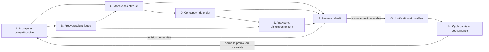

# PD-005 — Architecture de la Prompt Library

**Version documentaire :** 1.1  
**Dernière évolution normative :** 2 août 2026 — séparation de la navigation scientifique vers PD-009

## 1. Objet

La Prompt Library du Protocol Designer est un registre versionné de rôles IA spécialisés. Elle ne contient pas un « super-assistant » chargé de produire seul un protocole, mais un ensemble de capacités composables opérant sur un même état scientifique structuré.

Cette architecture décrit les futurs rôles nécessaires, leurs contrats et leur orchestration. Elle ne définit ni le texte des prompts, ni le choix des modèles, ni leur implémentation technique détaillée.

Elle applique le *Scientific Product Manifesto* et le manuel UX PD-004 : intention avant technique, parcours canonique, stratégie unique, décisions humaines explicites, grammaires d’incertitude communes et propagation visible des changements.

Depuis l’admission de `docs/pd-009-decision-engine-architecture.md`, PD-005 ne gouverne plus la sélection de la prochaine action scientifique. PD-009 décide s’il faut questionner, construire, comparer, revoir, escalader, arrêter ou refuser une projection protocolaire. La Prompt Library fournit uniquement les capacités susceptibles d’exécuter l’action sélectionnée et retourne des objets canoniques de PD-003.

## 2. Principes structurants

1. **Une stratégie scientifique unique.** Tous les rôles lisent et enrichissent le même modèle de projet. Ils ne créent pas de raisonnements parallèles indépendants.
2. **Le contexte précède la technique.** L’ordre de construction reste : intention → question → objectifs → hypothèses → physiopathologie → phénotypes → biomarqueurs → modalités → protocole → qualité → analyse → interprétation → preuves.
3. **Aucune décision implicite.** Toute proposition doit conserver sa justification, ses alternatives, son domaine de validité, ses limites et son statut scientifique.
4. **Les inconnues restent visibles.** Un rôle ne complète jamais une donnée absente par une supposition silencieuse.
5. **Les rôles proposent ; le chercheur décide.** Aucun rôle ne valide définitivement un protocole, ne prend une décision clinique ou ne remplace un comité scientifique, un méthodologiste, un biostatisticien ou un Core Lab.
6. **Une question doit avoir un impact.** Le Decision Engine PD-009 sélectionne un Besoin d’information uniquement si sa réponse peut modifier une décision ou réduire une incertitude importante ; un rôle de la Prompt Library ne crée pas sa propre priorité de navigation.
7. **Les sorties sont structurées avant d’être rédigées.** La rédaction et la projection utilisateur interviennent après la construction et la revue du raisonnement.
8. **La critique est séparée de la construction.** Les rôles de contrôle ne réécrivent pas silencieusement le projet ; ils produisent des constats, des sévérités et des actions proposées.
9. **L’escalade humaine est un résultat valide.** Une preuve insuffisante, une controverse majeure ou un usage hors domaine peut interrompre une branche du raisonnement.
10. **La Prompt Library est versionnée.** Chaque exécution doit être reconstructible à partir du rôle, de sa version, des entrées, des sources et des décisions humaines.

## 3. Contrat partagé entre les rôles

### 3.1 État scientifique commun

Les rôles échangent les objets structurés définis dans PD-003, et non uniquement des paragraphes. Ils utilisent notamment :

- Situation de recherche, Intention scientifique, Question scientifique et Contexte du projet ;
- Objectif scientifique, Hypothèse, Population d’étude, Phénomène biologique et Phénotype ;
- Énoncé de connaissance, Source scientifique, Preuve scientifique, Synthèse de preuves, Controverse scientifique et État de connaissance effectif ;
- Biomarqueur, Variable d’étude, Critère de jugement, Modalité, Acquisition, Protocole d’imagerie, Contrôle qualité et Analyse ;
- Option, Recommandation, Décision, Justification, Compromis et Dépendance ;
- Information de projet, Besoin d’information, Échange adaptatif et Contribution ;
- Incertitude, Risque, Biais, Limite, Contradiction, Alerte méthodologique et Revue méthodologique ;
- Événement d’évolution, Analyse d’impact, Stratégie scientifique et Version de stratégie ;
- Profil de projection, Projection et Rapport scientifique.

Les anciens libellés techniques tels que `ProjectIntent`, `ReasoningGraph`, `DecisionRecord`, `ProtocolStrategy` ou `RiskRegister` n’ont aucune autorité métier et ne doivent pas créer d’objets parallèles. Toute représentation technique future devra démontrer son équivalence avec les objets canoniques de PD-003.

### 3.2 Enveloppe obligatoire de toute sortie

Chaque sortie de rôle doit contenir au minimum :

- identifiant et version du rôle ;
- objets lus et objets produits ou modifiés ;
- statut de travail : `draft`, `proposed`, `accepted`, `rejected`, `needs_input`, `needs_evidence` ou `human_review_required` ;
- état de chaque information structurante : `connue`, `supposée`, `manquante` ou `contradictoire` ;
- statut de chaque conclusion : `établie`, `probable`, `contextuelle`, `controversée` ou `insuffisamment documentée` ;
- justification qualitative du statut, sans pourcentage de confiance non calibré ;
- références utilisées, le cas échéant ;
- décisions affectées et impact potentiel ;
- questions ou escalades nécessaires ;
- horodatage et version de l’état scientifique.

### 3.3 Classes de dépendances

- **Bloquante** : le rôle ne doit pas être exécuté sans cette entrée.
- **Conditionnelle** : nécessaire uniquement pour certains types de projets.
- **Enrichissante** : améliore la qualité, sans interdire une sortie provisoire.
- **De revue** : le rôle peut produire un constat, mais pas rendre la décision finale.

## 4. Vue d’ensemble des familles

## 5. Catalogue des rôles

### Famille A — Pilotage et compréhension du projet

#### R01 — Orchestrateur d’exécution des rôles

- **Mission :** orchestrer l’exécution des rôles utiles à l’action scientifique sélectionnée par le Decision Engine, gérer les boucles techniques de révision et préserver l’état scientifique commun.
- **Entrées :** action de navigation issue de PD-009, état complet du projet, intention courante, statuts des rôles et dépendances d’exécution.
- **Sorties :** plan d’exécution des rôles, résultat structuré, échec d’exécution ou demande de capacité supplémentaire ; aucune décision de navigation scientifique.
- **Dépendances :** aucune dépendance scientifique ; dépendance bloquante au registre des rôles et à leurs contrats.
- **Conditions d’utilisation :** actif lorsqu’une action PD-009 requiert une ou plusieurs capacités de la Prompt Library ; il ne produit lui-même aucune recommandation scientifique et ne choisit ni prochaine question, ni branche, ni arrêt.
- **Interactions :** appelle les rôles nécessaires ; reçoit leurs statuts ; retourne leurs objets au Decision Engine ; transmet les conflits au R30, au R31 ou au R33 sans les arbitrer.

#### R02 — Interpréteur d’intention

- **Mission :** identifier ce que l’utilisateur cherche à accomplir : explorer, démontrer, comparer, suivre, prédire, valider, reproduire ou préparer une publication.
- **Entrées :** formulation libre de l’utilisateur, rôle de l’utilisateur et contexte de session.
- **Sorties :** Intention scientifique, type de parcours, ambiguïtés initiales et Limites de périmètre.
- **Dépendances :** aucune ; première capacité scientifique du parcours.
- **Conditions d’utilisation :** à l’ouverture d’un projet ou lors d’un changement majeur d’intention.
- **Interactions :** alimente R03 et R04 ; peut être réactivé par R30 si le projet dérive de l’intention d’origine.

#### R03 — Reformulateur de question scientifique

- **Mission :** transformer l’intention en question scientifique précise, contextualisée, testable et distincte d’une solution technique.
- **Entrées :** Intention scientifique, éléments connus du Contexte du projet et formulation initiale.
- **Sorties :** une ou plusieurs formulations candidates de Question scientifique, périmètre inclus ou exclu et ambiguïtés résiduelles.
- **Dépendances :** R02 bloquante ; R04 conditionnelle si des données essentielles manquent.
- **Conditions d’utilisation :** avant toute recommandation de biomarqueur, modalité ou protocole ; à rejouer après un changement d’objectif.
- **Interactions :** travaille avec R05 ; déclenche R04 ; fournit la référence de cohérence à R30 et au Reviewer Simulator R32.

#### R04 — Gestionnaire des informations manquantes et questions adaptatives

- **Mission :** formuler et conduire l’Échange adaptatif correspondant au Besoin d’information sélectionné par le Decision Engine.
- **Entrées :** Besoin d’information priorisé par PD-009, objets affectés, contexte, options de réponse recevables et possibilité de différer.
- **Sorties :** Échange adaptatif, Contribution ou Information de projet issue de la réponse, avec provenance et qualification ; aucune priorité de navigation.
- **Dépendances :** dépendance bloquante à un Besoin d’information sélectionné par PD-009 ; enrichi par les objets scientifiques concernés.
- **Conditions d’utilisation :** uniquement après décision de questionnement par PD-009 ; jamais pour collecter des données « au cas où » ni pour sélectionner la question suivante.
- **Interactions :** reçoit le Besoin du Decision Engine ; remet la réponse sous forme d’objet PD-003 ; signale l’inconnu, le report ou la contradiction sans décider de la suite.

#### R05 — Architecte des objectifs et hypothèses

- **Mission :** définir les objectifs et construire les hypothèses correspondantes, leurs prédictions observables et leurs conditions de réfutation.
- **Entrées :** Question scientifique, Contexte du projet, État de connaissance effectif et Intention scientifique.
- **Sorties :** Objectifs scientifiques, Hypothèses, hiérarchie principal, secondaire ou exploratoire et liens vers les futurs Critères de jugement.
- **Dépendances :** R03 bloquante ; R10 et R13 enrichissantes ; R09 conditionnelle pour l’état des preuves.
- **Conditions d’utilisation :** dès que la question est suffisamment stable ; à réviser si la physiopathologie, la population ou la faisabilité change.
- **Interactions :** guide R10 à R20 ; est contrôlé par R30 ; fournit la matière au R32 et au R37.

### Famille B — Recherche et preuves scientifiques

#### R06 — Stratège de recherche bibliographique

- **Mission :** transformer les besoins de preuve en stratégie de recherche reproductible et proportionnée.
- **Entrées :** question, objets scientifiques concernés, décisions à documenter, période, langues et types de sources attendus.
- **Sorties :** questions documentaires, concepts, critères d’inclusion/exclusion, sources prioritaires et plan de recherche.
- **Dépendances :** R03 ou besoin ciblé d’un rôle métier ; accès conditionnel aux outils documentaires.
- **Conditions d’utilisation :** lorsqu’une décision nécessite des preuves nouvelles, actualisées ou contradictoires ; pas pour justifier a posteriori une décision déjà figée.
- **Interactions :** alimente R07 ; reçoit les lacunes de tous les rôles scientifiques et de revue ; son travail est audité par R28.

#### R07 — Extracteur de preuves

- **Mission :** extraire des sources les assertions pertinentes sans les transformer prématurément en recommandations.
- **Entrées :** plan de recherche, documents récupérés et schéma d’extraction.
- **Sorties :** assertions sourcées, population, méthode, résultats, limites, contexte et liens exacts vers les sources.
- **Dépendances :** R06 bloquante et accès au texte source ; ne doit pas travailler à partir du seul titre ou résumé si la décision exige le texte intégral.
- **Conditions d’utilisation :** après récupération des sources ; réexécution lors d’une correction, rétractation ou nouvelle version.
- **Interactions :** alimente R08 et R09 ; signale à R06 les documents insuffisants ; fournit les unités de preuve à R28.

#### R08 — Évaluateur de qualité des preuves

- **Mission :** qualifier la robustesse, le risque de biais, la transférabilité et le domaine de validité de chaque preuve.
- **Entrées :** assertions et caractéristiques méthodologiques extraites par R07.
- **Sorties :** niveau de preuve, limites, applicabilité au projet, signaux de fragilité et statut documentaire.
- **Dépendances :** R07 bloquante ; référentiels d’évaluation conditionnels au type d’étude.
- **Conditions d’utilisation :** pour toute preuve susceptible d’influencer une recommandation ; niveau d’examen proportionné au risque de la décision.
- **Interactions :** alimente R09 et tous les rôles de recommandation ; peut déclencher R06 si la preuve est insuffisante ; est contrôlé par R28.

#### R09 — Synthétiseur de preuves et controverses

- **Mission :** construire un état des connaissances sans effacer les désaccords, les lacunes ni les différences de contexte.
- **Entrées :** preuves qualifiées, question scientifique et contexte du projet.
- **Sorties :** synthèse structurée, convergences, divergences, explications possibles, statut de conclusion et questions non résolues.
- **Dépendances :** R08 bloquante ; plusieurs sources requises lorsque la conclusion se présente comme consensus.
- **Conditions d’utilisation :** avant toute recommandation importante ou lorsque plusieurs positions coexistent.
- **Interactions :** informe R05 et R10 à R29 ; envoie les lacunes à R06 ; les controverses majeures au R33.

### Famille C — Construction du modèle scientifique

#### R10 — Analyste physiopathologique

- **Mission :** expliciter les mécanismes biologiques pertinents et leur relation avec la question, la population et le stade de maladie.
- **Entrées :** question, objectifs, population, preuves synthétisées et connaissances structurées.
- **Sorties :** mécanismes, chaînes causales proposées, phénomènes attendus, alternatives explicatives, incertitudes et limites.
- **Dépendances :** R03 et R05 bloquantes ; R09 enrichissante ou bloquante pour une conclusion forte.
- **Conditions d’utilisation :** avant la sélection des biomarqueurs ; à rejouer si la population ou l’hypothèse change.
- **Interactions :** alimente R11 et R12 ; reçoit les objections du R32 ; est vérifié par R30.

#### R11 — Analyste des phénotypes, diagnostics différentiels et facteurs de confusion

- **Mission :** traduire les mécanismes en manifestations observables et identifier ce qui pourrait produire un signal similaire.
- **Entrées :** mécanismes de R10, population, comorbidités, traitements, temporalité et preuves.
- **Sorties :** phénotypes attendus, diagnostics différentiels méthodologiques, facteurs de confusion, mesures de désambiguïsation.
- **Dépendances :** R10 bloquante ; R09 enrichissante.
- **Conditions d’utilisation :** lorsque l’interprétation d’un biomarqueur peut manquer de spécificité ou varier selon le contexte.
- **Interactions :** contraint R12, R18, R22 et R27 ; fournit des points critiques à R32.

#### R12 — Stratège des biomarqueurs

- **Mission :** sélectionner et hiérarchiser les biomarqueurs capables d’observer les phénomènes pertinents.
- **Entrées :** objectifs, hypothèses, mécanismes, phénotypes, facteurs de confusion, preuves et contraintes initiales.
- **Sorties :** biomarqueurs indispensables, complémentaires ou exploratoires ; rôle de chacun ; redondances ; limites ; dépendances ; alternatives.
- **Dépendances :** R05, R10 et R11 bloquantes ; R09 bloquante pour les recommandations fortes.
- **Conditions d’utilisation :** seulement après explicitation du phénomène biologique ; à réviser lors d’un changement de critère de jugement ou de faisabilité.
- **Interactions :** alimente R13, R17, R20, R22 et R24 ; est challengé par R27, R30 et R32.

#### R13 — Comparateur de modalités

- **Mission :** comparer les modalités capables de mesurer les biomarqueurs retenus dans le contexte réel du projet.
- **Entrées :** stratégie de biomarqueurs, population, contraintes, preuves et capacités locales.
- **Sorties :** modalités candidates, comparaison contextualisée, avantages, limites, coûts, risques, complémentarités et recommandation conditionnelle.
- **Dépendances :** R12 bloquante ; R16 et R17 enrichissantes.
- **Conditions d’utilisation :** lorsqu’au moins deux modalités sont plausibles ou que la modalité envisagée doit être justifiée.
- **Interactions :** alimente R18 et R19 ; reçoit les contraintes de R16 ; expose les compromis au R36.

#### R14 — Architecte de la population et de l'éligibilité

- **Mission :** définir la population permettant d'éprouver l'hypothèse tout en maîtrisant généralisabilité, faisabilité et facteurs de confusion.
- **Entrées :** question, objectifs, hypothèses, mécanismes, phénotypes, contexte clinique et bassin de recrutement.
- **Sorties :** population cible et source, critères d'inclusion/exclusion proposés, sous-groupes, témoins ou comparateurs, justification et conséquences sur l'interprétation.
- **Dépendances :** R03, R05, R10 et R11 bloquantes ; R16 et R23 en boucle de conception.
- **Conditions d’utilisation :** pour tout projet impliquant des participants ou des données de patients ; escalade humaine requise pour les choix cliniques, éthiques ou réglementaires.
- **Interactions :** contraint R12, R16, R17, R20, R23 et R24 ; est challengé par R27, R32 et R34.

### Famille D — Conception du protocole et de son exécution

#### R15 — Analyste de reproduction et d'adaptation d'une étude

- **Mission :** reconstruire la logique d'une étude existante, distinguer ce qui est décrit de ce qui manque et adapter sa reproduction au contexte local.
- **Entrées :** publication et annexes, données complémentaires, contexte local, matériel, population et objectif de reproduction.
- **Sorties :** protocole source structuré, éléments non reproductibles ou insuffisamment décrits, écarts locaux, hypothèses d'adaptation et impacts attendus.
- **Dépendances :** R07 et R08 bloquantes ; R16, R18, R19, R21 et R22 conditionnelles selon l'étude.
- **Conditions d’utilisation :** uniquement pour le parcours « reproduire une étude » ou lorsqu’un protocole publié sert de référence explicite.
- **Interactions :** préremplit les objets de R12 à R24 sans les valider ; transmet les lacunes au R06 et les risques de fidélité au R27 et au R32.

#### R16 — Analyste de faisabilité et contraintes

- **Mission :** confronter la stratégie scientifique aux ressources, au recrutement, au temps, au budget, au matériel et aux compétences disponibles.
- **Entrées :** contexte des centres, stratégie envisagée, calendrier, exigences techniques et contraintes déclarées.
- **Sorties :** contraintes bloquantes ou négociables, hypothèses de faisabilité, écarts, scénarios et besoins d’expertise locale.
- **Dépendances :** données locales bloquantes pour une conclusion définitive ; R12 ou R13 pour analyser une stratégie donnée.
- **Conditions d’utilisation :** avant de figer toute modalité, séquence, visite ou analyse ; à rejouer après toute modification de ressources.
- **Interactions :** contraint R13, R17 à R24 ; sollicite R04 ; transmet les arbitrages au R36 et les risques au R27.

#### R17 — Architecte des critères de jugement

- **Mission :** traduire les objectifs et hypothèses en critères principal, secondaires, exploratoires et de sécurité clairement mesurables.
- **Entrées :** objectifs, hypothèses, biomarqueurs, temporalité, population et plan d’analyse envisagé.
- **Sorties :** définition des critères, unités, méthode de mesure, temps d’évaluation, population d’analyse et règles de dérivation.
- **Dépendances :** R05 et R12 bloquantes ; R22 et R23 en boucle de conception.
- **Conditions d’utilisation :** avant le dimensionnement statistique et la finalisation du calendrier.
- **Interactions :** co-construit avec R22 et R23 ; alimente R20 et R24 ; contrôlé par R30 et R32.

#### R18 — Constructeur de protocole d’acquisition

- **Mission :** convertir la stratégie scientifique en acquisitions, séquences, paramètres critiques et alternatives opérationnelles.
- **Entrées :** biomarqueurs, modalités, critères de jugement, matériel, contraintes, standards et preuves techniques.
- **Sorties :** protocole proposé, rôle de chaque acquisition, paramètres critiques, ordre, durée, dépendances, alternatives et conséquences d’omission.
- **Dépendances :** R12 à R17 bloquantes ; R19 et R21 en boucle ; R09 pour les choix justifiés par la littérature.
- **Conditions d’utilisation :** uniquement lorsque les objectifs et biomarqueurs sont suffisamment stables ; sortie provisoire si les données constructeur manquent.
- **Interactions :** co-construit avec R19 et R21 ; alimente R20 et R22 ; est contrôlé par R27, R30 et R32.

#### R19 — Architecte d’harmonisation multicentrique

- **Mission :** rendre comparables des acquisitions réalisées sur des centres, constructeurs et versions différents sans masquer les différences résiduelles.
- **Entrées :** protocole candidat, inventaire des centres, matériel, procédures locales, biomarqueurs et critères qualité.
- **Sorties :** noyau commun, variantes autorisées, calibration, qualification des sites, gestion des écarts et stratification analytique nécessaire.
- **Dépendances :** R16 et R18 bloquantes pour les études multicentriques ; R21 et R22 en boucle.
- **Conditions d’utilisation :** obligatoire en multicentrique ou lors de l’agrégation de données hétérogènes ; inutile pour un projet réellement monocentrique homogène.
- **Interactions :** modifie R18, R21, R22, R23 et R27 ; fournit des objections au R32.

#### R20 — Architecte du calendrier et des visites

- **Mission :** définir les temps d’observation cohérents avec la cinétique biologique, l’objectif et la charge du participant.
- **Entrées :** hypothèses, critères de jugement, cinétique attendue, acquisitions, intervention éventuelle et contraintes de suivi.
- **Sorties :** calendrier, fenêtres de visite, données requises par temps, justification, gestion des visites manquantes et scénarios alternatifs.
- **Dépendances :** R05, R10, R17 et R18 bloquantes ; R16 enrichissante.
- **Conditions d’utilisation :** études longitudinales, pronostiques, interventionnelles ou avec plusieurs temps ; version simplifiée pour les études transversales.
- **Interactions :** alimente R23 et R24 ; reçoit les contraintes de R16 ; expose les risques d’attrition au R27.

#### R21 — Architecte du contrôle qualité et de la reproductibilité

- **Mission :** concevoir la qualité dès le protocole : prévention, détection, acceptation, correction et traçabilité des écarts.
- **Entrées :** acquisitions, centres, biomarqueurs, procédures de lecture, risques techniques et critères de jugement.
- **Sorties :** plan QC, critères d’acceptation, contrôles sur site et centralisés, gestion des non-conformités, tests de reproductibilité et besoins de formation.
- **Dépendances :** R18 bloquante ; R19 conditionnelle ; R22 en boucle.
- **Conditions d’utilisation :** pour toute acquisition ou mesure ; profondeur renforcée en multicentrique, quantitatif ou Core Lab.
- **Interactions :** peut imposer une révision de R18 ; informe R22, R23 et R27 ; est simulé par R32.

### Famille E — Analyse et dimensionnement

#### R22 — Architecte de l’analyse d’imagerie et de la lecture

- **Mission :** définir comment les acquisitions deviennent des mesures interprétables et reproductibles.
- **Entrées :** protocole, biomarqueurs, critères de jugement, QC, logiciels, lecteurs et contraintes de données.
- **Sorties :** pipeline de lecture/quantification, prétraitements, segmentation, aveugle, adjudication, répétabilité, données dérivées et règles d’exclusion.
- **Dépendances :** R12, R17, R18 et R21 bloquantes ; R19 conditionnelle.
- **Conditions d’utilisation :** dès qu’une image ou une donnée dérivée participe à un critère ; détail adapté à la maturité du projet.
- **Interactions :** co-construit avec R17 et R23 ; informe R24 ; expose ses fragilités à R27 et R32.

#### R23 — Architecte du plan statistique

- **Mission :** relier hypothèses, critères, structure des données et estimands à des analyses statistiques adaptées.
- **Entrées :** objectifs, hypothèses, critères, calendrier, pipeline d’analyse, facteurs de confusion et structure multicentrique.
- **Sorties :** populations d’analyse, estimands, modèles, covariables, gestion des multiplicité et données manquantes, analyses de sensibilité et conditions d’interprétation.
- **Dépendances :** R05, R11, R17, R20 et R22 bloquantes ; R19 conditionnelle.
- **Conditions d’utilisation :** lorsque les critères sont définis ; doit solliciter un biostatisticien humain pour les plans complexes ou à enjeu réglementaire.
- **Interactions :** alimente R24 ; reçoit les risques du R27 ; est contrôlé par R30 et R32.

#### R24 — Estimateur de puissance et de taille d’échantillon

- **Mission :** produire un dimensionnement transparent, scénarisé et entièrement relié aux hypothèses numériques.
- **Entrées :** critère principal, effet attendu, variabilité, alpha, puissance, attrition, structure du plan, corrélations et données préliminaires.
- **Sorties :** taille d’échantillon par scénario, formule ou méthode, hypothèses, analyses de sensibilité, données manquantes et limites.
- **Dépendances :** R17 et R23 bloquantes ; données numériques bloquantes pour un chiffre unique ; R06 à R09 si les paramètres proviennent de la littérature.
- **Conditions d’utilisation :** après stabilisation du critère principal et du plan d’analyse ; ne doit jamais inventer un effet ou une variance.
- **Interactions :** peut renvoyer vers R04, R06 ou R16 ; transmet le risque de sous-puissance au R27 ; est challengé par R32.

#### R25 — Architecte des données et de leur intégrité

- **Mission :** définir les données nécessaires, leur provenance, leurs contrôles, leurs transformations et leur traçabilité tout au long de l'étude.
- **Entrées :** critères de jugement, calendrier, protocole, pipeline d'analyse, QC, centres et exigences de conservation.
- **Sorties :** dictionnaire conceptuel de données, flux, identifiants, règles de validation, données manquantes, dérivations, auditabilité et besoins d'interopérabilité.
- **Dépendances :** R17, R20, R21 et R22 bloquantes ; politiques locales et expertise de data management conditionnelles.
- **Conditions d’utilisation :** pour les études quantitatives, longitudinales, multicentriques ou destinées à une analyse réglementée ; ne définit pas seul les durées légales ni les bases juridiques.
- **Interactions :** contraint R22 et R23 ; fournit les risques d'intégrité au R27 ; est revu par R34 et le R32.

#### R26 — Interprète méthodologique des résultats

- **Mission :** relier des résultats disponibles aux hypothèses et au domaine de validité sans dépasser ce que le protocole et les données permettent de conclure.
- **Entrées :** résultats structurés, plan statistique, déviations, QC, données manquantes, hypothèses, preuves antérieures et risques.
- **Sorties :** hypothèses soutenues ou non soutenues, interprétations alternatives, robustesse, limites, analyses complémentaires justifiées et frontières des conclusions.
- **Dépendances :** R21 à R25, R27 et R30 bloquantes ; données réelles requises pour toute interprétation de résultat réel.
- **Conditions d’utilisation :** uniquement lorsque des résultats existent ; rôle futur, inactif pendant la conception initiale sauf pour tester à l’avance l’interprétabilité du plan.
- **Interactions :** alimente R32, R35, R37 et R38 ; soumet les ambiguïtés au R33 ; n'effectue aucun diagnostic individuel.

### Famille F — Revue, cohérence et sûreté

#### R27 — Analyste des biais, risques et compromis

- **Mission :** maintenir un registre transversal des risques scientifiques, techniques, opérationnels et interprétatifs.
- **Entrées :** état complet du projet, preuves, contraintes, protocole, QC et analyses.
- **Sorties :** Risques, Biais, Incertitudes, Limites et Compromis qualifiés, mesures de réduction, risque résiduel et propriétaire humain.
- **Dépendances :** enrichi par tous les rôles ; aucune conclusion de risque ne vaut validation réglementaire ou clinique.
- **Conditions d’utilisation :** en continu, avec revue formelle avant génération du rapport.
- **Interactions :** demande des révisions à R05 et R10 à R26 ; alimente R32, R33, R36 et R37.

#### R28 — Contrôleur de traçabilité des sources

- **Mission :** vérifier que chaque affirmation factuelle ou recommandation attribuée à la littérature est soutenue par une source exacte, qualifiée et applicable.
- **Entrées :** Décisions, Justifications, Sources scientifiques, Preuves scientifiques, Synthèses de preuves et versions documentaires.
- **Sorties :** matrice assertion-source, citations invalides ou manquantes, sources obsolètes, conflits d’applicabilité et corrections demandées.
- **Dépendances :** R07 et R08 bloquantes pour auditer une preuve ; accès au document source.
- **Conditions d’utilisation :** avant toute sortie scientifique partageable et après toute mise à jour bibliographique.
- **Interactions :** renvoie les défauts à R06-R09 et au rôle auteur ; bloque R35, R37 ou R38 si une affirmation importante n’est pas traçable.

#### R29 — Contrôleur de conformité du rôle et de la sortie

- **Mission :** vérifier qu’un rôle respecte son périmètre, son schéma de sortie, ses interdictions et ses règles d’arrêt.
- **Entrées :** définition versionnée du rôle, entrées reçues, sortie produite et journal d’exécution.
- **Sorties :** conformité du contrat, champs absents, dépassements de périmètre, décision non autorisée et statut de blocage.
- **Dépendances :** registre de la Prompt Library bloquant ; indépendant du contenu scientifique.
- **Conditions d’utilisation :** après chaque exécution à risque ou avant la persistance d’une sortie structurante.
- **Interactions :** renvoie au R01 ; peut imposer une réexécution ; transmet les incidents récurrents au R40.

#### R30 — Contrôleur de cohérence scientifique globale

- **Mission :** vérifier les liens de bout en bout entre question, hypothèses, phénomènes, biomarqueurs, acquisitions, critères, analyses et conclusions possibles.
- **Entrées :** Stratégie scientifique, Dépendances, Décisions, Protocole d’imagerie, Critères de jugement, Analyses, Risques et Preuves scientifiques.
- **Sorties :** incohérences, ruptures de chaîne, éléments orphelins, redondances, conclusions non soutenues et révisions ciblées.
- **Dépendances :** état suffisamment complet ; indépendant des rôles constructeurs.
- **Conditions d’utilisation :** aux jalons importants et avant tout rapport ; à rejouer après une modification à fort impact.
- **Interactions :** demande des corrections à R03, R05 et R10 à R26 ; alimente R32 et R33 ; autorise seulement le passage au livrable, jamais la validation scientifique finale.

#### R31 — Contrôleur de domaine, sécurité et escalade humaine

- **Mission :** détecter les usages hors périmètre méthodologique et caractériser les situations exigeant une restriction, un arrêt ou une expertise humaine.
- **Entrées :** demande utilisateur, état du projet, niveaux de preuve, risques et règles de gouvernance.
- **Sorties :** constat de domaine et de sécurité, restriction ou arrêt proposé, motif, spécialiste ou comité à solliciter ; PD-009 décide de la navigation correspondante.
- **Dépendances :** politiques du produit et domaines validés bloquants.
- **Conditions d’utilisation :** en entrée, avant une recommandation sensible et lorsque R09, R27, R29, R30 ou R32 signale un risque majeur.
- **Interactions :** transmet son constat au Decision Engine ; R01 suspend l’exécution uniquement sur l’action sélectionnée par PD-009 ; une clarification éventuelle est conduite par R04 après création et priorité d’un Besoin d’information.

#### R32 — Reviewer Simulator

- **Mission :** simuler plusieurs lectures critiques plausibles d’un dossier afin d’anticiper les objections méthodologiques, statistiques, techniques et de reproductibilité.
- **Entrées :** dossier scientifique presque complet, justification, preuves, protocole, analyses, risques et type de soumission visé.
- **Sorties :** questions de reviewer, objections classées par sévérité, éléments défendables, lacunes, demandes de justification et recommandations de révision.
- **Dépendances :** R27, R28 et R30 enrichissantes ; ne doit pas être utilisé comme premier constructeur du projet.
- **Conditions d’utilisation :** après une première stratégie cohérente, avant revue humaine, financement, pré-enregistrement ou soumission ; profils de reviewer explicitement séparés.
- **Interactions :** renvoie aux rôles concernés via R01 ; nourrit R37 ; les objections non résolues sont transmises au chercheur ou au R31.

#### R33 — Analyste des incertitudes et controverses

- **Mission :** caractériser une incertitude ou controverse et proposer les traitements défendables : explicitation, comparaison, recherche supplémentaire ou escalade.
- **Entrées :** controverses de R09, risques de R27, incohérences de R30 et objections de R32.
- **Sorties :** Options scientifiquement défendables, conditions de choix, Besoins d’information, niveau d’Incertitude et proposition d’arbitrage humain ; aucune action de navigation imposée.
- **Dépendances :** preuves et contexte suffisants pour caractériser le désaccord.
- **Conditions d’utilisation :** lorsqu’aucune option unique n’est soutenue ou que deux rôles produisent des propositions incompatibles.
- **Interactions :** transmet ses objets et traitements candidats à PD-009 ; fournit les Compromis au R36 ; peut solliciter un constat R31 ; ne tranche ni la navigation ni le choix scientifique.

#### R34 — Contrôleur de préparation éthique, réglementaire et de gouvernance des données

- **Mission :** détecter les éléments du projet qui nécessitent une revue éthique, réglementaire, de protection des données ou de responsabilité humaine.
- **Entrées :** population, interventions, calendrier, flux de données, centres, territoire juridique déclaré et usages secondaires envisagés.
- **Sorties :** checklist de préparation, obligations à confirmer, documents ou experts nécessaires, inconnues et points bloquants.
- **Dépendances :** R14 et R25 conditionnelles mais bloquantes lorsqu'elles s'appliquent ; référentiels locaux à jour et validation humaine obligatoires.
- **Conditions d’utilisation :** dès qu’un projet implique des participants, des données personnelles, un dispositif, une intervention ou plusieurs juridictions ; ne fournit jamais d’avis juridique ni d’autorisation.
- **Interactions :** peut suspendre R01 via R31 ; renvoie les données manquantes au R04 ; alimente R27, R32 et R37.

### Famille G — Justification, rédaction et projections

#### R35 — Constructeur de justification

- **Mission :** assembler la chaîne « décision → raison → preuve → contexte → alternative → limite → conséquence » pour chaque choix important.
- **Entrées :** Décision, Preuves scientifiques, Compromis, Risques, Options et arbitrages humains.
- **Sorties :** blocs de justification structurés et traçables, sans prose finale imposée.
- **Dépendances :** R28 et R30 requises avant publication ; rôle scientifique concerné pour chaque décision.
- **Conditions d’utilisation :** après stabilisation d’une décision ; à rejouer si la preuve, le contexte ou le choix change.
- **Interactions :** reçoit tous les rôles constructeurs ; alimente R32, R36 et R37 ; signale les justifications impossibles au R30.

#### R36 — Analyste de compromis et d’alternatives

- **Mission :** rendre visibles les gains, pertes et conclusions impossibles associés à chaque scénario.
- **Entrées :** options de biomarqueurs, modalités, acquisitions, visites, analyses, coûts, risques et faisabilité.
- **Sorties :** scénarios comparables, conséquences, conditions de préférence, éléments non compensables et décision à soumettre au chercheur.
- **Dépendances :** au moins deux options ou une modification envisagée ; R16 et R27 enrichissantes.
- **Conditions d’utilisation :** lors d’un arbitrage ; jamais pour créer artificiellement une alternative sans pertinence.
- **Interactions :** peut mobiliser R12 à R24 ; alimente R35, R37 et la décision humaine ; les controverses sont traitées par R33.

#### R37 — Architecte du rapport scientifique

- **Mission :** organiser les objets validés en un dossier cohérent sans modifier le fond scientifique.
- **Entrées :** Stratégie scientifique, Justifications, Preuves scientifiques, Risques, Revue méthodologique et Profil de projection.
- **Sorties :** plan du rapport, sections, ordre de lecture, annexes, tableaux nécessaires et éléments restant à compléter.
- **Dépendances :** R28, R30 et R31 bloquantes avant une version partageable ; R32 conditionnelle selon le jalon ; R34 conditionnelle selon le projet.
- **Conditions d’utilisation :** lorsqu’un état du raisonnement doit être restitué ; le plan peut être régénéré pour chaque projection.
- **Interactions :** transmet sa structure au R38 ; reçoit la hiérarchie du R39 ; signale les trous documentaires au R01.

#### R38 — Rédacteur scientifique

- **Mission :** transformer exclusivement les objets approuvés en texte scientifique clair, fidèle et adapté au format demandé.
- **Entrées :** plan de R37, objets structurés, justifications, sources, terminologie et règles éditoriales.
- **Sorties :** résumé, méthodes, justification, limites, synthèse ou autre section demandée, avec citations reliées.
- **Dépendances :** R37 bloquante ; R28 pour les citations ; aucune autorisation d’inventer ou de résoudre une lacune.
- **Conditions d’utilisation :** en fin de chaîne ou pour une prévisualisation explicitement marquée brouillon ; jamais pour construire le raisonnement source.
- **Interactions :** est contrôlé par R28, R29 et R30 ; alimente R39 ; les lacunes retournent au R01.

#### R39 — Adaptateur de projection et de niveau d’accompagnement

- **Mission :** projeter une même stratégie pour un chercheur, radiologue, manipulateur, méthodologiste, Core Lab, financeur ou lecteur pédagogique.
- **Entrées :** contenu scientifique approuvé, rôle du destinataire, expertise, temps disponible, format et objectif d’usage.
- **Sorties :** sélection, profondeur, terminologie, ordre et représentation adaptés ; aucune modification des décisions scientifiques.
- **Dépendances :** R37 ou R38 ; profil utilisateur minimal.
- **Conditions d’utilisation :** pour toute restitution ; une nouvelle projection ne déclenche pas une nouvelle stratégie.
- **Interactions :** guide R37 et R38 ; est contrôlé par R29 ; peut demander au R04 le niveau de détail souhaité.

### Famille H — Cycle de vie et gouvernance de la Prompt Library

#### R40 — Analyste d’impact des changements

- **Mission :** mesurer les conséquences d’une nouvelle information, contrainte, décision ou preuve sur l’ensemble du raisonnement existant.
- **Entrées :** ancien et nouvel états, graphe de dépendances, décisions et versions.
- **Sorties :** objets invalidés, rôles à rejouer, livrables obsolètes, changements visibles et décisions humaines à reconfirmer.
- **Dépendances :** Versions de stratégie, Stratégie scientifique et Dépendances bloquantes.
- **Conditions d’utilisation :** à chaque modification après stabilisation initiale et lors d’une mise à jour des connaissances.
- **Interactions :** fournit au Decision Engine les objets affectés et les actions candidates ; PD-009 choisit le sous-ensemble scientifique à reprendre, puis R01 orchestre les capacités correspondantes ; les Projections affectées sont rendues obsolètes sans être effacées.

#### R41 — Curateur des retours d’expérience

- **Mission :** structurer les retours de projets sans les transformer automatiquement en vérité générale.
- **Entrées :** feedback utilisateur, incidents, déviations, décisions humaines, résultats de revue et métadonnées du projet.
- **Sorties :** observations candidates, contexte, fréquence, portée locale, besoin de preuve et proposition de revue scientifique.
- **Dépendances :** consentement, anonymisation et gouvernance des données ; validation humaine obligatoire avant tout usage général.
- **Conditions d’utilisation :** hors génération immédiate du protocole, dans le cycle d’amélioration continue.
- **Interactions :** transmet des candidats au R42 ; informe R40 après validation ; ne modifie jamais directement les connaissances actives.

#### R42 — Assistant de gouvernance des connaissances

- **Mission :** préparer l’intégration, la révision, la dépréciation ou le retrait d’une connaissance dans la mémoire scientifique.
- **Entrées :** nouvelles preuves, alertes de rétractation, controverses, retours qualifiés et règles de gouvernance.
- **Sorties :** dossier de changement, connaissances affectées, proposition de statut, justification et liste des validations humaines requises.
- **Dépendances :** R06 à R09 et R28 ; comité scientifique humain bloquant pour l’activation.
- **Conditions d’utilisation :** lors d’une évolution du corpus ou d’un signal de fragilité ; jamais dans le parcours conversationnel comme autorité autonome.
- **Interactions :** après approbation humaine, déclenche R40 ; conserve les versions ; informe R01 des domaines temporairement suspendus.

#### R43 — Évaluateur de la Prompt Library

- **Mission :** mesurer la qualité, la stabilité, la reproductibilité et les régressions de chaque rôle et de leurs compositions.
- **Entrées :** jeux de cas versionnés, sorties attendues structurées, journaux d’exécution, incidents de R29 et décisions d’experts.
- **Sorties :** métriques par rôle, écarts, régressions, cas d’échec, recommandation de promotion ou de retrait d’une version.
- **Dépendances :** corpus d’évaluation gouverné et critères humains ; séparé du moteur de production.
- **Conditions d’utilisation :** avant promotion d’une version, après changement de modèle ou de rôle, et lors d’un incident.
- **Interactions :** alimente les responsables de la Prompt Library ; utilise R29 pour la conformité ; ne corrige pas lui-même les connaissances scientifiques.

## 6. Orchestration de référence

L’orchestration décrite ici commence après que PD-009 a sélectionné l’action scientifique. Elle organise des capacités ; elle ne détermine ni la prochaine question, ni la suffisance du raisonnement, ni le passage vers un protocole.

### 6.1 Parcours nominal

1. PD-009 sélectionne l’action de clarification ; R02 identifie l’intention lorsqu’elle est l’objet demandé.
2. R03 reformule la question ; lorsque PD-009 sélectionne un Besoin d’information, R04 conduit l’Échange adaptatif correspondant.
3. R05 établit objectifs et hypothèses.
4. R06 à R09 construisent le socle de preuves nécessaire.
5. R10 à R13 et R14 construisent la chaîne population → phénomène → phénotype → biomarqueur → modalité.
6. R16 à R21 conçoivent la stratégie réalisable, le protocole, les visites et la qualité ; R15 traite le parcours de reproduction.
7. R22 à R24 et R25 définissent l’analyse, les données et le dimensionnement ; R26 intervient lorsque des résultats existent.
8. R27 à R33 recherchent les biais, les incohérences, les objections et les motifs d’escalade.
9. Le chercheur arbitre les décisions structurantes et les compromis.
10. R35 à R39 justifient, organisent, rédigent et projettent le dossier.
11. R40 gère toute modification ultérieure ; R41 à R43 assurent l’amélioration gouvernée du système.

### 6.2 Boucles obligatoires

- **Preuve insuffisante :** rôle métier → R06 → R07 → R08 → R09 → rôle métier ; si aucune preuve exploitable n’existe, R31 produit un constat et PD-009 choisit la réduction de portée, l’escalade ou l’arrêt.
- **Information manquante :** rôle métier → Besoin d’information → PD-009 → R04 → utilisateur → Information de projet → PD-009.
- **Incohérence :** R30 → rôle propriétaire → R29 → R30.
- **Arbitrage :** R36 ou R33 → PD-009 → chercheur habilité → Décision → R40.
- **Objection de reviewer :** R32 → rôle concerné → R30 → nouvelle simulation si nécessaire.
- **Changement :** Événement d’évolution → R40 → PD-009 → sous-ensemble minimal de rôles exécuté par R01 → nouvelle revue.

### 6.3 Portes de passage

Les portes suivantes décrivent les contributions attendues des rôles. Leur évaluation décisionnelle et l’autorisation de poursuivre relèvent de PD-009 à partir des objets et invariants de PD-003.

- **Porte A — Question exploitable :** intention, population minimale, objectif et inconnues critiques identifiés.
- **Porte B — Modèle scientifique recevable :** hypothèses, mécanismes et biomarqueurs reliés sans raccourci non déclaré.
- **Porte C — Stratégie réalisable :** modalités, acquisition, calendrier et contraintes compatibles ou explicitement arbitrés.
- **Porte D — Analyse cohérente :** critères, mesures, analyses et puissance alignés.
- **Porte E — Revue méthodologique :** risques, sources, cohérence et domaine contrôlés ; escalades résolues ou visibles.
- **Porte F — Livrable partageable :** décisions humaines enregistrées, citations vérifiées et projection fidèle au raisonnement.

## 7. Règles d’activation

La Prompt Library ne doit pas exécuter systématiquement les 43 rôles. PD-009 choisit l’action scientifique ; R01 choisit uniquement le sous-ensemble minimal de capacités nécessaire pour l’exécuter à partir :

- du type de parcours ;
- de la maturité du projet ;
- du caractère mono- ou multicentrique ;
- du type transversal, longitudinal, pronostique, diagnostique, méthodologique ou interventionnel ;
- de la présence d’imagerie quantitative ;
- du niveau de preuve demandé ;
- du risque scientifique ou réglementaire ;
- du type de livrable ;
- des changements intervenus depuis la dernière revue.

Exemples : R19 n’est requis que pour l’hétérogénéité inter-centres ; R20 est allégé pour une étude transversale ; R24 ne peut produire de valeur finale sans hypothèses numériques ; R32 intervient après une première construction cohérente ; R15 ne s'active que pour une reproduction ; R34 dépend du cadre juridique réel ; R26 requiert des résultats ; R41 à R43 appartiennent à la gouvernance, pas au dialogue utilisateur courant.

## 8. Structure du registre de la Prompt Library

Chaque fiche de rôle versionnée devra contenir :

- identifiant stable, nom et famille ;
- version du contrat et statut (`draft`, `candidate`, `active`, `deprecated`, `suspended`) ;
- mission et non-missions ;
- schémas d’entrée et de sortie ;
- objets autorisés en lecture et en écriture ;
- dépendances bloquantes, conditionnelles et enrichissantes ;
- règles d’activation et d’arrêt ;
- exigences de preuve et seuils d’escalade ;
- interactions entrantes et sortantes ;
- validations humaines requises ;
- modèle(s) autorisé(s) et paramètres d’exécution, définis ultérieurement ;
- jeux d’évaluation, critères de réussite et régressions connues ;
- propriétaire scientifique, propriétaire produit et historique des versions.

Le texte détaillé des prompts sera une couche ultérieure attachée à ces contrats. Il ne devra jamais redéfinir silencieusement la mission, les permissions ou les règles d’arrêt d’un rôle.

## 9. Frontières explicites

Cette architecture n’autorise aucun rôle à :

- formuler un diagnostic ou une recommandation thérapeutique individuelle ;
- déclarer un protocole « validé » ;
- substituer une décision IA à une décision du chercheur ou du comité ;
- inventer une donnée, une source, un effet attendu ou une variance ;
- transformer une habitude locale en recommandation générale ;
- masquer une controverse, une preuve faible ou une information manquante ;
- modifier une décision scientifique par simple adaptation rédactionnelle ;
- apprendre automatiquement d’un projet utilisateur sans gouvernance, consentement et validation scientifique.
- sélectionner de sa propre initiative la prochaine question, la fermeture d’une branche, l’arrêt du raisonnement ou l’autorisation d’un protocole, responsabilités exclusives de PD-009 et des Décisions humaines applicables.

## 10. Résultat architectural

La Prompt Library cible ainsi quatre fonctions distinctes :

- **construire** le raisonnement avec les rôles A à E ;
- **challenger et sécuriser** ce raisonnement avec les rôles F ;
- **expliquer et projeter** le même raisonnement avec les rôles G ;
- **maintenir sa validité dans le temps** avec les rôles H.

Le Protocol Designer ne repose donc pas sur une succession de textes générés, mais sur un graphe de décisions scientifiques versionné, contrôlé et projetable. Les prompts détaillés pourront évoluer sans remettre en cause cette architecture, à condition de rester subordonnés aux contrats de rôles définis ici.
