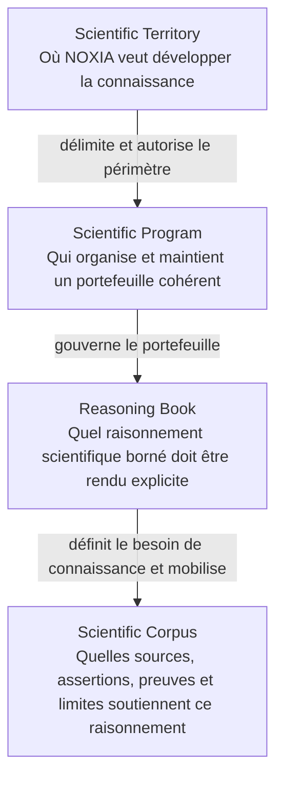
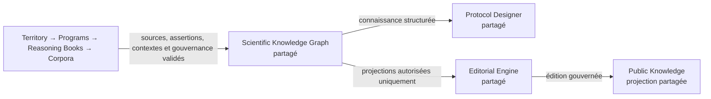
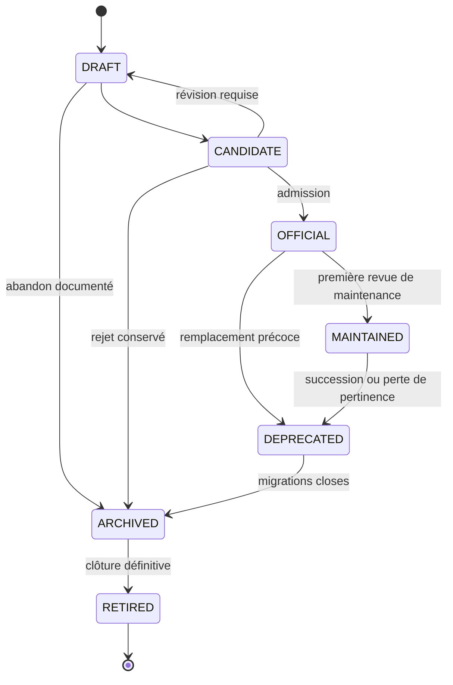

# PD-012 — Scientific Program Architecture

## Architecture scientifique des Programmes NOXIA

**Statut :** REFERENCE_NORMATIVE — OFFICIAL

**Niveau documentaire :** NIVEAU_1 — référence normative spécialisée

**Version :** 1.0

**Date d’effet :** 2 août 2026

**Autorité :** organisation scientifique des Programmes NOXIA

**Source maîtresse :** `docs/pd-012-scientific-program-architecture.md`

**Éditions dérivées :** aucune

**Périmètre :** structuration, autorité, cycle de vie et relations des Scientific Programs

**Autorités supérieures :** Charte fondatrice de NOXIA, puis *Scientific Product Manifesto* du Protocol Designer

**Références coordonnées :** Product Specification, PD-003, PD-004, PD-005, PD-009, PD-011, Scientific Territory Model, Scientific Knowledge Catalog et Scientific Knowledge Graph
**Principe directeur :** plusieurs Programmes peuvent organiser la connaissance ; il n’existe qu’un seul système scientifique partagé et aucune connaissance n’est dupliquée pour les servir

---

## 0. Décision documentaire et règle de lecture

### 0.1 Nature exacte de la mission

PD-012 crée la référence normative qui manquait entre le périmètre scientifique intentionnel de NOXIA et ses corpus scientifiques spécialisés.

Il définit le **Scientific Program** comme une unité durable d’organisation et de responsabilité scientifique. Il ne crée :

- aucun domaine médical effectif ;
- aucun Reasoning Book ;
- aucun Scientific Corpus ;
- aucune assertion scientifique ;
- aucune ontologie médicale ;
- aucun registre de Programmes déjà admis ;
- aucune preuve d’implémentation.

Les noms de Programmes cités dans ce document sont des **exemples d’architecture**. Ils ne deviennent pas officiels par leur seule mention.

### 0.2 Documents consultés dans l’ordre d’autorité

1. `0. NOXIA — SOURCE-OF-TRUTH-INDEX.md` — gouvernance documentaire, hiérarchie, sources maîtresses et arbitrage ;
2. `output/documents/noxia-la-charte-fondatrice-edition-editoriale.docx` — mission et principes durables de NOXIA ;
3. `output/documents/noxia-protocol-designer-scientific-product-manifesto-edition-editoriale.docx` — philosophie scientifique, moteur unique, connaissance partagée et projections ;
4. `output/documents/noxia-protocol-designer-product-specification-v1.0.docx` — cible produit, intentions utilisateur et frontières du Protocol Designer ;
5. `docs/pd-003-research-object-model.md` — objets métier, relations, versionnement, traçabilité et responsabilité humaine ;
6. `docs/pd-004-ux-manifesto.md` — traduction des connaissances en expérience, sans exposition des structures internes ;
7. `docs/pd-009-decision-engine-architecture.md` — navigation scientifique et séparation entre action du moteur et Décision humaine ;
8. `docs/pd-005-prompt-library-architecture.md` — capacités contributrices, sans autorité de navigation ni de gouvernance des Programmes ;
9. `docs/pd-011-evaluation-framework.md` — cas, métriques, campagnes d’évaluation et décision de publication ;
10. `docs/scientific-territory-model.md` — périmètre scientifique souhaité et frontières ;
11. `docs/p6-scientific-knowledge-catalog.md` — couverture réelle, priorité et sélection des campagnes ;
12. `docs/scientific-assertion-layer.md` et `docs/scientific-knowledge-graph-web.md` — identités, assertions, preuves, contextes et révisions ;
13. `docs/p10-territorial-scientific-production.md` et `docs/p11-continuous-territorial-scientific-production.md` — enrichissement atomique et production continue ;
14. les Reasoning Books PD-002 Fabry et PD-008 Myocardite — exemples de corpus scientifiques spécialisés et datés.

### 0.3 Distinctions obligatoires

| Catégorie | Éléments applicables à PD-012 | Portée exacte |
|---|---|---|
| Principes établis | science avant technologie ; intention avant solution ; stratégie scientifique unique ; contexte, preuves, limites et incertitudes visibles ; chercheur décisionnaire ; connaissance partagée | Invariants supérieurs que PD-012 applique sans les modifier |
| Références normatives | Product Specification, PD-003, PD-004, PD-005, PD-009, PD-011, Territory Model, Catalog et Knowledge Graph | Contrats spécialisés qui conservent leur autorité propre |
| Corpus scientifiques datés | Reasoning Books Fabry et Myocardite ; corpus P4, P4R et P5 | Exemples et contenus scientifiques qui ne sont ni généralisés ni modifiés ici |
| Cible | architecture capable d’organiser plusieurs centaines de Programmes et un nombre non borné de Reasoning Books | Norme d’organisation future, pas preuve qu’un registre de Programmes existe |
| État réellement observé | le dépôt contient les deux Reasoning Books officiels, le Territory Model, le Catalog, le Knowledge Graph et les contrats de production ; aucun registre officiel de Scientific Programs n’a été identifié avant PD-012 | Écart de structuration que la présente référence vient définir, sans l’implémenter |
| Hypothèses | taille future du portefeuille, noms des futurs Programmes, ordre de leur admission et granularité optimale de chaque Programme | Éléments à décider par les procédures d’admission, jamais par la liste illustrative de PD-012 |

### 0.4 Clarifications et écarts terminologiques

#### A — Un Scientific Program n’est pas un Dossier de recherche

Le `Dossier de recherche` de PD-003 porte un projet particulier, ses acteurs, sa stratégie et ses décisions. Un Scientific Program organise durablement un portefeuille de connaissances et de Reasoning Books couvrant plusieurs projets possibles.

PD-012 ne modifie donc pas PD-003 et ne crée pas un nouvel objet du raisonnement d’un projet.

#### B — La hiérarchie verticale n’est pas une hiérarchie de fichiers

La chaîne attendue :

```text
Scientific Territory
        ↓
Scientific Program
        ↓
Reasoning Book
        ↓
Scientific Corpus
```

exprime une **décomposition de responsabilité scientifique**, pas une inclusion physique, une règle de stockage ni une autorité éditoriale descendante automatique.

Un Reasoning Book mobilise un ou plusieurs corpus structurés. Il reste lui-même classé, dans le SOURCE-OF-TRUTH-INDEX, comme document scientifique spécialisé et daté de niveau 2. PD-012 ne requalifie pas rétroactivement PD-002 ou PD-008 : il distingue simplement le **cahier de raisonnement** du **substrat structuré de sources, extractions, assertions et EvidenceLinks** qui le soutient.

#### C — Le Program Owner n’est pas un décideur humain

Le `Program Owner` désigne l’unique Programme responsable de l’identité et de l’évolution canonique d’un élément partagé. Il ne désigne ni une personne ni une autorité institutionnelle.

Toute action de modification, qualification, correction ou retrait reste réalisée par un `Acteur du projet` ou une instance humaine disposant du `Mandat décisionnel` requis au sens de PD-003. L’appartenance à un Programme ne crée aucun mandat humain.

#### D — Une liste illustrative n’est pas un registre officiel

`Cardiac MRI`, `Spectral CT`, `OEF`, `CMRO₂`, `Core Lab Imaging` ou `Artificial Intelligence` ne deviennent pas des Programmes par leur présence dans PD-012. Ils devront franchir la procédure d’admission.

Certains noms sont volontairement ambigus : `Cardiac MRI` associe un domaine anatomoclinique et une modalité ; il relève donc normalement d’un Programme hybride, même s’il est souvent présenté par commodité comme un Programme de modalité. `OEF` ou `CMRO₂` peuvent rester des Knowledge Areas ou des biomarqueurs tant qu’une responsabilité scientifique autonome de Programme n’est pas démontrée.

#### E — Le Catalog reste l’autorité de pilotage des campagnes

Le Scientific Program porte une vision, un périmètre, des dépendances et une roadmap scientifique. Il ne choisit pas manuellement la prochaine campagne.

Le Scientific Knowledge Catalog reste l’autorité sur la couverture réelle, la priorité calculée, la readiness et la file d’enrichissement. Une roadmap de Programme ne devient un signal opérationnel que si le contrat du Catalog l’admet explicitement ; elle ne constitue jamais un override silencieux.

### 0.5 Portée normative et absence de preuve d’implémentation

PD-012 décrit ce qui devra être vrai lorsqu’un portefeuille de Scientific Programs sera constitué. Sa présence ne prouve :

- ni l’existence d’un Program particulier ;
- ni l’existence d’un registre exécutable ;
- ni l’attribution actuelle d’un Program Owner aux objets du Knowledge Graph ;
- ni la migration des Reasoning Books existants ;
- ni la disponibilité d’une interface de navigation par Programme.

Toute capacité réelle devra être vérifiée séparément dans les registres, rapports, données et tests applicables.

---

## 1. Définition du Scientific Program

### 1.1 Définition normative

Un **Scientific Program** est une unité durable de gouvernance scientifique qui :

- délimite un problème ou une famille de problèmes suffisamment cohérents ;
- organise une vision scientifique et une roadmap ;
- gouverne un portefeuille ouvert de Reasoning Books ;
- attribue une propriété canonique unique aux connaissances dont il assure la maintenance ;
- référence les connaissances partagées appartenant à d’autres Programmes ;
- rend visibles ses dépendances, ses frontières et son état de maturité ;
- assure la propagation documentaire de ses évolutions vers ses consommateurs.

Un Program n’est ni un thème éditorial, ni un simple dossier administratif, ni une copie d’une branche du Territory Model. Son existence doit correspondre à une responsabilité scientifique autonome et durable.

### 1.2 Objectifs

Un Scientific Program poursuit cinq objectifs :

1. **Cohérence** — réunir des Reasoning Books qui partagent un même cadre scientifique sans fusionner leurs questions ;
2. **Responsabilité** — rendre explicite qui maintient chaque identité et chaque connaissance canonique ;
3. **Continuité** — conserver l’histoire des évolutions scientifiques, corrections, dépréciations et transferts ;
4. **Partage** — permettre à plusieurs Programmes de réutiliser les mêmes connaissances sans les recopier ;
5. **Échelle** — organiser plusieurs centaines de domaines sans créer un moteur, un graphe ou une ontologie par domaine.

### 1.3 Responsabilités

Un Program DOIT :

- déclarer son identité stable, sa version et son état de cycle de vie ;
- définir son périmètre inclus, adjacent et exclu ;
- référencer les nœuds du Scientific Territory qui justifient son existence ;
- déclarer son type principal et, le cas échéant, son caractère hybride ;
- maintenir sa Scientific Vision et sa Scientific Roadmap ;
- gouverner l’admission, la révision et le retrait de ses Reasoning Books ;
- maintenir l’inventaire des éléments qu’il possède et de ceux qu’il consomme ;
- déclarer ses dépendances et relations avec les autres Programmes ;
- attribuer exactement un Program Owner à chaque élément canonique dont il a la charge ;
- déclencher une analyse d’impact lors d’une évolution susceptible d’affecter des consommateurs ;
- conserver les incertitudes, controverses, limites et lacunes de son périmètre ;
- rester compatible avec les normes supérieures et les autorités spécialisées.

### 1.4 Frontières

Un Program NE DOIT JAMAIS :

- devenir un second Scientific Territory Model ;
- devenir un second Scientific Knowledge Catalog ;
- contenir une copie locale du Scientific Knowledge Graph ;
- créer sa propre ontologie médicale concurrente ;
- redéfinir les objets de PD-003 ;
- choisir la prochaine action du Decision Engine ;
- définir ses propres critères PASS/FAIL en dehors de PD-011 ;
- posséder son propre Editorial Engine ;
- créer une page publique ou une autorisation de publication ;
- transformer sa roadmap en campagne exécutée ;
- transformer un corpus en recommandation clinique ;
- décider à la place d’un acteur humain habilité.

### 1.5 Dossier d’autorité minimal

Tout Program officiellement admis possède un dossier d’autorité contenant au minimum :

- un identifiant stable et un nom préféré ;
- une définition courte et un objectif scientifique ;
- un type principal ;
- un périmètre inclus, adjacent et exclu ;
- ses ancrages dans le Scientific Territory Model ;
- sa version et son état de cycle de vie ;
- sa Scientific Vision ;
- sa Scientific Roadmap ;
- ses relations avec les autres Programmes ;
- son registre d’ownership ;
- son portefeuille de Reasoning Books ;
- ses Knowledge, Editorial et Evaluation Assets référencés ;
- ses responsables humains et leurs mandats applicables ;
- ses règles de revue et d’évolution ;
- ses contradictions ou conflits de périmètre non résolus ;
- son historique d’admission, de révision, de transfert et de retrait.

Ce dossier est une exigence documentaire. PD-012 ne prescrit ni format de stockage ni architecture technique.

---

## 2. Organisation verticale officielle de la connaissance

### 2.1 Chaîne de responsabilité



Les flèches signifient **cadre**, **responsabilité** et **dépendance**. Elles ne signifient ni copie, ni propriété automatique, ni génération descendante.

### 2.2 Responsabilités par niveau

| Niveau | Rôle | Responsabilité | Produit | Ne produit jamais |
|---|---|---|---|---|
| Scientific Territory | Définir le champ scientifique intentionnel | Délimiter territoires, domaines, sous-domaines, Knowledge Areas, frontières et appartenances multiples | Structure de périmètre et roadmap territoriale | Source, assertion, Program automatique, campagne ou publication |
| Scientific Program | Organiser une responsabilité scientifique durable | Gouverner vision, roadmap, ownership, dépendances et portefeuille de Reasoning Books | Dossier d’autorité, portefeuille, relations et règles de maintenance | Contenu médical inventé, Knowledge Graph local, décision de campagne ou page |
| Reasoning Book | Rendre explicite un raisonnement scientifique borné et daté | Définir construits, objectifs, hypothèses, décisions, limites, controverses et porte de non-protocole | Document scientifique de niveau 2, versionné et traçable | Protocole exécutable, ontologie universelle ou autorité sur un autre domaine |
| Scientific Corpus | Conserver le substrat de preuve structuré | Réunir sources, révisions, extractions, assertions atomiques, EvidenceLinks, contextes, synthèses et lacunes | Objets scientifiques intégrables au Knowledge Graph | Consensus inventé, publication automatique ou modification du territoire |

### 2.3 Cardinalités et partage

- Un Scientific Territory peut ancrer zéro, un ou plusieurs Programmes.
- Un Program peut couvrir plusieurs nœuds territoriaux lorsque son type ou sa portée le justifie.
- Un nœud territorial ne crée jamais automatiquement un Program.
- Un Program peut gouverner un nombre non borné de Reasoning Books.
- Chaque Reasoning Book possède exactement un Program Owner, tout en pouvant référencer plusieurs Programmes contributeurs.
- Un Reasoning Book peut mobiliser plusieurs Scientific Corpora.
- Un Scientific Corpus peut soutenir plusieurs Reasoning Books sans être dupliqué.
- Chaque Scientific Corpus possède exactement un Program Owner.
- Une appartenance multiple au Territory Model ne crée jamais plusieurs identités ni plusieurs Owners.

### 2.4 Sens des passages entre niveaux

Le passage d’un niveau au suivant exige une décision explicite :

1. un territoire rend un Program admissible, mais ne l’admet pas ;
2. un Program rend un Reasoning Book gouvernable, mais ne le rédige pas automatiquement ;
3. un Reasoning Book exprime des besoins de connaissance, mais ne transforme pas une affirmation narrative en ScientificAssertion ;
4. un corpus structure des preuves, mais ne transforme pas son contenu en recommandation ni en publication.

Chaque niveau peut rester incomplet. L’absence d’un niveau inférieur doit rester visible.

---

## 3. Systèmes scientifiques transverses

### 3.1 Principe

Les systèmes transverses ne font pas partie de la hiérarchie verticale. Ils consomment les connaissances gouvernées par les niveaux précédents.



### 3.2 Responsabilités des consommateurs

| Système transverse | Ce qu’il consomme | Responsabilité | Ce qu’il ne fait jamais |
|---|---|---|---|
| Scientific Knowledge Graph | Concepts, sources, assertions, EvidenceLinks, contextes, révisions et ownership issus des corpus validés | Conserver une mémoire scientifique partagée, versionnée, interrogeable et non dupliquée | Créer un graphe par Program, choisir une question de projet ou autoriser une publication |
| Protocol Designer | Objets PD-003, connaissances du graphe, Reasoning Books applicables, limites et états de preuve | Accompagner une intention utilisateur et construire une stratégie scientifique traçable | Exposer la hiérarchie interne comme produit, modifier un Program ou décider à la place du chercheur |
| Editorial Engine | Projections scientifiques et éditoriales explicitement autorisées, avec leurs sources et limites | Transformer une projection admise en artefacts éditoriaux cohérents selon son propre contrat | Définir la connaissance, corriger une assertion ou posséder une instance par Program |
| Public Knowledge | Artefacts effectivement publiés, bornés par leur version, leur date et leur contexte | Donner accès à des connaissances publiques compréhensibles et traçables | Devenir source de vérité, corriger le corpus ou publier automatiquement une projection interne |

### 3.3 Interdiction de duplication des systèmes

Il est explicitement interdit de créer :

- un Scientific Knowledge Graph par Program ;
- un Protocol Designer par Program ;
- un Editorial Engine par Program ;
- un registre public de vérité propre à chaque Program ;
- un moteur de synthèse, de projection ou de publication concurrent dans un Program.

Une vue filtrée par Program reste une vue du système partagé. Elle n’est jamais une instance indépendante.

### 3.4 Catalog et campagnes : planification transverse

Le Scientific Knowledge Catalog et les Scientific Campaigns appartiennent au plan de pilotage, pas à la hiérarchie documentaire verticale :

```text
Territory + relations de Programs + état réel du Knowledge Graph
                           ↓
             Scientific Knowledge Catalog
                           ↓
                  Scientific Campaigns
                           ↓
             Scientific Knowledge Graph partagé
```

Le Catalog observe les appartenances, l’ownership, la couverture et les lacunes. Il calcule la file selon son propre contrat. Une campagne enrichit le graphe dans le périmètre autorisé ; elle ne modifie ni le Territory Model ni la définition d’un Program.

---

## 4. Règles d’héritage

### 4.1 Principe général

L’héritage transmet des **contraintes et des contextes**, jamais des copies d’objets. Un niveau inférieur référence la version de l’autorité supérieure qu’il applique.

### 4.2 Ce qui descend des constitutions et manifestes

Tout Program, Reasoning Book et Scientific Corpus hérite obligatoirement :

- de la science avant la technologie ;
- de l’intention avant la solution ;
- de l’unicité du raisonnement scientifique ;
- de la contextualisation de toute connaissance ;
- de la traçabilité des propositions et des limites ;
- de la conservation des inconnues et controverses ;
- de la responsabilité humaine ;
- de la reproductibilité et de l’historicité ;
- de l’interdiction de produire une réponse coûte que coûte ;
- de la distinction entre connaissance, raisonnement et projection.

Ces principes ne peuvent être atténués par un Program spécialisé.

### 4.3 Ce qui descend du Scientific Territory

Le Territory Model transmet :

- les nœuds de périmètre auxquels le Program se rattache ;
- les frontières `IN_SCOPE`, adjacentes et `OUT_OF_SCOPE` applicables ;
- les appartenances multiples ;
- les dimensions transverses pertinentes ;
- les règles de frontière.

Il ne transmet ni connaissance, ni priorité de campagne, ni couverture acquise.

### 4.4 Ce qui descend d’un Program

Un Reasoning Book et les corpus qu’il mobilise héritent du Program :

- du périmètre du Programme ;
- de ses règles d’ownership et de partage ;
- de ses dépendances déclarées ;
- de ses exigences de traçabilité et de maintenance compatibles avec les normes supérieures ;
- de la Scientific Vision pertinente ;
- des éléments de roadmap nécessaires pour situer le travail ;
- des références vers les actifs partagés applicables.

Le Program ne transmet jamais une conclusion scientifique par sa seule autorité.

### 4.5 Ce qui descend d’un Reasoning Book

Un corpus construit ou révisé pour un Reasoning Book conserve :

- la question et le construit étudiés ;
- les objectifs et hypothèses explicitement bornés ;
- les populations, contextes et temporalités à documenter ;
- les distinctions sémantiques nécessaires ;
- les décisions et conditions de refus à instruire ;
- les controverses et questions ouvertes ;
- la date d’état des connaissances.

Ces éléments définissent un besoin d’extraction et de synthèse. Ils ne préjugent jamais du résultat des sources.

### 4.6 Ce qui ne descend jamais automatiquement

Ne descendent jamais par simple appartenance :

- une valeur normale, un seuil, une unité ou une formule ;
- une conclusion d’un autre Reasoning Book ;
- une pratique locale ou une préférence de centre ;
- une compatibilité constructeur ou logicielle ;
- une causalité, un consensus ou une recommandation ;
- un statut de validation humaine ;
- un statut `EDITORIAL_READY` ou `PUBLIC_READY` ;
- l’ownership d’un élément seulement référencé ;
- un mandat décisionnel humain ;
- une autorisation de publication ;
- la priorité d’une campagne ;
- une décision d’un projet particulier.

### 4.7 Propagation des évolutions

Une évolution d’une autorité supérieure déclenche une analyse d’impact. Elle ne réécrit jamais silencieusement les niveaux inférieurs.

Le résultat peut être :

- aucun impact ;
- requalification sans changement de fond ;
- nouvelle version mineure ;
- nouvelle version majeure ;
- révision d’un Reasoning Book ;
- révision d’un corpus ou de ses assertions ;
- dépréciation d’un actif ;
- suspension d’une projection ;
- conflit non résolu nécessitant un arbitrage humain.

---

## 5. Types officiels de Scientific Programs

### 5.1 Règle de classification

Chaque Program possède un type principal. Une classification décrit son axe d’organisation ; elle ne crée ni hiérarchie d’autorité ni droit de propriété sur tous les sujets qu’elle recouvre.

| Type | Définition | Test d’admission | Exemples illustratifs non admis par PD-012 |
|---|---|---|---|
| MODALITY_PROGRAM | Organise une famille de modalités, d’acquisitions ou de technologies dont les méthodes partagent une responsabilité scientifique durable | La cohérence provient principalement de la technologie ou du mode d’observation, au-delà d’un organe unique | Spectral CT, Photon Counting CT, PET, Nuclear Imaging |
| DOMAIN_PROGRAM | Organise une famille de questions, phénomènes, mesures ou usages scientifiques cohérents | Le domaine possède des questions, Reasoning Books et dépendances qui justifient une gouvernance autonome | Neuro Perfusion, Neuro Metabolism ; OEF ou CMRO₂ seulement si leur autonomie est démontrée |
| CROSS_CUTTING_PROGRAM | Maintient des méthodes, règles ou actifs utilisés par plusieurs domaines et modalités | Sa valeur provient précisément de la réutilisation transversale et non d’une pathologie particulière | Core Lab Imaging, Imaging Biomarkers, Medical Physics, Artificial Intelligence, Image Processing |
| HYBRID_PROGRAM | Croise durablement plusieurs axes sans pouvoir être réduit honnêtement à l’un d’eux | Le croisement modifie les questions, méthodes, corpus et responsabilités ; il ne constitue pas un simple filtre | Cardiac MRI, Clinical Trial Imaging, Quantitative Imaging, Oncology Imaging selon leur périmètre effectif |

### 5.2 Règles propres aux Programmes hybrides

Un Program hybride DOIT :

- déclarer un axe principal de responsabilité ;
- référencer tous ses ancrages territoriaux ;
- expliquer pourquoi des relations entre Programmes existants ne suffisent pas ;
- limiter son ownership aux éléments réellement spécifiques au croisement ;
- référencer, sans les recopier, les actifs génériques des Programmes contributeurs ;
- définir les conditions de dissolution si le croisement ne justifie plus une gouvernance autonome.

Un Program hybride ne sert jamais à contourner une frontière ou à s’approprier les connaissances de plusieurs Programmes.

### 5.3 Grands Programmes : espace illustratif

Les familles suivantes démontrent uniquement la capacité de l’architecture à accueillir des domaines variés :

- Cardiac MRI ;
- Spectral Imaging ;
- Neuro Imaging ;
- Thoracic Imaging ;
- Abdominal Imaging ;
- Oncology Imaging ;
- Interventional Imaging ;
- Nuclear Imaging ;
- Molecular Imaging ;
- Quantitative Imaging ;
- Imaging Biomarkers ;
- Clinical Trial Imaging ;
- Core Lab Imaging ;
- Medical Physics ;
- Artificial Intelligence ;
- Image Processing.

Cette liste :

- n’est pas exhaustive ;
- ne constitue pas une roadmap ;
- ne fixe aucune priorité ;
- ne prouve aucun corpus ;
- ne préjuge pas de la granularité finale ;
- n’admet aucun Program ;
- ne remplace pas le Scientific Territory Model.

### 5.4 Un nombre non borné de Reasoning Books

Un Program peut gouverner autant de Reasoning Books que son périmètre scientifique le justifie. Aucun quota minimal ou maximal n’est fixé.

Une nouvelle variation ne mérite toutefois un Reasoning Book autonome que si elle modifie au moins un élément central : question, construit, population, contexte, temporalité, méthode de preuve, décisions, limites ou porte de non-protocole. Une substitution lexicale ou une simple variante de modalité ne suffit pas.

---

## 6. Relations entre Scientific Programs

### 6.1 Relations officielles

| Relation | Direction | Signification | Effet d’autorité |
|---|---|---|---|
| DEPENDS_ON | A → B | A ne peut remplir une responsabilité déclarée sans un actif, une règle ou un résultat maintenu par B | B reste Owner de ses actifs ; A les référence |
| CROSS_CUTS | A ↔ B | A porte une responsabilité transverse qui s’applique à B dans un domaine explicite | Aucun transfert d’ownership ; le contexte d’application reste visible |
| SHARES_KNOWLEDGE_WITH | A ↔ B | A et B consomment un même actif canonique | L’actif garde exactement un Owner ; la relation n’est pas une copropriété |
| SUPPORTS | A → B | A fournit une capacité scientifique ou méthodologique nécessaire ou utile à B | A maintient l’actif support ; B maintient son usage et ses limites |
| EXPERIMENTAL_EXTENSION_OF | A → B | A explore une extension non encore admise de B | Les résultats restent candidats ; aucune autorité officielle n’est héritée |
| REFERENCES | A → B | A utilise un actif de B sans dépendance structurante | Référence en lecture ; aucune permission de modification |
| SUPERSEDES | A → B | A remplace explicitement B après procédure de transfert | B conserve son identité et son historique ; aucun effacement |

### 6.2 Program dépendant

Un Program dépendant possède au moins une relation `DEPENDS_ON`. La dépendance précise :

- l’objet ou la responsabilité concernée ;
- la version minimale applicable ;
- le caractère bloquant ou non bloquant ;
- la conduite en cas d’indisponibilité ;
- l’impact d’une évolution du Programme fournisseur.

Les relations `DEPENDS_ON` structurantes doivent former un graphe acyclique. Une dépendance circulaire doit être décomposée ou arbitrée.

### 6.3 Program transverse

Un Program transverse est classé `CROSS_CUTTING_PROGRAM` et peut porter plusieurs relations `CROSS_CUTS` ou `SUPPORTS`.

Il ne devient pas propriétaire de toutes les connaissances qu’il qualifie. Par exemple, une règle métrologique partagée peut lui appartenir ; l’assertion clinique qui l’utilise reste la propriété du Programme clinique compétent.

### 6.4 Program partagé

Le terme « Program partagé » désigne un Program consommé par plusieurs autres Programmes. Il ne signifie jamais que son autorité est partagée entre plusieurs Owners.

Les Programmes consommateurs :

- référencent ses actifs canoniques ;
- déclarent leur contexte d’usage ;
- reçoivent les événements d’évolution ;
- ne corrigent pas localement les actifs du Programme partagé.

### 6.5 Program support

Un Program support fournit principalement des méthodes, standards, règles de qualité, outils conceptuels ou actifs d’évaluation réutilisables.

`SUPPORT` est un rôle relationnel, pas une autorité supérieure. Un Program support ne peut imposer une conclusion scientifique hors de son domaine de responsabilité.

### 6.6 Program expérimental

Un Program expérimental est un Program `DRAFT` ou `CANDIDATE` qualifié comme expérimental et relié, si nécessaire, par `EXPERIMENTAL_EXTENSION_OF`.

Il peut produire :

- une vision candidate ;
- une cartographie de périmètre ;
- des hypothèses de roadmap ;
- des Reasoning Books candidats ;
- des actifs non officiels explicitement isolés.

Il ne peut pas :

- posséder une assertion scientifique effective ;
- modifier un actif officiel ;
- alimenter une projection publique ;
- revendiquer une validation ;
- contourner la procédure d’admission.

### 6.7 Invariants relationnels

1. Aucune relation ne crée automatiquement une appartenance ou un ownership.
2. Une relation transitive n’est jamais ajoutée sans justification explicite.
3. `SHARES_KNOWLEDGE_WITH` et `CROSS_CUTS` sont symétriques ; les autres relations restent orientées.
4. Un Program ne peut dépendre de lui-même.
5. Les cycles `DEPENDS_ON` et `SUPERSEDES` sont interdits.
6. Une relation possède une version, une justification, un domaine d’application et un état.
7. La suppression d’une relation ne réécrit pas l’historique des consommateurs.
8. Une relation contestée reste `UNRESOLVED` jusqu’à arbitrage.

---

## 7. Architecture documentaire interne d’un Program

### 7.1 Principe

L’architecture interne d’un Program est un **portefeuille de références gouvernées**. Elle ne constitue ni un dossier contenant des copies, ni une base de connaissances autonome.

Le terme `Asset` désigne ici une unité de portefeuille. Il ne crée pas un nouvel objet métier concurrent de PD-003 ou du Scientific Knowledge Graph.

### 7.2 Composants internes

| Composant | Nature | Source de vérité | Responsabilité du Program | Règle de non-duplication |
|---|---|---|---|---|
| Scientific Vision | Orientation normative propre au périmètre | Dossier d’autorité du Program | Expliquer les questions durables, les frontières et l’ambition scientifique | Ne contient ni assertion ni promesse de résultat |
| Scientific Roadmap | Plan scientifique révisable | Dossier d’autorité du Program | Ordonner dépendances, Reasoning Books candidats et besoins de connaissance | Ne remplace ni le Territory Model ni la file du Catalog |
| Concepts | Vue d’inventaire | ConceptIdentity du Knowledge Graph | Référencer les concepts possédés ou consommés | Aucune copie ni définition locale concurrente |
| Biomarkers | Vue spécialisée des concepts et mesures | Knowledge Graph et corpus | Organiser les biomarqueurs pertinents avec leur ownership et leurs contextes | Aucun biomarqueur redéfini pour le Program |
| Physics | Vue de connaissances physiques et métrologiques | Assertions, sources, corpus et Programmes support | Identifier les dépendances physiques nécessaires | Aucune ontologie physique parallèle |
| Clinical Questions | Portefeuille de questions et construits | Reasoning Books et objets PD-003 lorsqu’ils sont utilisés dans un projet | Organiser les questions que le Program sait documenter | Aucune question de projet particulier transformée en règle universelle |
| Reasoning Books | Documents scientifiques spécialisés de niveau 2 | Source maîtresse déclarée de chaque Reasoning Book | Admettre, versionner, maintenir, déprécier et relier | Un Reasoning Book possède un seul Program Owner |
| Scientific Corpus | Ensemble gouverné de sources, extractions, assertions, preuves, contextes et synthèses | Registres scientifiques partagés | Définir le périmètre, l’ownership et les exigences de maintenance | Le corpus reste partagé ; aucune copie par Reasoning Book |
| Scientific Assertions | Vue des assertions détenues ou consommées | ScientificAssertionIdentity et Revision du Knowledge Graph | Assurer ownership, revue d’impact et consommation contextuelle | Une assertion possède un seul Program Owner |
| Knowledge Assets | Regroupement de sources, extractions, synthèses, glossaires et cartes de preuve | Autorités scientifiques correspondantes | Inventorier et rendre les dépendances lisibles | Le regroupement ne crée pas de nouvelle vérité |
| Editorial Assets | Projections candidates ou publiées | Projection scientifique, puis Editorial Engine selon son contrat | Relier un actif éditorial à ses sources et à son état | Aucun contenu éditorial source n’est maintenu dans le Program |
| Evaluation Assets | Cas, références, métriques, campagnes, contrats de non-régression et dossiers de preuve | PD-011 et ses artefacts gouvernés | Référencer les actifs applicables au périmètre | Aucun seuil ou PASS local concurrent |

### 7.3 Scientific Vision

La Scientific Vision décrit :

- le problème durable que le Program organise ;
- les questions auxquelles il veut rendre possible un raisonnement rigoureux ;
- ses frontières scientifiques ;
- ses relations avec les autres Programmes ;
- les principes de qualité propres au périmètre, lorsqu’ils ne redéfinissent pas une norme supérieure ;
- les inconnues structurantes qui justifient la roadmap.

Elle ne contient aucune assertion non sourcée, aucun seuil et aucune priorité de campagne exécutable.

### 7.4 Scientific Roadmap

La Scientific Roadmap décrit :

- les Reasoning Books candidats ;
- les dépendances entre thèmes ;
- les corpus à construire ou actualiser ;
- les actifs partagés à obtenir ;
- les revues et évaluations nécessaires ;
- les critères de passage entre étapes ;
- les risques et lacunes.

Elle exprime une intention de progression. Elle ne prouve ni couverture, ni readiness, ni exécution.

### 7.5 Portefeuille et vues dérivées

Les listes de Concepts, Biomarkers, Assertions, Knowledge Assets, Editorial Assets et Evaluation Assets sont des vues dérivées d’identités canoniques. Leur absence ou leur retard de projection ne permet jamais de recréer localement l’objet manquant.

Toute vue indique au minimum :

- l’identité canonique ;
- le Program Owner ;
- la version utilisée ;
- le rôle du Program courant : `OWNS`, `CONSUMES`, `CONTRIBUTES` ou `OBSERVES` ;
- le domaine d’usage ;
- l’état de cycle de vie ;
- les dépendances et impacts connus.

---

## 8. Program Authority Rules

### 8.1 Principe de propriété unique

Tout élément canonique gouverné dans l’architecture des Programmes possède exactement un `Program Owner` :

- ConceptIdentity ;
- SourceIdentity et ses révisions documentaires ;
- ScientificAssertionIdentity et ses révisions ;
- Scientific Corpus ;
- Reasoning Book ;
- Knowledge Asset ;
- relation ou règle propre à un Program ;
- actif éditorial ou d’évaluation lorsque son autorité spécialisée permet une attribution de Programme.

Une valeur manquante est un blocage d’admission. Plusieurs Owners sont une contradiction d’autorité.

### 8.2 Sens exact de l’ownership

Le Program Owner :

- maintient l’identité canonique ;
- instruit les propositions de modification ;
- organise la qualification et la revue appropriées ;
- publie les nouvelles révisions autorisées ;
- enregistre les corrections, dépréciations, remplacements et rétractions documentées ;
- informe les Programmes consommateurs ;
- conserve l’historique et les décisions.

Pour une source externe, « corriger » ou « rétracter » signifie uniquement mettre à jour la représentation NOXIA à partir d’une notice officielle. Le Program Owner ne modifie jamais la publication d’origine et ne déclare jamais lui-même sa rétractation.

### 8.3 Ownership et usage

Un Program peut utiliser un élément appartenant à un autre Program lorsqu’il :

- référence l’identité canonique ;
- conserve la version et le contexte appliqués ;
- déclare son rôle de consommateur ;
- respecte les limites et conditions d’usage ;
- reçoit les événements d’évolution ;
- ne crée aucune variante locale sous une nouvelle identité.

L’usage n’accorde aucun droit de modification.

### 8.4 Attribution initiale

Lorsqu’un élément pourrait relever de plusieurs Programmes, l’Owner est déterminé dans cet ordre :

1. Programme dont le périmètre définit le sens principal de l’identité ;
2. Programme transverse dont la responsabilité couvre explicitement l’actif générique ;
3. Programme support officiellement mandaté pour sa maintenance ;
4. arbitrage humain documenté si les critères précédents restent insuffisants.

La date de première création ne suffit jamais à attribuer l’ownership.

### 8.5 Modification, qualification, correction et rétraction

Seul le processus gouverné par le Program Owner peut rendre effective une modification, une qualification, une correction ou une rétraction dans NOXIA.

Un Program consommateur peut :

- signaler une erreur ;
- proposer une révision ;
- fournir une nouvelle source ;
- contester une qualification ;
- demander une revue urgente ;
- suspendre localement son usage avec justification.

Il ne peut pas publier sa propre correction canonique.

### 8.6 Propagation documentaire

Toute évolution effective produit un événement d’impact contenant :

- l’identité et la version concernées ;
- l’ancien et le nouvel état ;
- le motif ;
- la source ou la décision autorisant le changement ;
- les Programmes consommateurs connus ;
- les Reasoning Books, corpus, assertions, synthèses, évaluations et projections potentiellement affectés ;
- la gravité et l’urgence ;
- la décision attendue de chaque consommateur.

La propagation notifie et ouvre des analyses d’impact. Elle ne réécrit jamais automatiquement un Reasoning Book daté, une campagne close ou une projection publiée.

### 8.7 Transfert d’ownership

Un transfert d’ownership exige :

1. une justification de périmètre ;
2. l’accord des gouvernances source et cible ;
3. l’inventaire des consommateurs ;
4. une analyse d’impact ;
5. une version majeure du dossier du ou des Programmes affectés lorsque leur frontière change ;
6. une date d’effet ;
7. la conservation de l’ancien Owner dans l’historique ;
8. la mise à jour des liens sans changement d’identité de l’actif.

Un transfert ne crée jamais une nouvelle assertion ou une nouvelle source pour contourner la procédure.

### 8.8 Conflit d’autorité

Si deux Programmes revendiquent un même élément ou si aucun Owner légitime ne peut être déterminé :

- l’état devient `UNRESOLVED_OWNERSHIP` ;
- toute modification effective est suspendue ;
- les usages existants restent visibles avec avertissement ;
- aucune projection nouvelle ne peut prétendre à une autorité supérieure ;
- un arbitrage humain documenté est requis.

---

## 9. Cycle de vie d’un Scientific Program

### 9.1 États officiels

| État | Signification | Autorité | Actions permises | Sortie attendue |
|---|---|---|---|---|
| DRAFT | Proposition encore exploratoire | Aucune autorité normative | Définir périmètre, vision, relations et risques | CANDIDATE ou abandon documenté |
| CANDIDATE | Dossier complet soumis à admission | Autorité de travail uniquement | Revue de chevauchement, ownership, compatibilité et premier portefeuille | OFFICIAL, révision ou rejet |
| OFFICIAL | Programme admis et version initiale effective | Autorité sur son périmètre déclaré | Admettre ses actifs, gouverner ownership et lancer sa maintenance | MAINTAINED après première revue planifiée |
| MAINTAINED | Programme officiel activement revu | Autorité courante | Maintenir vision, roadmap, corpus, Reasoning Books et dépendances | Maintien, DEPRECATED ou révision majeure |
| DEPRECATED | Programme remplacé ou déconseillé pour les nouveaux travaux | Autorité historique et transitoire | Servir les dépendances existantes, organiser migration et transfert | ARCHIVED ou retour exceptionnel par nouvelle décision |
| ARCHIVED | Programme gelé comme référence historique | Autorité historique en lecture | Conserver identité, versions, décisions et liens | RETIRED ou maintien en archive |
| RETIRED | Programme définitivement fermé | Aucune autorité courante ; identité réservée | Conserver un tombstone, le successeur et l’historique | État terminal |

### 9.2 Transitions



Une réactivation ne modifie jamais l’ancien état. Elle crée une nouvelle décision et, si nécessaire, une nouvelle version ou un nouveau Program relié à l’identité historique.

### 9.3 Critères de maintenance

Un Program `MAINTAINED` possède :

- une revue planifiée ;
- au moins un Reasoning Book officiel ou une activité scientifique gouvernée explicitement justifiée ;
- un registre d’ownership sans conflit bloquant ;
- une roadmap actuelle ;
- des dépendances résolues ou explicitement qualifiées ;
- un traitement documenté des corrections et rétractions ;
- une analyse des actifs ou consommateurs affectés par ses évolutions.

Un Program durablement vide doit être rétrogradé ou supprimé du portefeuille actif. Le Territory Model suffit pour représenter un domaine souhaité mais non encore organisé.

---

## 10. Versionnement

### 10.1 Convention

Les Scientific Programs utilisent des versions `MAJEURE.MINEURE` :

- `1.0` — première admission officielle ;
- `1.1` — évolution compatible ;
- `2.0` — changement de responsabilité ou de frontière rompant la compatibilité.

Une correction purement éditoriale qui ne change ni sens, ni périmètre, ni responsabilité reste tracée dans le journal documentaire. Elle ne doit pas servir à masquer un changement normatif.

### 10.2 Version majeure

Une version majeure est obligatoire lorsque change :

- la définition du Program ;
- son périmètre inclus ou exclu ;
- son type principal ;
- son axe principal lorsqu’il est hybride ;
- la règle d’attribution d’ownership ;
- une relation structurante `DEPENDS_ON`, `SUPERSEDES` ou `EXPERIMENTAL_EXTENSION_OF` ;
- la répartition d’actifs entre plusieurs Programmes ;
- la compatibilité attendue avec les consommateurs ;
- la signification d’un état de cycle de vie ;
- la fusion ou la scission du Program.

### 10.3 Version mineure

Une version mineure suffit pour :

- admettre un nouveau Reasoning Book compatible avec le périmètre ;
- enrichir la Scientific Roadmap ;
- ajouter une relation non structurante ;
- ajouter un consommateur ou un actif partagé ;
- préciser une frontière sans en changer le sens ;
- mettre à jour une cadence de revue ;
- documenter une évolution compatible d’un portefeuille.

### 10.4 Breaking change

Un breaking change est un changement qui rend une interprétation antérieure invalide ou ambiguë pour au moins un consommateur. Il exige :

- une version majeure ;
- une analyse d’impact ;
- un plan de migration ;
- un maintien de l’ancienne version ;
- une notification aux consommateurs ;
- une vérification des Reasoning Books, corpus, évaluations et projections concernés.

### 10.5 Scientific update

Une `scientific update` modifie l’état des connaissances : nouvelle source, correction, rétractation, preuve, contradiction ou synthèse.

Elle versionne d’abord les objets scientifiques concernés. Elle ne change la version du Program que si elle modifie sa vision, sa frontière, son ownership, son portefeuille ou ses règles de maintenance.

### 10.6 Reasoning update

Une `reasoning update` modifie la chaîne de raisonnement d’un Reasoning Book : construit, objectif, hypothèse, décision, controverse, limite ou porte de non-protocole.

Elle crée une nouvelle version du Reasoning Book et une analyse d’impact sur ses corpus et projections. Le Program reçoit une version mineure si son portefeuille ou ses dépendances documentaires changent ; il reçoit une version majeure seulement si son propre contrat change.

### 10.7 Knowledge update

Une `knowledge update` modifie une identité, une révision, une assertion, un EvidenceLink, un contexte ou un statut documentaire du Knowledge Graph.

Elle ne réécrit jamais une version historique du Program ou d’un Reasoning Book. Elle déclenche les analyses d’impact prévues par l’ownership et peut suspendre une projection devenue non fiable.

### 10.8 Fusion, scission et renommage

- Une fusion crée un Program successeur ; les anciens deviennent `DEPRECATED`, puis `ARCHIVED`.
- Une scission crée plusieurs Programmes avec de nouveaux identifiants et un transfert explicite de chaque ownership.
- Un renommage compatible conserve l’identifiant et crée une version mineure.
- Un changement de sens sous un même nom constitue une version majeure ou un nouveau Program.
- Un identifiant retiré n’est jamais réutilisé.

---

## 11. Compatibilité documentaire

### 11.1 Matrice d’autorité

| Autorité | Ce qu’elle gouverne | Ce que PD-012 lui apporte | Ce que PD-012 ne peut pas redéfinir |
|---|---|---|---|
| Charte fondatrice | Mission, valeurs et principes universels | Organisation durable compatible avec connaissance, raisonnement et transmission | Philosophie, responsabilité humaine ou primauté de la science |
| Scientific Product Manifesto | Philosophie du moteur scientifique, stratégie unique et projections | Portefeuille de domaines partageant le même moteur | Produit, méthode de raisonnement ou rôle du Knowledge Graph |
| Product Specification | Expérience produit cible | Contexte de Programme éventuellement consommé par les parcours | Écrans, transitions, rôles ou critères produit |
| PD-003 | Objets métier, relations, cycles, versionnement et décisions humaines | Contexte de gouvernance externe aux projets | Aucun objet métier, état épistémique ou mandat |
| PD-004 | Expérience et accessibilité | Aucun objet UX nouveau ; seulement des regroupements invisibles pour l’utilisateur tant qu’ils n’aident pas son intention | Navigation, microcopie, progressive disclosure ou visibilité des limites |
| PD-005 | Capacités IA contributrices | Périmètre scientifique dans lequel une capacité peut être appelée | Rôles, orchestration ou autorité de navigation |
| PD-009 | Prochaine action, branches, impacts, arrêts et refus | Limites de domaine et connaissances disponibles à lire | Règles de décision ou d’arrêt |
| PD-011 | Évaluation, métriques, campagnes et PASS/FAIL | Rattachement des Evaluation Assets et périmètre de revendication | Métriques, seuils, comité ou décision de publication |
| Reasoning Books | Raisonnement scientifique spécialisé et daté | Ownership, portefeuille, dépendances et maintenance | Contenu scientifique, date, sources ou décisions propres au cahier |
| Scientific Knowledge Graph | Identités, révisions, assertions, preuves et contextes | Program Owner et relations de consommation | Sémantique des objets, provenance ou lifecycle scientifique |
| Scientific Knowledge Catalog | Couverture réelle, priorité, readiness et file | Appartenance de Programme, ownership et dépendances gouvernées | Calcul de priorité, sélection de campagne ou autorisation de projection |
| Editorial Engine | Transformation éditoriale générique | Références d’ownership et provenance des projections autorisées | Architecture, capacités ou gouvernance du moteur externe |

### 11.2 Règle de spécialisation

PD-012 est spécialisé sur l’organisation des Programmes. Il prime uniquement lorsqu’une question porte sur :

- l’existence ou l’admission d’un Program ;
- son type ;
- son périmètre ;
- ses relations avec d’autres Programmes ;
- son Program Owner ;
- son portefeuille de Reasoning Books ;
- son cycle de vie et sa version.

Il ne peut pas être invoqué pour trancher une question scientifique, un objet métier, une navigation, une évaluation ou une publication.

### 11.3 Absence de duplication des responsabilités

- PD-003 définit les objets ; PD-012 organise les Programmes qui les référencent.
- PD-009 choisit l’action suivante ; PD-012 fournit seulement le périmètre et les dépendances applicables.
- PD-011 évalue une version ; PD-012 relie les actifs d’évaluation à un Program.
- Le Reasoning Book porte un raisonnement daté ; PD-012 gouverne son appartenance et sa maintenance.
- Le Knowledge Graph conserve la connaissance ; PD-012 attribue une responsabilité de Programme sans recopier cette connaissance.
- L’Editorial Engine produit des artefacts selon son propre contrat ; PD-012 ne gouverne que la provenance scientifique qui lui est transmise.

---

## 12. Règles absolues de non-duplication

1. Une définition scientifique canonique existe une seule fois.
2. Une ConceptIdentity existe une seule fois, même si plusieurs Programmes la consomment.
3. Une SourceIdentity existe une seule fois ; ses révisions, corrections et rétractions restent liées.
4. Une ScientificAssertionIdentity existe une seule fois pour une proposition et un contexte réellement équivalents.
5. Un EvidenceLink n’est jamais copié pour simuler une preuve propre à un Program.
6. Un Scientific Corpus n’est pas dupliqué pour chaque Reasoning Book qui l’utilise.
7. Une ontologie médicale ou physique ne peut pas être créée à l’intérieur d’un Program.
8. Deux Programmes ne peuvent pas décrire le même périmètre avec une responsabilité interchangeable.
9. Deux Programmes ne peuvent pas posséder le même élément canonique.
10. Une variante lexicale ne crée ni nouveau Program ni nouveau Reasoning Book.
11. Une vue filtrée n’est pas un nouvel actif scientifique.
12. Une projection éditoriale ne devient pas une source scientifique.
13. Un Evaluation Asset ne peut pas être recopié pour obtenir un résultat différent.
14. Un actif partagé est référencé ; il n’est jamais forké silencieusement.
15. Un besoin local est représenté comme contexte, extension ou Contribution avant toute création d’identité.
16. Une divergence légitime est conservée sous forme de contextes, révisions, assertions opposées ou controverse, pas sous forme de vérités concurrentes non reliées.

### 12.1 Test de chevauchement entre Programmes

Avant toute admission, le candidat est comparé aux Programmes existants selon :

- problème scientifique ;
- axe d’organisation ;
- périmètre inclus et exclu ;
- nœuds territoriaux ;
- Reasoning Books prévus ;
- actifs à posséder ;
- dépendances ;
- consommateurs ;
- règles de maintenance.

Si la différence ne porte que sur un nom, une population, une modalité secondaire, un format éditorial ou une durée, le candidat est rejeté ou transformé en relation, Reasoning Book ou contexte.

### 12.2 Fork scientifique interdit

Lorsqu’un Program consommateur conteste une connaissance du Program Owner, il ouvre une Contribution, une Contradiction ou une demande de revue. Il ne crée pas une copie locale corrigée.

Une exception expérimentale doit rester isolée, reliée à l’identité canonique et non effective. Si elle est confirmée, elle rejoint l’historique de l’identité existante ou justifie explicitement une nouvelle identité par différence réelle de sens ou de contexte.

---

## 13. Admission d’un nouveau Scientific Program

### 13.1 Principe

Un Program n’est pas admis parce qu’un domaine paraît important, parce qu’un nœud territorial existe ou parce qu’un nombre élevé de publications est disponible.

Il est admis lorsqu’une responsabilité scientifique autonome, durable, non dupliquée et gouvernable est démontrée.

### 13.2 Procédure officielle

#### Étape 1 — Proposition

Créer un dossier `DRAFT` décrivant l’identité candidate, le problème scientifique, la justification et le demandeur.

#### Étape 2 — Alignement territorial

Rattacher le candidat aux nœuds existants du Scientific Territory Model et qualifier chaque frontière : incluse, adjacente, exclue ou non résolue.

Une absence réelle de représentation territoriale doit être traitée par la gouvernance du Territory Model avant l’admission ; le Program ne modifie pas lui-même le territoire.

#### Étape 3 — Test de nécessité

Démontrer pourquoi un Reasoning Book supplémentaire, une relation entre Programmes ou une extension d’un Program existant ne suffit pas.

#### Étape 4 — Test de chevauchement

Comparer le candidat au portefeuille officiel et résoudre tout doublon, recouvrement ou frontière ambiguë.

#### Étape 5 — Classification

Attribuer le type `MODALITY_PROGRAM`, `DOMAIN_PROGRAM`, `CROSS_CUTTING_PROGRAM` ou `HYBRID_PROGRAM`, ainsi que les rôles support ou expérimental applicables.

#### Étape 6 — Architecture d’autorité

Définir le Program Owner des premiers actifs, les responsables humains, les mandats, les relations, les dépendances et les règles de transfert.

#### Étape 7 — Vision et roadmap

Établir une Scientific Vision et une Scientific Roadmap qui ne contiennent ni assertions inventées ni priorités de campagne forcées.

#### Étape 8 — Premier portefeuille

Identifier au moins un Reasoning Book officiel ou un premier Reasoning Book candidat suffisamment défini, ainsi que les corpus et actifs partagés nécessaires. Un conteneur administratif vide ne peut pas être admis.

#### Étape 9 — Revue de compatibilité

Vérifier Charte, Manifesto, Product Specification, PD-003, PD-004, PD-005, PD-009, PD-011, Territory Model, Catalog, Knowledge Graph et frontières de publication.

#### Étape 10 — Revue des liens

Vérifier identités, ownership, dépendances, cycles, sources maîtresses, successeurs et consommateurs.

#### Étape 11 — Décision d’admission

Une instance humaine mandatée décide : `ADMIT`, `REVISE`, `MERGE`, `REJECT` ou `DEFER_UNRESOLVED`.

#### Étape 12 — Version et index

En cas d’admission :

- attribuer la version `1.0` ;
- passer le Program à `OFFICIAL` ;
- conserver la décision et ses justifications ;
- inscrire ses documents d’autorité dans le SOURCE-OF-TRUTH-INDEX ;
- valider de nouveau liens et contradictions.

### 13.3 Décisions possibles

| Décision | Effet |
|---|---|
| ADMIT | Le Program devient OFFICIAL version 1.0 |
| REVISE | Le dossier retourne en DRAFT avec exigences explicites |
| MERGE | Le besoin rejoint un Program existant ; aucun nouvel identifiant officiel n’est créé |
| REJECT | Le dossier est archivé avec son motif ; il ne crée aucune autorité |
| DEFER_UNRESOLVED | L’admission est suspendue jusqu’à résolution d’une frontière, d’un ownership ou d’une dépendance |

---

## 14. Critères d’acceptation

### 14.1 Critères obligatoires d’un Program officiel

Un Program peut être admis uniquement si :

- son identité et son nom sont uniques ;
- son problème scientifique est formulé sans contenu médical inventé ;
- sa responsabilité diffère réellement de celles des Programmes existants ;
- son périmètre inclus, adjacent et exclu est explicite ;
- ses ancrages territoriaux existent ;
- son type est justifié ;
- ses relations et dépendances sont explicites ;
- aucun cycle de dépendance structurant n’est présent ;
- son registre d’ownership ne contient ni doublon ni conflit non qualifié ;
- sa Scientific Vision et sa Scientific Roadmap existent ;
- son premier portefeuille n’est pas un conteneur vide ;
- les Reasoning Books prévus répondent à des questions autonomes ;
- les actifs partagés sont référencés plutôt que copiés ;
- les responsables humains et mandats nécessaires sont identifiés ;
- son cycle de vie, son versionnement et sa cadence de revue sont définis ;
- il ne crée aucun moteur, graphe, catalogue ou ontologie concurrent ;
- il ne s’attribue aucune autorisation éditoriale ou publique ;
- sa compatibilité documentaire est vérifiée ;
- le SOURCE-OF-TRUTH-INDEX est mis à jour dans la même décision.

### 14.2 Motifs de rejet immédiat

Le candidat est rejeté ou différé s’il :

- duplique un Program existant ;
- reproduit une branche du Territory Model sans responsabilité supplémentaire ;
- n’est qu’un thème éditorial ou un filtre ;
- ne peut désigner un Program Owner unique ;
- exige un Knowledge Graph ou un Editorial Engine propre ;
- repose uniquement sur une fonctionnalité hypothétique ;
- confond domaine scientifique et projet particulier ;
- contient des assertions, seuils ou recommandations non sourcés ;
- contourne PD-009, PD-011 ou le Catalog ;
- transforme une zone adjacente en domaine inclus sans décision de frontière ;
- ne possède aucun Reasoning Book ou travail scientifique autonome identifiable ;
- ne peut expliquer pourquoi une relation ou une extension d’un Program existant serait insuffisante.

### 14.3 Passage à MAINTAINED

Le passage de `OFFICIAL` à `MAINTAINED` exige :

- une première revue de maintenance ;
- la vérification du portefeuille réel ;
- l’absence de conflit d’ownership bloquant ;
- la résolution ou qualification des dépendances ;
- une roadmap encore actuelle ;
- une procédure de mise à jour et de propagation éprouvée ;
- la confirmation qu’aucune duplication de système ou de connaissance n’a été introduite.

---

## 15. Frontières entre les grands composants

| Composant | Responsabilité propre | Entrées principales | Sorties principales | N’absorbe jamais |
|---|---|---|---|---|
| Scientific Program | Gouvernance d’un portefeuille scientifique durable | Territory, normes supérieures, actifs existants, décisions humaines | Vision, roadmap, ownership, relations, portefeuille | Reasoning Book, corpus, graph, produit, moteur éditorial |
| Reasoning Book | Raisonnement scientifique spécialisé, daté et non protocolaire | Question, sources, corpus, normes et contexte | Construits, objectifs, hypothèses, décisions, limites, controverses | Program, corpus structuré global, ontologie ou campagne |
| Scientific Corpus | Preuve structurée et contextualisée | Sources, extractions, méthodes de revue | Assertions, EvidenceLinks, contextes, synthèses et lacunes | Reasoning Book narratif, Program, publication ou protocole |
| Scientific Knowledge Graph | Mémoire scientifique partagée | Objets validés des corpus | Requêtes, relations, états et projections internes | Program, décision humaine ou contenu public |
| Protocol Designer | Accompagnement d’une intention et construction d’une stratégie | Objets PD-003, graph, contextes, limites et décisions humaines | Stratégie et projections de projet | Program, science source, validation ou décision clinique |
| Editorial Engine | Transformation éditoriale gouvernée | Projections autorisées et provenance | Artefacts éditoriaux selon son contrat | Science source, ownership, evaluation ou publication automatique |

### 15.1 Aucun composant n’est un conteneur des autres

- Le Program ne contient pas physiquement le Knowledge Graph.
- Le Reasoning Book ne contient pas toutes les sources qu’il cite.
- Le Corpus ne contient pas le Program qui le gouverne.
- Le Knowledge Graph ne contient pas l’expérience utilisateur.
- Le Protocol Designer ne contient pas l’Editorial Engine.
- L’Editorial Engine ne contient pas la connaissance scientifique.

Chaque composant conserve sa responsabilité, son autorité et son cycle de vie.

---

## 16. Compatibilité avec plusieurs centaines de Programmes

### 16.1 Invariants d’échelle

L’architecture reste stable à grande échelle grâce aux règles suivantes :

1. identités stables et non réutilisables ;
2. quatre types principaux seulement ;
3. relations explicites plutôt qu’une profondeur hiérarchique supplémentaire ;
4. ownership unique et usage multiple ;
5. un seul Knowledge Graph ;
6. un seul Scientific Knowledge Catalog ;
7. un seul Protocol Designer ;
8. un seul Editorial Engine partagé ;
9. Reasoning Books non bornés mais soumis à un test d’autonomie ;
10. corpus et actifs partagés par référence ;
11. versionnement indépendant de chaque niveau ;
12. propagation par événements d’impact, jamais par copie ;
13. maintien des historiques et identités dépréciées ;
14. admission humaine et contrôles anti-chevauchement ;
15. aucun miroir automatique entre Territory nodes et Programs.

### 16.2 Cas futurs supportés sans évolution architecturale

L’architecture peut accueillir, après admission distincte :

- Spectral CT ;
- Photon Counting CT ;
- K-edge Imaging ;
- Cardiac MRI ;
- Neuro Perfusion ;
- Neuro Metabolism ;
- OEF ;
- CMRO₂ ;
- Diffusion MRI ;
- CT Perfusion ;
- PET ;
- Molecular Imaging ;
- Radiomics ;
- AI Imaging ;
- Core Lab Imaging.

Chaque exemple peut devenir Program, Reasoning Book, Knowledge Area ou actif partagé selon son autonomie réelle. PD-012 n’impose pas le niveau.

### 16.3 Quand une évolution de PD-012 serait légitime

Une nouvelle couche ou un nouveau type ne peut être ajouté que si :

- plusieurs Programmes indépendants rencontrent le même besoin non représentable ;
- les relations, types et cycles existants ont été testés et sont insuffisants ;
- une simple vue, relation, extension ou règle de contexte ne résout pas le problème ;
- la nécessité est générique et documentée ;
- l’impact sur les autorités existantes est analysé ;
- la modification est admise comme version normative de PD-012.

La croissance du nombre de Programmes, à elle seule, ne justifie aucune nouvelle couche.

---

## 17. Cas de compétence architecturale

### 17.1 Cardiac MRI

Le nom associe une modalité et un domaine anatomoclinique. Le candidat doit être évalué comme `HYBRID_PROGRAM`, avec axe principal explicite. Il ne peut posséder toutes les connaissances IRM ni toutes les connaissances cardiaques.

### 17.2 OEF et CMRO₂

Ces éléments peuvent être des biomarqueurs, Knowledge Areas, Reasoning Books ou Programmes. Ils ne deviennent Programmes que si leur vision, leur roadmap, leur portefeuille et leur responsabilité autonome franchissent les critères d’admission.

### 17.3 Connaissance partagée entre IRM et CT

Une assertion générique possède un Owner unique. Les Programmes IRM et CT la référencent avec leurs contextes. Ils ne créent pas deux versions identiques pour obtenir chacun une propriété locale.

### 17.4 Correction d’une publication partagée

Le Program Owner de la SourceIdentity enregistre la notice officielle, crée la révision documentaire et déclenche une analyse d’impact. Les Programmes consommateurs réévaluent leurs assertions et Reasoning Books sans réécrire leurs versions historiques.

### 17.5 Méthode Core Lab transverse

Un Program transverse peut posséder la règle générique de contrôle ou d’harmonisation. Un Program clinique reste propriétaire de l’assertion clinique qui applique cette règle dans son contexte.

### 17.6 Program expérimental

Un candidat Photon Counting CT peut explorer une relation avec Spectral CT. Tant qu’il reste expérimental, ses actifs ne deviennent pas effectifs, ne modifient aucun Program officiel et n’alimentent aucune projection publique.

### 17.7 Deux Programmes au périmètre interchangeable

Si deux candidats produiraient les mêmes Reasoning Books, corpus et responsabilités, un seul peut survivre. L’autre est fusionné, transformé en relation ou rejeté.

### 17.8 Knowledge Graph filtré par Program

Une vue `Program = X` reste une requête du Knowledge Graph partagé. Elle ne crée ni sous-graphe autonome ni responsabilité technique indépendante.

---

## 18. Gouvernance et règles d’évolution de PD-012

### 18.1 PD-012 évolue lorsque

- la définition normative d’un Scientific Program change ;
- un type principal est ajouté, retiré ou redéfini ;
- une relation officielle change de sens ;
- les règles d’ownership ou de transfert changent ;
- le cycle de vie ou le versionnement change ;
- la frontière avec Territory, Catalog, Knowledge Graph, Protocol Designer, PD-011 ou Editorial Engine change ;
- la procédure d’admission ou les critères d’acceptation changent ;
- une contradiction avec une norme supérieure exige un arbitrage ;
- un besoin générique objectivement démontré ne peut pas être représenté.

### 18.2 PD-012 ne doit jamais évoluer pour

- admettre un Program particulier ;
- ajouter un Reasoning Book ;
- refléter une campagne ou un état de couverture ;
- intégrer une nouvelle publication ;
- corriger une assertion ;
- suivre une préférence locale ;
- imposer la structure d’un domaine médical ;
- créer une page ou un silo éditorial ;
- adapter l’architecture à une limitation d’implémentation momentanée ;
- augmenter artificiellement le nombre de Programmes ;
- donner à un Program un moteur ou un graphe propre.

### 18.3 Procédure d’évolution

Toute évolution de PD-012 exige :

1. une demande motivée ;
2. l’identification du besoin générique ;
3. l’examen des solutions par type, relation, contexte ou vue ;
4. la vérification de compatibilité avec les constitutions et références normatives ;
5. une analyse d’impact sur les Programmes et actifs existants ;
6. une nouvelle version de PD-012 ;
7. la conservation de la version antérieure ;
8. la mise à jour du SOURCE-OF-TRUTH-INDEX ;
9. la revalidation des liens, ownerships et contradictions.

### 18.4 Source maîtresse

`docs/pd-012-scientific-program-architecture.md` est l’unique source maîtresse de PD-012.

Aucune édition DOCX ou PDF n’est admise dans la version 1.0. Toute édition future devra être déclarée dans le SOURCE-OF-TRUTH-INDEX et régénérée depuis ce Markdown.

---

## 19. Invariants officiels

1. Le Scientific Territory définit où la connaissance doit être développée.
2. Le Scientific Program organise qui maintient un portefeuille scientifique cohérent.
3. Le Reasoning Book rend explicite un raisonnement spécialisé et daté.
4. Le Scientific Corpus conserve le substrat structuré de preuve.
5. Le Scientific Knowledge Graph reste unique et partagé.
6. Le Scientific Knowledge Catalog reste l’autorité de couverture, de priorité, de readiness et de file.
7. Les campagnes exécutent le catalogue ; les Programmes ne les choisissent pas manuellement.
8. Le Protocol Designer, l’Editorial Engine et Public Knowledge sont des consommateurs, pas des niveaux de la hiérarchie scientifique.
9. Aucun Program ne possède son propre Knowledge Graph, Protocol Designer ou Editorial Engine.
10. Chaque élément canonique possède exactement un Program Owner.
11. L’ownership n’est pas un mandat humain.
12. Un Program consommateur référence ; il ne fork pas.
13. Une appartenance multiple au Territory Model n’entraîne jamais plusieurs identités.
14. Une relation entre Programmes n’entraîne jamais un transfert d’autorité implicite.
15. Un Program peut gouverner un nombre non borné de Reasoning Books.
16. Une variation lexicale ou éditoriale ne justifie jamais un Program ou un Reasoning Book.
17. Une Scientific Vision ne contient aucune assertion non sourcée.
18. Une Scientific Roadmap ne vaut ni campagne, ni couverture, ni readiness.
19. Un Scientific Corpus ne vaut ni recommandation clinique, ni autorisation de publication.
20. Une correction ou rétractation conserve l’histoire et déclenche une analyse d’impact.
21. Une version historique n’est jamais réécrite.
22. Un Program expérimental ne possède aucune autorité officielle.
23. Un Program vide ou purement administratif ne doit pas rester actif.
24. La liste illustrative de PD-012 n’admet aucun Program.
25. Une nouvelle couche d’architecture exige une nécessité générique objectivement démontrée.

---

## 20. Décision normative finale

L’organisation scientifique de NOXIA suit désormais deux architectures complémentaires et non concurrentes :

```text
ARCHITECTURE VERTICALE DE RESPONSABILITÉ

Scientific Territory
        ↓
Scientific Program
        ↓
Reasoning Book
        ↓
Scientific Corpus


SYSTÈMES PARTAGÉS DE CONSOMMATION ET DE PILOTAGE

Scientific Knowledge Catalog → Scientific Campaigns
                                      ↓
                         Scientific Knowledge Graph
                          ↙           ↓            ↘
              Protocol Designer  Editorial Engine  autres projections
                                      ↓
                              Public Knowledge
```

Le Scientific Program fournit la continuité qui manquait entre un territoire intentionnel et des Reasoning Books indépendants. Il ne devient ni un nouveau graphe, ni une nouvelle ontologie, ni un nouveau moteur.

Son autorité porte uniquement sur le périmètre, le portefeuille, les relations, l’ownership, le cycle de vie et la maintenance scientifique. La connaissance reste unique, partagée, versionnée et consommée par les systèmes transverses.

Cette séparation permet à NOXIA d’accueillir plusieurs centaines de Programmes sans multiplier ses infrastructures ni ses sources de vérité.
