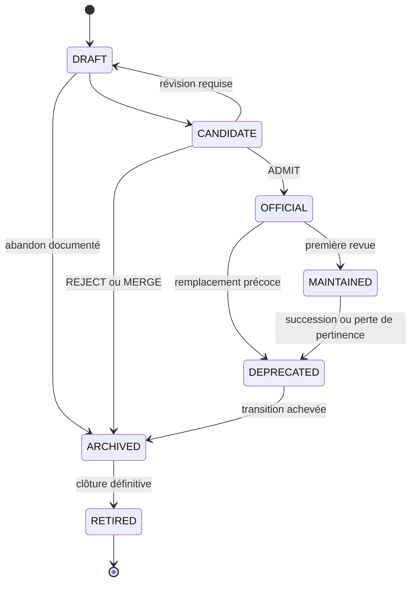

# PD-013 — Scientific Program Registry

## Registre officiel des Scientific Programs NOXIA

**Statut :** REFERENCE_NORMATIVE — OFFICIAL

**Niveau documentaire :** NIVEAU_1 — référence normative spécialisée

**Version :** 1.0

**Date d’effet :** 2 août 2026

**Révision de l’état officiel du registre :** 1.7

**Date d’état :** 3 août 2026

**Autorité :** identité, inscription, état et traçabilité des Scientific Programs

**Source maîtresse :** `docs/pd-013-scientific-program-registry.md`

**Éditions dérivées :** aucune

**Programmes officiels inscrits dans l’état 1.7 :** 3

**Périmètre :** contrat du registre et état officiel de ses inscriptions

**Autorités supérieures :** Charte fondatrice de NOXIA, *Scientific Product Manifesto*, puis PD-003 et PD-012 dans leurs domaines respectifs

**Références coordonnées :** Product Specification, PD-009, PD-011, Scientific Territory Model, Scientific Knowledge Catalog, Scientific Knowledge Graph, Protocol Designer et Editorial Engine

**Principe directeur :** un seul registre, une seule identité par Programme, un seul état effectif et aucune connaissance dupliquée

---

## 0. Décision documentaire et règle de lecture

### 0.1 Nature exacte de la mission

PD-013 crée la référence normative qui définit **où l’existence officielle d’un Scientific Program est constatée** et **comment cette existence reste identifiable, versionnée, recherchable et auditable**.

PD-013 remplit deux fonctions indissociables :

1. il définit le contrat du Scientific Program Registry ;
2. il constitue la source maîtresse de l’état officiel des inscriptions tant qu’aucune autre représentation n’a été admise par le SOURCE-OF-TRUTH-INDEX.

Le contrat PD-013 reste en version 1.0. Son état initial contenait **zéro Scientific Program officiel**. La révision d’état 1.1 a enregistré en premier l’admission documentaire de `NXP-000002 — Cardiac MRI & Quantitative Cardiac Imaging`. La révision d’état 1.2 a ensuite enregistré l’admission documentaire de `NXP-000001 — Spectral Imaging`. La révision d’état 1.3 admet `RB-003 — Reasoning Book 03 — Spectral Imaging` comme actif officiel de niveau 2 du portefeuille de `NXP-000001` et porte ce Programme à la version mineure 1.1. La révision d’état 1.4 admet `RB-004 — Reasoning Book 04 — Cardiac MRI & Quantitative Cardiac Imaging` comme actif officiel de niveau 2 du portefeuille de `NXP-000002` et porte ce Programme à la version mineure 1.1. La révision d’état 1.5 enregistre en troisième l’admission documentaire de `NXP-000003 — Neuro Perfusion & Metabolism`, `OFFICIAL` version 1.0, avec `RB-005` comme unique référence candidate non créée. La révision d’état 1.6 enregistre la correction bibliographique bornée de RB-004, version 1.0 vers 1.1, et porte `NXP-000002` à la version mineure 1.2 sans modifier sa vision, ses frontières, ses relations ou son ownership. La révision d’état 1.7 admet `RB-005 — Reasoning Book 05 — Neuro Perfusion & Metabolism Foundations` comme actif officiel de niveau 2 du portefeuille de `NXP-000003` et porte ce Programme à la version mineure 1.1. L’ordre numérique des ProgramID n’encode aucune chronologie et ne réécrit pas cet ordre historique.

Les admissions de Programmes ne créent aucune représentation exécutable et ne promeuvent automatiquement aucun nom illustratif, nœud territorial, KnowledgeNode ou Reasoning Book. Les admissions ultérieures de RB-003, RB-004 puis RB-005 résultent de décisions documentaires distinctes et ne créent ni registre exécutable, ni activation produit, ni publication. L’admission de RB-005 ne crée ni les autres cahiers de la roadmap de `NXP-000003`, ni ownership sur les connaissances déjà présentes dans le Catalog ou le Knowledge Graph.

PD-013 ne crée :

- aucun contenu scientifique ;
- aucun Reasoning Book ;
- aucun Scientific Corpus ;
- aucune ScientificAssertion ;
- aucune SourceIdentity ;
- aucun Knowledge Graph ;
- aucune ontologie ;
- aucune interface ;
- aucun stockage ;
- aucune API ;
- aucun modèle métier concurrent de PD-003 ou PD-012.

### 0.2 Documents consultés dans l’ordre d’autorité

1. `0. NOXIA — SOURCE-OF-TRUTH-INDEX.md` — hiérarchie, sources maîtresses, admission et arbitrage ;
2. `output/documents/noxia-la-charte-fondatrice-edition-editoriale.docx` — mission, valeurs et principes durables ;
3. `output/documents/noxia-protocol-designer-scientific-product-manifesto-edition-editoriale.docx` — connaissance partagée, moteur scientifique unique, responsabilité humaine et historicité ;
4. `output/documents/noxia-protocol-designer-product-specification-v1.0.docx` — cible produit, intentions utilisateur, états honnêtes et distinction entre produit et infrastructure ;
5. `docs/pd-003-research-object-model.md` — identités, objets métier, Acteurs, Mandats, relations, versions et histoire des décisions ;
6. `docs/pd-012-scientific-program-architecture.md` — définition, types, relations, ownership, cycle de vie, admission et frontières des Scientific Programs ;
7. `docs/pd-009-decision-engine-architecture.md` — navigation scientifique, prochaine action, arrêts et décisions humaines ;
8. `docs/pd-011-evaluation-framework.md` — évaluation, métriques, PASS/FAIL, gouvernance et publication d’une version ;
9. `docs/scientific-territory-model.md` — périmètre scientifique souhaité ;
10. `docs/p6-scientific-knowledge-catalog.md` — couverture réelle, priorité, readiness et file ;
11. `docs/scientific-knowledge-graph-web.md` — identités scientifiques, révisions, assertions, sources, preuves et projections internes.

### 0.3 Distinctions obligatoires

| Catégorie | Éléments applicables à PD-013 | Portée exacte |
|---|---|---|
| Principes établis | science avant technologie ; identité stable ; responsabilité humaine ; contexte et limites visibles ; historique non réécrit ; connaissance partagée | Contraintes supérieures appliquées sans modification |
| Références normatives | PD-003, PD-009, PD-011, PD-012, Territory Model, Catalog et Knowledge Graph | Contrats spécialisés que le registre référence sans les absorber |
| Corpus scientifiques | Reasoning Books et corpus P4–P5 | Actifs éventuellement référencés par un futur Programme, jamais modifiés ou inscrits automatiquement par PD-013 |
| Cible normative | registre unique, déterministe et auditable capable de gouverner plusieurs centaines d’inscriptions | Contrat durable, sans choix d’implémentation |
| État réellement observé | PD-012 et PD-013 sont officiels ; les états 1.1 puis 1.2 enregistrent deux admissions de Programmes, l’état 1.3 l’admission de RB-003, l’état 1.4 l’admission de RB-004, l’état 1.5 la troisième admission de Programme, l’état 1.6 une correction bibliographique de RB-004 et l’état 1.7 l’admission de RB-005 | `NXP-000002` est `OFFICIAL` version 1.2 ; `NXP-000001` est `OFFICIAL` version 1.1 ; `NXP-000003` est `OFFICIAL` version 1.1 ; RB-003 et RB-005 sont `OFFICIAL` version 1.0 et RB-004 `OFFICIAL` version 1.1 ; aucune représentation exécutable, activation produit ou publication n’est démontrée |
| Hypothèses | futurs Programmes, futures relations inter-Programmes, les sept entrées non identifiées de la roadmap de `NXP-000003`, ainsi que tous les actifs non créés | Données absentes ou prospectives ; les exemples historiques de la section 14 restent exclus du registre officiel |

### 0.4 Arbitrages explicites

#### A — Le registre normatif n’est pas une implémentation

PD-013 définit les informations, règles, états, recherches et opérations qui devront rester vrais quelle que soit la représentation choisie ultérieurement. Il ne prescrit ni fichier de données séparé, ni table, ni service, ni interface.

Une future implémentation devra dériver de PD-013 et prouver sa conformité. Son existence ne pourra pas modifier silencieusement le présent contrat.

#### B — PD-013 n’est pas une seconde architecture de Programmes

PD-012 reste l’autorité sur le sens d’un Scientific Program, ses types, ses relations, son ownership, son cycle de vie et son admission. PD-013 définit uniquement comment ces décisions sont enregistrées, recherchées et conservées.

Si PD-012 et une entrée du registre divergent, l’entrée est non conforme. Le registre ne corrige jamais PD-012 par commodité.

#### C — Le Program Owner n’est pas un responsable humain

Le `Program Owner` est le Programme responsable de l’identité canonique d’un actif au sens de PD-012. Les `responsables humains` sont des Acteurs ou instances dotés de Mandats explicites au sens de PD-003.

Le registre conserve les deux informations séparément. Un nom de personne ne peut jamais être placé dans le champ `ProgramOwner`.

#### D — « Parent » n’introduit pas une nouvelle hiérarchie

PD-012 privilégie les relations explicites et interdit qu’un Programme devienne une simple copie d’une branche territoriale. Il ne définit aucune relation canonique `PARENT_OF`.

En version 1.0, `parent` est donc une **vue de regroupement dérivée** des Territory Links ou des relations officielles. Ce n’est ni un champ d’autorité, ni une relation canonique, ni une propriété d’ownership. Tout besoin futur d’un véritable parent de Programme exige d’abord une évolution explicite de PD-012.

#### E — Un Program prévu n’est pas encore un Program enregistré

Un domaine `PLANNED` dans le Territory Model ou priorisé dans le Catalog peut apparaître dans une vue prospective du registre. Il ne reçoit ni `ProgramID`, ni version, ni état de cycle de vie tant qu’un dossier `DRAFT` n’a pas été créé.

La planification reste une information dérivée, jamais une admission implicite.

#### F — Les exemples ne sont pas des entrées

Les fiches historiques `Cardiac MRI`, `Spectral CT` et `Imaging Biomarkers` de la section 14 restent exclues de tous les comptes, recherches et décisions du registre officiel. L’exemple `Cardiac MRI` est supplanté par l’admission distincte de `NXP-000002` et l’exemple `Spectral CT` par l’admission distincte de `NXP-000001`. Aucun exemple ne devient alias, seconde identité, source d’admission ou entrée de registre.

---

## 1. Le Scientific Program Registry officiel

### 1.1 Définition

Le **Scientific Program Registry** est l’autorité documentaire unique qui permet de déterminer :

- si une identité de Programme existe ;
- si elle est seulement proposée ou officiellement admise ;
- quel est son état effectif ;
- quelle version est applicable ;
- quel Programme possède les actifs référencés ;
- quels responsables humains et Mandats ont autorisé les décisions ;
- quels territoires, relations, dépendances et portefeuilles lui sont associés ;
- quelles évolutions, fusions, substitutions ou clôtures ont eu lieu.

Le registre répond à la question : **« Quels Scientific Programs NOXIA reconnaît-il, dans quel état et sous quelle autorité ? »**

Il ne répond pas à :

- « Que souhaite couvrir NOXIA ? » — Scientific Territory Model ;
- « Que couvre réellement le corpus ? » — Scientific Knowledge Catalog ;
- « Quelle connaissance est établie ? » — Scientific Knowledge Graph et corpus ;
- « Quelle campagne faut-il exécuter ? » — Catalog et Campaign Planner ;
- « Quelle action scientifique poser ensuite ? » — PD-009 ;
- « Une version a-t-elle démontré sa valeur ? » — PD-011.

### 1.2 Responsabilités

Le registre DOIT :

- conserver une identité stable par Programme ;
- exposer un état effectif unique ;
- distinguer proposition, admission, expérimentation, dépréciation et retrait ;
- référencer les autorités et actifs sans les recopier ;
- conserver les alias sans multiplier les identités ;
- rendre les relations orientées et leur historique vérifiables ;
- maintenir l’unicité de l’ownership ;
- conserver les versions et changements sans réécrire le passé ;
- refuser toute entrée incomplète, contradictoire ou non admise ;
- rendre les exemples et projections prospectives impossibles à confondre avec les inscriptions officielles.

### 1.3 Autorité

PD-013 possède une autorité spécialisée sur :

- le format conceptuel d’une inscription ;
- l’unicité et la stabilité des ProgramID ;
- l’état courant du registre ;
- le journal des inscriptions et évolutions ;
- les recherches autorisées ;
- l’exclusion des exemples et vues prospectives.

Il ne possède aucune autorité pour inventer un Programme, modifier PD-012, produire une connaissance, attribuer un PASS, sélectionner une campagne ou publier une page.

### 1.4 Portée et registre courant

| Mesure du registre — état 1.7 | Valeur | Interprétation |
|---|---:|---|
| Programmes officiellement inscrits | 3 | `NXP-000002`, puis `NXP-000001`, puis `NXP-000003`, ont franchi l’admission PD-012 et PD-013 |
| Programmes `OFFICIAL` | 3 | `NXP-000002` en version 1.2 ; `NXP-000001` en version 1.1 ; `NXP-000003` en version 1.1 |
| Programmes `MAINTAINED` | 0 | Aucun Programme officiel en maintenance |
| Programmes candidats inscrits | 0 | Aucun Scientific Program candidat |
| Programmes expérimentaux inscrits | 0 | Aucun dossier expérimental enregistré |
| Programmes retirés ou historiques | 0 | Aucun identifiant antérieur à conserver |
| Reasoning Books officiels | 3 | RB-003 version 1.0 sous `NXP-000001`, RB-004 version 1.1 sous `NXP-000002` et RB-005 version 1.0 sous `NXP-000003` |
| Références candidates de Reasoning Books non créés | 0 | La référence candidate RB-005 est devenue un actif officiel ; aucune autre référence de roadmap ne possède d’identifiant |
| Entrées prospectives de roadmap sous `NXP-000003` | 7 | Sept candidats restent sans identifiant, sans réservation et sans autorité |
| Éditions dérivées de Reasoning Books | 3 | Un PDF dérivé pour chaque DOCX maître ; aucun PDF n’est source maîtresse |
| Exemples documentaires historiques | 3 | Exclus du registre officiel ; `Cardiac MRI` et `Spectral CT` sont supplantés comme exemples par des inscriptions distinctes |

Cette table est un état documentaire explicite. Elle ne prouve ni l’existence d’un registre exécutable ni l’absence de domaines dans le Territory Model ou le Catalog.

### 1.5 Unicité du registre

Il ne peut exister :

- qu’une seule source maîtresse normative du Scientific Program Registry ;
- qu’un seul état effectif par ProgramID ;
- qu’un seul journal canonique d’évolution ;
- qu’une seule interprétation normative de chaque champ.

Une projection, un export ou une vue filtrée n’est jamais un second registre.

---

## 2. Identité et dossier d’inscription d’un Program

### 2.1 Principe

Une inscription représente l’identité et l’état d’autorité d’un Programme. Elle ne contient ni les connaissances du Programme ni les documents qu’elle référence.

Tous les champs obligatoires sont présents. Lorsqu’une valeur n’est pas encore démontrée, le champ reste explicitement `null`, `UNKNOWN`, `UNRESOLVED`, `NOT_APPLICABLE` ou vide selon sa cardinalité. L’absence ne doit jamais être remplacée par une valeur plausible.

### 2.2 Champs obligatoires

| Champ normatif | Cardinalité | Contenu autorisé | Autorité ou règle |
|---|---:|---|---|
| ProgramID | 1 | Identifiant stable conforme à la section 4 | Unique, réservé et jamais réutilisé |
| Nom officiel | 1 | Désignation préférée validée | Un seul nom effectif par version |
| Alias | 0..n | Anciens noms, abréviations ou variantes utiles | Ne créent jamais de nouvelle identité |
| Description courte | 1 | Périmètre et responsabilité en une formulation concise | Aucune assertion scientifique |
| Description longue | 1 | Définition, inclusions, exclusions, frontières et utilité durable | Compatible avec PD-012 et le Territory Model |
| Type | 1 | `MODALITY_PROGRAM`, `DOMAIN_PROGRAM`, `CROSS_CUTTING_PROGRAM` ou `HYBRID_PROGRAM` | Vocabulaire fermé de PD-012 |
| Statut | 1 | Un état officiel de la section 3 | Un seul état effectif |
| Version | 1 | Version `MAJEURE.MINEURE` du Programme | Sémantique PD-012 |
| Date | 1 | Date d’effet de la version ou de l’état courant | Datée, non déduite d’un horodatage technique |
| Program Owner | 1 | ProgramID responsable de l’identité du dossier | Pour le dossier du Programme, égal à son propre ProgramID ; distinct des responsables humains |
| Responsables humains | 1..n pour une admission officielle | Références vers Acteurs ou instances et Mandats applicables | PD-003 ; aucun nom libre ne crée un Mandat |
| Program Vision | 1 | Référence vers la Scientific Vision effective | Ne contient aucune assertion non sourcée |
| Scientific Roadmap | 1 | Référence vers la roadmap effective | Ne vaut ni priorité du Catalog ni campagne |
| Territory Links | 1..n | Références vers des nœuds territoriaux et leurs frontières | Le registre ne modifie pas le Territory Model |
| Relations | 0..n | Relations officielles PD-012, versionnées et justifiées | Aucune relation implicite |
| Dependencies | 0..n | Sous-ensemble explicite des relations `DEPENDS_ON` | Les cycles structurants sont interdits |
| Reasoning Books | 0..n | Références vers identités et versions | Aucune copie documentaire |
| Scientific Corpus | 0..n | Références vers corpus et versions | Aucun contenu scientifique local |
| Knowledge Assets | 0..n | Références vers actifs canoniques | Ownership et rôle d’usage explicites |
| Editorial Assets | 0..n | Références vers projections ou actifs éditoriaux gouvernés | Aucun statut public déduit |
| Evaluation Assets | 0..n | Références vers actifs PD-011 | Aucun PASS local ou implicite |

### 2.3 Vues de portefeuille complémentaires

Pour satisfaire les recherches et contrôles sans dupliquer les actifs, une inscription expose également des vues de références :

- `ConceptRefs` ;
- `BiomarkerRefs` ;
- `ScientificAssertionRefs` ;
- `SourceRefs` ;
- `ConsumerProgramRefs` ;
- `SupplierProgramRefs` ;
- `ChangeLogRef` ;
- `AdmissionDecisionRef` ;
- `OwnershipRegistryRef`.

Ces vues ne créent aucun nouvel objet métier. Elles indexent les identités canoniques détenues, consommées, fournies ou observées.

### 2.4 Rôle déclaré pour chaque référence

Chaque actif référencé indique :

- son identité canonique ;
- sa version utilisée ;
- son Program Owner ;
- le rôle du Programme courant : `OWNS`, `CONSUMES`, `CONTRIBUTES` ou `OBSERVES` ;
- le contexte d’usage ;
- l’état de validité de la référence ;
- la date d’effet ;
- l’analyse d’impact ouverte, s’il en existe une.

### 2.5 Invariants d’une inscription

1. Un ProgramID correspond à une seule identité.
2. Une identité possède un seul nom officiel effectif et peut posséder plusieurs alias.
3. Une identité possède un seul état effectif.
4. Une version historique reste immuable.
5. Un champ obligatoire absent reste explicitement inconnu et peut bloquer une transition.
6. Un actif référencé n’est jamais copié dans l’inscription.
7. Une référence ne transfère aucun ownership.
8. Un responsable humain ne devient pas Program Owner.
9. Une description ne contient aucune connaissance non sourcée.
10. Une vue dérivée ne devient jamais une source de vérité autonome.

---

## 3. Registre des états

### 3.1 États officiels

PD-013 reprend sans les redéfinir les sept états de PD-012 :

| Statut | Sens enregistré | Conditions minimales dans le registre | Autorité courante |
|---|---|---|---|
| DRAFT | Proposition exploratoire identifiée | ProgramID réservé, demandeur, périmètre initial, date et motif | Aucune autorité normative |
| CANDIDATE | Dossier complet soumis à admission | Champs d’admission présents, chevauchements et conflits documentés | Autorité de travail uniquement |
| OFFICIAL | Programme admis en version initiale | Décision `ADMIT`, version 1.0, responsables et Mandats, ownership sans conflit bloquant | Autorité officielle sur son périmètre déclaré |
| MAINTAINED | Programme officiel activement revu | Première revue de maintenance, portefeuille réel, roadmap actuelle et propagation vérifiée | Autorité officielle courante |
| DEPRECATED | Programme remplacé ou déconseillé pour de nouveaux travaux | Motif, successeur éventuel, plan de transition et consommateurs identifiés | Autorité historique et transitoire |
| ARCHIVED | Programme gelé comme référence historique | Date d’archive, état final, liens, versions et décisions conservés | Lecture historique |
| RETIRED | Programme définitivement fermé | Tombstone, motif, successeur éventuel et identifiant réservé | Aucune autorité courante |

### 3.2 Transitions autorisées



Toute transition conserve :

- l’état précédent ;
- la date d’effet ;
- la décision ;
- l’Acteur ou l’instance ;
- le Mandat ;
- la justification ;
- les impacts ;
- la version résultante.

Une transition non prévue est refusée. Une réactivation crée une nouvelle décision et ne réécrit jamais l’ancien état.

### 3.3 Contraintes de statut

- `DRAFT` et `CANDIDATE` ne peuvent alimenter aucune projection publique.
- `OFFICIAL` ne signifie ni `MAINTAINED`, ni `EDITORIAL_READY`, ni `PUBLIC_READY`.
- `MAINTAINED` ne crée aucun PASS PD-011.
- `DEPRECATED` reste consultable et ne reçoit plus de nouvel actif sans justification de transition.
- `ARCHIVED` est immuable, sauf addendum de correction historique explicitement relié.
- `RETIRED` est terminal et son ProgramID reste réservé.
- Un état absent, multiple ou contradictoire bloque toute opération d’autorité.

### 3.4 Standing réel dérivé

Le registre peut produire une vue `RegistryStanding` sans créer un second cycle de vie :

| Standing demandé | Dérivation | Autorité |
|---|---|---|
| PROGRAM_OFFICIALLY_ADMITTED | Statut `OFFICIAL`, `MAINTAINED`, `DEPRECATED`, `ARCHIVED` ou `RETIRED` après décision `ADMIT` historique | Selon le statut effectif |
| PROGRAM_CANDIDATE | Statut `DRAFT` ou `CANDIDATE` | Aucune autorité officielle |
| PROGRAM_EXPERIMENTAL | `DRAFT` ou `CANDIDATE` avec qualification expérimentale et, si applicable, `EXPERIMENTAL_EXTENSION_OF` | Aucune autorité officielle |
| PROGRAM_WITHDRAWN | Candidat rejeté ou fusionné, ou Programme `ARCHIVED`/`RETIRED` | Historique uniquement |
| PROGRAM_PLANNED | Vue prospective issue du Territory Model ou du Catalog, sans ProgramID | N’est pas un Scientific Program enregistré |

`RegistryStanding` est une projection de lecture. Le champ `Statut` reste l’unique état canonique d’une inscription.

---

## 4. Identifiants

### 4.1 Format officiel

Le format d’un ProgramID est :

```text
NXP-000001
```

Règles :

- préfixe fixe `NXP` pour NOXIA Program ;
- séparateur `-` ;
- séquence numérique sur six chiffres ;
- aucune information scientifique, territoriale, chronologique ou organisationnelle encodée ;
- comparaison sensible à la forme canonique ;
- affichage intégral dans toute décision ou trace d’autorité.

### 4.2 Attribution

Un ProgramID peut être réservé lors de la création d’un dossier `DRAFT`. Cette réservation :

- ne vaut pas admission ;
- ne vaut pas existence officielle ;
- est inscrite au journal ;
- reste définitive même si le candidat est rejeté ;
- empêche tout réemploi pour une autre identité.

Les exemples de PD-013 ne reçoivent aucun identifiant au format `NXP-######`.

### 4.3 Unicité et stabilité

- Un ProgramID n’est attribué qu’une fois.
- Une fusion, une scission ou un remplacement ne recycle aucun identifiant.
- Un changement de nom ne change jamais le ProgramID.
- Une modification de périmètre compatible conserve le ProgramID et versionne le Programme.
- Un changement créant une identité différente reçoit un nouveau ProgramID et une relation historique.
- Un ProgramID `ARCHIVED` ou `RETIRED` reste résolvable vers son tombstone.

### 4.4 Renommage et alias

Un renommage :

1. conserve le ProgramID ;
2. crée une version compatible ou majeure selon le changement de sens ;
3. déplace l’ancien nom dans `Alias` ;
4. conserve la date et la justification ;
5. actualise les références de présentation sans réécrire les versions historiques.

Un alias ne peut devenir un second nom officiel simultané.

### 4.5 Interdiction de réutilisation

Un identifiant réservé, rejeté, fusionné, remplacé, archivé ou retiré n’est jamais réattribué. L’absence d’actifs ou la disparition du nom ne libère pas l’identifiant.

---

## 5. Program Owners et responsables humains

### 5.1 Portée de PD-013

PD-012 reste l’autorité sur la propriété unique, la consommation, la contribution, la propagation, le transfert et le conflit. PD-013 enregistre l’application de ces règles ; il ne les redéfinit pas.

### 5.2 Owner du dossier de Programme

Le dossier canonique d’un Programme est gouverné par le Programme qu’il décrit. Son champ `ProgramOwner` est donc égal à son `ProgramID`.

Cette auto-référence signifie uniquement que :

- l’identité du Programme ne peut être absorbée silencieusement par un autre ;
- son histoire reste attachée à son identifiant ;
- une succession ne réécrit pas le prédécesseur ;
- les actifs du portefeuille peuvent, eux, être transférés selon PD-012.

### 5.3 Responsables humains

Les responsables humains :

- instruisent les propositions ;
- réalisent ou commandent les revues ;
- prennent les décisions autorisées ;
- qualifient les conflits ;
- approuvent les transferts selon leur Mandat ;
- signent les admissions, rejets, fusions, remplacements et clôtures.

Chaque action enregistre l’Acteur ou l’instance, le Mandat, la portée et la date. Une participation, une expertise ou une ancienneté ne suffit pas à créer un Mandat.

### 5.4 Registre d’ownership

Pour chaque actif, le registre référence :

- l’identité canonique ;
- le Program Owner courant ;
- la date d’effet ;
- les Owners antérieurs ;
- les Programmes consommateurs ;
- les propositions ou conflits ouverts ;
- les décisions de transfert ;
- les impacts non résolus.

### 5.5 Transfert

Un transfert d’ownership est enregistré uniquement après la procédure PD-012. Il conserve :

- Owner source et Owner cible ;
- actif concerné ;
- justification de périmètre ;
- accords et Mandats ;
- date d’effet ;
- consommateurs ;
- analyse d’impact ;
- version avant et après ;
- état de propagation.

Le transfert ne change ni l’identité de l’actif ni ses versions historiques.

### 5.6 Conflit

Un conflit produit l’état `UNRESOLVED_OWNERSHIP` sur la référence concernée. Tant qu’il persiste :

- aucun nouvel Owner effectif n’est enregistré ;
- aucune modification canonique n’est attribuée à l’un des prétendants ;
- les usages existants restent visibles avec avertissement ;
- toute admission ou transition dépendante est bloquée ;
- un arbitrage humain mandaté est requis.

### 5.7 Historique

L’historique d’ownership est append-only sur le plan conceptuel : une décision ultérieure ajoute un événement, elle ne remplace jamais l’attribution antérieure.

---

## 6. Relations du registre

### 6.1 Relations canoniques

Le registre accepte uniquement les relations de PD-012 :

| Relation | Usage dans le registre | Effet |
|---|---|---|
| DEPENDS_ON | Dépendance déclarée vers un Programme fournisseur | Peut être bloquante ou non ; aucun transfert d’ownership |
| CROSS_CUTS | Application transverse dans un périmètre explicite | Relation symétrique ; contexte obligatoire |
| SHARES_KNOWLEDGE_WITH | Consommation commune d’un actif canonique | Owner unique conservé |
| SUPPORTS | Fourniture d’une méthode, règle ou capacité scientifique | Fournisseur et consommateur restent distincts |
| EXPERIMENTAL_EXTENSION_OF | Extension candidate d’un Programme | Aucune autorité officielle héritée |
| REFERENCES | Usage en lecture sans dépendance structurante | Aucun droit de modification |
| SUPERSEDES | Succession explicite après procédure | Historique et identités antérieures conservés |

Chaque relation possède : identité des deux Programmes, direction, version, justification, portée, état, date d’effet et historique.

### 6.2 Parent

`parent` est une vue non canonique :

- elle peut regrouper des Programmes par nœud territorial ;
- elle peut présenter un Programme de référence lorsqu’une relation officielle le justifie ;
- elle ne crée pas `PARENT_OF` ;
- elle ne transmet ni périmètre, ni statut, ni ownership ;
- elle ne peut pas être utilisée pour autoriser une transition.

La valeur canonique de `ParentProgramID` reste `NOT_APPLICABLE` en version 1.0.

### 6.3 Dépendances

La vue `Dependencies` contient uniquement les relations `DEPENDS_ON` effectives. Elle précise :

- Programme fournisseur ;
- actif ou responsabilité attendue ;
- version minimale ;
- caractère bloquant ;
- condition de satisfaction ;
- conséquence d’une indisponibilité ;
- date de dernière revue.

Les cycles structurants sont refusés.

### 6.4 Références

La vue `References` contient les relations `REFERENCES` et les actifs canoniques utilisés en lecture. Une référence ne doit jamais être promue en dépendance ou ownership par simple fréquence d’usage.

### 6.5 Programmes consommateurs

Un Programme est consommateur lorsqu’il référence un actif appartenant à un autre Programme ou dépend d’une responsabilité de celui-ci. La vue des consommateurs est dérivée des références canoniques et des rôles `CONSUMES` ; elle n’est pas maintenue comme une vérité concurrente.

### 6.6 Programmes fournisseurs

Un Programme est fournisseur lorsqu’il possède un actif consommé, porte une relation `SUPPORTS` ou satisfait une relation `DEPENDS_ON`. La vue des fournisseurs est dérivée des relations et de l’ownership.

### 6.7 Contrôles relationnels

- aucune auto-dépendance ;
- aucun cycle `DEPENDS_ON` ou `SUPERSEDES` ;
- aucune relation sans justification ;
- aucune symétrie ajoutée aux relations orientées ;
- aucune transitivité inférée ;
- aucune relation vers un exemple illustratif ;
- aucune relation vers un ProgramID inconnu ;
- aucune relation supprimée de l’historique.

---

## 7. Portefeuille référencé

### 7.1 Principe absolu

Le registre contient des **références d’autorité**, jamais les actifs eux-mêmes.

### 7.2 Familles d’actifs

| Famille | Référence attendue | Source de vérité | Interdiction |
|---|---|---|---|
| Reasoning Books | identité, version, statut et rôle | Source maîtresse admise de chaque Reasoning Book | Aucun texte recopié |
| Scientific Corpus | identité, version, périmètre et rôle | Registres scientifiques partagés | Aucune extraction ou synthèse locale |
| Concepts | ConceptIdentity et version applicable | Scientific Knowledge Graph | Aucune définition concurrente |
| Assertions | ScientificAssertionIdentity et Revision | Scientific Knowledge Graph | Aucun énoncé dupliqué |
| Sources | SourceIdentity et SourceRevision | Scientific Knowledge Graph | Aucun doublon bibliographique |
| Knowledge Assets | identité, version, type et rôle | Autorité scientifique correspondante | Aucun regroupement transformé en vérité |
| Editorial Assets | projectionId, version, visibilité et provenance | Projection scientifique puis Editorial Engine | Aucun contenu éditorial maintenu dans le registre |
| Evaluation Assets | identité, version, périmètre et statut | PD-011 et artefacts gouvernés | Aucun score, seuil ou PASS local |

### 7.3 Référence minimale

Toute référence contient au minimum :

- identifiant de l’actif ;
- type d’actif ;
- version ;
- Program Owner ;
- rôle du Programme courant ;
- contexte d’usage ;
- statut ;
- source maîtresse ou registre canonique ;
- date d’effet ;
- éventuel blocage.

### 7.4 Actif absent

Une liste vide signifie qu’aucun actif de cette famille n’est officiellement référencé. Elle ne signifie ni que le domaine ne possède aucune connaissance, ni que le registre peut en créer une.

### 7.5 Propagation

Lorsqu’un actif change, le registre reçoit ou référence un événement d’impact. Il actualise l’état de la référence après décision autorisée, sans modifier l’actif, le Reasoning Book ou la projection.

---

## 8. État réel et catégories de présence

### 8.1 Programme officiellement admis

Un Programme officiellement admis possède :

- un ProgramID ;
- une décision `ADMIT` ;
- un statut `OFFICIAL` ou ultérieur ;
- une version effective ;
- des responsables humains et Mandats ;
- un dossier conforme à PD-012 ;
- une inscription complète et non contradictoire.

### 8.2 Programme prévu

Un Programme prévu est seulement une vue prospective liée à un besoin territorial ou de catalogue. Il ne possède aucun ProgramID, aucun statut PD-012 et aucune autorité.

Il doit être affiché ou exporté avec la qualification `PROGRAM_PLANNED — NOT_REGISTERED`.

### 8.3 Programme candidat

Un Programme candidat possède un dossier `DRAFT` ou `CANDIDATE`, un ProgramID réservé et aucune autorité officielle. Ses actifs éventuels restent candidats et isolés.

### 8.4 Programme expérimental

Un Programme expérimental est un candidat explicitement qualifié comme tel. Il ne peut ni posséder une assertion effective, ni modifier un actif officiel, ni alimenter une projection publique.

### 8.5 Programme retiré

Un Programme retiré ou fermé conserve son ProgramID, ses versions, ses décisions, son successeur éventuel et son tombstone. Le retrait n’efface jamais son histoire.

### 8.6 Règle d’affichage documentaire

Toute restitution du registre doit séparer visiblement :

1. inscriptions officielles actives ;
2. inscriptions officielles historiques ;
3. candidats ;
4. expérimentations ;
5. vues prospectives non enregistrées ;
6. exemples illustratifs.

Aucune agrégation ne doit appeler « Programmes NOXIA » la somme de ces six catégories sans ventilation.

---

## 9. Admission et opérations de registre

### 9.1 Création

La création réserve un ProgramID et ouvre un dossier `DRAFT`. Elle exige : demandeur, motif, périmètre initial, date, ancrages territoriaux candidats et recherche de chevauchement.

Elle ne vaut jamais admission.

### 9.2 Validation

La validation d’un candidat contrôle :

- complétude des champs ;
- identité et nom uniques ;
- conformité du type ;
- frontières territoriales ;
- absence de doublon ;
- relations et dépendances ;
- ownership ;
- responsables et Mandats ;
- vision, roadmap et premier portefeuille ;
- compatibilité PD-003, PD-009, PD-011 et PD-012 ;
- absence de contenu scientifique inventé.

### 9.3 Admission

L’admission applique la procédure PD-012 et enregistre :

- décision `ADMIT` ;
- autorité humaine et Mandat ;
- version 1.0 ;
- date d’effet ;
- statut `OFFICIAL` ;
- dossier d’autorité ;
- ownership initial ;
- relations ;
- contrôles de non-duplication ;
- mise à jour du SOURCE-OF-TRUTH-INDEX lorsque des documents d’autorité sont admis.

### 9.4 Rejet

`REJECT` conserve le ProgramID réservé, le dossier soumis, le motif, l’autorité, la date et les correspondances proches. Le candidat ne devient jamais officiel et son identifiant ne peut être réutilisé.

### 9.5 Fusion

Deux cas sont distingués :

1. un candidat rejoint un Programme existant par décision `MERGE` : aucun nouvel officiel n’est créé ;
2. plusieurs Programmes officiels fusionnent : un Programme successeur reçoit un nouvel identifiant, les prédécesseurs passent `DEPRECATED`, puis `ARCHIVED`, et chaque ownership est transféré explicitement.

La fusion n’efface aucune identité ni version.

### 9.6 Remplacement

`REPLACE` n’est pas une nouvelle décision d’admission concurrente de PD-012. Un remplacement est une séquence gouvernée :

1. admettre ou identifier le successeur ;
2. créer la relation `SUPERSEDES` ;
3. versionner les Programmes affectés ;
4. passer le prédécesseur à `DEPRECATED` ;
5. transférer les ownerships autorisés ;
6. notifier les consommateurs ;
7. conserver l’historique et le tombstone.

### 9.7 Atomicité documentaire

Une opération de registre n’est effective que lorsque identité, état, version, décision, ownership, relations, journal et contrôles sont cohérents ensemble. Un état partiel reste une proposition non effective.

---

## 10. Versionnement et historique

### 10.1 Quatre niveaux distincts

| Niveau | Ce qui est versionné | Effet |
|---|---|---|
| Contrat PD-013 | Structure, règles et sémantique du registre | Version de la référence normative |
| État du registre | Ensemble des inscriptions et journal à une date donnée | Révision globale reconstructible |
| Programme | Définition, périmètre, type, relations, ownership et portefeuille | Version `MAJEURE.MINEURE` selon PD-012 |
| Actif référencé | Source, assertion, corpus, Reasoning Book, projection ou évaluation | Version gouvernée par son autorité propre |

Une évolution à un niveau n’impose pas automatiquement la même version aux autres niveaux.

### 10.2 Version du contrat

- une modification incompatible d’un champ, d’un état ou d’une règle produit une version majeure de PD-013 ;
- une précision compatible, une nouvelle recherche ou un contrôle supplémentaire produit une version mineure ;
- une admission ou évolution d’inscription conforme au contrat actualise l’état et le journal sans changer nécessairement la version du contrat.

### 10.3 Version du Programme

PD-013 applique les versions majeures, mineures, breaking changes, scientific updates, reasoning updates et knowledge updates définis par PD-012. Il ne redéfinit pas leur sens.

### 10.4 Journal des évolutions

Chaque événement contient :

- EventID stable ;
- ProgramID ;
- type d’opération ;
- état et version avant ;
- état et version après ;
- date d’effet ;
- Acteur ou instance ;
- Mandat ;
- justification ;
- documents et décisions sources ;
- relations, ownerships et actifs affectés ;
- résultats des contrôles ;
- blocages ou réserves ;
- événement remplacé ou corrigé, le cas échéant.

### 10.5 Immutabilité

Une version ou un événement effectif n’est jamais réécrit. Une erreur crée une correction reliée, un nouvel état et une analyse d’impact.

### 10.6 Compatibilité

Une version est compatible lorsque ses consommateurs peuvent conserver le même sens, les mêmes identités et les mêmes responsabilités. Toute rupture exige version majeure, analyse d’impact, migration documentaire et maintien de l’état antérieur.

---

## 11. Contrat de recherche

### 11.1 Principe

Le registre définit des capacités de recherche conceptuelles. Il ne définit aucune interface, syntaxe de requête, base de données ou API.

Une recherche retourne des inscriptions ou des vues explicitement qualifiées. Elle ne crée ni relation, ni alias, ni ownership par inférence.

### 11.2 Critères autorisés

| Critère | Portée de recherche | Source |
|---|---|---|
| Nom | Nom officiel effectif | Inscription |
| Alias | Alias exact, ancien nom ou abréviation enregistrée | Inscription |
| Type | Un des quatre types PD-012 | Inscription |
| Territoire | Territory Link exact ou descendant selon règle déclarée | Territory Model + inscription |
| Owner | Program Owner d’un actif ou dossier | Registre d’ownership |
| État | Statut PD-012 ou RegistryStanding explicitement demandé | Inscription ou vue dérivée |
| Reasoning Book | Identité ou version référencée | Portefeuille |
| Corpus | Identité ou version référencée | Portefeuille |
| Biomarqueur | ConceptIdentity ou BiomarkerRef détenu ou consommé | Knowledge Graph + vue de références |
| Modalité | Territory Link, type ou concept canonique explicitement relié | Territory Model ou Knowledge Graph |
| Domaine | Territory Link ou périmètre déclaré | Territory Model + inscription |

### 11.3 Résultat minimal

Chaque résultat indique :

- ProgramID ou `NOT_REGISTERED` ;
- nom ;
- type ;
- statut ;
- version ;
- standing réel ;
- Program Owner ;
- rôle dans la correspondance : propriétaire, consommateur, fournisseur ou simple référence ;
- source de la correspondance ;
- date de l’état ;
- avertissements.

### 11.4 Recherches composées

Les critères peuvent être combinés. Le résultat doit expliquer si la correspondance provient :

- du dossier du Programme ;
- d’un Territory Link ;
- d’un actif possédé ;
- d’un actif consommé ;
- d’une relation fournisseur/consommateur ;
- d’une vue prospective.

### 11.5 Données absentes

Une recherche sans résultat retourne `NO_REGISTERED_PROGRAM_MATCH`. Elle ne crée pas une proposition, ne transforme pas un nœud territorial en Programme et ne consulte pas les exemples illustratifs comme solution de repli.

### 11.6 Exclusion des exemples

Les objets `ILLUSTRATIVE_EXAMPLE` sont exclus par défaut et ne peuvent apparaître que dans un mode documentaire explicitement demandé. Ils sont toujours séparés des résultats officiels.

---

## 12. Compatibilité avec les autorités existantes

| Autorité | Responsabilité conservée | Ce que PD-013 enregistre | Ce que PD-013 ne peut jamais redéfinir |
|---|---|---|---|
| Charte fondatrice | Mission et principes universels | Compatibilité déclarée du registre | Philosophie ou responsabilité humaine |
| Scientific Product Manifesto | Moteur scientifique, connaissance partagée et projections | Principe d’unicité et de traçabilité | Produit ou méthode de raisonnement |
| Product Specification | Expérience produit cible | Aucune interface ; seulement des références éventuellement consommables | Écrans, parcours ou interactions |
| PD-003 | Objets métier, Acteurs, Mandats, décisions et versions de stratégie | Références vers responsables et Mandats | Objet métier, état épistémique ou décision de projet |
| PD-009 | Prochaine action, branches, impacts et arrêts | Périmètres et dépendances lisibles | Navigation ou décision scientifique |
| PD-011 | Évaluation, métriques, PASS/FAIL et publication | Références vers Evaluation Assets | Métrique, seuil, PASS ou autorisation de publication |
| PD-012 | Définition, type, relation, ownership, lifecycle, admission et évolution des Programmes | Identité, état et décisions appliquant PD-012 | Toute règle d’architecture des Programmes |
| Scientific Territory | Périmètre souhaité et frontières | Territory Links | Nœud, frontière ou roadmap territoriale |
| Scientific Knowledge Catalog | Couverture, priorité, readiness et file | Références et vues de couverture éventuelles | KnowledgeNode, priorité, campagne ou readiness |
| Scientific Knowledge Graph | Concepts, sources, assertions, preuves, contextes et révisions | Références et Program Owner | Contenu, relation scientifique ou provenance |
| Editorial Engine | Transformation éditoriale générique | Références vers Editorial Assets | Architecture, capacité ou publication du moteur |
| Protocol Designer | Accompagnement de l’intention et stratégie de projet | Contexte de Programme éventuellement consommable | Produit, projet, navigation ou décision humaine |

### 12.1 Ordre d’arbitrage

- PD-003 prime pour les objets métier et Mandats.
- PD-009 prime pour la navigation.
- PD-011 prime pour l’évaluation et la publication d’une version.
- PD-012 prime pour le sens et les règles des Programmes.
- PD-013 prime uniquement pour l’identité inscrite, l’état effectif du registre, le journal et la recherche.

### 12.2 Contradiction

Toute divergence entre une inscription et une autorité spécialisée produit `REGISTRY_CONFLICT`. L’entrée reste visible, mais aucune transition dépendante n’est autorisée avant arbitrage et correction versionnée.

---

## 13. Règles absolues de non-duplication

Il est interdit de créer :

1. plusieurs ProgramID pour la même identité ;
2. plusieurs identités sous des variantes lexicales ;
3. plusieurs Owners pour un même actif ;
4. plusieurs états effectifs pour un ProgramID ;
5. plusieurs registres canoniques ;
6. plusieurs versions effectives concurrentes sans branche explicitement candidate ;
7. plusieurs Programmes au périmètre et à la responsabilité interchangeables ;
8. une copie d’un Reasoning Book dans une inscription ;
9. une copie d’un corpus, concept, assertion ou source ;
10. une ontologie locale de Programme ;
11. un alias traité comme une identité ;
12. une relation implicite déduite d’un nom ;
13. un Owner déduit du premier utilisateur ;
14. une hiérarchie `parent` concurrente du Territory Model ;
15. une vue filtrée présentée comme un nouveau registre ;
16. un exemple illustratif compté comme Programme ;
17. un Programme prévu traité comme candidat ;
18. un candidat présenté comme officiel ;
19. un Programme `MAINTAINED` présenté comme scientifiquement validé ;
20. une projection publique déduite d’une inscription.

### 13.1 Test d’identité

Avant toute création, comparer :

- nom et alias ;
- définition courte et longue ;
- responsabilité ;
- périmètre ;
- type ;
- Territory Links ;
- relations ;
- Reasoning Books prévus ;
- actifs à posséder ;
- Programmes consommateurs et fournisseurs.

Une différence purement lexicale, éditoriale ou administrative ne justifie jamais une nouvelle identité.

### 13.2 Conflit de registre

Si deux inscriptions semblent représenter le même Programme, aucune fusion silencieuse n’est autorisée. Les deux sont gelées comme candidates ou conflictuelles jusqu’à décision `MERGE`, `REJECT` ou arbitrage d’identité.

---

## 14. Exemples illustratifs exclus du registre

### 14.1 Règle commune

Les trois fiches suivantes conservent la trace des exemples utilisés lors de la création du contrat. Elles ne sont pas des dossiers `DRAFT`, ne réservent aucun identifiant et ne prouvent aucun rattachement territorial. Dans l’état courant 1.6, les colonnes `Cardiac MRI` et `Spectral CT` sont des exemples historiques supplantés : seules les inscriptions distinctes et complètes `NXP-000002`, `NXP-000001` et `NXP-000003` de la section 19 possèdent une autorité.

| Champ | Cardiac MRI | Spectral CT | Imaging Biomarkers |
|---|---|---|---|
| Marqueur documentaire | HISTORICAL_ILLUSTRATIVE_EXAMPLE_SUPERSEDED | HISTORICAL_ILLUSTRATIVE_EXAMPLE_SUPERSEDED | ILLUSTRATIVE_EXAMPLE |
| ProgramID | NOT_ASSIGNED | NOT_ASSIGNED | NOT_ASSIGNED |
| Nom illustratif | Cardiac MRI | Spectral CT | Imaging Biomarkers |
| Alias | [] | [] | [] |
| Description courte | Exemple de Programme hybride | Exemple de Programme de modalité | Exemple de Programme transverse |
| Description longue | NOT_APPLICABLE | NOT_APPLICABLE | NOT_APPLICABLE |
| Type illustratif | HYBRID_PROGRAM | MODALITY_PROGRAM | CROSS_CUTTING_PROGRAM |
| Statut | SUPERSEDED_AS_EXAMPLE_BY_NXP-000002 | SUPERSEDED_AS_EXAMPLE_BY_NXP-000001 | NOT_REGISTERED |
| Version | NOT_APPLICABLE | NOT_APPLICABLE | NOT_APPLICABLE |
| Date | null | null | null |
| Program Owner | null | null | null |
| Responsables humains | [] | [] | [] |
| Program Vision | null | null | null |
| Scientific Roadmap | null | null | null |
| Territory Links | [] | [] | [] |
| Relations | [] | [] | [] |
| Dependencies | [] | [] | [] |
| Reasoning Books | [] | [] | [] |
| Scientific Corpus | [] | [] | [] |
| Knowledge Assets | [] | [] | [] |
| Editorial Assets | [] | [] | [] |
| Evaluation Assets | [] | [] | [] |

### 14.2 Interdictions propres aux exemples

Les exemples :

- ne peuvent être retrouvés comme Programmes officiels ;
- ne peuvent recevoir une relation canonique ;
- ne peuvent posséder un actif ;
- ne peuvent être exportés comme registre effectif ;
- ne peuvent servir de précédent d’admission ;
- ne peuvent être promus sans une nouvelle proposition entièrement instruite.

Les admissions de `NXP-000002` et `NXP-000001` résultent chacune d’une proposition distincte, d’un arbitrage humain borné et de la procédure complète des sections 9 et 15. Elles ne transforment pas rétroactivement les fiches illustratives en inscriptions, en alias ou en sources d’admission.

---

## 15. Critères d’acceptation d’une inscription

### 15.1 Critères obligatoires

Une inscription peut devenir `OFFICIAL` uniquement si :

- la procédure d’admission PD-012 est achevée ;
- un ProgramID unique est réservé ;
- le nom officiel et les alias ne créent aucun doublon ;
- la description expose une responsabilité autonome ;
- le type est conforme à PD-012 ;
- le statut demandé est cohérent avec la transition ;
- la version et la date sont présentes ;
- `ProgramOwner` est unique et cohérent ;
- les responsables humains et Mandats sont vérifiables ;
- Program Vision et Scientific Roadmap sont référencées ;
- au moins un Territory Link est valide ;
- les relations et dépendances sont conformes et acycliques ;
- le premier portefeuille n’est pas un conteneur vide ;
- chaque actif possède une identité, une version, un Owner et un rôle d’usage ;
- aucun actif n’est dupliqué ;
- aucun conflit d’ownership ou d’identité bloquant ne subsiste ;
- l’historique et la décision d’admission sont complets ;
- les contrôles de compatibilité documentaire sont réussis ;
- le SOURCE-OF-TRUTH-INDEX est actualisé si nécessaire.

### 15.2 Motifs de refus

L’inscription est rejetée ou différée si :

- le candidat n’est qu’un nœud territorial, un thème éditorial ou une vue ;
- une responsabilité autonome n’est pas démontrée ;
- un Programme équivalent existe ;
- un champ obligatoire est inventé ;
- l’Owner est absent, multiple ou humain ;
- le candidat exige une relation non autorisée ;
- le dossier crée une connaissance, un corpus ou une ontologie locale ;
- les Mandats sont absents ;
- une dépendance bloquante est non résolue ;
- l’admission contourne PD-012 ;
- une revendication de validation ou de publication est implicite.

### 15.3 Contrôles après admission

L’admission est suivie de :

- vérification des recherches par ProgramID, nom, alias et état ;
- vérification des relations directes et inverses ;
- vérification des références de portefeuille ;
- comparaison du journal et de l’état effectif ;
- validation de l’absence de doublon ;
- validation de l’absence d’impact sur Territory, Catalog, Knowledge Graph, produit ou publication.

---

## 16. Cas de compétence du registre

### 16.1 Recherche d’un exemple illustratif

Une recherche exacte sur `Cardiac MRI & Quantitative Cardiac Imaging` retourne `NXP-000002`. Une recherche exacte sur `Spectral Imaging` retourne `NXP-000001`. Une recherche sur le seul libellé historique `Cardiac MRI` ou `Spectral CT` ne doit jamais retourner la fiche illustrative comme Programme ; elle peut signaler l’inscription officielle correspondante comme correspondance de périmètre, avec `source de correspondance = description officielle`, sans créer d’alias implicite.

### 16.2 Domaine prévu dans le Territory Model

Un domaine territorial sans dossier `DRAFT` apparaît au plus comme `PROGRAM_PLANNED — NOT_REGISTERED`. Il ne reçoit aucun ProgramID.

### 16.3 Renommage

Un Programme officiel change de nom sans changer de sens. Le ProgramID est conservé, l’ancien nom devient alias et l’événement est journalisé.

### 16.4 Deux candidats équivalents

Les deux dossiers sont bloqués. Une décision `MERGE` ou `REJECT` détermine la seule identité poursuivie ; aucun doublon officiel n’est créé.

### 16.5 Owner contesté

La référence passe `UNRESOLVED_OWNERSHIP`. Les usages restent visibles, mais l’admission ou la transition dépendante est suspendue.

### 16.6 Publication corrigée

Le registre référence l’évolution de la SourceIdentity et l’événement d’impact. Il ne modifie ni la publication ni l’assertion ; le Program Owner et le Knowledge Graph restent responsables de leurs révisions.

### 16.7 Programme remplacé

Le successeur possède un nouvel identifiant. Le prédécesseur reste résolvable, passe `DEPRECATED`, puis éventuellement `ARCHIVED`, et conserve la relation `SUPERSEDES` inversée dans son historique.

### 16.8 Recherche par biomarqueur

La correspondance provient d’un `BiomarkerRef` canonique possédé ou consommé. Le registre ne déduit jamais un biomarqueur à partir du nom du Programme.

---

## 17. Gouvernance et évolution de PD-013

### 17.1 PD-013 évolue lorsque

Le contrat normatif évolue lorsque :

- la structure obligatoire d’une inscription change ;
- le format ou les règles d’identifiant changent ;
- la sémantique d’un état ou d’une recherche change ;
- une règle de non-duplication ou de compatibilité change ;
- la frontière entre PD-012 et le registre change ;
- une contradiction avec une autorité supérieure exige un arbitrage.

L’état du registre évolue, sans changement nécessaire du contrat, lorsqu’un Programme est proposé, admis, versionné, fusionné, remplacé, déprécié, archivé ou retiré selon les règles présentes.

### 17.2 PD-013 ne doit jamais évoluer pour

- inventer un Programme afin de remplir le registre ;
- refléter automatiquement un nouveau Territory node ou KnowledgeNode ;
- ajouter une source, une assertion ou un corpus ;
- modifier un Reasoning Book ;
- changer une priorité de campagne ;
- créer une interface ou un stockage ;
- autoriser une publication ;
- contourner PD-003, PD-009, PD-011 ou PD-012 ;
- faire disparaître un identifiant ou un événement historique.

### 17.3 Procédure d’évolution du contrat

1. identifier le besoin générique ;
2. vérifier qu’il ne relève pas déjà de PD-012 ou d’une autre autorité ;
3. qualifier la compatibilité ;
4. analyser les inscriptions et consommateurs affectés ;
5. créer une nouvelle version de PD-013 ;
6. conserver la version antérieure ;
7. mettre à jour le SOURCE-OF-TRUTH-INDEX ;
8. revalider identités, liens, ownerships, recherches et non-duplication.

### 17.4 Procédure d’évolution de l’état

Une opération d’inscription :

- applique le contrat courant ;
- conserve la décision et son Mandat ;
- crée un événement de journal ;
- produit un nouvel état reconstructible ;
- ne modifie la version du contrat que si la sémantique du registre change ;
- met à jour l’index uniquement si la gouvernance documentaire ou un document autoritatif change.

### 17.5 Source maîtresse

`docs/pd-013-scientific-program-registry.md` est l’unique source maîtresse de PD-013 version 1.0.

Aucune édition DOCX, PDF, JSON, interface ou représentation exécutable n’est admise. Toute future représentation devra être enregistrée dans le SOURCE-OF-TRUTH-INDEX et démontrer son équivalence avec cette source.

---

## 18. Invariants officiels

1. Il existe un seul Scientific Program Registry canonique.
2. Le contrat v1.0 a été établi avec un registre initial vide ; l’état 1.1 contient historiquement `NXP-000002`, l’état 1.2 les deux premières admissions de Programmes, l’état 1.3 l’admission de RB-003, l’état 1.4 l’admission de RB-004, l’état 1.5 l’admission de `NXP-000003`, l’état 1.6 la correction bibliographique de RB-004 et l’état courant 1.7 l’admission de RB-005 : `NXP-000002` est en version 1.2 avec RB-004 version 1.1, `NXP-000001` en version 1.1 avec RB-003 version 1.0, et `NXP-000003` en version 1.1 avec RB-005 version 1.0.
3. PD-012 définit les Programmes ; PD-013 enregistre leur identité et leur état.
4. Un ProgramID identifie une seule identité et n’est jamais réutilisé.
5. Un alias ne crée jamais de Programme.
6. Une identité possède un seul état effectif.
7. Une version historique reste immuable.
8. Un Programme prévu n’est pas un Programme enregistré.
9. Un candidat n’est pas un Programme officiel.
10. Un exemple illustratif n’est ni candidat ni officiel.
11. `parent` n’est pas une relation canonique en version 1.0.
12. Chaque actif possède exactement un Program Owner.
13. Le Program Owner n’est jamais un responsable humain.
14. Les responsables humains agissent uniquement selon un Mandat explicite.
15. Une référence ne transfère aucun ownership.
16. Le registre ne contient aucune copie de Reasoning Book, corpus, concept, assertion ou source.
17. Le registre ne crée aucune connaissance scientifique.
18. Le registre ne crée ni Knowledge Graph, ni Catalog, ni Editorial Engine, ni Protocol Designer.
19. Le registre ne sélectionne aucune campagne.
20. Un statut `OFFICIAL` ou `MAINTAINED` ne vaut ni PASS PD-011, ni readiness éditoriale, ni autorisation de publication.
21. Une fusion ou un remplacement conserve tous les identifiants historiques.
22. Un conflit non résolu bloque l’opération dépendante.
23. Une recherche sans résultat ne crée aucune identité.
24. Les vues prospectives et exemples sont exclus des comptes officiels.
25. Toute évolution effective est datée, mandatée, versionnée et traçable.

---

## 19. État officiel du registre — contrat v1.0, état 1.7

### 19.1 Inscriptions officielles

| ProgramID | Nom officiel | Type | Statut | Version | Date d’effet | Program Owner |
|---|---|---|---|---|---|---|
| `NXP-000002` | Cardiac MRI & Quantitative Cardiac Imaging | `HYBRID_PROGRAM` | `OFFICIAL` | 1.2 | 3 août 2026 | `NXP-000002` |
| `NXP-000001` | Spectral Imaging | `MODALITY_PROGRAM` | `OFFICIAL` | 1.1 | 3 août 2026 | `NXP-000001` |
| `NXP-000003` | Neuro Perfusion & Metabolism | `DOMAIN_PROGRAM` | `OFFICIAL` | 1.1 | 3 août 2026 | `NXP-000003` |

L’ordre des lignes est chronologique : `NXP-000002` a été admis par l’événement `NXP-REG-EVENT-20260803-0001` dans l’état 1.1 ; `NXP-000001` a été admis ensuite par l’événement `NXP-REG-EVENT-20260803-0002` dans l’état 1.2, puis porté à la version 1.1 par l’admission de RB-003 dans l’événement `NXP-REG-EVENT-20260803-0003` et l’état 1.3 ; `NXP-000002` a été porté à la version 1.1 par l’admission de RB-004 dans l’événement `NXP-REG-EVENT-20260803-0004` et l’état 1.4 ; `NXP-000003` a été admis par l’événement `NXP-REG-EVENT-20260803-0005` dans l’état 1.5 ; la correction bibliographique de RB-004 a porté cet actif à la version 1.1 et `NXP-000002` à la version 1.2 par l’événement `NXP-REG-EVENT-20260803-0006` dans l’état 1.6 ; l’admission de RB-005 a enfin porté `NXP-000003` à la version 1.1 par l’événement `NXP-REG-EVENT-20260803-0007` dans l’état 1.7. Conformément à la section 4.1, la séquence numérique du ProgramID n’encode aucune chronologie.

#### 19.1.1 Identité et classification de NXP-000002

| Champ | Valeur officielle |
|---|---|
| ProgramID | `NXP-000002` |
| Nom officiel | Cardiac MRI & Quantitative Cardiac Imaging |
| Alias | `[]` |
| Description courte | Portefeuille scientifique de référence pour les fondements scientifiques, physiques et méthodologiques de l’IRM cardiaque moderne et de l’imagerie cardiaque quantitative. |
| Description longue | Programme durable organisant les futurs Reasoning Books consacrés à l’IRM cardiaque et à ses dimensions quantitatives, sans contenir de pathologie particulière, de connaissance scientifique détaillée, de protocole clinique ni de recommandation clinique. |
| Type | `HYBRID_PROGRAM` |
| Axe principal | Croisement durable entre la modalité IRM, le domaine cardiaque et les méthodes d’imagerie quantitative propres à ce périmètre |
| Statut | `OFFICIAL` |
| RegistryStanding | `PROGRAM_OFFICIALLY_ADMITTED` |
| Version | 1.0 |
| Date d’effet | 3 août 2026 |
| Program Owner | `NXP-000002` |
| Responsables humains | NOXIA Project Governance, représentée par Charles de Bourguignon ; MandateRef `PD-015-MANDATE-NXP-000002-20260803` |
| Program Vision | `NXP-000002 §19.1.2` |
| Scientific Roadmap | `NXP-000002 §19.1.4` |
| Territory Links | Treize références exactes, qualifiées en §19.1.3 |
| Relations | `[]` — aucune relation canonique effective |
| Dependencies | `[]` — aucune dépendance canonique effective entre Programmes |
| Reasoning Books | `[RB-004 — PLANNED_CANDIDATE_NOT_CREATED]` |
| Scientific Corpus | `[]` |
| Knowledge Assets | `[]` |
| Editorial Assets | `[]` |
| Evaluation Assets | `[]` |
| ParentProgramID | `NOT_APPLICABLE` |
| AdmissionDecisionRef | `ADMISSION-DECISION-NXP-000002-20260803` |
| OwnershipRegistryRef | `OWNERSHIP-NXP-000002-20260803` |
| ChangeLogRef | `CHANGE-NXP-000002-0001` |

Le type `HYBRID_PROGRAM` est retenu parce que la responsabilité du Programme ne peut être réduite honnêtement à une modalité générique, à un domaine anatomique isolé ou à une méthode transverse. Le croisement IRM–cardiaque–quantification organise un portefeuille propre, tout en laissant aux futurs Programmes transverses la propriété de leurs actifs génériques. `NXP-000002` ne possède donc ni toute la connaissance IRM, ni toute la connaissance cardiaque, ni toute l’imagerie quantitative.

#### 19.1.2 Scientific Vision

**Vision scientifique.** Établir un portefeuille documentaire cohérent et durable permettant de développer, versionner et relier les futurs raisonnements sur l’IRM cardiaque moderne et l’imagerie cardiaque quantitative, avec des frontières, dépendances et limites explicitement gouvernées.

**Mission.** Organiser les fondements scientifiques, physiques et méthodologiques nécessaires aux futurs Reasoning Books du périmètre ; assurer leur cohérence documentaire ; prévenir les duplications avec les Programmes transverses ; conserver l’histoire de leurs évolutions.

**Domaine inclus.** Le périmètre documentaire comprend :

- Cardiac MRI Physics ;
- Relaxation Physics ;
- Contrast mechanisms ;
- Cine MRI ;
- SSFP ;
- GRE ;
- Black Blood ;
- Perfusion MRI ;
- Late Gadolinium Enhancement ;
- Native T1 ;
- T2 Mapping ;
- T1 Mapping ;
- Extracellular Volume ;
- T2* ;
- Diffusion MRI ;
- 4D Flow ;
- Feature Tracking ;
- Myocardial Strain ;
- Tagging ;
- Motion Correction ;
- Respiratory Compensation ;
- ECG Gating ;
- Image Quality ;
- Harmonisation ;
- Repeatability ;
- Reproducibility ;
- Quantitative Cardiac Imaging ;
- Cardiac Imaging Biomarkers.

**Domaine exclu.** Sont exclus :

- toute pathologie particulière en tant que périmètre propre du Programme ;
- tout protocole clinique ou protocole d’acquisition exécutable ;
- toute recommandation clinique ou décision individuelle ;
- toute assertion, valeur, seuil, conclusion ou connaissance scientifique détaillée ;
- tout contenu de Reasoning Book ;
- toute instance locale du Scientific Knowledge Graph, du Catalog, du Protocol Designer ou de l’Editorial Engine ;
- toute autorisation de publication, activation produit ou revendication de validation.

**Frontières adjacentes.** Les méthodes génériques de physique médicale, traitement d’image, intelligence artificielle, Core Lab, qualification des biomarqueurs, essais cliniques et imagerie quantitative restent des responsabilités transverses potentielles. Le Programme ne peut que les référencer ou déclarer une relation prospective tant que leurs Programmes ne sont pas inscrits.

**Dépendances documentaires.** Le Programme reste subordonné à la Charte, au Scientific Product Manifesto, à PD-003, PD-009, PD-011, PD-012 et PD-013. Il utilise le Scientific Territory Model pour ses ancrages, le Scientific Knowledge Catalog pour la couverture et la file, et le Scientific Knowledge Graph partagé pour toute future connaissance. Ces dépendances d’autorité ne constituent pas des relations `DEPENDS_ON` entre Programmes.

**Objectifs à long terme.** Le Programme vise à :

1. gouverner la feuille de route RB-004 à RB-012 sans créer automatiquement ses documents ;
2. maintenir des frontières explicites entre fondements IRM cardiaque et actifs génériques transverses ;
3. rendre les futurs Reasoning Books compatibles entre eux sans dupliquer leurs corpus ;
4. préparer une organisation documentée de la qualité, de l’harmonisation, de la répétabilité et de la reproductibilité ;
5. assurer la propagation versionnée des évolutions vers les actifs futurs ;
6. préserver l’absence de contenu scientifique tant que les corpus, sources, assertions et revues applicables n’existent pas.

**Cadence de revue.** Une revue documentaire est requise au moins annuellement, ainsi qu’après toute proposition d’admission d’un Reasoning Book, modification de frontière, conflit d’ownership ou évolution structurante d’une dépendance. Cette cadence ne vaut ni revue scientifique humaine, ni PASS PD-011.

#### 19.1.3 Territory Links

Les liens suivants référencent des nœuds existants. Ils ne modifient ni leur contenu, ni leur couverture, ni leur priorité.

| Territory Link | Frontière | Fonction dans le Programme |
|---|---|---|
| `noxia:scientific-territory:modalities-acquisition:domain:magnetic-resonance` | `INCLUDED` | Axe modalité principal |
| `noxia:scientific-territory:anatomy-specialties:domain:cardiac-vascular` | `INCLUDED` | Axe de domaine principal, borné à l’imagerie cardiaque |
| `noxia:scientific-territory:measurements-biomarkers:domain:relaxation-mapping` | `INCLUDED` | Ancrage des thèmes de mapping et relaxométrie |
| `noxia:scientific-territory:measurements-biomarkers:domain:perfusion-hemodynamics` | `INCLUDED` | Ancrage de la perfusion et de l’hémodynamique |
| `noxia:scientific-territory:measurements-biomarkers:domain:flow-function` | `INCLUDED` | Ancrage du flux et de la fonction |
| `noxia:scientific-territory:measurements-biomarkers:domain:mechanics-elastography:subdomain:strain-motion` | `INCLUDED` | Ancrage de la mécanique et du mouvement |
| `noxia:scientific-territory:modalities-acquisition:domain:magnetic-resonance:subdomain:diffusion-mri` | `INCLUDED` | Ancrage de la diffusion IRM dans le périmètre cardiaque |
| `noxia:scientific-territory:physics-instrumentation:domain:mr-physics` | `INCLUDED` | Ancrage des fondements physiques IRM |
| `noxia:scientific-territory:quality-safety:domain:image-quality` | `INCLUDED` | Ancrage de la qualité d’image |
| `noxia:scientific-territory:quality-safety:domain:quality-control` | `INCLUDED` | Ancrage du contrôle et de l’assurance qualité |
| `noxia:scientific-territory:quality-safety:domain:reproducibility-harmonization` | `INCLUDED` | Ancrage de l’harmonisation et de la reproductibilité |
| `noxia:scientific-territory:computational-imaging:domain:registration` | `ADJACENT` | Méthodes génériques de correction et compensation du mouvement |
| `noxia:scientific-territory:research-evidence:domain:quantitative-biomarker-qualification` | `ADJACENT` | Qualification transverse future des biomarqueurs |

Les états territoriaux `PARTIALLY_COVERED`, `NOT_COVERED` ou `PLANNED` restent ceux du Territory Model et du Catalog. L’admission du Programme ne les transforme pas.

#### 19.1.4 Scientific Roadmap officielle

| Référence | Titre documentaire prévu | État dans cette mission | Fonction documentaire |
|---|---|---|---|
| `RB-004` | Reasoning Book 04 — Cardiac MRI Foundations | `PLANNED_CANDIDATE_NOT_CREATED` | Première référence candidate suffisamment définie ; seul élément non vide du premier portefeuille |
| `RB-005` | Cardiac Mapping | `PLANNED_ROADMAP_ENTRY_NOT_CREATED` | Futur cahier consacré au domaine documentaire du mapping cardiaque |
| `RB-006` | Cardiac Perfusion | `PLANNED_ROADMAP_ENTRY_NOT_CREATED` | Futur cahier consacré au domaine documentaire de la perfusion cardiaque |
| `RB-007` | Cardiac Flow (4D Flow) | `PLANNED_ROADMAP_ENTRY_NOT_CREATED` | Futur cahier consacré au domaine documentaire du flux cardiaque |
| `RB-008` | Cardiac Mechanics (Strain, Feature Tracking, Tagging) | `PLANNED_ROADMAP_ENTRY_NOT_CREATED` | Futur cahier consacré au domaine documentaire de la mécanique cardiaque |
| `RB-009` | Quantitative Cardiac Imaging | `PLANNED_ROADMAP_ENTRY_NOT_CREATED` | Futur cahier consacré au domaine documentaire de l’imagerie cardiaque quantitative |
| `RB-010` | Cardiac Quality Control | `PLANNED_ROADMAP_ENTRY_NOT_CREATED` | Futur cahier consacré au domaine documentaire du contrôle qualité cardiaque |
| `RB-011` | Cardiac MRI Physics | `PLANNED_ROADMAP_ENTRY_NOT_CREATED` | Futur cahier consacré au domaine documentaire de la physique IRM cardiaque |
| `RB-012` | Cardiac Imaging Biomarkers | `PLANNED_ROADMAP_ENTRY_NOT_CREATED` | Futur cahier consacré au domaine documentaire des biomarqueurs d’imagerie cardiaque |

Les huit entrées postérieures à RB-004 appartiennent uniquement à la roadmap. Elles ne sont ni des Reasoning Books, ni des actifs du portefeuille, ni des identités réservées par PD-013.

#### 19.1.5 Premier portefeuille et référence RB-004

| Famille | Références effectives dans l’état 1.1 |
|---|---|
| Scientific Vision | `NXP-000002 §19.1.2` |
| Scientific Roadmap | `NXP-000002 §19.1.4` |
| Territory Links | `NXP-000002 §19.1.3` |
| Reasoning Books | `[RB-004 — PLANNED_CANDIDATE_NOT_CREATED]` |
| Scientific Corpus | `[]` |
| ConceptRefs | `[]` |
| BiomarkerRefs | `[]` |
| ScientificAssertionRefs | `[]` |
| SourceRefs | `[]` |
| Knowledge Assets | `[]` |
| Editorial Assets | `[]` |
| Evaluation Assets | `[]` |
| Relations canoniques effectives | `[]` |
| Dependencies canoniques effectives | `[]` |

La seule référence candidate du portefeuille possède le dossier minimal suivant :

| Champ RB-004 | Valeur |
|---|---|
| Identifiant | `RB-004` |
| Titre | Reasoning Book 04 — Cardiac MRI Foundations |
| Statut | `PLANNED_CANDIDATE_NOT_CREATED` |
| Program Owner prévu | `NXP-000002` |
| Rôle du Programme | `OWNS`, limité à la référence candidate ; aucun contenu scientifique n’existe |
| Version | `NOT_APPLICABLE_UNTIL_CREATED` |
| Contexte d’usage | Premier portefeuille documentaire de `NXP-000002` |
| État de validité de la référence | `VALID_REFERENCE_TO_UNCREATED_CANDIDATE` |
| Date d’effet de la référence | 3 août 2026 |
| Dépendances et impacts ouverts | `[]` |
| Niveau documentaire prévu | `NIVEAU_2` |
| Source maîtresse prévue | `DOCX` |
| Édition dérivée prévue | `PDF` |
| Périmètre résumé | Fondements scientifiques de l’IRM cardiaque, physique, relaxation, contraste, séquences, ciné, mapping, perfusion, 4D Flow, feature tracking, tagging, biomarqueurs quantitatifs, contrôle qualité, harmonisation, limitations et controverses |
| État scientifique | `NOT_CREATED` |
| Revue scientifique | `NOT_PERFORMED` |
| Activation | `NOT_ACTIVATED` |
| Autorité scientifique | `NONE` |
| Contenu scientifique | `ABSENT` |

RB-004 n’est pas officiellement rattaché comme Reasoning Book existant. Il est désormais admissible sous `NXP-000002` : sa future création, revue et admission devront suivre PD-012 et PD-013. Aucun autre Reasoning Book ne peut revendiquer ce Program Owner sans cette procédure.

#### 19.1.6 Ownership Registry

**OwnershipRegistryID :** `OWNERSHIP-NXP-000002-20260803`.

| Référence | Program Owner | Nature de l’ownership | État |
|---|---|---|---|
| Dossier de Programme `NXP-000002` | `NXP-000002` | Identité canonique du Programme | `EFFECTIVE` |
| Référence candidate `RB-004` | `NXP-000002` | Ownership prévu de la référence candidate uniquement | `PLANNED_NOT_EFFECTIVE_FOR_SCIENTIFIC_CONTENT` |

Aucun corpus, concept, biomarqueur, assertion, source, Knowledge Asset, Editorial Asset ou Evaluation Asset n’est possédé par cette admission.

#### 19.1.7 Relations

**Relations canoniques effectives :** `[]`.

PD-014 n’étant pas effectivement admis au moment de l’opération, aucune relation canonique n’est créée vers `NXP-000001` ou vers `Spectral Imaging`.

Le registre conserve uniquement la vue non autoritative suivante :

| Cible prospective | ProgramID cible | Type relationnel candidat | État | Effet d’autorité |
|---|---|---|---|---|
| Spectral Imaging | `NOT_REGISTERED` | `REFERENCES` / `SHARES_KNOWLEDGE_WITH` | `PROSPECTIVE_RELATIONS_NOT_REGISTERED` | Aucun |
| Core Lab Imaging | `NOT_REGISTERED` | `SUPPORTS` / `CROSS_CUTS` | `PROSPECTIVE_RELATIONS_NOT_REGISTERED` | Aucun |
| Imaging Biomarkers | `NOT_REGISTERED` | `SHARES_KNOWLEDGE_WITH` / `CROSS_CUTS` | `PROSPECTIVE_RELATIONS_NOT_REGISTERED` | Aucun |
| Quantitative Imaging | `NOT_REGISTERED` | `DEPENDS_ON` / `SHARES_KNOWLEDGE_WITH` | `PROSPECTIVE_RELATIONS_NOT_REGISTERED` | Aucun |
| Clinical Trial Imaging | `NOT_REGISTERED` | `CROSS_CUTS` / `REFERENCES` | `PROSPECTIVE_RELATIONS_NOT_REGISTERED` | Aucun |
| Image Processing | `NOT_REGISTERED` | `DEPENDS_ON` / `SUPPORTS` | `PROSPECTIVE_RELATIONS_NOT_REGISTERED` | Aucun |
| Neuro Imaging | `NOT_REGISTERED` | `SHARES_KNOWLEDGE_WITH` | `PROSPECTIVE_RELATIONS_NOT_REGISTERED` | Aucun |
| Medical Physics | `NOT_REGISTERED` | `DEPENDS_ON` / `SUPPORTS` | `PROSPECTIVE_RELATIONS_NOT_REGISTERED` | Aucun |
| Artificial Intelligence | `NOT_REGISTERED` | `REFERENCES` / `CROSS_CUTS` | `PROSPECTIVE_RELATIONS_NOT_REGISTERED` | Aucun |

Ces lignes ne possèdent ni ProgramID cible, ni version de relation, ni ownership, ni dépendance effective. Elles ne participent pas au graphe relationnel canonique et ne peuvent être promues sans admission de la cible et revue PD-012/PD-013.

#### 19.1.8 Mandat documentaire borné

| Champ | Valeur |
|---|---|
| MandateRef | `PD-015-MANDATE-NXP-000002-20260803` |
| Source du Mandat | Instruction corrective et arbitrage humain PD-015 |
| Instance humaine mandatée | NOXIA Project Governance |
| Représentant humain | Charles de Bourguignon |
| Rôle | Propriétaire du projet et autorité actuelle de gouvernance documentaire |
| Portée | Examiner et autoriser l’admission documentaire de `NXP-000002` |
| Opération autorisée | Admission de `Cardiac MRI & Quantitative Cardiac Imaging` |
| Date d’effet | 3 août 2026 |
| Durée | Limitée à l’opération d’admission et à sa trace atomique |

Le Mandat exclut toute décision scientifique, validation de corpus, revue scientifique humaine, décision PASS PD-011, autorisation de publication, activation produit et création de protocole clinique. Il ne crée ni Mandat permanent, ni gouvernance générale, ni nouvel objet métier.

#### 19.1.9 Admission Decision

| Champ | Valeur |
|---|---|
| AdmissionDecisionID | `ADMISSION-DECISION-NXP-000002-20260803` |
| Décision | `ADMIT` |
| ProgramID | `NXP-000002` |
| État avant | `NOT_REGISTERED` |
| État après | `OFFICIAL` |
| Version résultante | 1.0 |
| Date d’effet | 3 août 2026 |
| Instance décisionnelle | NOXIA Project Governance |
| Représentant | Charles de Bourguignon |
| MandateRef | `PD-015-MANDATE-NXP-000002-20260803` |
| Nature | Décision documentaire d’admission uniquement |
| Documents sources | Mission PD-015 et instruction corrective d’arbitrage humain PD-015 |

**Justification.** L’identité est unique ; la responsabilité hybride est autonome ; les frontières et ancrages existent ; la Scientific Vision et la Scientific Roadmap sont établies ; RB-004 fournit une première référence candidate suffisamment définie sans créer de contenu ; l’ownership est unique ; aucune relation canonique ne vise un Programme inexistant ; aucune contradiction indépendante ne subsiste.

#### 19.1.10 Registry Event et Change Log

| Champ | Registry Event |
|---|---|
| EventID | `NXP-REG-EVENT-20260803-0001` |
| ProgramID | `NXP-000002` |
| Opération | `ADMIT` |
| État et version avant | `NOT_REGISTERED` / `NOT_APPLICABLE` |
| État et version après | `OFFICIAL` / 1.0 |
| Date d’effet | 3 août 2026 |
| Instance | NOXIA Project Governance |
| MandateRef | `PD-015-MANDATE-NXP-000002-20260803` |
| AdmissionDecisionRef | `ADMISSION-DECISION-NXP-000002-20260803` |
| Relations effectives | `[]` |
| Ownerships affectés | Dossier `NXP-000002` effectif ; référence RB-004 prospective |
| Actifs affectés | Dossier de Programme et référence candidate RB-004 uniquement |
| Réserves | RB-004 non créé ; actifs scientifiques absents ; relations prospectives sans autorité |
| Contrôles | Identité, type, Territory Links, ownership, portefeuille, relations, compatibilité et index vérifiés |
| Événement remplacé ou corrigé | `NONE` |

| ChangeLogID | Modification | Effet | Éléments inchangés |
|---|---|---|---|
| `CHANGE-NXP-000002-0001` | Admission initiale de `NXP-000002` et passage de l’état global du registre de 1.0 à 1.1 | Un Programme `OFFICIAL`, version 1.0 ; RB-004 référencé comme candidat non créé | Contrat PD-013 v1.0, PD-012, Territory Model, Catalog, Knowledge Graph, produit, corpus, code et publication |

#### 19.1.11 Justification d’admission et contrôles de compatibilité

| Critère PD-012 / PD-013 | Résultat | Preuve synthétique |
|---|---|---|
| Identité unique | `PASS` | Aucun ProgramID ni nom officiel équivalent dans l’état du registre |
| Responsabilité autonome | `PASS` | Croisement durable IRM–cardiaque–quantification, distinct d’un filtre ou d’un projet particulier |
| Type justifié | `PASS` | `HYBRID_PROGRAM`, conformément au cas de compétence PD-012 Cardiac MRI |
| Frontières explicites | `PASS` | Inclusions, exclusions et zones adjacentes définies en §19.1.2 |
| Ancrages territoriaux | `PASS` | Liens exacts et non mutatifs en §19.1.3 |
| Scientific Vision et Roadmap | `PASS` | §§19.1.2 et 19.1.4, sans assertions ni priorités de campagne |
| Premier portefeuille non vide | `PASS` | Référence candidate RB-004 suffisamment définie, contenu absent |
| Program Owner unique | `PASS` | `NXP-000002` pour le dossier ; ownership futur de RB-004 borné à sa référence candidate |
| Autorité humaine et Mandat | `PASS` | Mandat documentaire limité §19.1.8 |
| Relations conformes et acycliques | `PASS` | Zéro relation canonique ; neuf relations uniquement prospectives et sans ProgramID cible |
| Actifs partagés non dupliqués | `PASS` | Toutes les vues scientifiques et éditoriales restent vides |
| Compatibilité PD-003, PD-009 et PD-011 | `PASS` | Aucune décision scientifique, navigation, projection protocolaire ou revendication de validation |
| Compatibilité Territory, Catalog et Knowledge Graph | `PASS` | Références en lecture seule ; aucune mutation, campagne, couverture ou connaissance créée |
| Source-of-Truth Index | `PASS` | État du registre actualisé dans la même décision documentaire |

| Contract | Préservé ? | Preuve | Remarque |
|---|---|---|---|
| Mandat documentaire explicite | Oui | `PD-015-MANDATE-NXP-000002-20260803` | Borné à l’admission et à sa trace |
| Aucune décision scientifique | Oui | Exclusions du Mandat et actifs scientifiques vides | `ADMIT` est une décision documentaire |
| Portefeuille non vide sans contenu scientifique | Oui | RB-004, `PLANNED_CANDIDATE_NOT_CREATED` | Aucun fichier RB-004 créé |
| Un seul Program Owner | Oui | Ownership Registry §19.1.6 | Aucun humain placé dans `ProgramOwner` |
| Aucune relation vers un Programme inexistant | Oui | Relations canoniques `[]` | Les neuf cibles restent prospectives, sans ProgramID |
| Aucune revendication PD-011 | Oui | Evaluation Assets `[]` | Aucun PASS, benchmark ou publication |
| Aucune publication | Oui | Editorial Assets `[]` | Aucun statut éditorial ou public |
| Atomicité complète | Oui | Identité, statut, version, Mandat, décision, event, Change Log et contrôles présents | Un seul état effectif : `OFFICIAL` 1.0 |
| RB-004 admissible sous NXP-000002 | Oui | Référence candidate et Owner prévu enregistrés | Sa création et son admission restent futures |
| Contrat PD-013 inchangé | Oui | Version normative 1.0 conservée | Seule la révision globale d’état passe à 1.1 |

#### 19.1.12 Qualification historique au passage à l’état 1.2

Les §§19.1.1 à 19.1.11 constituent la trace immuable de l’admission de `NXP-000002` dans l’état 1.1. En particulier, la mention de `Spectral Imaging` comme `NOT_REGISTERED` au §19.1.7 décrit fidèlement le pré-état de cette première admission.

Dans l’état 1.2 alors courant, `NXP-000001` était inscrit, mais aucune relation avec `NXP-000002` n’était créée : aucun actif partagé effectif, aucune dépendance effective et aucune justification suffisante n’étaient enregistrés. L’état 1.3 admet RB-003 sans créer une telle relation. La prospective historique n’est donc ni réécrite ni promue.

#### 19.1.13 Admission de RB-004 et passage à l’état 1.4

Les §§19.1.1 à 19.1.12 conservent intégralement les pré-états 1.1 à 1.3 : RB-004 y est une référence candidate non créée et `NXP-000002` y est en version 1.0. Ces formulations sont historiques et ne sont pas réécrites. Le présent paragraphe porte seul l’état effectif ultérieur.

##### 19.1.13.1 Référence d’actif officielle

| Champ | Valeur effective dans l’état 1.4 |
|---|---|
| AssetID | `RB-004` |
| Titre | Reasoning Book 04 — Cardiac MRI & Quantitative Cardiac Imaging |
| Famille | `REASONING_BOOK` et corpus scientifique spécialisé daté |
| Niveau documentaire | `NIVEAU_2` |
| Statut | `OFFICIAL` |
| Version | 1.0 |
| État des connaissances | 3 août 2026 |
| Program Owner | `NXP-000002` |
| Rôle du Programme | `OWNS` |
| Contexte d’usage | Corpus scientifique de référence de `NXP-000002` pour les fondements de l’IRM cardiaque moderne et de l’imagerie cardiaque quantitative |
| Source maîtresse | `output/documents/noxia-protocol-designer-reasoning-book-rb-004-cardiac-mri-quantitative-cardiac-imaging.docx` |
| Édition dérivée | `output/pdf/noxia-protocol-designer-reasoning-book-rb-004-cardiac-mri-quantitative-cardiac-imaging.pdf` |
| Date d’effet | 3 août 2026, après `NXP-REG-EVENT-20260803-0003` |
| Blocage | `NONE` |
| Activation produit | `NOT_ACTIVATED` |
| Publication | `NOT_AUTHORIZED_BY_THIS_DECISION` |
| Évaluation PD-011 | `NOT_CLAIMED` |
| Revue scientifique humaine | `NOT_CLAIMED` |
| Autorité scientifique | Corpus officiel spécialisé, daté et borné ; aucune autorité protocolaire, thérapeutique ou de recommandation clinique |

RB-004 couvre les construits, objectifs, hypothèses, décisions, limitations, controverses, conditions de refus, preuves et questions ouvertes relatifs à l’IRM cardiaque et à l’imagerie cardiaque quantitative. Il ne contient ni protocole clinique, ni paramètres constructeur exécutables, ni recommandation thérapeutique, ni interface, ni implémentation.

Le portefeuille effectif de `NXP-000002` référence désormais :

| Famille | Références effectives dans l’état 1.4 |
|---|---|
| Scientific Vision | `NXP-000002 §19.1.2` |
| Scientific Roadmap | `NXP-000002 §19.1.4` |
| Territory Links | `NXP-000002 §19.1.3` |
| Reasoning Books | `[RB-004 — OFFICIAL — VERSION_1_0]` |
| Scientific Corpus | `[RB-004 — OFFICIAL — VERSION_1_0]` |
| ConceptRefs | `[]` |
| BiomarkerRefs | `[]` |
| ScientificAssertionRefs | `[]` |
| SourceRefs | `[]` — les références R01–R43 restent gouvernées par le DOCX maître, sans création d’identités de graphe par PD-013 |
| Knowledge Assets | `[]` |
| Editorial Assets | `[]` |
| Evaluation Assets | `[]` |
| Relations canoniques effectives | `[]` |
| Dependencies canoniques effectives | `[]` |
| Ownership Registry | `OWNERSHIP-NXP-000002-20260803`, révision d’état 1.4 |

L’Ownership Registry conserve la référence candidate comme état historique et constate l’état courant suivant :

| Référence | Program Owner | Nature de l’ownership | État courant |
|---|---|---|---|
| Dossier de Programme `NXP-000002` | `NXP-000002` | Identité canonique du Programme | `EFFECTIVE` |
| `RB-004`, version 1.0 | `NXP-000002` | Ownership effectif du Reasoning Book et de son corpus documentaire | `EFFECTIVE` |

##### 19.1.13.2 Versionnement et cycle de vie

L’admission de RB-004 est compatible avec le périmètre, la vision, le type, les frontières, les relations et l’ownership existants de `NXP-000002`. Conformément à PD-012 §10.3, l’admission d’un nouveau Reasoning Book compatible impose une évolution mineure : le Programme passe donc de la version **1.0** à la version **1.1**. Aucune évolution majeure n’est justifiée, car aucune responsabilité, frontière, relation canonique, type ou règle d’ownership n’est rompue.

`NXP-000002` conserve le statut `OFFICIAL`. L’admission documentaire de RB-004 ne constitue pas une première revue de maintenance et ne permet donc pas le passage à `MAINTAINED`.

RB-004 possède son propre cycle de vie. Toute future révision devra conserver son identité, sa provenance, son état des connaissances, ses sources et l’historique de ses décisions ; le PDF restera une édition dérivée régénérée depuis le DOCX maître.

##### 19.1.13.3 Mandat et décision d’admission de l’actif

| Champ | Valeur |
|---|---|
| MandateRef | `PD-016-MANDATE-RB-004-NXP-000002-20260803` |
| Source du Mandat | Mission PD-016 — Réconciliation atomique de RB-004 avec le Scientific Program Registry |
| Instance humaine mandatée | NOXIA Project Governance |
| Représentant humain | Charles de Bourguignon |
| Rôle | Propriétaire du projet et autorité actuelle de gouvernance documentaire |
| Portée | Vérifier et autoriser l’admission documentaire de RB-004 sous `NXP-000002`, puis réconcilier PD-013 et le SOURCE-OF-TRUTH-INDEX |
| Exclusions | Modification scientifique, revue scientifique humaine inventée, décision clinique, PASS PD-011, publication publique, activation produit, protocole clinique et Mandat permanent |
| Date d’effet | 3 août 2026 |
| Durée | Limitée à cette opération de réconciliation et d’admission documentaire |

| Champ | Valeur |
|---|---|
| DecisionID | `ASSET-ADMISSION-DECISION-RB-004-20260803` |
| Décision | `ADMIT_ASSET_REFERENCE` |
| ProgramID | `NXP-000002` |
| AssetID | `RB-004` |
| État de l’actif avant | `PLANNED_CANDIDATE_NOT_CREATED` / `NOT_APPLICABLE_UNTIL_CREATED` |
| État de l’actif après | `OFFICIAL` / 1.0 |
| Version du Programme avant | 1.0 |
| Version du Programme après | 1.1 |
| État global avant | 1.3 |
| État global après | 1.4 |
| Date d’effet | 3 août 2026, après `NXP-REG-EVENT-20260803-0003` |
| Instance décisionnelle | NOXIA Project Governance |
| MandateRef | `PD-016-MANDATE-RB-004-NXP-000002-20260803` |
| Nature | Admission documentaire d’un corpus scientifique de niveau 2 ; aucune activation produit ou publication |

##### 19.1.13.4 Registry Event, Change Log et contrôles

| Champ | Registry Event |
|---|---|
| EventID | `NXP-REG-EVENT-20260803-0004` |
| Ordre chronologique | Postérieur aux événements `…0001`, `…0002` et `…0003`, qui restent inchangés |
| ProgramID | `NXP-000002` |
| Opération | `REGISTER_REASONING_BOOK_ASSET` |
| État et version avant du Programme | `OFFICIAL` / 1.0 |
| État et version après du Programme | `OFFICIAL` / 1.1 |
| État global avant | 1.3 |
| État global après | 1.4 |
| Actif avant | `RB-004` / `PLANNED_CANDIDATE_NOT_CREATED` |
| Actif après | `RB-004` / `OFFICIAL` / 1.0 |
| Date d’effet | 3 août 2026 |
| Instance | NOXIA Project Governance |
| MandateRef | `PD-016-MANDATE-RB-004-NXP-000002-20260803` |
| DecisionRef | `ASSET-ADMISSION-DECISION-RB-004-20260803` |
| Relations effectives | `[]` |
| Ownerships affectés | Ownership prévu de RB-004 devenu effectif sous `NXP-000002` |
| Actifs affectés | DOCX maître et PDF dérivé de RB-004 |
| Preuves documentaires | Identité et métadonnées du DOCX ; cohérence du PDF dérivé ; structure, références, identifiants, liens, accessibilité et rendu vérifiés |
| Réserves et exclusions | Revue scientifique humaine et PASS PD-011 non revendiqués ; aucune publication, activation produit, assertion, protocole ou implémentation |
| Impacts | Portefeuille et Ownership Registry de `NXP-000002` actualisés ; Programme 1.0 → 1.1 ; état du registre 1.3 → 1.4 |
| Effet produit ou public | `NONE` |
| Événement remplacé ou corrigé | `NONE` |

| ChangeLogID | Modification | Effet | Éléments inchangés |
|---|---|---|---|
| `CHANGE-NXP-000002-0002` | Admission de RB-004 version 1.0, état global 1.3 → 1.4 et version Programme 1.0 → 1.1 | Un Reasoning Book et corpus de niveau 2 officiel, possédé par `NXP-000002` | Contrat PD-013 v1.0, statut et frontières du Programme, PD-012, relations, dépendances, Knowledge Graph, Catalog, produit, implémentation et publication |

| Contrôle | Résultat | Preuve synthétique |
|---|---|---|
| Identité et titre | `PASS_DOCUMENTAIRE` | `RB-004 — Reasoning Book 04 — Cardiac MRI & Quantitative Cardiac Imaging`, sans doublon dans le portefeuille |
| Niveau et source maîtresse | `PASS_DOCUMENTAIRE` | Niveau 2 ; DOCX maître et PDF dérivé explicitement enregistrés |
| Program Owner unique | `PASS_DOCUMENTAIRE` | `NXP-000002`, ownership prévu devenu effectif sans copropriété |
| Version du Programme | `PASS_DOCUMENTAIRE` | Passage mineur 1.0 → 1.1 conforme à PD-012 §10.3 pour un Reasoning Book compatible |
| Contenu borné | `PASS_DOCUMENTAIRE` | Aucun protocole clinique, paramètre constructeur exécutable, recommandation thérapeutique, interface ou implémentation |
| Structure scientifique | `PASS_DOCUMENTAIRE` | Construits, objectifs, hypothèses, décisions, limitations, controverses, questions ouvertes, conditions de refus et carte des preuves présents |
| Identifiants bibliographiques | `PASS_DOCUMENTAIRE` | 43 références ; DOI, PMID et PMCID présents ou explicitement non applicables ; liens intégrés au DOCX et au PDF |
| DOCX maître | `PASS_DOCUMENTAIRE` | Structure OOXML valide ; audit d’accessibilité sans constat ; 40 pages rendues, sans page vide |
| PDF dérivé | `PASS_DOCUMENTAIRE` | 40 pages, métadonnées cohérentes et rendu conforme au DOCX validé |
| Contradictions | `PASS_DOCUMENTAIRE` | Pré-états conservés comme historiques ; état 1.4 explicite ; aucune norme supérieure modifiée |
| Source-of-Truth Index | `PASS_DOCUMENTAIRE` | Admission, classification, formats, évolution, routage et comptes réconciliés dans la même opération |

Les libellés `PASS_DOCUMENTAIRE` qualifient exclusivement les contrôles documentaires, bibliographiques et de fabrication de cette admission. Ils ne constituent ni revue scientifique humaine, ni PASS PD-011, ni autorisation de publication.

### 19.2 Admission de NXP-000001 dans l’état 1.2

#### 19.2.1 Identité et classification de NXP-000001

| Champ | Valeur officielle |
|---|---|
| ProgramID | `NXP-000001` |
| Nom officiel | Spectral Imaging |
| Alias | `[]` |
| Description courte | Portefeuille scientifique de référence pour la famille des technologies, acquisitions et modes d’observation qui exploitent explicitement l’information énergétique ou spectrale en imagerie humaine. |
| Description longue | Programme durable organisant les futurs Reasoning Books consacrés aux fondements, architectures, reconstructions, sorties quantitatives, biomarqueurs candidats, métrologie, limites et controverses de l’imagerie spectrale, sans créer de connaissance scientifique détaillée, de protocole clinique ni de recommandation. |
| Type | `MODALITY_PROGRAM` |
| Axe principal | Famille technologique et mode d’observation spectral, au-delà d’un organe, d’une pathologie ou d’un constructeur unique |
| Statut | `OFFICIAL` |
| RegistryStanding | `PROGRAM_OFFICIALLY_ADMITTED` |
| Version | 1.0 |
| Date d’effet | 3 août 2026, postérieurement à `NXP-REG-EVENT-20260803-0001` dans l’ordre du journal |
| Program Owner | `NXP-000001` |
| Responsables humains | NOXIA Project Governance, représentée par Charles de Bourguignon ; MandateRef `PD-014-MANDATE-NXP-000001-20260803` |
| Program Vision | `NXP-000001 §19.2.2` |
| Scientific Roadmap | `NXP-000001 §19.2.4` |
| Territory Links | Dix-huit références exactes, qualifiées en §19.2.3 |
| Relations | `[]` — aucune relation canonique effective |
| Dependencies | `[]` — aucune dépendance canonique effective entre Programmes |
| Reasoning Books | `[RB-003 — PLANNED_CANDIDATE_NOT_CREATED]` |
| Scientific Corpus | `[]` |
| ConceptRefs | `[]` |
| BiomarkerRefs | `[]` |
| ScientificAssertionRefs | `[]` |
| SourceRefs | `[]` |
| Knowledge Assets | `[]` |
| Editorial Assets | `[]` |
| Evaluation Assets | `[]` |
| ParentProgramID | `NOT_APPLICABLE` |
| AdmissionDecisionRef | `ADMISSION-DECISION-NXP-000001-20260803` |
| OwnershipRegistryRef | `OWNERSHIP-NXP-000001-20260803` |
| ChangeLogRef | `CHANGE-NXP-000001-0001` |

Le type `MODALITY_PROGRAM` est retenu parce que la cohérence du Programme provient principalement d’une famille de technologies, d’acquisitions et de modes d’observation fondés sur l’information énergétique, au-delà d’un organe unique. Le Programme n’est pas `DOMAIN_PROGRAM`, car aucune pathologie, population ou famille clinique de questions ne constitue son axe principal. Il n’est pas `CROSS_CUTTING_PROGRAM`, car sa responsabilité première n’est pas de maintenir une méthode générique réutilisée par toutes les modalités. Il n’est pas `HYBRID_PROGRAM`, car la pluralité des détecteurs, reconstructions, mesures et usages reste réductible à un axe technologique spectral principal, sans croisement anatomoclinique irréductible.

`MODALITY_PROGRAM` ne signifie pas que `Spectral Imaging` représente une modalité particulière, un scanner, un constructeur ou un équipement. PD-012 applique ce type à une famille de modalités, d’acquisitions ou de technologies partageant une responsabilité durable.

L’attribution de `NXP-000001` après `NXP-000002` est conforme à la section 4.1 : le format encode une séquence numérique sur six chiffres mais **aucune information chronologique**. Aucune autorité supérieure n’impose une attribution strictement croissante selon l’ordre des admissions.

#### 19.2.2 Scientific Vision, Mission et frontières

**Vision scientifique.** Établir un portefeuille documentaire cohérent et durable permettant de développer, versionner et relier de futurs raisonnements sur l’imagerie spectrale, avec des identités stables, des frontières explicites, un ownership unique, des incertitudes conservées et une traçabilité complète.

Cette Vision est une orientation de gouvernance. Elle ne contient aucune assertion scientifique, aucun seuil, aucune promesse de performance et aucune autorisation de campagne.

**Mission.** `NXP-000001` organise les futurs Reasoning Books de son périmètre, maintient leur cohérence documentaire, attribue l’ownership des futurs actifs canoniques, référence les connaissances partagées sans les copier, rend les dépendances visibles et conserve l’histoire des évolutions, limites, controverses et changements de frontière.

**Domaine inclus.** Le périmètre documentaire comprend :

- Dual Energy CT ;
- Spectral CT ;
- Photon Counting CT ;
- K-edge Imaging ;
- Material Decomposition ;
- Virtual Monoenergetic Imaging ;
- Effective Z ;
- Electron Density ;
- Iodine Quantification ;
- Spectral Biomarkers ;
- Detector Physics ;
- Energy-resolving detectors ;
- Spectral Reconstruction ;
- Multi-contrast Imaging lorsque l’axe spectral est central ;
- Emerging Spectral Technologies soumises à une revue de frontière.

Ces désignations sont des sujets de responsabilité documentaire. Leur inclusion ne constitue aucune conclusion sur leur définition scientifique, leur performance, leur précision, leur sécurité, leur reproductibilité, leur utilité ou leur applicabilité clinique.

**Frontières adjacentes.** Restent adjacents :

- CT conventionnel et acquisition CT générale ;
- agents de contraste, traceurs, sécurité et pharmacologie ;
- radioprotection, dose et qualité d’image ;
- métrologie, calibration et harmonisation génériques ;
- pipelines quantitatifs, traitement d’image et visualisation ;
- qualification générique des biomarqueurs ;
- intelligence artificielle et informatique scientifique ;
- Core Lab, essais cliniques et workflows documentaires ;
- domaines anatomiques, pathologiques ou cliniques consommateurs ;
- équipements, constructeurs, modèles et versions décrits dans des sources.

**Domaine exclu.** Sont exclus :

- tout protocole d’acquisition exécutable ou protocole clinique ;
- toute recommandation clinique ou décision individuelle ;
- toute valeur de paramètre, seuil ou plage de référence non portée par un corpus admis ;
- toute revendication de bénéfice, performance, sécurité, précision, répétabilité, reproductibilité ou supériorité ;
- tout parc installé, licence ou capacité locale d’un équipement ;
- toute propriété globale sur la CT, la physique médicale, les biomarqueurs, l’IA, les Core Labs ou un domaine clinique ;
- tout Knowledge Graph, Catalog, Territory Model, Decision Engine ou Editorial Engine local au Programme ;
- toute autorisation de publication, activation produit ou projection éditoriale ;
- toute connaissance déduite du seul nom d’une technologie.

**Dépendances documentaires.** Le Programme reste subordonné à la Charte, au Scientific Product Manifesto, à PD-003, PD-009, PD-011, PD-012 et PD-013. Il utilise le Scientific Territory Model pour ses ancrages, le Scientific Knowledge Catalog pour la couverture et la file, et le Scientific Knowledge Graph partagé pour toute future connaissance. Ces autorités ne constituent pas des relations `DEPENDS_ON` entre Programmes.

**Objectifs stratégiques de gouvernance.** Le Programme vise à :

1. stabiliser les frontières documentaires des familles d’imagerie spectrale sans créer d’ontologie concurrente ;
2. préparer des Reasoning Books autonomes, chacun doté d’une question, de limites et d’une porte de non-protocole ;
3. exiger que toute future conclusion soit reliée à des sources, contextes et EvidenceLinks canoniques ;
4. rendre explicitables les dépendances de mesure, calibration, incertitude et comparabilité dans de futurs corpus ;
5. réutiliser les identités du Knowledge Graph sans duplication locale ;
6. référencer PD-011 pour toute future revendication de valeur, sans PASS local ;
7. soumettre toute technologie spectrale émergente à un test de frontière et d’autonomie.

Aucun objectif n’est une priorité de campagne. Le Catalog conserve seul l’autorité sur couverture, priorité, readiness et file.

**Cadence de revue.** Une revue documentaire est requise au moins annuellement, ainsi qu’après toute proposition d’admission d’un Reasoning Book, modification de frontière, conflit d’ownership ou évolution structurante d’une dépendance. La première revue de maintenance est due au plus tard le 3 août 2027. Cette cadence ne vaut ni revue scientifique humaine, ni PASS PD-011 ; le statut reste `OFFICIAL` tant que les critères de passage à `MAINTAINED` ne sont pas satisfaits.

#### 19.2.3 Territory Links

Les liens suivants référencent des nœuds existants. Ils ne modifient ni leur contenu, ni leur couverture, ni leur priorité. `INCLUDED` et `ADJACENT` qualifient uniquement la frontière de `NXP-000001`.

| Territory Link | Frontière | Fonction dans le Programme |
|---|---|---|
| `noxia:scientific-territory:modalities-acquisition:domain:computed-tomography` | `INCLUDED` | Ancrage de la famille CT sans appropriation de toute la CT |
| `noxia:scientific-territory:modalities-acquisition:domain:computed-tomography:subdomain:dual-energy-spectral` | `INCLUDED` | Ancrage des architectures Dual Energy et Spectral CT |
| `noxia:scientific-territory:modalities-acquisition:domain:computed-tomography:subdomain:photon-counting` | `INCLUDED` | Ancrage des technologies Photon Counting CT |
| `noxia:scientific-territory:measurements-biomarkers:domain:attenuation-density-composition` | `INCLUDED` | Ancrage des sorties candidates Effective Z, Electron Density et quantification de composition |
| `noxia:scientific-territory:measurements-biomarkers:domain:attenuation-density-composition:subdomain:material-decomposition` | `INCLUDED` | Ancrage de la décomposition de matériaux et de la quantification associée |
| `noxia:scientific-territory:physics-instrumentation:domain:radiation-matter` | `INCLUDED` | Ancrage physique général du périmètre spectral |
| `noxia:scientific-territory:physics-instrumentation:domain:radiation-matter:subdomain:photon-interactions` | `INCLUDED` | Ancrage de l’axe énergétique et des futures questions K-edge |
| `noxia:scientific-territory:physics-instrumentation:domain:radiation-matter:subdomain:radiation-detection` | `INCLUDED` | Ancrage des détecteurs intégrateurs et à résolution énergétique |
| `noxia:scientific-territory:physics-instrumentation:domain:reconstruction-science` | `INCLUDED` | Ancrage des reconstructions et représentations spectrales |
| `noxia:scientific-territory:physics-instrumentation:domain:metrology-calibration` | `INCLUDED` | Ancrage des futures exigences de mesure, calibration et incertitude |
| `noxia:scientific-territory:physics-instrumentation:domain:emerging-technology` | `INCLUDED` | Ancrage de gouvernance des technologies spectrales futures |
| `noxia:scientific-territory:physics-instrumentation:domain:emerging-technology:subdomain:advanced-detectors` | `INCLUDED` | Ancrage des futures familles de détecteurs à examiner |
| `noxia:scientific-territory:modalities-acquisition:domain:emerging-modalities` | `ADJACENT` | Une modalité émergente n’entre dans le Programme que si son axe spectral est central et admis |
| `noxia:scientific-territory:physics-instrumentation:domain:contrast-agents` | `ADJACENT` | Les agents ne sont pas possédés par le Programme ; seuls leurs usages spectraux peuvent être référencés |
| `noxia:scientific-territory:computational-imaging:domain:quantitative-pipelines` | `ADJACENT` | Les pipelines génériques restent transverses |
| `noxia:scientific-territory:quality-safety:domain:reproducibility-harmonization` | `ADJACENT` | Les règles génériques de qualité restent sous une autorité transverse future |
| `noxia:scientific-territory:quality-safety:domain:radiation-safety` | `ADJACENT` | La radioprotection et la dose ne sont pas absorbées par le Programme |
| `noxia:scientific-territory:research-evidence:domain:quantitative-biomarker-qualification` | `ADJACENT` | La qualification générique reste distincte ; les biomarqueurs spectraux futurs la référenceront |

K-edge Imaging est rattaché aux liens `photon-interactions`, `radiation-detection`, `dual-energy-spectral`, `photon-counting` et `material-decomposition`. Effective Z et Electron Density sont rattachés à `attenuation-density-composition`. Iodine Quantification et Multi-contrast Imaging sont rattachés à `material-decomposition`, avec `contrast-agents` adjacent. Virtual Monoenergetic Imaging et Spectral Reconstruction sont rattachés à `dual-energy-spectral` et `reconstruction-science`.

Ces rattachements sont des décisions de frontière, pas des assertions scientifiques ni des modifications territoriales.

#### 19.2.4 Scientific Roadmap officielle

La roadmap est une `DOCUMENTARY_HYPOTHESIS — NOT_A_CAMPAIGN — NOT_A_READINESS_CLAIM`.

| Référence | Titre documentaire prévu | État dans cette mission | Fonction documentaire |
|---|---|---|---|
| `RB-003` | Reasoning Book 03 — Spectral Imaging | `PLANNED_CANDIDATE_NOT_CREATED` | Première référence candidate suffisamment définie ; seul Reasoning Book candidat du premier portefeuille |

Les thèmes suivants sont des hypothèses de décomposition ultérieure. Ils ne possèdent ni numéro, ni identifiant, ni priorité, ni Owner effectif :

| Hypothèse documentaire | Test d’autonomie futur | État |
|---|---|---|
| Physique des détecteurs et architectures à résolution énergétique | Vérifier si les construits, preuves, limites et controverses justifient un cahier distinct | `ROADMAP_HYPOTHESIS` |
| Familles Dual Energy et Spectral CT | Vérifier si les différences d’acquisition et de reconstruction justifient un raisonnement autonome | `ROADMAP_HYPOTHESIS` |
| Photon Counting CT | Vérifier si la technologie exige un cahier propre plutôt qu’une section du cadrage général | `ROADMAP_HYPOTHESIS` |
| Reconstruction spectrale et décomposition de matériaux | Vérifier l’autonomie des méthodes, sorties, dépendances et limites | `ROADMAP_HYPOTHESIS` |
| Sorties quantitatives et biomarqueurs spectraux | Vérifier les construits de mesure, contextes et exigences de qualification | `ROADMAP_HYPOTHESIS` |
| Métrologie, calibration et harmonisation | Vérifier si la responsabilité doit appartenir à un futur Programme transverse | `ROADMAP_HYPOTHESIS` |
| K-edge et imagerie multi-contraste | Vérifier l’autonomie des besoins de sources, contextes, métrologie et sécurité | `ROADMAP_HYPOTHESIS` |
| Applications anatomocliniques | Vérifier si chaque application doit être possédée par le Programme clinique concerné, avec contribution de `NXP-000001` | `ROADMAP_HYPOTHESIS` |

Aucune ligne prospective ne progresse sans question autonome, non-duplication, ownership unique, source maîtresse, sources admissibles, revue appropriée et décision documentaire distincte. La roadmap ne sélectionne aucune campagne et ne prouve ni couverture, ni readiness, ni exécution.

#### 19.2.5 Premier portefeuille et référence RB-003

| Famille | Références effectives dans l’état 1.2 |
|---|---|
| Scientific Vision | `NXP-000001 §19.2.2` |
| Scientific Roadmap | `NXP-000001 §19.2.4` |
| Territory Links | `NXP-000001 §19.2.3` |
| Reasoning Books | `[RB-003 — PLANNED_CANDIDATE_NOT_CREATED]` |
| Scientific Corpus | `[]` |
| ConceptRefs | `[]` |
| BiomarkerRefs | `[]` |
| ScientificAssertionRefs | `[]` |
| SourceRefs | `[]` |
| Knowledge Assets | `[]` |
| Editorial Assets | `[]` |
| Evaluation Assets | `[]` |
| Relations canoniques effectives | `[]` |
| Dependencies canoniques effectives | `[]` |
| Dependency Registry | `[]` — aucune dépendance inter-Programme effective |
| Ownership Registry | `OWNERSHIP-NXP-000001-20260803` |

La référence candidate possède le dossier minimal suivant :

| Champ RB-003 | Valeur |
|---|---|
| Identifiant documentaire candidat | `RB-003` |
| Titre | Reasoning Book 03 — Spectral Imaging |
| Statut | `PLANNED_CANDIDATE_NOT_CREATED` |
| Program Owner prévu | `NXP-000001` |
| Rôle du Programme | `OWNS`, limité à la référence candidate ; aucun contenu scientifique n’existe |
| Version | `NOT_APPLICABLE_UNTIL_CREATED` |
| Contexte d’usage | Premier portefeuille documentaire de `NXP-000001` |
| État de validité de la référence | `VALID_REFERENCE_TO_UNCREATED_CANDIDATE` |
| Date d’effet de la référence | 3 août 2026 |
| Dépendances et impacts ouverts | `[]` |
| Niveau documentaire prévu | `NIVEAU_2` |
| Source maîtresse prévue | `DOCX` |
| Édition dérivée prévue | `PDF` |
| Périmètre résumé | Fondements de l’imagerie spectrale, Dual Energy CT, Photon Counting CT, K-edge Imaging, décomposition de matériaux, reconstruction spectrale, biomarqueurs spectraux, métrologie, limites et controverses |
| État scientifique | `NOT_CREATED` |
| Revue scientifique | `NOT_PERFORMED` |
| Activation | `NOT_ACTIVATED` |
| Autorité scientifique | `NONE` |
| Contenu scientifique | `ABSENT` |

RB-003 n’est pas un actif scientifique effectif. Sa version et sa source restent non applicables ; son Owner est prévu, non attribué à un contenu inexistant. Cette référence satisfait uniquement le premier portefeuille non vide autorisé par l’arbitrage humain. Aucun fichier RB-003 n’est créé.

RB-003 est désormais admissible sous `NXP-000001` : sa future création, sa source maîtresse réelle, sa revue et son admission de niveau 2 devront faire l’objet d’une mission distincte et d’une mise à jour du SOURCE-OF-TRUTH-INDEX.

#### 19.2.6 Ownership Registry

**OwnershipRegistryID :** `OWNERSHIP-NXP-000001-20260803`.

| Référence | Program Owner | Nature de l’ownership | État |
|---|---|---|---|
| Dossier de Programme `NXP-000001` | `NXP-000001` | Identité canonique du Programme | `EFFECTIVE` |
| Référence candidate `RB-003` | `NXP-000001` | Ownership prévu de la référence candidate uniquement | `PLANNED_NOT_EFFECTIVE_FOR_SCIENTIFIC_CONTENT` |

Aucun corpus, concept, biomarqueur, assertion, source, Knowledge Asset, Editorial Asset ou Evaluation Asset n’est possédé par cette admission. Aucun humain n’est Program Owner. Tout transfert futur exige la procédure PD-012/PD-013, une décision humaine mandatée et une analyse d’impact.

#### 19.2.7 Relations

**Relations canoniques effectives :** `[]`.

`NXP-000002` existe dans le registre, mais aucune relation canonique avec `NXP-000001` n’est créée par simple coexistence :

| Programme examiné | ProgramID | Contrôle | Décision dans l’état 1.2 |
|---|---|---|---|
| Cardiac MRI & Quantitative Cardiac Imaging | `NXP-000002` | Aucun actif partagé effectif, aucune dépendance effective et aucune justification relationnelle suffisamment établie | `RELATION_REVIEWED_NOT_CREATED` |

Cette absence de relation ne nie pas un recouvrement thématique potentiel. Une future relation `REFERENCES`, `SHARES_KNOWLEDGE_WITH` ou autre type fermé PD-012 devra être orientée, contextualisée, versionnée, justifiée et ajoutée par une nouvelle opération ; elle ne transférera aucun ownership.

Le registre conserve uniquement la vue non autoritative suivante pour les autres désignations :

| Cible prospective | ProgramID cible | Type relationnel candidat | État | Effet d’autorité |
|---|---|---|---|---|
| Core Lab Imaging | `NOT_REGISTERED` | `SUPPORTS` / `CROSS_CUTS` | `PROSPECTIVE_RELATIONS_NOT_REGISTERED` | Aucun |
| Imaging Biomarkers | `NOT_REGISTERED` | `SHARES_KNOWLEDGE_WITH` / `CROSS_CUTS` | `PROSPECTIVE_RELATIONS_NOT_REGISTERED` | Aucun |
| Medical Physics | `NOT_REGISTERED` | `DEPENDS_ON` / `SUPPORTS` | `PROSPECTIVE_RELATIONS_NOT_REGISTERED` | Aucun |
| Artificial Intelligence | `NOT_REGISTERED` | `REFERENCES` / `CROSS_CUTS` | `PROSPECTIVE_RELATIONS_NOT_REGISTERED` | Aucun |
| Quantitative Imaging | `NOT_REGISTERED` | `SHARES_KNOWLEDGE_WITH` / `CROSS_CUTS` | `PROSPECTIVE_RELATIONS_NOT_REGISTERED` | Aucun |
| Clinical Trial Imaging | `NOT_REGISTERED` | `REFERENCES` / `CROSS_CUTS` | `PROSPECTIVE_RELATIONS_NOT_REGISTERED` | Aucun |

Ces lignes ne possèdent aucun ProgramID réel, aucune version de relation, aucun ownership et aucune autorité. Elles ne participent pas au graphe relationnel canonique.

#### 19.2.8 Mandat documentaire borné

| Champ | Valeur |
|---|---|
| MandateRef | `PD-014-MANDATE-NXP-000001-20260803` |
| Source du Mandat | Instruction corrective et arbitrage humain de reprise de PD-014 |
| Instance humaine mandatée | NOXIA Project Governance |
| Représentant humain | Charles de Bourguignon |
| Rôle | Propriétaire du projet et autorité actuelle de gouvernance documentaire |
| Portée | Examiner et autoriser l’admission documentaire de `NXP-000001` |
| Opération autorisée | Admission de `Spectral Imaging` |
| Date d’effet | 3 août 2026 |
| Durée | Limitée à l’opération d’admission et à sa trace atomique |

Le Mandat exclut toute décision scientifique, validation de corpus, revue scientifique humaine, décision PASS PD-011, autorisation de publication, activation produit et création de protocole clinique. Il ne crée ni Mandat permanent, ni gouvernance générale, ni nouvel objet métier.

#### 19.2.9 Admission Decision

| Champ | Valeur |
|---|---|
| AdmissionDecisionID | `ADMISSION-DECISION-NXP-000001-20260803` |
| Décision | `ADMIT` |
| ProgramID | `NXP-000001` |
| État avant du Programme | `NOT_REGISTERED` |
| État après du Programme | `OFFICIAL` |
| État global avant | 1.1 — `NXP-000002` seul Programme officiel |
| État global après | 1.2 — deux Programmes officiels |
| Version résultante | 1.0 |
| Date d’effet | 3 août 2026, après l’événement `NXP-REG-EVENT-20260803-0001` |
| Instance décisionnelle | NOXIA Project Governance |
| Représentant | Charles de Bourguignon |
| MandateRef | `PD-014-MANDATE-NXP-000001-20260803` |
| Nature | Décision documentaire d’admission uniquement |
| Documents sources | Mission PD-014, instruction corrective initiale et arbitrage humain de reprise de PD-014 |

**Justification.** L’identité est unique ; l’ordre numérique n’est pas chronologique ; la responsabilité de modalité technologique est autonome ; les frontières et ancrages existent ; la Scientific Vision et la Scientific Roadmap sont établies ; RB-003 fournit une première référence candidate suffisamment définie sans créer de contenu ; l’ownership est unique ; aucune relation canonique n’est créée sans justification ; aucune contradiction indépendante ne subsiste.

`ADMIT` rend officiel le Programme documentaire. Il ne valide aucun sujet scientifique, n’admet aucun Reasoning Book et ne transforme aucune identité du Knowledge Graph en actif possédé.

#### 19.2.10 Registry Event et Change Log

| Champ | Registry Event |
|---|---|
| EventID | `NXP-REG-EVENT-20260803-0002` |
| Ordre chronologique | Postérieur à `NXP-REG-EVENT-20260803-0001`, qui reste inchangé |
| ProgramID | `NXP-000001` |
| Opération | `ADMIT` |
| État et version avant du Programme | `NOT_REGISTERED` / `NOT_APPLICABLE` |
| État et version après du Programme | `OFFICIAL` / 1.0 |
| État global avant | 1.1 / un Programme officiel (`NXP-000002`) |
| État global après | 1.2 / deux Programmes officiels (`NXP-000002`, puis `NXP-000001`) |
| Date d’effet | 3 août 2026 |
| Instance | NOXIA Project Governance |
| MandateRef | `PD-014-MANDATE-NXP-000001-20260803` |
| AdmissionDecisionRef | `ADMISSION-DECISION-NXP-000001-20260803` |
| Relations effectives | `[]` |
| Ownerships affectés | Dossier `NXP-000001` effectif ; référence RB-003 prospective |
| Actifs affectés | Dossier de Programme et référence candidate RB-003 uniquement |
| Réserves | RB-003 non créé ; actifs scientifiques absents ; aucune relation canonique créée |
| Contrôles | Identité, chronologie, type, Territory Links, ownership, portefeuille, relations, compatibilité, état 1.1 et index vérifiés |
| Événement remplacé ou corrigé | `NONE` |

| ChangeLogID | Modification | Effet | Éléments inchangés |
|---|---|---|---|
| `CHANGE-NXP-000001-0001` | Admission de `NXP-000001` et passage de l’état global du registre de 1.1 à 1.2 | Deux Programmes `OFFICIAL`, chacun en version 1.0 ; RB-003 référencé comme candidat non créé | Admission, décision, événement et Change Log de `NXP-000002` ; contrat PD-013 v1.0 ; PD-012 ; Territory Model ; Catalog ; Knowledge Graph ; produit ; corpus ; code et publication |

L’opération est atomique : aucun état partiel 1.2 n’est effectif sans identité, statut, version, Mandat, décision, Event, Change Log, ownership, portefeuille, contrôles et réconciliation de l’index.

#### 19.2.11 Justification d’admission et contrôles de compatibilité

| Critère PD-012 / PD-013 | Résultat | Preuve synthétique |
|---|---|---|
| Identité unique | `PASS` | `NXP-000001` n’était ni attribué ni réservé ; aucun nom officiel équivalent n’existait |
| Chronologie des identifiants | `PASS` | PD-013 §4.1 exclut toute information chronologique dans le ProgramID |
| Responsabilité autonome | `PASS` | Famille technologique spectrale durable, irréductible à un RB isolé ou à un filtre éditorial |
| Type justifié | `PASS` | `MODALITY_PROGRAM`, comparaison des quatre types en §19.2.1 |
| Frontières explicites | `PASS` | Inclusions, exclusions et zones adjacentes définies en §19.2.2 |
| Ancrages territoriaux | `PASS` | Dix-huit liens exacts et non mutatifs en §19.2.3 |
| Scientific Vision et Roadmap | `PASS` | §§19.2.2 et 19.2.4, sans assertions ni priorités de campagne |
| Premier portefeuille non vide | `PASS` | Référence candidate RB-003 suffisamment définie, contenu absent |
| Program Owner unique | `PASS` | `NXP-000001` pour le dossier ; ownership futur de RB-003 borné à la référence candidate |
| Autorité humaine et Mandat | `PASS` | Mandat documentaire limité §19.2.8 |
| Relations conformes et acycliques | `PASS` | Zéro relation canonique ; relation avec `NXP-000002` examinée mais non créée |
| Actifs partagés non dupliqués | `PASS` | Toutes les vues scientifiques et éditoriales restent vides |
| Compatibilité PD-003, PD-009 et PD-011 | `PASS` | Aucune décision scientifique, navigation, projection protocolaire ou revendication de validation |
| Compatibilité Territory, Catalog et Knowledge Graph | `PASS` | Références en lecture seule ; aucune mutation, campagne, couverture ou connaissance créée |
| Préservation de `NXP-000002` | `PASS` | Événement `…0001`, décision, Mandat et Change Log historiques conservés |
| Source-of-Truth Index | `PASS` | État 1.2 et ordre historique réconciliés dans la même opération documentaire |

Les libellés `PASS` de ce tableau qualifient uniquement le contrôle documentaire d’admission. Ils ne constituent jamais un PASS PD-011.

| Contract | Préservé ? | Preuve | Remarque |
|---|---|---|---|
| NXP-000002 intégralement préservé | Oui | §§19.1.1 à 19.1.11 et `NXP-REG-EVENT-20260803-0001` | Aucune annulation, rétrogradation, renumérotation ou réécriture ; la qualification §19.1.12 conserve le contexte historique |
| NXP-000001 admis sans réécriture de l’histoire | Oui | §19.2 et `NXP-REG-EVENT-20260803-0002` | Deuxième admission chronologique, ProgramID inchangé |
| État PD-013 1.1 → 1.2 | Oui | En-tête, §19.2.10 et §19.5 | Contrat normatif toujours en version 1.0 |
| Exactement deux Programmes officiels | Oui | §19.1 et tableau du registre courant | `NXP-000002`, puis `NXP-000001` dans l’ordre d’admission |
| Événements distincts et chronologiques | Oui | `…0001` puis `…0002` | Aucun identifiant d’événement réutilisé |
| Mandat humain explicite et borné | Oui | `PD-014-MANDATE-NXP-000001-20260803` | Limité à l’admission documentaire de `NXP-000001` |
| Aucune décision scientifique | Oui | §§19.2.8 et 19.2.9 | `ADMIT` est exclusivement documentaire |
| Un seul Program Owner par Programme | Oui | Ownership Registries §§19.1.6 et 19.2.6 | Aucun humain placé dans `ProgramOwner` |
| Portefeuille non vide sans contenu scientifique | Oui | §19.2.5 | RB-003 candidate ; corpus, assertions, sources et actifs restent vides |
| RB-003 non créé | Oui | Statuts `NOT_CREATED`, `ABSENT`, `NONE` | Aucun fichier RB-003 admis ou créé |
| Aucune relation vers un Programme inexistant | Oui | §19.2.7 | Cibles futures sans ProgramID ; aucune relation canonique effective |
| Relation avec NXP-000002 non forcée | Oui | §19.2.7 | Coexistence insuffisante ; aucune dépendance ou connaissance partagée effective |
| Aucune revendication PD-011 | Oui | Evaluation Assets `[]` | Aucun PASS, benchmark ou publication |
| Aucune publication | Oui | Editorial Assets `[]` | Aucun statut éditorial ou public |
| Index réconcilié | Oui | SOURCE-OF-TRUTH-INDEX v1.12 | Comptes documentaires inchangés, deux Programmes inscrits |
| Aucune occurrence résiduelle contradictoire | Oui | Recherches textuelles ciblées imposées par l’arbitrage | « zéro Programme officiel » décrit l’état initial v1.10 ; « seul Programme » décrit le pré-état 1.1 ; les cinq autres formulations recherchées sont absentes |
| Atomicité complète | Oui | §19.2.10 | Un seul post-état effectif : registre 1.2 |
| RB-003 admissible sous NXP-000001 | Oui | Référence candidate et Owner prévu enregistrés | Sa création et son admission restent futures et distinctes |
| Contrats PD-012 et PD-013 inchangés | Oui | PD-012 non modifié ; PD-013 version normative 1.0 | Seules les données d’état du registre évoluent |

#### 19.2.12 Distinction des niveaux de vérité

| Catégorie | État après admission |
|---|---|
| Principes établis | Charte et Manifesto inchangés |
| Références normatives | PD-003, PD-009, PD-011, PD-012 et contrat PD-013 inchangés |
| Corpus scientifiques datés | Aucun corpus ajouté ou modifié par l’admission |
| Cible | Portefeuille durable d’imagerie spectrale et roadmap hypothétique |
| État documentaire effectif | `NXP-000001`, `OFFICIAL`, version 1.0, deuxième admission chronologique |
| État réellement implémenté | Aucun registre exécutable, produit, interface ou activation |
| Hypothèses | RB-003 non créé, autres thèmes de roadmap non identifiés, relations futures non enregistrées |

#### 19.2.13 Admission de RB-003 et passage à l’état 1.3

Les §§19.2.1 à 19.2.12 conservent intégralement le pré-état 1.2 : RB-003 y est une référence candidate non créée et `NXP-000001` y est en version 1.0. Ces formulations sont historiques et ne sont pas réécrites. Le présent paragraphe porte seul l’état effectif ultérieur.

##### 19.2.13.1 Référence d’actif officielle

| Champ | Valeur effective dans l’état 1.3 |
|---|---|
| AssetID | `RB-003` |
| Titre | Reasoning Book 03 — Spectral Imaging |
| Famille | `REASONING_BOOK` et corpus scientifique spécialisé daté |
| Niveau documentaire | `NIVEAU_2` |
| Statut | `OFFICIAL` |
| Version | 1.0 |
| État des connaissances | 3 août 2026 |
| Program Owner | `NXP-000001` |
| Rôle du Programme | `OWNS` |
| Contexte d’usage | Corpus scientifique de référence de `NXP-000001` pour les principes de l’imagerie spectrale moderne |
| Source maîtresse | `output/documents/noxia-protocol-designer-reasoning-book-rb-003-spectral-imaging.docx` |
| Édition dérivée | `output/pdf/noxia-protocol-designer-reasoning-book-rb-003-spectral-imaging.pdf` |
| Date d’effet | 3 août 2026 |
| Blocage | `NONE` |
| Activation produit | `NOT_ACTIVATED` |
| Publication | `NOT_AUTHORIZED_BY_THIS_DECISION` |
| Évaluation PD-011 | `NOT_CLAIMED` |
| Revue scientifique humaine | `NOT_CLAIMED` |
| Autorité scientifique | Corpus officiel spécialisé, daté et borné ; aucune autorité protocolaire ou recommandation clinique |

RB-003 couvre les principes scientifiques de Dual Energy CT, Spectral CT, Photon Counting CT, K-edge Imaging, décomposition de matériaux, reconstructions, sorties quantitatives et semi-quantitatives, métrologie, dose, applications, limites, controverses, biais et inconnues. Il ne décrit aucun scanner particulier et ne contient ni protocole clinique, ni recommandation, ni interface, ni implémentation.

Le portefeuille effectif de `NXP-000001` référence désormais :

| Famille | Références effectives dans l’état 1.3 |
|---|---|
| Scientific Vision | `NXP-000001 §19.2.2` |
| Scientific Roadmap | `NXP-000001 §19.2.4` |
| Territory Links | `NXP-000001 §19.2.3` |
| Reasoning Books | `[RB-003 — OFFICIAL — VERSION_1_0]` |
| Scientific Corpus | `[RB-003 — OFFICIAL — VERSION_1_0]` |
| ConceptRefs | `[]` |
| BiomarkerRefs | `[]` |
| ScientificAssertionRefs | `[]` |
| SourceRefs | `[]` — les références R01–R61 restent gouvernées par le DOCX maître, sans création d’identités de graphe par PD-013 |
| Knowledge Assets | `[]` |
| Editorial Assets | `[]` |
| Evaluation Assets | `[]` |
| Relations canoniques effectives | `[]` |
| Dependencies canoniques effectives | `[]` |
| Ownership Registry | `OWNERSHIP-NXP-000001-20260803`, révision d’état 1.3 |

##### 19.2.13.2 Versionnement et cycle de vie

L’admission d’un nouveau Reasoning Book compatible modifie le portefeuille de `NXP-000001` sans modifier sa vision, sa frontière, son type, ses relations ni son ownership. Conformément à PD-012 §10.3, le Programme passe donc de la version 1.0 à la version mineure **1.1** et conserve le statut `OFFICIAL`.

RB-003 possède son propre cycle de vie. Une révision mineure peut corriger une référence ou clarifier une définition sans modifier les décisions D0–D18. Une révision majeure est requise lorsqu’un construit, une décision, une condition de refus, le statut d’un agent ou la hiérarchie des preuves change. Toute révision conserve motif, responsable scientifique, date des connaissances, sources ajoutées ou retirées, décisions affectées, identifiants vérifiés, analyse de contradictions et versions antérieures ; le PDF est toujours régénéré depuis le DOCX maître et n’est jamais corrigé isolément.

##### 19.2.13.3 Mandat et décision d’admission de l’actif

| Champ | Valeur |
|---|---|
| MandateRef | `RB-003-MANDATE-20260803` |
| Source du Mandat | Mission RB-003 et instruction humaine de reprise du 3 août 2026 |
| Instance humaine mandatée | NOXIA Project Governance |
| Représentant humain | Charles de Bourguignon |
| Portée | Créer, classifier, vérifier et admettre RB-003 sous `NXP-000001`, puis réconcilier PD-013 et le SOURCE-OF-TRUTH-INDEX |
| Exclusions | Protocole clinique, recommandation, interface, implémentation, activation produit, PASS PD-011, publication, commit et push |
| Date d’effet | 3 août 2026 |
| Durée | Limitée à la création, à l’admission et à leur trace documentaire atomique |

| Champ | Valeur |
|---|---|
| DecisionID | `ASSET-ADMISSION-DECISION-RB-003-20260803` |
| Décision | `ADMIT_ASSET_REFERENCE` |
| ProgramID | `NXP-000001` |
| AssetID | `RB-003` |
| État de l’actif avant | `PLANNED_CANDIDATE_NOT_CREATED` / `NOT_APPLICABLE_UNTIL_CREATED` |
| État de l’actif après | `OFFICIAL` / 1.0 |
| Version du Programme avant | 1.0 |
| Version du Programme après | 1.1 |
| État global avant | 1.2 |
| État global après | 1.3 |
| Date d’effet | 3 août 2026, après `NXP-REG-EVENT-20260803-0002` |
| Instance décisionnelle | NOXIA Project Governance |
| MandateRef | `RB-003-MANDATE-20260803` |
| Nature | Admission documentaire d’un corpus scientifique de niveau 2 ; aucune activation produit ou publication |

##### 19.2.13.4 Registry Event, Change Log et contrôles

| Champ | Registry Event |
|---|---|
| EventID | `NXP-REG-EVENT-20260803-0003` |
| Ordre chronologique | Postérieur aux événements `…0001` et `…0002`, qui restent inchangés |
| ProgramID | `NXP-000001` |
| Opération | `REGISTER_REASONING_BOOK_ASSET` |
| État et version avant du Programme | `OFFICIAL` / 1.0 |
| État et version après du Programme | `OFFICIAL` / 1.1 |
| État global avant | 1.2 |
| État global après | 1.3 |
| Actif avant | `RB-003` / `PLANNED_CANDIDATE_NOT_CREATED` |
| Actif après | `RB-003` / `OFFICIAL` / 1.0 |
| Date d’effet | 3 août 2026 |
| Instance | NOXIA Project Governance |
| MandateRef | `RB-003-MANDATE-20260803` |
| DecisionRef | `ASSET-ADMISSION-DECISION-RB-003-20260803` |
| Relations effectives | `[]` |
| Ownerships affectés | Ownership prévu de RB-003 devenu effectif sous `NXP-000001` |
| Actifs affectés | DOCX maître et PDF dérivé de RB-003 |
| Réserves | Revue scientifique humaine et PASS PD-011 non revendiqués ; aucune publication ni activation produit |
| Événement remplacé ou corrigé | `NONE` |

| ChangeLogID | Modification | Effet | Éléments inchangés |
|---|---|---|---|
| `CHANGE-NXP-000001-0002` | Admission de RB-003 version 1.0, état global 1.2 → 1.3 et version Programme 1.0 → 1.1 | Un Reasoning Book et corpus de niveau 2 officiel, possédé par `NXP-000001` | Contrat PD-013 v1.0, statut et frontières du Programme, PD-012, relations, dépendances, Knowledge Graph, Catalog, produit, implémentation et publication |

| Contrôle | Résultat | Preuve synthétique |
|---|---|---|
| Identité et titre | `PASS` | `RB-003 — Reasoning Book 03 — Spectral Imaging`, sans doublon dans le portefeuille |
| Niveau et source maîtresse | `PASS` | Niveau 2 ; DOCX maître et PDF dérivé explicitement enregistrés |
| Program Owner unique | `PASS` | `NXP-000001`, ownership prévu devenu effectif sans copropriété |
| Version du Programme | `PASS` | Passage mineur 1.0 → 1.1 conforme à PD-012 pour un nouveau Reasoning Book compatible |
| Contenu borné | `PASS` | Aucun protocole, recommandation, scanner particulier, interface ou implémentation |
| Structure scientifique | `PASS` | 78 sections ; O1–O18 ; H1–H20 ; D0–D18 ; RF01–RF20 ; carte des preuves, controverses, biais, inconnues et Q1–Q20 |
| Identifiants bibliographiques | `PASS` | 61 références ; DOI, PMID, PMCID et liens PubMed vérifiés ; toutes citées dans le corps |
| DOCX maître | `PASS` | Structure OOXML valide ; audit d’accessibilité sans constat ; 37 pages rendues et inspectées |
| PDF dérivé | `PASS` | 37 pages, métadonnées cohérentes, aucune page vide et rendu pixel-identique au DOCX validé |
| Contradictions | `PASS` | Pré-état 1.2 conservé comme historique ; état 1.3 explicite ; aucune norme supérieure modifiée |
| Source-of-Truth Index | `PASS` | Admission, classification, formats, évolution, routage et comptes réconciliés en version 1.14 |

Les libellés `PASS` ci-dessus qualifient exclusivement les contrôles documentaires, bibliographiques et de fabrication de cette admission. Ils ne constituent ni revue scientifique humaine, ni PASS PD-011, ni autorisation de publication.

### 19.3 Candidats et expérimentations enregistrés

**Aucun Scientific Program candidat ou expérimental.**

RB-003, RB-004 et RB-005 sont des actifs officiels respectifs de `NXP-000001`, `NXP-000002` et `NXP-000003`, pas des Scientific Programs. Leurs anciens états candidats restent conservés dans les pré-états historiques des §§19.1, 19.2 et 19.6. Les exemples de la section 14 restent exclus.

### 19.4 Identifiants réservés sans inscription officielle

**Aucun.**

`NXP-000002`, `NXP-000001` et `NXP-000003` sont attribués et officiels. Aucun autre ProgramID n’est réservé. Les libellés RB-006 à RB-012 de la roadmap historique cardiaque ne sont ni des ProgramID, ni des identités documentaires réservées. Les sept entrées sans identifiant de la roadmap de `NXP-000003` ne constituent pas davantage une réservation.

### 19.5 Historique d’opérations

| Opération | Effet sur les Programmes | Décision |
|---|---:|---|
| Création du contrat PD-013 version 1.0, 2 août 2026 | 0 inscription | Registre normatif établi vide |
| Admission de `NXP-000002`, état 1.1, 3 août 2026 | 1 inscription officielle | `ADMIT` — `ADMISSION-DECISION-NXP-000002-20260803` |
| Admission ultérieure de `NXP-000001`, état 1.2, 3 août 2026 | 2 inscriptions officielles | `ADMIT` — `ADMISSION-DECISION-NXP-000001-20260803` |
| Admission de RB-003 sous `NXP-000001`, état 1.3, 3 août 2026 | 2 inscriptions officielles ; un Reasoning Book officiel ; `NXP-000001` version 1.1 | `ADMIT_ASSET_REFERENCE` — `ASSET-ADMISSION-DECISION-RB-003-20260803` |
| Admission de RB-004 sous `NXP-000002`, état 1.4, 3 août 2026 | 2 inscriptions officielles ; deux Reasoning Books officiels ; `NXP-000002` version 1.1 | `ADMIT_ASSET_REFERENCE` — `ASSET-ADMISSION-DECISION-RB-004-20260803` |
| Admission de `NXP-000003`, état 1.5, 3 août 2026 | 3 inscriptions officielles ; `NXP-000003` version 1.0 ; RB-005 candidat non créé | `ADMIT` — `ADMISSION-DECISION-NXP-000003-20260803` |
| Révision bibliographique de RB-004, état 1.6, 3 août 2026 | Trois Programmes officiels ; RB-004 version 1.1 ; `NXP-000002` version 1.2 | `REVISE_ASSET_REFERENCE` — `ASSET-REVISION-DECISION-RB-004-20260803` |
| Admission de RB-005 sous `NXP-000003`, état 1.7, 3 août 2026 | Trois Programmes officiels ; trois Reasoning Books officiels ; `NXP-000003` version 1.1 | `ADMIT_ASSET_REFERENCE` — `ASSET-ADMISSION-DECISION-RB-005-20260803` |

---

### 19.6 Admission de NXP-000003 dans l’état 1.5

#### 19.6.1 Nature de l’opération, niveaux de vérité et écarts qualifiés

La présente opération est une **admission documentaire atomique de Scientific Program**. Elle enregistre une identité de Programme, son périmètre, sa vision, sa roadmap, son ownership prévu et sa décision humaine bornée. Elle ne crée ni connaissance, ni Reasoning Book, ni corpus, ni assertion, ni recommandation, ni protocole, ni produit.

Les autorités ont été consultées dans l’ordre imposé par le Mandat : SOURCE-OF-TRUTH-INDEX ; Charte fondatrice ; Scientific Product Manifesto ; Product Specification ; PD-003 ; PD-009 ; PD-011 ; PD-012 ; PD-013 ; recherche des sources PD-014 puis PD-015 ; Scientific Territory Model ; Scientific Knowledge Catalog ; Scientific Knowledge Graph. Aucun fichier autonome PD-014 ou PD-015 n’étant présent, leur contenu n’a pas été inventé : seules leurs traces historiques dans le présent registre sont opposables à cette opération.

| Catégorie | État applicable à l’admission de `NXP-000003` | Conséquence |
|---|---|---|
| Principes établis | science avant technologie ; phénomènes et objectifs avant modalités ; responsabilité humaine ; connaissance partagée ; incertitudes et limites visibles ; historique non réécrit | Contraintes héritées de la Charte et du Scientific Product Manifesto, inchangées |
| Références normatives | PD-003, PD-009, PD-011, PD-012, contrat PD-013 v1.0, Territory Model, Catalog et Knowledge Graph | Autorités coordonnées respectées sans modification |
| Corpus scientifiques datés | RB-003 et RB-004 existent comme corpus officiels ; d’autres contenus scientifiques sont présents dans le Catalog et le Knowledge Graph | Aucun de ces contenus n’est absorbé, copié, validé ou attribué à `NXP-000003` par l’admission |
| Cible | portefeuille durable de futurs raisonnements sur la perfusion, l’hémodynamique, l’oxygénation et le métabolisme cérébraux | Vision et roadmap documentaires uniquement |
| État réellement implémenté | PD-013 reste un registre documentaire ; aucun registre exécutable ni lien d’ownership de Programme n’est démontré dans le Catalog ou le Knowledge Graph | L’admission n’affirme aucune capacité produit, interface, persistance, activation ou automatisation |
| Hypothèses | RB-005 non créé ; sept autres candidats de roadmap sans identifiant attribué ; relations futures ; futurs corpus et actifs | Aucun effet scientifique ou opérationnel ; revue et admission distinctes requises |

Les écarts suivants sont explicitement conservés et qualifiés :

| Écart documentaire | Constat | Qualification appliquée dans l’état 1.5 |
|---|---|---|
| Deux usages du libellé de mission `PD-016` | L’état 1.4 conserve déjà `PD-016-MANDATE-RB-004-NXP-000002-20260803` pour la réconciliation de RB-004 ; la présente mission est également intitulée PD-016 | Aucun document autonome PD-016 n’existe. Les deux opérations restent distinguées par des MandateRef, DecisionID et EventID uniques ; aucune autorité n’est transférée de l’une à l’autre |
| Attribution de `RB-005` face aux libellés historiques RB-005 à RB-012 | PD-013 §19.1.4 emploie ces libellés pour des entrées prospectives de `NXP-000002`, mais établit qu’elles ne sont ni Reasoning Books, ni actifs, ni identités réservées | `RB-005` devient la seule référence candidate suffisamment définie de `NXP-000003`. Les occurrences cardiaques restent des libellés historiques non réservants et ne peuvent fonder aucun ownership ; les sept autres entrées de la nouvelle roadmap ne reçoivent aucun identifiant |
| Le mandat nomme huit futurs Reasoning Books mais ne fournit pas leurs identifiants | Seul le prochain identifiant documentaire réellement disponible peut être déterminé sans préempter les admissions futures | `RB-005` est attribué au premier candidat, « Neuro Perfusion Foundations ». Les sept autres candidats sont enregistrés sans identifiant, avec le statut imposé et une qualification `ROADMAP_ONLY — NOT_AN_IDENTITY — NOT_RESERVED` |
| Un nœud territorial intitulé exactement « Neurovascular Coupling » est absent | Le Territory Model possède le nœud `couplage-debit-metabolisme`, mais pas ce libellé exact | Le concept demandé reste dans la frontière documentaire du Programme et est ancré au nœud existant le plus précis ; aucune mutation territoriale ni équivalence scientifique n’est affirmée |
| Un nœud territorial intitulé exactement « PET Perfusion » est absent | Le Territory Model possède des nœuds de traceurs de perfusion, de mesures PET et de comparaison PET–IRM | PET Perfusion reste dans la frontière documentaire du Programme et est rattachée à ces ancrages existants ; aucune équivalence taxonomique ou scientifique n’est inventée |
| Des KnowledgeNodes et connaissances existent déjà dans les domaines concernés | Le Catalog et le Knowledge Graph décrivent notamment `cerebral-perfusion` et `oef-cmro2` | Leur existence ne crée aucun `ConceptRef`, `BiomarkerRef`, Knowledge Asset ou ownership dans ce Programme. Les vues correspondantes restent vides jusqu’à une opération distincte et gouvernée |

Ces qualifications ne réécrivent aucun pré-état. Elles empêchent qu’un libellé prospectif, un contenu préexistant ou un numéro de prompt soit interprété comme une identité, un actif ou une autorité non admise.

#### 19.6.2 Identité et classification de NXP-000003

| Champ | Valeur effective dans l’état 1.5 |
|---|---|
| ProgramID | `NXP-000003` |
| Nom officiel | Neuro Perfusion & Metabolism |
| Alias | `[]` |
| Description courte | Programme de domaine organisant le portefeuille documentaire de référence consacré à la perfusion cérébrale, au métabolisme cérébral et à l’imagerie hémodynamique quantitative |
| Description longue | Responsabilité documentaire durable couvrant les phénomènes, construits, mesures et familles de méthodes nécessaires aux futurs Reasoning Books de perfusion, hémodynamique, oxygénation et métabolisme cérébraux, sans contenu scientifique, pathologie particulière, protocole, recommandation ou implémentation |
| Type | `DOMAIN_PROGRAM` |
| Statut | `OFFICIAL` |
| Version | 1.0 |
| Date d’effet | 3 août 2026, après `NXP-REG-EVENT-20260803-0004` |
| Program Owner | `NXP-000003` |
| Responsables humains | NOXIA Project Governance, représentée par Charles de Bourguignon ; MandateRef `PD-016-MANDATE-NXP-000003-20260803` |
| Program Vision | `NXP-000003 §19.6.3` |
| Scientific Roadmap | `NXP-000003 §19.6.5` |
| Territory Links | `NXP-000003 §19.6.4` |
| Relations canoniques effectives | `[]` |
| Dependencies canoniques effectives | `[]` |
| Reasoning Books | `[RB-005 — PLANNED_CANDIDATE_NOT_CREATED]` |
| Scientific Corpus | `[]` |
| Knowledge Assets | `[]` |
| Editorial Assets | `[]` |
| Evaluation Assets | `[]` |
| AdmissionDecisionRef | `ADMISSION-DECISION-NXP-000003-20260803` |
| OwnershipRegistryRef | `OWNERSHIP-NXP-000003-20260803` |
| ChangeLogRef | `CHANGE-NXP-000003-0001` |

| Type PD-012 examiné | Résultat | Justification |
|---|---|---|
| `MODALITY_PROGRAM` | Non retenu | La cohérence ne provient pas d’une technologie unique : le périmètre traverse CT, IRM et des contextes d’imagerie moléculaire ou nucléaire sans posséder ces modalités génériques |
| `DOMAIN_PROGRAM` | **Retenu** | Le Programme organise une famille autonome de questions, phénomènes, construits, mesures et usages scientifiques centrés sur la perfusion, l’hémodynamique, l’oxygénation et le métabolisme cérébraux ; PD-012 cite explicitement Neuro Perfusion et Neuro Metabolism comme exemples de ce type |
| `CROSS_CUTTING_PROGRAM` | Non retenu | Les méthodes quantitatives peuvent être réutilisables, mais la responsabilité ici reste bornée au domaine cérébral et ne maintient pas une méthode générique pour tous les organes et modalités |
| `HYBRID_PROGRAM` | Non retenu | Les différentes modalités sont des moyens d’observation du même domaine ; leur croisement ne constitue pas l’axe principal de responsabilité et ne justifie pas l’appropriation de leurs actifs génériques |

Le Programme est nécessaire au-delà d’un RB isolé parce qu’il porte huit axes documentaires autonomes prévus, plusieurs familles de mesure, plusieurs contextes de modalité, une frontière propre avec les méthodes génériques et une continuité d’ownership. Il ne duplique ni `NXP-000001`, centré sur la technologie spectrale, ni `NXP-000002`, centré sur le croisement IRM–cardiaque–quantification.

#### 19.6.3 Scientific Vision, Mission, frontières et objectifs

**Scientific Vision.** Organiser un portefeuille documentaire cohérent, durable et traçable permettant de développer de futurs Reasoning Books sur la perfusion cérébrale, l’hémodynamique cérébrale, l’oxygénation et le métabolisme cérébral, tout en maintenant des frontières explicites entre phénomènes, mesures, modalités, applications et actifs transverses.

**Mission.** Gouverner les références documentaires futures du domaine ; rendre leurs dépendances et limites visibles ; attribuer un ownership unique aux seuls actifs effectivement admis ; préserver la distinction entre ce qui est mesuré, dérivé, interprété ou encore hypothétique ; empêcher toute duplication du Territory Model, du Catalog, du Knowledge Graph ou des Programmes de modalité.

**Scientific Strategy.** Construire progressivement le portefeuille par Reasoning Books autonomes, en commençant par un cahier de fondations suffisamment défini, puis en soumettant séparément chacun des sept axes prospectifs à une décision de création et, le cas échéant, à une admission documentaire. Les savoirs partagés restent référencés depuis leurs autorités d’origine ; aucune modalité, connaissance ou relation inter-Programme n’est absorbée par anticipation.

**Domaine couvert.** Le périmètre documentaire comprend :

- Cerebral Perfusion ;
- CT Perfusion ;
- MR Perfusion ;
- PET Perfusion ;
- DSC MRI ;
- DCE MRI ;
- ASL ;
- OEF ;
- CMRO₂ ;
- Oxygen Extraction ;
- Oxygen Metabolism ;
- Cerebral Blood Flow (CBF) ;
- Cerebral Blood Volume (CBV) ;
- Mean Transit Time (MTT) ;
- Tmax ;
- Time To Peak ;
- Delay et Delay maps ;
- Penumbra ;
- Ischemic Core ;
- Neurovascular Coupling ;
- Cerebral Hemodynamics ;
- Cerebrovascular Physiology ;
- Cerebral Metabolism ;
- Brain Oxygenation ;
- Oxygen Imaging ;
- Quantitative Neuro Imaging.

Cette liste délimite des sujets documentaires futurs. Elle ne formule aucune assertion sur leur sens, leur méthode, leur validité, leurs seuils, leurs relations causales ou leur emploi clinique.

**Domaine exclu.** Sont exclus :

- toute pathologie particulière comme responsabilité propre du Programme ;
- toute décision diagnostique, pronostique, thérapeutique ou clinique individuelle ;
- tout protocole clinique ou protocole d’acquisition exécutable ;
- tout seuil, valeur, formule, conclusion ou recommandation scientifique ;
- toute assertion, source, EvidenceLink, corpus ou synthèse créée par l’admission ;
- toute propriété générique de l’ensemble de la CT, de l’IRM, de la médecine nucléaire, de l’imagerie spectrale ou de l’imagerie quantitative ;
- toute instance locale du Territory Model, du Catalog, du Knowledge Graph, du Protocol Designer ou de l’Editorial Engine ;
- toute interface, implémentation, activation, campagne, projection publique ou autorisation de publication.

**Frontières adjacentes.** Les techniques génériques CT, IRM, spectrales et nucléaires, la physique médicale, la reconstruction, le traitement d’image, l’intelligence artificielle, la qualification transverse des biomarqueurs, la méthodologie Core Lab et les essais cliniques restent sous leurs autorités actuelles ou de futurs Programmes dédiés. Les pathologies neurologiques restent des contextes d’application, non des sous-domaines possédés.

**Dépendances documentaires.** Le Programme dépend des constitutions et normes supérieures pour ses règles ; du Territory Model pour ses ancrages ; du Catalog pour la couverture, la priorité, la readiness et la file ; du Knowledge Graph partagé pour toute future connaissance ; de PD-011 pour toute évaluation. Ces dépendances d’autorité ne sont pas des relations `DEPENDS_ON` entre Scientific Programs.

**Objectifs stratégiques.** Le Programme vise à :

1. gouverner une roadmap de huit futurs Reasoning Books sans créer automatiquement leurs documents ;
2. maintenir une séparation explicite entre phénomènes cérébraux, mesures candidates, méthodes d’acquisition et interprétations ;
3. rendre compatibles les futurs cahiers de fondations, hémodynamique, OEF, CMRO₂, pénombre, noyau ischémique, imagerie neuro quantitative et imagerie de l’oxygène sans dupliquer leurs corpus ;
4. préserver l’ownership des méthodes génériques et des connaissances partagées hors du Programme lorsqu’elles appartiennent à une autre autorité ;
5. documenter les futures exigences de quantification, limites, inconnues, controverses, harmonisation et reproductibilité sans en inventer le contenu ;
6. propager de façon versionnée les évolutions futures vers les Reasoning Books, corpus, évaluations et projections concernés ;
7. conserver un arrêt explicite lorsque les sources, contextes, mesures ou validations nécessaires ne sont pas disponibles.

**Cadence de revue.** Une revue documentaire est requise au moins annuellement et après toute proposition d’admission d’un Reasoning Book, évolution de frontière, conflit d’ownership ou relation structurante. La première revue de maintenance est due au plus tard le 3 août 2027. Cette cadence ne vaut ni revue scientifique humaine, ni PASS PD-011 ; le Programme reste `OFFICIAL` tant que les critères de passage à `MAINTAINED` ne sont pas satisfaits.

#### 19.6.4 Territory Links

Les liens suivants référencent uniquement des nœuds existants. Ils ne modifient ni le Territory Model, ni leur couverture, ni leur priorité. `INCLUDED` et `ADJACENT` qualifient la frontière de `NXP-000003`, pas l’état de couverture territorial.

| Territory Link | Frontière | Fonction dans le Programme |
|---|---|---|
| `noxia:scientific-territory:anatomy-specialties:domain:neuroradiology` | `ADJACENT` | Cadre anatomoclinique général, non possédé dans son ensemble |
| `noxia:scientific-territory:anatomy-specialties:domain:neuroradiology:subdomain:brain` | `ADJACENT` | Cadre cérébral général, non possédé dans son ensemble |
| `noxia:scientific-territory:anatomy-specialties:domain:neuroradiology:subdomain:cerebrovascular` | `INCLUDED` | Ancrage neurovasculaire |
| `noxia:scientific-territory:anatomy-specialties:domain:neuroradiology:subdomain:cerebrovascular:knowledge-area:perfusion-cerebrale` | `INCLUDED` | Ancrage de la perfusion cérébrale |
| `noxia:scientific-territory:measurements-biomarkers:domain:perfusion-hemodynamics` | `INCLUDED` | Axe principal perfusion et hémodynamique |
| `noxia:scientific-territory:measurements-biomarkers:domain:perfusion-hemodynamics:subdomain:flow-volume-time` | `INCLUDED` | Organisation des familles débit, volume et temps |
| `noxia:scientific-territory:measurements-biomarkers:domain:perfusion-hemodynamics:subdomain:flow-volume-time:knowledge-area:cbf` | `INCLUDED` | Ancrage documentaire CBF |
| `noxia:scientific-territory:measurements-biomarkers:domain:perfusion-hemodynamics:subdomain:flow-volume-time:knowledge-area:cbv` | `INCLUDED` | Ancrage documentaire CBV |
| `noxia:scientific-territory:measurements-biomarkers:domain:perfusion-hemodynamics:subdomain:flow-volume-time:knowledge-area:mtt` | `INCLUDED` | Ancrage documentaire MTT |
| `noxia:scientific-territory:measurements-biomarkers:domain:perfusion-hemodynamics:subdomain:flow-volume-time:knowledge-area:temps-au-pic` | `INCLUDED` | Ancrage documentaire Time To Peak |
| `noxia:scientific-territory:measurements-biomarkers:domain:perfusion-hemodynamics:subdomain:flow-volume-time:knowledge-area:tmax` | `INCLUDED` | Ancrage documentaire Tmax et temporalité de retard |
| `noxia:scientific-territory:measurements-biomarkers:domain:perfusion-hemodynamics:subdomain:kinetic-models` | `INCLUDED` | Ancrage des futurs raisonnements sur les modèles et cartes dérivées |
| `noxia:scientific-territory:measurements-biomarkers:domain:perfusion-hemodynamics:subdomain:vascular-function` | `INCLUDED` | Ancrage des fonctions hémodynamiques vasculaires |
| `noxia:scientific-territory:measurements-biomarkers:domain:oxygenation-metabolism` | `INCLUDED` | Axe principal oxygénation et métabolisme |
| `noxia:scientific-territory:measurements-biomarkers:domain:oxygenation-metabolism:subdomain:oxygen-extraction` | `INCLUDED` | Ancrage de l’extraction d’oxygène |
| `noxia:scientific-territory:measurements-biomarkers:domain:oxygenation-metabolism:subdomain:oxygen-extraction:knowledge-area:comparaison-pet-et-irm` | `INCLUDED` | Ancrage comparatif existant des contextes PET et IRM |
| `noxia:scientific-territory:measurements-biomarkers:domain:oxygenation-metabolism:subdomain:oxygen-extraction:knowledge-area:oef` | `INCLUDED` | Ancrage documentaire OEF |
| `noxia:scientific-territory:measurements-biomarkers:domain:oxygenation-metabolism:subdomain:oxygen-metabolism` | `INCLUDED` | Ancrage du métabolisme de l’oxygène |
| `noxia:scientific-territory:measurements-biomarkers:domain:oxygenation-metabolism:subdomain:oxygen-metabolism:knowledge-area:cmro2` | `INCLUDED` | Ancrage documentaire CMRO₂ |
| `noxia:scientific-territory:measurements-biomarkers:domain:oxygenation-metabolism:subdomain:oxygen-metabolism:knowledge-area:couplage-debit-metabolisme` | `INCLUDED` | Ancrage existant le plus précis pour le couplage débit–métabolisme, sans créer une équivalence scientifique universelle avec « Neurovascular Coupling » |
| `noxia:scientific-territory:measurements-biomarkers:domain:oxygenation-metabolism:subdomain:oxygen-metabolism:knowledge-area:mesures-pet` | `INCLUDED` | Ancrage existant des mesures PET du métabolisme de l’oxygène |
| `noxia:scientific-territory:modalities-acquisition:domain:computed-tomography` | `ADJACENT` | La CT générique reste hors ownership ; seul son usage de perfusion entre dans le domaine |
| `noxia:scientific-territory:modalities-acquisition:domain:computed-tomography:subdomain:perfusion-ct` | `INCLUDED` | Ancrage de CT Perfusion |
| `noxia:scientific-territory:modalities-acquisition:domain:computed-tomography:subdomain:perfusion-ct:knowledge-area:cartes-parametriques-de-perfusion` | `INCLUDED` | Ancrage des cartes de perfusion CT, y compris la famille documentaire des cartes de retard |
| `noxia:scientific-territory:modalities-acquisition:domain:magnetic-resonance` | `ADJACENT` | L’IRM générique reste hors ownership ; seuls ses usages de perfusion et métabolisme sont concernés |
| `noxia:scientific-territory:modalities-acquisition:domain:magnetic-resonance:subdomain:perfusion-mri` | `INCLUDED` | Ancrage de MRI Perfusion |
| `noxia:scientific-territory:modalities-acquisition:domain:magnetic-resonance:subdomain:perfusion-mri:knowledge-area:asl` | `INCLUDED` | Ancrage documentaire ASL |
| `noxia:scientific-territory:modalities-acquisition:domain:magnetic-resonance:subdomain:perfusion-mri:knowledge-area:dce` | `INCLUDED` | Ancrage documentaire DCE MRI |
| `noxia:scientific-territory:modalities-acquisition:domain:magnetic-resonance:subdomain:perfusion-mri:knowledge-area:dsc` | `INCLUDED` | Ancrage documentaire DSC MRI |
| `noxia:scientific-territory:modalities-acquisition:domain:magnetic-resonance:subdomain:perfusion-mri:knowledge-area:cartes-de-perfusion` | `INCLUDED` | Ancrage des cartes de perfusion IRM |
| `noxia:scientific-territory:modalities-acquisition:domain:nuclear-medicine-modalities` | `ADJACENT` | Les modalités nucléaires restent génériques ; leurs futurs usages comparatifs peuvent être référencés |
| `noxia:scientific-territory:modalities-acquisition:domain:nuclear-medicine-modalities:subdomain:radiopharmaceutical-imaging:knowledge-area:traceurs-de-perfusion` | `INCLUDED` | Ancrage existant le plus précis pour la famille documentaire PET Perfusion, sans affirmer une équivalence de modalité |
| `noxia:scientific-territory:clinical-applications:domain:neurologic-disease:subdomain:stroke:knowledge-area:penombre-et-core` | `ADJACENT` | Ancrage territorial existant pour Penumbra et Infarct Core sans inclure une pathologie dans la responsabilité du Programme |
| `noxia:scientific-territory:computational-imaging:domain:quantitative-pipelines` | `ADJACENT` | Les chaînes quantitatives génériques restent transverses |
| `noxia:scientific-territory:research-evidence:domain:quantitative-biomarker-qualification` | `ADJACENT` | La qualification générique des biomarqueurs reste sous son autorité propre |

Les états territoriaux et les niveaux de couverture restent inchangés. Les absences de nœuds exacts pour certains libellés du mandat sont conservées comme limites d’alignement, non corrigées par invention.

#### 19.6.5 Scientific Roadmap officielle

La roadmap est une `DOCUMENTARY_HYPOTHESIS — NOT_A_CAMPAIGN — NOT_A_READINESS_CLAIM`.

| Référence de roadmap | Titre ou fonction documentaire prévu | État dans l’état 1.5 | Effet d’autorité |
|---|---|---|---|
| `RB-005` | Neuro Perfusion Foundations | `PLANNED_CANDIDATE_NOT_CREATED` | Unique référence candidate suffisamment définie du portefeuille ; aucun contenu ni autorité scientifique |
| `NOT_ASSIGNED` | Cerebral Hemodynamics | `PLANNED_CANDIDATE_NOT_CREATED — ROADMAP_ONLY — NOT_AN_IDENTITY — NOT_RESERVED` | Aucun ; candidat non suffisamment défini |
| `NOT_ASSIGNED` | OEF | `PLANNED_CANDIDATE_NOT_CREATED — ROADMAP_ONLY — NOT_AN_IDENTITY — NOT_RESERVED` | Aucun ; candidat non suffisamment défini |
| `NOT_ASSIGNED` | CMRO₂ | `PLANNED_CANDIDATE_NOT_CREATED — ROADMAP_ONLY — NOT_AN_IDENTITY — NOT_RESERVED` | Aucun ; candidat non suffisamment défini |
| `NOT_ASSIGNED` | Penumbra | `PLANNED_CANDIDATE_NOT_CREATED — ROADMAP_ONLY — NOT_AN_IDENTITY — NOT_RESERVED` | Aucun ; candidat non suffisamment défini |
| `NOT_ASSIGNED` | Ischemic Core | `PLANNED_CANDIDATE_NOT_CREATED — ROADMAP_ONLY — NOT_AN_IDENTITY — NOT_RESERVED` | Aucun ; candidat non suffisamment défini |
| `NOT_ASSIGNED` | Quantitative Neuro Imaging | `PLANNED_CANDIDATE_NOT_CREATED — ROADMAP_ONLY — NOT_AN_IDENTITY — NOT_RESERVED` | Aucun ; candidat non suffisamment défini |
| `NOT_ASSIGNED` | Oxygen Imaging | `PLANNED_CANDIDATE_NOT_CREATED — ROADMAP_ONLY — NOT_AN_IDENTITY — NOT_RESERVED` | Aucun ; candidat non suffisamment défini |

Les sept entrées `NOT_ASSIGNED` ne sont ni des Reasoning Books créés, ni des actifs, ni des identités documentaires réservées. Leur roadmap ne garantit aucun futur identifiant et ne crée aucun ownership. Toute future proposition devra démontrer son autonomie, vérifier l’absence de collision au moment de l’admission et recevoir une décision distincte.

#### 19.6.6 Premier portefeuille documentaire

| Famille | Références effectives dans l’état 1.5 |
|---|---|
| Scientific Vision | `NXP-000003 §19.6.3` |
| Scientific Roadmap | `NXP-000003 §19.6.5` |
| Territory Links | `NXP-000003 §19.6.4` |
| ConceptRefs | `[]` |
| BiomarkerRefs | `[]` |
| ScientificAssertionRefs | `[]` |
| SourceRefs | `[]` |
| Knowledge Assets | `[]` |
| Evaluation Assets | `[]` |
| Editorial Assets | `[]` |
| Reasoning Book Portfolio | `[RB-005 — PLANNED_CANDIDATE_NOT_CREATED]` |
| Corpus Portfolio | `[]` |
| Relations canoniques effectives | `[]` |
| Dependencies canoniques effectives | `[]` |
| Dependency Registry | `[]` — aucune dépendance inter-Programme effective |
| Ownership Registry | `OWNERSHIP-NXP-000003-20260803` |

Le portefeuille est non vide uniquement par la référence candidate RB-005. L’existence de nœuds, sources, assertions ou synthèses dans les systèmes scientifiques partagés ne les inscrit pas dans ces vues et ne crée aucun actif local.

#### 19.6.7 Référence candidate RB-005

| Champ RB-005 | Valeur |
|---|---|
| Identifiant documentaire candidat | `RB-005` |
| Titre planifié | Reasoning Book 05 — Neuro Perfusion Foundations |
| Fonction de roadmap | Neuro Perfusion Foundations |
| Statut | `PLANNED_CANDIDATE_NOT_CREATED` |
| Program Owner prévu | `NXP-000003` |
| Rôle du Programme | `OWNS`, limité à la référence candidate ; aucun contenu scientifique n’existe |
| Version | `NOT_APPLICABLE_UNTIL_CREATED` |
| Contexte d’usage | Premier portefeuille documentaire de `NXP-000003` |
| État de validité de la référence | `VALID_REFERENCE_TO_UNCREATED_CANDIDATE` |
| Date d’effet de la référence | 3 août 2026 |
| Dépendances et impacts ouverts | `[]` |
| Niveau documentaire prévu | `NIVEAU_2` |
| Source maîtresse prévue | `DOCX` |
| Édition dérivée prévue | `PDF` |
| Périmètre résumé | Fondements documentaires de la perfusion, de l’hémodynamique, de l’oxygénation et du métabolisme cérébraux, sans assertion ni protocole |
| État scientifique | `NOT_CREATED` |
| Revue | `NOT_PERFORMED` |
| Activation | `NOT_ACTIVATED` |
| Autorité scientifique | `NONE` |
| Contenu scientifique | `ABSENT` |

RB-005 n’est pas un actif scientifique effectif. Aucun fichier RB-005 n’est créé. Sa création, sa revue scientifique, sa source maîtresse réelle, son admission de niveau 2 et toute relation à des corpus devront faire l’objet d’une mission distincte et d’une mise à jour documentaire atomique.

#### 19.6.8 Ownership Registry

**OwnershipRegistryID :** `OWNERSHIP-NXP-000003-20260803`.

| Référence | Program Owner | Nature de l’ownership | État |
|---|---|---|---|
| Dossier de Programme `NXP-000003` | `NXP-000003` | Identité canonique du Programme | `EFFECTIVE` |
| Référence candidate `RB-005` | `NXP-000003` | Ownership prévu de la référence candidate uniquement | `PLANNED_NOT_EFFECTIVE_FOR_SCIENTIFIC_CONTENT` |

Aucun corpus, ConceptIdentity, biomarqueur, assertion, SourceIdentity, Knowledge Asset, Editorial Asset ou Evaluation Asset n’est possédé par cette admission. Aucun humain n’est Program Owner. Les sept autres candidats de roadmap n’entrent pas dans l’Ownership Registry.

#### 19.6.9 Relations et Dependency Registry

**Relations canoniques effectives :** `[]`.

| Programme examiné | ProgramID | Recouvrement potentiel observé | Décision dans l’état 1.5 |
|---|---|---|---|
| Spectral Imaging | `NXP-000001` | Certaines futures questions de CT Perfusion pourraient mobiliser une technologie spectrale | `RELATION_REVIEWED_NOT_CREATED` — aucun actif partagé effectif, aucune dépendance structurante ni référence canonique versionnée n’est attribuée par l’admission |
| Cardiac MRI & Quantitative Cardiac Imaging | `NXP-000002` | Les deux domaines emploient des thèmes de perfusion, d’hémodynamique et de quantification | `RELATION_REVIEWED_NOT_CREATED` — similarité thématique insuffisante, aucun actif partagé effectif et aucun transfert d’ownership justifié |

**Dependency Registry :** `[]`. Aucune relation `DEPENDS_ON` inter-Programme n’est créée ; aucun cycle n’existe.

Les autres cibles restent une vue prospective non autoritative :

| Cible prospective | ProgramID cible | Type relationnel à examiner ultérieurement | État | Effet d’autorité |
|---|---|---|---|---|
| Neuro Imaging | `NOT_REGISTERED` | `REFERENCES` / `SHARES_KNOWLEDGE_WITH` | `PROSPECTIVE_RELATIONS_NOT_REGISTERED` | Aucun |
| Imaging Biomarkers | `NOT_REGISTERED` | `CROSS_CUTS` / `SHARES_KNOWLEDGE_WITH` | `PROSPECTIVE_RELATIONS_NOT_REGISTERED` | Aucun |
| Quantitative Imaging | `NOT_REGISTERED` | `CROSS_CUTS` / `SUPPORTS` | `PROSPECTIVE_RELATIONS_NOT_REGISTERED` | Aucun |
| Medical Physics | `NOT_REGISTERED` | `SUPPORTS` / `DEPENDS_ON` | `PROSPECTIVE_RELATIONS_NOT_REGISTERED` | Aucun |
| Nuclear Imaging | `NOT_REGISTERED` | `REFERENCES` / `SHARES_KNOWLEDGE_WITH` | `PROSPECTIVE_RELATIONS_NOT_REGISTERED` | Aucun |
| Molecular Imaging | `NOT_REGISTERED` | `REFERENCES` / `SHARES_KNOWLEDGE_WITH` | `PROSPECTIVE_RELATIONS_NOT_REGISTERED` | Aucun |
| Image Processing | `NOT_REGISTERED` | `SUPPORTS` / `CROSS_CUTS` | `PROSPECTIVE_RELATIONS_NOT_REGISTERED` | Aucun |
| Artificial Intelligence | `NOT_REGISTERED` | `REFERENCES` / `CROSS_CUTS` | `PROSPECTIVE_RELATIONS_NOT_REGISTERED` | Aucun |
| Core Lab Imaging | `NOT_REGISTERED` | `SUPPORTS` / `CROSS_CUTS` | `PROSPECTIVE_RELATIONS_NOT_REGISTERED` | Aucun |
| Clinical Trial Imaging | `NOT_REGISTERED` | `REFERENCES` / `CROSS_CUTS` | `PROSPECTIVE_RELATIONS_NOT_REGISTERED` | Aucun |

Ces lignes n’attribuent aucun ProgramID, aucune version, aucun ownership et aucune relation canonique.

#### 19.6.10 Mandat documentaire borné

| Champ | Valeur |
|---|---|
| MandateRef | `PD-016-MANDATE-NXP-000003-20260803` |
| Source du Mandat | Mission PD-016 — Admission du troisième Scientific Program — Neuro Perfusion & Metabolism |
| Instance humaine mandatée | NOXIA Project Governance |
| Représentant humain | Charles de Bourguignon |
| Rôle | Propriétaire du projet et autorité actuelle de gouvernance documentaire |
| Portée | Admission documentaire de `NXP-000003` uniquement |
| Opération autorisée | Examiner, décider et enregistrer l’admission documentaire de `Neuro Perfusion & Metabolism`, puis réconcilier PD-013 et le SOURCE-OF-TRUTH-INDEX |
| Date d’effet | 3 août 2026 |
| Durée | Limitée à l’opération d’admission et à sa trace atomique |

Le Mandat exclut toute décision scientifique, création ou validation de corpus, revue scientifique humaine, décision PASS PD-011, publication, activation produit, création de protocole, implémentation et modification du Territory Model, du Catalog ou du Knowledge Graph. Il ne crée aucun Mandat permanent.

#### 19.6.11 Admission Decision

| Champ | Valeur |
|---|---|
| AdmissionDecisionID | `ADMISSION-DECISION-NXP-000003-20260803` |
| Décision | `ADMIT` |
| ProgramID | `NXP-000003` |
| État avant du Programme | `NOT_REGISTERED` |
| État après du Programme | `OFFICIAL` |
| État global avant | 1.4 — deux Programmes officiels |
| État global après | 1.5 — trois Programmes officiels |
| Version résultante | 1.0 |
| Date d’effet | 3 août 2026, après `NXP-REG-EVENT-20260803-0004` |
| Instance décisionnelle | NOXIA Project Governance |
| Représentant | Charles de Bourguignon |
| MandateRef | `PD-016-MANDATE-NXP-000003-20260803` |
| Nature | Décision documentaire d’admission uniquement |
| Documents sources | Mission PD-016 et autorités listées aux §§0.2 et 19.6.1, avec qualification explicite des absences PD-014/PD-015 |

**Justification.** L’identité et le nom sont uniques ; la responsabilité de domaine est autonome ; le type `DOMAIN_PROGRAM` est justifié ; les frontières et ancrages territoriaux existent ; la Vision et la Roadmap sont établies sans connaissance inventée ; RB-005 fournit le premier portefeuille non vide sans créer de contenu ; l’ownership est unique ; les collisions de libellés historiques sont qualifiées sans réécriture ; aucune relation canonique n’est forcée ; aucune contradiction bloquante ne subsiste. La version 1.0 est la version initiale exigée par PD-012 pour une première admission `OFFICIAL` et n’altère aucun contrat existant.

`ADMIT` rend officiel le Programme documentaire. Il ne valide aucune connaissance, n’admet aucun Reasoning Book et n’attribue aucun actif du Knowledge Graph.

#### 19.6.12 Registry Event et Change Log

| Champ | Registry Event |
|---|---|
| EventID | `NXP-REG-EVENT-20260803-0005` |
| Ordre chronologique | Postérieur à `NXP-REG-EVENT-20260803-0004`, qui reste inchangé |
| ProgramID | `NXP-000003` |
| Opération | `ADMIT` |
| État et version avant du Programme | `NOT_REGISTERED` / `NOT_APPLICABLE` |
| État et version après du Programme | `OFFICIAL` / 1.0 |
| État global avant | 1.4 / deux Programmes officiels |
| État global après | 1.5 / trois Programmes officiels |
| Date d’effet | 3 août 2026 |
| Instance | NOXIA Project Governance |
| MandateRef | `PD-016-MANDATE-NXP-000003-20260803` |
| AdmissionDecisionRef | `ADMISSION-DECISION-NXP-000003-20260803` |
| Relations effectives | `[]` |
| Ownerships affectés | Dossier `NXP-000003` effectif ; référence RB-005 prospective |
| Actifs affectés | Dossier de Programme et référence candidate RB-005 uniquement |
| Réserves | RB-005 non créé ; sept autres candidats de roadmap sans identité ni réservation ; actifs scientifiques absents ; aucune relation canonique créée |
| Contrôles | Identité, type, frontières, Territory Links, portfolio, ownership, relations, compatibilité, collisions documentaires, chronologie et index vérifiés |
| Événement remplacé ou corrigé | `NONE` |

| ChangeLogID | Modification | Effet | Éléments inchangés |
|---|---|---|---|
| `CHANGE-NXP-000003-0001` | Admission de `NXP-000003` et passage de l’état global du registre de 1.4 à 1.5 | Trois Programmes `OFFICIAL` ; `NXP-000003` version 1.0 ; RB-005 candidat non créé | Contrat PD-013 v1.0 ; versions, statuts, Reasoning Books et corpus de `NXP-000001` et `NXP-000002` ; PD-012 ; Territory Model ; Catalog ; Knowledge Graph ; produit ; code ; publication |

L’opération est atomique : l’état 1.5 n’est effectif qu’avec identité, type, statut, version, Vision, Roadmap, Territory Links, portfolio, ownership, Mandat, Decision, Event, Change Log, contrôles et réconciliation du SOURCE-OF-TRUTH-INDEX.

#### 19.6.13 Tableau complet de compatibilité

| Autorité | Contrôle | Résultat documentaire | Limite conservée |
|---|---|---|---|
| PD-003 | Identité stable, responsabilité humaine, Mandat, traçabilité, versionnement et distinction entre hypothèse et connaissance | `PASS_DOCUMENTAIRE` | L’admission ne crée aucun objet de projet, Décision scientifique, Biomarqueur, Preuve ou Stratégie scientifique |
| PD-009 | Aucune appropriation de la prochaine action, aucun chemin automatique vers un protocole et arrêt possible lorsque l’information manque | `PASS_DOCUMENTAIRE` | Le Programme fournit seulement une frontière et un portefeuille ; il ne navigue pas dans un projet |
| PD-011 | Aucun seuil local, Evaluation Asset, benchmark, PASS/FAIL ou décision de publication | `PASS_DOCUMENTAIRE` | La valeur scientifique de NOXIA et de tout futur actif reste à démontrer séparément |
| PD-012 | Responsabilité autonome, type justifié, Vision, Roadmap, premier portefeuille non vide, ownership unique, relations explicites et admission humaine | `PASS_DOCUMENTAIRE` | `OFFICIAL` ne signifie pas `MAINTAINED` ; RB-005 reste absent |
| PD-013 | ProgramID unique, état effectif unique, chronologie, Event, Change Log, Mandat et historique conservés | `PASS_DOCUMENTAIRE` | Le contrat reste v1.0 et aucune représentation exécutable n’est créée |
| PD-014 | Admission historique de `NXP-000001`, son MandateRef, son Event et son état préservés | `COMPATIBLE — AUTORITÉ_AUTONOME_ABSENTE` | Aucun fichier autonome PD-014 n’existe ; aucun contenu normatif n’est inventé ou réputé consulté |
| PD-015 | Admission historique de `NXP-000002`, son MandateRef, son Event et son état préservés | `COMPATIBLE — AUTORITÉ_AUTONOME_ABSENTE` | Aucun fichier autonome PD-015 n’existe ; aucun contenu normatif n’est inventé ou réputé consulté |
| Scientific Territory Model | Liens exacts vers des nœuds existants ; frontières incluses ou adjacentes ; aucune mutation | `PASS_DOCUMENTAIRE` | Les couvertures territoriales, priorités et absences de nœuds exacts restent inchangées |
| Scientific Knowledge Catalog | Aucun override de couverture, priorité, readiness, file ou campagne ; nœuds existants seulement observés | `PASS_DOCUMENTAIRE` | Les KnowledgeNodes existants ne deviennent ni actifs ni propriété du Programme |
| Scientific Knowledge Graph | Aucun concept, source, assertion, EvidenceLink, contexte, synthèse, révision ou Program Owner ajouté | `PASS_DOCUMENTAIRE` | La connaissance existante reste partagée et sous ses autorités actuelles |

Les libellés `PASS_DOCUMENTAIRE` qualifient uniquement la conformité de l’admission. Ils ne constituent ni revue scientifique humaine, ni PASS PD-011, ni autorisation de publication.

#### 19.6.14 Contract final de l’admission

| Contract | Préservé ? | Preuve | Remarque |
|---|---|---|---|
| Trois Scientific Programs officiels | Oui | En-tête, §1.4, §19.5 et `NXP-REG-EVENT-20260803-0005` | Ordre historique : `NXP-000002`, `NXP-000001`, `NXP-000003` |
| Program Owner unique par Programme | Oui | Ownership Registries des §§19.1, 19.2 et 19.6.8 | Chaque dossier s’auto-référence ; aucun humain n’est Program Owner |
| NXP-000001 et NXP-000002 préservés | Oui | `CHANGE-NXP-000003-0001` | Versions 1.1, statuts et actifs officiels inchangés |
| Type de NXP-000003 justifié | Oui | §19.6.2 | `DOMAIN_PROGRAM`, après examen explicite des quatre types |
| Vision, frontières et objectifs sans connaissance inventée | Oui | §19.6.3 | Orientations documentaires, aucune assertion, valeur ou recommandation |
| Territory Links existants et non mutatifs | Oui | §19.6.4 et contrôle d’existence ciblé | Aucun nœud créé ou modifié |
| Portefeuille non vide mais sans contenu scientifique | Oui | §19.6.6 | Seule la référence candidate RB-005 rend le portefeuille non vide |
| RB-005 non créé | Oui | §19.6.7 | `NOT_CREATED`, `ABSENT`, `NONE`; aucun fichier RB-005 |
| Sept autres candidats de roadmap non créés et non réservés | Oui | §19.6.5 | Tous portent `PLANNED_CANDIDATE_NOT_CREATED` ; aucun identifiant futur n’est garanti |
| Roadmap prospective complète | Oui | §19.6.5 | Huit intitulés imposés présents exactement une fois ; seul RB-005 est suffisamment défini |
| Collision prospective RB explicitement qualifiée | Oui | §19.6.1 | Les anciens libellés cardiaques n’étaient ni identités ni réservations |
| Collision de libellé PD-016 explicitement qualifiée | Oui | §19.6.1 et MandateRef distincts | Aucun document PD-016 autonome n’est créé |
| Autorités PD-014 et PD-015 non inventées | Oui | §19.6.13 et absences documentaires de l’index | Seules leurs traces historiques dans PD-013 sont préservées |
| Aucune relation injustifiée | Oui | §19.6.9 | Deux Programmes existants examinés ; zéro relation canonique |
| Aucune dépendance inter-Programme | Oui | Dependency Registry `[]` | Aucun cycle possible |
| Aucun corpus, assertion ou Knowledge Asset | Oui | §19.6.6 et §19.6.8 | Catalog et Knowledge Graph inchangés |
| Aucun Reasoning Book, protocole ou connaissance créé | Oui | §19.6.1, §19.6.5 à §19.6.8 | La roadmap ne produit aucun fichier ni contenu scientifique |
| Aucune revendication PD-011 | Oui | Evaluation Assets `[]` et §19.6.13 | Aucun benchmark, PASS ou valeur démontrée |
| Aucune publication | Oui | Editorial Assets `[]` | Aucun statut éditorial ou public |
| Aucune implémentation | Oui | Nature documentaire §19.6.1 | Aucun code, interface, registre exécutable, activation ou déploiement |
| Atomicité PD-013 et index | Oui | État 1.5, Event `…0005`, Change Log et SOURCE-OF-TRUTH-INDEX v1.16 | Aucun post-état partiel officiel |
| Comptes documentaires recalculés | Oui | Inventaire de l’index v1.16 | 60 artefacts gouvernés ; 61 index inclus ; aucun nouveau fichier |
| Aucune contradiction résiduelle active | Oui | §19.6.1 et §19.6.13 | Absences PD-014/PD-015 et collision PD-016 qualifiées sans invention ni réécriture historique |
| Aucun autre document normatif modifié | Oui | Périmètre du diff documentaire | Seuls PD-013 et l’index sont révisés |

#### 19.6.15 État résultant et portée d’autorité

`NXP-000003 — Neuro Perfusion & Metabolism` est le troisième Scientific Program officiellement admis. Il est `OFFICIAL`, version 1.0, de type `DOMAIN_PROGRAM`, avec lui-même comme Program Owner et NOXIA Project Governance comme instance humaine mandatée pour cette admission seulement.

Son autorité porte sur son identité, ses frontières, sa Vision, sa Roadmap et la gouvernance future de son portefeuille. Elle ne porte sur aucun contenu scientifique actuel. RB-005 reste une référence candidate sans fichier ni autorité ; les sept autres candidats restent des entrées de roadmap sans identifiant, non identitaires et non réservées.

---

### 19.7 Révision bibliographique de RB-004 dans l’état 1.6

#### 19.7.1 Constat, classification et portée

La consolidation P17 a vérifié les 43 références de RB-004 contre les notices officielles disponibles le 3 août 2026. La notice PubMed du PMID `42241965`, déjà correctement associée au DOI `10.1016/j.jocmr.2025.101912`, expose désormais le PMCID `PMC13265417`. RB-004 version 1.0 portait encore `PMCID: N/A` pour cette référence R30.

L’écart est classé `ERROR` bibliographique : il affecte la traçabilité d’une source, sans changer son identité, son contenu cité, sa fonction dans le raisonnement ou une conclusion scientifique. La correction est limitée à trois opérations cohérentes : remplacement du PMCID de R30, passage documentaire de RB-004 de la version 1.0 à la version 1.1 et régénération du PDF dérivé depuis le DOCX maître.

Les autres contrôles P17 ne démontrent aucune incohérence active dans PD-012, PD-013, RB-003 ou les portefeuilles. Les anciens états candidats, versions 1.0, roadmaps et admissions restent immuables dans les §§19.1 à 19.6.

#### 19.7.2 État courant de l’actif et du portefeuille

| Champ | État 1.5 | État 1.6 |
|---|---|---|
| AssetID | `RB-004` | `RB-004` |
| Statut | `OFFICIAL` | `OFFICIAL` |
| Version de l’actif | 1.0 | 1.1 |
| Program Owner | `NXP-000002` | `NXP-000002` |
| Version du Programme | 1.1 | 1.2 |
| Source maîtresse | DOCX enregistré au §19.1.13.1 | même DOCX maître, révisé |
| Édition dérivée | PDF enregistré au §19.1.13.1 | même PDF dérivé, régénéré |
| Référence R30 | PMID et DOI corrects ; PMCID déclaré `N/A` | PMID `42241965`, DOI inchangé, PMCID `PMC13265417` |
| Effet scientifique | aucun | aucun |
| Vision, frontières, type, relations et ownership | inchangés | inchangés |

Le passage de `NXP-000002` à la version mineure 1.2 documente l’évolution compatible de son portefeuille au sens de PD-012 §10.3. Aucune version majeure n’est justifiée : la responsabilité, la frontière, le type, les relations et l’ownership du Programme sont inchangés.

#### 19.7.3 Mandat et décision de révision

| Champ | Valeur |
|---|---|
| MandateRef | `P17-MANDATE-CONSOLIDATION-20260803` |
| Source du Mandat | Mission P17 — Consolidation documentaire des Scientific Programs et Reasoning Books |
| Instance humaine mandatée | NOXIA Project Governance |
| Représentant humain | Charles de Bourguignon |
| Portée | Contrôler PD-012, PD-013, RB-003, RB-004 et le SOURCE-OF-TRUTH-INDEX ; corriger uniquement les incohérences documentaires démontrées |
| Exclusions | Nouveau Programme, nouveau Reasoning Book, nouvelle connaissance, nouveau corpus, implémentation, code, commit, push et déploiement |
| Date d’effet | 3 août 2026 |
| Durée | Limitée à la consolidation P17 et à sa trace documentaire |

| Champ | Valeur |
|---|---|
| DecisionID | `ASSET-REVISION-DECISION-RB-004-20260803` |
| Décision | `REVISE_ASSET_REFERENCE` |
| ProgramID | `NXP-000002` |
| AssetID | `RB-004` |
| État et version avant | `OFFICIAL` / 1.0 |
| État et version après | `OFFICIAL` / 1.1 |
| Version du Programme avant | 1.1 |
| Version du Programme après | 1.2 |
| État global avant | 1.5 |
| État global après | 1.6 |
| MandateRef | `P17-MANDATE-CONSOLIDATION-20260803` |
| Nature | Correction bibliographique et révision documentaire mineure ; aucune révision scientifique |

#### 19.7.4 Registry Event et Change Log

| Champ | Registry Event |
|---|---|
| EventID | `NXP-REG-EVENT-20260803-0006` |
| Ordre chronologique | Postérieur à `NXP-REG-EVENT-20260803-0005`, qui reste inchangé |
| ProgramID | `NXP-000002` |
| Opération | `REGISTER_REASONING_BOOK_REVISION` |
| État et version avant du Programme | `OFFICIAL` / 1.1 |
| État et version après du Programme | `OFFICIAL` / 1.2 |
| État global avant | 1.5 |
| État global après | 1.6 |
| Actif avant | `RB-004` / `OFFICIAL` / 1.0 |
| Actif après | `RB-004` / `OFFICIAL` / 1.1 |
| Date d’effet | 3 août 2026 |
| Instance | NOXIA Project Governance |
| MandateRef | `P17-MANDATE-CONSOLIDATION-20260803` |
| DecisionRef | `ASSET-REVISION-DECISION-RB-004-20260803` |
| Ownerships affectés | aucun transfert ; `NXP-000002` reste l’unique Program Owner |
| Actifs affectés | DOCX maître et PDF dérivé de RB-004 ; référence de portefeuille |
| Réserves | aucune conclusion scientifique modifiée ; aucune revue humaine ou décision PD-011 revendiquée |
| Événement remplacé ou corrigé | `NONE` — l’événement enregistre une nouvelle révision et ne réécrit pas l’admission `…0004` |

| ChangeLogID | Modification | Effet | Éléments inchangés |
|---|---|---|---|
| `CHANGE-NXP-000002-0003` | PMCID R30 `N/A` → `PMC13265417`, RB-004 1.0 → 1.1, `NXP-000002` 1.1 → 1.2 et état global 1.5 → 1.6 | Traçabilité bibliographique restaurée et portefeuille courant réconcilié | Contrat PD-013 v1.0, PD-012, identité et statut de RB-004, contenu scientifique, décisions CMR-D00–D18, relations, ownership, Territory Model, Catalog, Knowledge Graph, produit, code et publication |

#### 19.7.5 Contrôles de clôture

| Contrôle | Résultat | Limite |
|---|---|---|
| DOI, PMID et PMCID de RB-003 | `PASS_DOCUMENTAIRE` — 61 notices concordantes | Ne vaut pas revue scientifique humaine |
| DOI, PMID et PMCID de RB-004 | `PASS_DOCUMENTAIRE` après correction de R30 — 43 références concordantes, dont deux objets hors PubMed vérifiés séparément | Ne vaut pas réévaluation du corpus |
| Program Owner et portefeuille | `PASS_DOCUMENTAIRE` — RB-004 reste sous `NXP-000002` uniquement | Aucun ownership de connaissance partagée créé |
| Territory Links | `PASS_DOCUMENTAIRE` — 13, 18 et 35 liens uniques et existants pour les trois Programmes | Les recouvrements inter-Programmes restent des références partagées, non des doublons d’identité |
| Relations et cycles | `PASS_DOCUMENTAIRE` — zéro relation canonique effective et zéro dépendance inter-Programme | Les vues prospectives restent `NOT_REGISTERED` et sans autorité |
| Historique | `PASS_DOCUMENTAIRE` — états 1.1 à 1.5 et versions antérieures conservés | Aucune réécriture rétroactive |
| PD-011 | `NOT_CLAIMED` | Aucun PASS scientifique ou droit de publication |

---

### 19.8 Admission de RB-005 dans l’état 1.7

Les §§19.6.1 à 19.6.12 conservent intégralement le pré-état 1.5 : RB-005 y est une référence candidate non créée et `NXP-000003` y est en version 1.0. Ces formulations sont historiques et ne sont pas réécrites. Le présent paragraphe porte seul l’état effectif ultérieur.

#### 19.8.1 Nature de l’opération et niveaux de vérité

L’opération admet un actif documentaire scientifique déjà créé et validé dans les formats requis. Elle ne modifie ni le contrat PD-013 version 1.0, ni PD-012, ni la Vision, la Roadmap, les Territory Links, les relations ou les frontières de `NXP-000003`.

| Catégorie | État applicable à l’admission de RB-005 | Conséquence |
|---|---|---|
| Principes établis | Science avant technologie ; phénomènes avant biomarqueurs ; responsabilité humaine ; preuves, limites et contradictions visibles | Contraintes supérieures inchangées |
| Références normatives | PD-003, PD-004, PD-009, PD-011, PD-012 et contrat PD-013 version 1.0 | Contrats appliqués sans modification |
| Corpus scientifique daté | RB-005 version 1.0, état des connaissances arrêté au 3 août 2026 | Corpus officiel borné ; aucune vérité universelle ou décision clinique individuelle |
| Cible | Socle scientifique de référence de `NXP-000003` pour l’hémodynamique, la perfusion, l’oxygénation, le métabolisme et la barrière hémato-encéphalique | Portefeuille documentaire enrichi, sans activation produit |
| État réellement implémenté | DOCX maître et PDF dérivé accessibles ; registre toujours documentaire | Aucune interface, règle exécutable, campagne, assertion de graphe ou automatisation démontrée |
| Hypothèses | NPM-H01 à NPM-H20, questions ouvertes et sept autres entrées de roadmap sans identifiant | Éléments à tester ; aucune autorité protocolaire ou recommandation |

#### 19.8.2 Référence d’actif officielle

| Champ | Valeur effective dans l’état 1.7 |
|---|---|
| AssetID | `RB-005` |
| Titre | Reasoning Book 05 — Neuro Perfusion & Metabolism Foundations |
| Famille | `REASONING_BOOK` et corpus scientifique général daté |
| Niveau documentaire | `NIVEAU_2` |
| Statut | `OFFICIAL` |
| Version | 1.0 |
| État des connaissances | 3 août 2026 |
| Program Owner | `NXP-000003` |
| Rôle du Programme | `OWNS` |
| Contexte d’usage | Corpus scientifique de référence de `NXP-000003` pour les fondements de la neuro-perfusion et du métabolisme cérébral |
| Source maîtresse | `output/documents/noxia-protocol-designer-reasoning-book-rb-005-neuro-perfusion-metabolism-foundations.docx` |
| Édition dérivée | `output/pdf/noxia-protocol-designer-reasoning-book-rb-005-neuro-perfusion-metabolism-foundations.pdf` |
| Date d’effet | 3 août 2026 |
| Blocage | `NONE` |
| Relations canoniques effectives | `[]` |
| Activation produit | `NOT_ACTIVATED` |
| Publication | `NOT_AUTHORIZED_BY_THIS_DECISION` |
| Évaluation PD-011 | `NOT_CLAIMED` |
| Revue scientifique humaine | `NOT_CLAIMED` |
| Autorité scientifique | Corpus officiel général, daté et borné ; aucune autorité protocolaire, thérapeutique ou clinique individuelle |

RB-005 couvre les construits CBF, CBV, MTT, TTP, Tmax, délai, OEF, CMRO₂, autorégulation, réactivité cérébrovasculaire, couplage neurovasculaire, collatérales, microcirculation et barrière hémato-encéphalique ; il compare CTP, DSC-MRI, DCE-MRI, ASL et PET et examine la métrologie ainsi que des applications illustratives. Il ne contient ni protocole clinique, ni recommandation, ni paramètre exécutable, ni interface, ni implémentation.

Le portefeuille effectif de `NXP-000003` référence désormais :

| Famille | Références effectives dans l’état 1.7 |
|---|---|
| Scientific Vision | `NXP-000003 §19.6.3` |
| Scientific Roadmap | `NXP-000003 §19.6.5`, pré-état historique conservé |
| Territory Links | `NXP-000003 §19.6.4` |
| Reasoning Books | `[RB-005 — OFFICIAL — VERSION_1_0]` |
| Scientific Corpus | `[RB-005 — OFFICIAL — VERSION_1_0]` |
| ConceptRefs | `[]` |
| BiomarkerRefs | `[]` |
| ScientificAssertionRefs | `[]` |
| SourceRefs | `[]` — les références R01–R65 restent gouvernées par le DOCX maître, sans création d’identités de graphe par PD-013 |
| Knowledge Assets | `[]` |
| Editorial Assets | `[]` |
| Evaluation Assets | `[]` |
| Relations canoniques effectives | `[]` |
| Dependencies canoniques effectives | `[]` |
| Ownership Registry | `OWNERSHIP-NXP-000003-20260803`, révision d’état 1.7 |

#### 19.8.3 Versionnement et cycle de vie

L’admission d’un nouveau Reasoning Book compatible modifie le portefeuille de `NXP-000003` sans modifier sa vision, sa frontière, son type, ses relations ni son ownership. Conformément à PD-012 §10.3, le Programme passe donc de la version 1.0 à la version mineure **1.1** et conserve le statut `OFFICIAL`.

RB-005 possède son propre cycle de vie. Une révision mineure peut corriger une référence ou clarifier un passage sans modifier les construits, décisions NPM-D00 à NPM-D20 ou conditions de refus NPM-RF01 à NPM-RF26. Une révision majeure est requise si le périmètre, un construit, un statut de preuve, une décision ou une condition de refus change. Toute révision conserve le motif, la date des connaissances, les sources ajoutées ou retirées, les contradictions, les identifiants et les versions antérieures ; le PDF est toujours régénéré depuis le DOCX maître et n’est jamais corrigé isolément.

#### 19.8.4 Mandat et décision d’admission de l’actif

| Champ | Valeur |
|---|---|
| MandateRef | `RB-005-MANDATE-NXP-000003-20260803` |
| Source du Mandat | Mission RB-005 — Reasoning Book 05 — Neuro Perfusion & Metabolism Foundations |
| Instance humaine mandatée | NOXIA Project Governance |
| Représentant humain | Charles de Bourguignon |
| Portée | Créer, classifier, vérifier et admettre RB-005 sous `NXP-000003`, puis réconcilier PD-013 et le SOURCE-OF-TRUTH-INDEX |
| Exclusions | Protocole clinique, recommandation, interface, implémentation, code, activation produit, PASS PD-011, publication, commit, push et déploiement |
| Date d’effet | 3 août 2026 |
| Durée | Limitée à la création, à l’admission et à leur trace documentaire atomique |

| Champ | Valeur |
|---|---|
| DecisionID | `ASSET-ADMISSION-DECISION-RB-005-20260803` |
| Décision | `ADMIT_ASSET_REFERENCE` |
| ProgramID | `NXP-000003` |
| AssetID | `RB-005` |
| État de l’actif avant | `PLANNED_CANDIDATE_NOT_CREATED` / `NOT_APPLICABLE_UNTIL_CREATED` |
| État de l’actif après | `OFFICIAL` / 1.0 |
| Version du Programme avant | 1.0 |
| Version du Programme après | 1.1 |
| État global avant | 1.6 |
| État global après | 1.7 |
| Date d’effet | 3 août 2026, après `NXP-REG-EVENT-20260803-0006` |
| Instance décisionnelle | NOXIA Project Governance |
| MandateRef | `RB-005-MANDATE-NXP-000003-20260803` |
| Nature | Admission documentaire d’un corpus scientifique de niveau 2 ; aucune activation produit ou publication |

#### 19.8.5 Registry Event, Change Log et contrôles

| Champ | Registry Event |
|---|---|
| EventID | `NXP-REG-EVENT-20260803-0007` |
| Ordre chronologique | Postérieur à `NXP-REG-EVENT-20260803-0006`, qui reste inchangé |
| ProgramID | `NXP-000003` |
| Opération | `REGISTER_REASONING_BOOK_ASSET` |
| État et version avant du Programme | `OFFICIAL` / 1.0 |
| État et version après du Programme | `OFFICIAL` / 1.1 |
| État global avant | 1.6 |
| État global après | 1.7 |
| Actif avant | `RB-005` / `PLANNED_CANDIDATE_NOT_CREATED` |
| Actif après | `RB-005` / `OFFICIAL` / 1.0 |
| Date d’effet | 3 août 2026 |
| Instance | NOXIA Project Governance |
| MandateRef | `RB-005-MANDATE-NXP-000003-20260803` |
| DecisionRef | `ASSET-ADMISSION-DECISION-RB-005-20260803` |
| Relations effectives | `[]` |
| Ownerships affectés | Ownership prévu de RB-005 devenu effectif sous `NXP-000003` |
| Actifs affectés | DOCX maître et PDF dérivé de RB-005 |
| Réserves | Revue scientifique humaine et PASS PD-011 non revendiqués ; aucune publication ni activation produit |
| Événement remplacé ou corrigé | `NONE` |

| ChangeLogID | Modification | Effet | Éléments inchangés |
|---|---|---|---|
| `CHANGE-NXP-000003-0002` | Admission de RB-005 version 1.0, état global 1.6 → 1.7 et version Programme 1.0 → 1.1 | Un Reasoning Book et corpus de niveau 2 officiel, possédé par `NXP-000003` | Contrat PD-013 v1.0, statut, type et frontières du Programme, PD-012, relations, dépendances, Knowledge Graph, Catalog, produit, implémentation et publication |

| Contrôle | Résultat | Preuve synthétique |
|---|---|---|
| Identité et titre | `PASS_DOCUMENTAIRE` | `RB-005 — Reasoning Book 05 — Neuro Perfusion & Metabolism Foundations`, sans doublon dans le portefeuille |
| Niveau et source maîtresse | `PASS_DOCUMENTAIRE` | Niveau 2 ; DOCX maître et PDF dérivé explicitement enregistrés |
| Program Owner unique | `PASS_DOCUMENTAIRE` | `NXP-000003`, ownership prévu devenu effectif sans copropriété |
| Version du Programme | `PASS_DOCUMENTAIRE` | Passage mineur 1.0 → 1.1 conforme à PD-012 pour un nouveau Reasoning Book compatible |
| Contenu borné | `PASS_DOCUMENTAIRE` | Aucun protocole, recommandation, interface, implémentation ou paramètre clinique exécutable |
| Structure scientifique | `PASS_DOCUMENTAIRE` | 100 sections ; NPM-C01–C20 ; NPM-O01–O20 ; NPM-H01–H20 ; NPM-D00–D20 ; NPM-RF01–RF26 ; NPM-A01–A22 ; KG-NPM-01–24 ; Evidence Map et questions ouvertes |
| Identifiants bibliographiques | `PASS_DOCUMENTAIRE` | 65 PMID uniques ; 64 DOI présents ; une absence de DOI vérifiée et explicitée ; PMCID présents ou absence PubMed/PMC explicitée ; 65 liens PubMed |
| DOCX maître | `PASS_DOCUMENTAIRE` | OOXML valide ; 18 tableaux géométriquement cohérents et balisés ; 123 signets ; 142 liens internes ; audit d’accessibilité sans constat |
| PDF dérivé | `PASS_DOCUMENTAIRE` | 38 pages rendues et inspectées ; PDF balisé ; métadonnées, polices incorporées, 129 entrées de navigation et 277 annotations cohérentes |
| Contradictions | `PASS_DOCUMENTAIRE` | Pré-état 1.5 conservé comme historique ; l’ancienne référence candidate devient l’actif officiel dans l’état 1.7 ; aucune norme supérieure modifiée |
| PD-011 | `NOT_CLAIMED` | Aucun PASS scientifique, benchmark produit ou droit de publication |

Les libellés `PASS_DOCUMENTAIRE` ci-dessus qualifient exclusivement les contrôles de gouvernance, de traçabilité, d’identifiants et de fabrication. Ils ne constituent ni revue scientifique humaine, ni PASS PD-011, ni autorisation de publication.

---

## 20. Décision normative finale

NOXIA dispose désormais :

```text
Scientific Territory Model
        ↓ définit le périmètre souhaité
PD-012 — Scientific Program Architecture
        ↓ définit ce qu’est un Programme et comment il est gouverné
PD-013 — Scientific Program Registry
        ↓ constate quelles identités existent réellement et dans quel état
Scientific Knowledge Catalog
        ↓ mesure couverture, priorité, readiness et file
Scientific Campaigns
        ↓ enrichissent
Scientific Knowledge Graph partagé
        ↓ alimente les projections autorisées
Protocol Designer / Editorial Engine / Public Knowledge
```

PD-013 reste le point d’autorité qui enregistre les admissions sans confondre intention territoriale, architecture normative, couverture scientifique et existence réelle.

Le contrat reste en version 1.0. Son état courant 1.7 contient exactement trois Programmes officiellement admis et de statut `OFFICIAL` :

1. `NXP-000002 — Cardiac MRI & Quantitative Cardiac Imaging`, admis en premier dans l’état 1.1 par l’événement `NXP-REG-EVENT-20260803-0001`, porté à la version 1.1 dans l’état 1.4 par l’admission de RB-004 et l’événement `NXP-REG-EVENT-20260803-0004`, puis à la version 1.2 dans l’état 1.6 par la révision bibliographique de RB-004 et l’événement `NXP-REG-EVENT-20260803-0006` ;
2. `NXP-000001 — Spectral Imaging`, admis ensuite en version 1.0 dans l’état 1.2 par l’événement `NXP-REG-EVENT-20260803-0002`, puis porté à la version 1.1 dans l’état 1.3 par l’admission de RB-003 et l’événement `NXP-REG-EVENT-20260803-0003` ;
3. `NXP-000003 — Neuro Perfusion & Metabolism`, admis en troisième dans l’état 1.5, version 1.0 et type `DOMAIN_PROGRAM`, par l’événement `NXP-REG-EVENT-20260803-0005`, puis porté à la version 1.1 dans l’état 1.7 par l’admission de RB-005 et l’événement `NXP-REG-EVENT-20260803-0007`.

Les admissions de Programmes sont exclusivement documentaires. Les opérations ultérieures admettent `RB-003 — Reasoning Book 03 — Spectral Imaging` version 1.0, `RB-004 — Reasoning Book 04 — Cardiac MRI & Quantitative Cardiac Imaging` initialement version 1.0 et `RB-005 — Reasoning Book 05 — Neuro Perfusion & Metabolism Foundations` version 1.0 comme corpus scientifiques de niveau 2 possédés respectivement par `NXP-000001`, `NXP-000002` et `NXP-000003`, avec DOCX maître et PDF dérivé. La révision 1.1 de RB-004 corrige uniquement le PMCID de R30 et ne modifie aucune conclusion scientifique. Les sept autres candidats de la roadmap de `NXP-000003` restent des entrées sans identifiant, non identitaires et non réservées. L’état 1.7 ne crée ni assertion dans le Knowledge Graph, ni relation canonique non justifiée, ni implémentation, ni activation produit, ni publication, et ne revendique aucun PASS PD-011.
