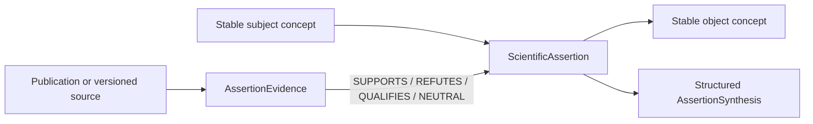

# Scientific Assertion Layer

## Scope

This layer turns the existing entity catalogue into a Scientific Knowledge Graph model without migrating any scientific data.

- An entity is a stable concept.
- A `ScientificAssertion` is a versioned scientific fact candidate.
- A `ScientificSource` is a versioned provenance record.
- `AssertionEvidence` records how a source supports, refutes, qualifies or neutrally documents an assertion.
- `AssertionSynthesis` exposes structured state only. It never generates narrative text.

The existing entities and relations remain unchanged until a separate, scientifically reviewed migration.

## Knowledge flow



A publication never becomes a direct scientific edge between two concepts in the new model. Its position is carried by one or more evidence records attached to an assertion.

## Fundamental records

### ScientificAssertion

The required contract contains:

- identity and proposition: `assertionId`, `subjectEntityId`, `predicate`, `objectEntityId`, `statement`;
- optional context facets: `context`, `population`, `clinicalContext`, `technicalContext`, `workflowContext`, `equipmentContext`, `softwareContext`, `sequenceContext`, `fieldStrength`, `contrastAgent`, `measurementMethod`;
- qualification: `limitations`, `confidence`, `evidenceLevel`;
- provenance indexes: `sourceIds`, `publicationIds`;
- lifecycle: `validFrom`, `validUntil`, `status`, `version`, `reviewer`, `createdAt`, `updatedAt`.

All context facets are nullable. When present, their internal shape and entity-family references are validated.

The generic `context` may also contain versioned alternatives combined with `ANY_OF` or `ALL_OF`. Each alternative keeps its manufacturer, software version, sequence, field strength and other facets together, avoiding an ambiguous Cartesian product of flat identifier lists.

### ScientificSource

Supported versioned source types are:

- `PrimarySource`;
- `SecondarySource`;
- `Guideline`;
- `Consensus`;
- `InternalValidation`;
- `ManufacturerDocumentation`.

A source may reference an existing Publication entity, but the source record retains its own type, version, lifecycle and provenance metadata.

### AssertionEvidence

An evidence record links exactly one source to one assertion and carries:

- stance: `SUPPORTS`, `REFUTES`, `QUALIFIES` or `NEUTRAL`;
- evidence level and confidence;
- optional evidence-specific context and limitations;
- reviewer, lifecycle status and version.

Every source and publication declared by an assertion must have a corresponding evidence record. This prevents a publication identifier from being interpreted as implicit support.

## Predicate registry

The registry includes the requested predicates and the additional predicates needed for explicit opposition and versioning. Each definition declares its category, symmetry, opposite predicate and cycle group when applicable.

Dependency predicates such as `DERIVED_FROM`, `REQUIRES`, `DEPENDS_ON`, `NORMALIZED_BY` and `QUANTIFIED_BY` share one acyclic dependency group. `SUPERSEDES` has its own acyclic version group. Mixed cycles are therefore detected.

`SUPPORTS` and `REFUTES` remain available as assertion predicates for concept-level propositions. A publication stance must nevertheless use `AssertionEvidence`, never a direct entity relation.

## Context model

The context registry defines eleven optional facets:

1. generic scope, inclusion and exclusion;
2. population;
3. clinical context;
4. technical context;
5. workflow, centre and protocol;
6. manufacturer, equipment, generation and options;
7. software versions, builds, options and licences;
8. sequences, families, implementations and parameter sets;
9. magnetic field strength in tesla;
10. contrast agent;
11. measurement method.

Common facets apply to the whole assertion. Context variants describe distinct compatible combinations, for example one manufacturer–software–sequence tuple and another alternative tuple.

References to existing entity families are checked. Centre, build, option, licence, implementation and parameter-set identifiers remain namespaced context identifiers until their own stable concept families are introduced by a separately scoped model change.

## Structured synthesis

For each assertion, the synthesis engine returns the following fields:

- `stateOfKnowledge`;
- `controversies`;
- `consensus`;
- `weakPoints`;
- `openQuestions`;
- `history`;
- `confidence`.

These fields contain statuses, identifiers and counts only. No clinical prose or recommendation is generated. A contradiction is present when active supporting and refuting evidence coexist, or when opposite predicates target the same concepts in the same context.

## Versioned registries

- `scientific-assertions`;
- `assertion-types`;
- `predicates`;
- `contexts`;
- `provenance`;
- `assertion-status`;
- `evidence-model`.

The registries are integrated into the existing Knowledge Graph registry surface. Their data collections are intentionally empty in this pass.

## Validation contract

The assertion validator detects:

- missing subject or object entities;
- absent or undeclared sources and publications;
- incomplete record shapes and invalid versions or dates;
- invalid context entity families;
- internal context contradictions;
- forbidden dependency and version cycles;
- opposing evidence and predicates;
- expired, superseded, obsolete or retracted assertions.

Orphans, missing provenance, invalid contexts and cycles are errors. Contradictions and obsolescence are preserved diagnostics: they remain queryable and are not deleted.

## Migration boundary

The current catalogue contains no `ScientificAssertion`, `ScientificSource` or `AssertionEvidence` record. Existing relations are migration candidates only.

During the next pass:

1. classify legacy relations;
2. create versioned source records from authoritative material;
3. convert eligible facts to `DRAFT` and `UNASSESSED` assertions;
4. attach evidence stances without inferring them from page wording;
5. obtain scientific review before activation;
6. move consumers to assertion syntheses before deprecating direct scientific relations.

## Verification commands

```text
npm run validate:scientific-assertions
npm run report:scientific-assertions
npm run validate:knowledge-graph
npm test -- --run
```
