# SKM-000 — Scientific Knowledge ──────────────────────────────────────────────────────────────────────────────
PD-003R1 — Scientific Model, Observability & Study Data Object Model Extension
Évolution normative coordonnée du Research Object Model
──────────────────────────────────────────────────────────────────────────────

Modèle recommandé :
GPT-5.6 Sol

Niveau de raisonnement :
Maximum

──────────────────────────────────────────────────────────────────────────────
NATURE DE LA MISSION
──────────────────────────────────────────────────────────────────────────────

Cette mission est une mission NORMATIVE.

Elle ne constitue pas :

- une implémentation OBS-001 ;
- une implémentation CDM-001 ;
- une modification de moteur ;
- une migration de données ;
- une création d'interface.

Elle doit arbitrer et, si l'arbitrage est positif,
faire évoluer explicitement le modèle métier canonique NOXIA.

La mission est motivée par :

SKM-000 — Scientific Knowledge Modeling Architecture

Décision SKM-000 :

SCIENTIFIC_KNOWLEDGE_MODEL_ARCHITECTURE_ACCEPTED_WITH_LIMITATIONS

Architecture recommandée :

Architecture D.

──────────────────────────────────────────────────────────────────────────────
GOUVERNANCE ABSOLUE
──────────────────────────────────────────────────────────────────────────────

Avant toute modification :

1. lire intégralement :

0. NOXIA — SOURCE-OF-TRUTH-INDEX.md

2. consulter dans cet ordre :

- NOXIA — Charte fondatrice ;
- NOXIA Protocol Designer — Scientific Product Manifesto ;
- Editorial Engine — Architecture Manifesto.

3. consulter ensuite :

- PD-003 — Research Object Model ;
- PD-004 ;
- PD-005 ;
- PD-009 ;
- PD-011 ;
- RDE-001 ;
- RDE-002 ;
- RDE-003 ;
- KE-001 ;
- ST-001 ;
- IMG-001 ;
- IMG-001B ;
- PRJ-001 ;
- VAL-000 ;
- SKM-000.

La hiérarchie documentaire doit être respectée strictement.

SKM-000 est :

NIVEAU_3 — candidat non admis.

Il ne peut donc pas
écraser silencieusement PD-003
ou le Scientific Product Manifesto.

──────────────────────────────────────────────────────────────────────────────
CONTRADICTION À ARBITRER EXPLICITEMENT
──────────────────────────────────────────────────────────────────────────────

Le Scientific Product Manifesto établit actuellement :

Phénomène biologique
↓
Biomarqueur = observable
↓
Modalité

et précise notamment que :

- les phénomènes biologiques ne sont pas directement observables ;
- ils doivent être approchés par des biomarqueurs ;
- les biomarqueurs représentent les observables ;
- les modalités permettent d'observer les biomarqueurs.

SKM-000 recommande une architecture plus fine :

Knowledge
↓
Scientific Model
↓
Observability & Measurement Model
↓
Research Project
↓
Canonical Study Data Model

avec distinction entre :

- Scientific Concept ;
- Scientific Model ;
- Observable Concept ;
- Biomarker ;
- Variable Definition ;
- Realized Observation.

Cette différence constitue
une évolution normative réelle.

Elle ne doit jamais être résolue silencieusement.

──────────────────────────────────────────────────────────────────────────────
PROBLÈME MÉTIER
──────────────────────────────────────────────────────────────────────────────

Les objets actuels sont insuffisamment précis
pour les moteurs futurs.

Exemple :

Fibrose myocardique

n'est pas :

ECV.

ECV peut être utilisé
comme biomarqueur de certains phénomènes
dans certains contextes.

Mais il existe un niveau conceptuel distinct :

la propriété ou le construit
que l'on cherche à observer ou estimer.

De même :

Variable d'étude

n'est pas :

valeur effectivement recueillie.

Une Variable peut être définie
sans qu'aucune observation correspondante
n'existe encore.

Enfin :

un mécanisme scientifique candidat

n'est pas :

une assertion Knowledge

ni :

une vérité scientifique universelle.

──────────────────────────────────────────────────────────────────────────────
MISSION
──────────────────────────────────────────────────────────────────────────────

Arbitrer les extensions nécessaires
au Research Object Model afin de permettre
sans duplication :

1. Scientific Models ;

2. Observable Concepts ;

3. Observation / Measurement Methods ;

4. Data Needs ;

5. Variable Definitions ;

6. Realized Observations ;

tout en préservant :

- Phénomène biologique ;
- Phénotype ;
- Biomarqueur ;
- Modalité ;
- Acquisition ;
- Procédure de lecture ;
- Analyse ;
- Critère de jugement ;
- connaissances ;
- preuves ;
- décisions ;
- inconnues ;
- contradictions.

──────────────────────────────────────────────────────────────────────────────
PRINCIPE DE COMPATIBILITÉ
──────────────────────────────────────────────────────────────────────────────

L'objectif n'est PAS
de remplacer les objets existants.

Il faut déterminer
si chaque besoin nouveau doit devenir :

A. un nouvel objet canonique ;

B. un rôle d'un objet existant ;

C. une relation canonique ;

D. une projection/contextualisation ;

E. aucun nouvel objet.

Privilégier la solution
la moins inflationniste
compatible avec la séparation réelle
des responsabilités.

La Charte interdit
les abstractions inutiles.

──────────────────────────────────────────────────────────────────────────────
ARBITRAGE 1 — SCIENTIFIC MODEL
──────────────────────────────────────────────────────────────────────────────

Déterminer si Scientific Model
doit devenir :

- un objet canonique ;
- un agrégat ;
- une projection runtime ;
- ou une responsabilité de Scientific Thinking.

Il doit pouvoir représenter :

- éléments scientifiques référencés ;
- rôles ;
- relations ;
- temporalité ;
- mécanismes ;
- alternatives ;
- hypothèses ;
- contradictions ;
- domaine de validité ;
- versions ;
- provenance.

Mais il ne doit jamais :

- recopier les preuves Knowledge ;
- remplacer le Knowledge Graph ;
- augmenter le niveau de preuve ;
- devenir automatiquement une vérité universelle.

──────────────────────────────────────────────────────────────────────────────
ARBITRAGE 2 — OBSERVABLE CONCEPT
──────────────────────────────────────────────────────────────────────────────

Déterminer si Observable Concept
doit devenir un objet canonique distinct.

Question centrale :

Comment distinguer précisément :

Phénomène biologique

Biomarqueur

Observable Concept

Variable d'étude ?

Tester notamment la proposition :

Phénomène
=
processus/état scientifique étudié.

Observable Concept
=
propriété/construit susceptible
d'être observé ou estimé.

Biomarqueur
=
usage contextualisé et soutenu
d'un observable comme indicateur
d'un phénomène, d'un état ou d'une réponse.

Variable
=
opérationnalisation adoptée
dans un Research Project.

Cette proposition est candidate.

Ne pas l'admettre automatiquement.

──────────────────────────────────────────────────────────────────────────────
ARBITRAGE 3 — BIOMARQUEUR
──────────────────────────────────────────────────────────────────────────────

Le Scientific Product Manifesto définit actuellement
le biomarqueur comme observable.

Deux options doivent être comparées :

OPTION A

Conserver Biomarker comme objet observable canonique
et représenter Observable Concept
comme rôle/relation supplémentaire.

OPTION B

Distinguer :

Observable Concept
et
Biomarker Role.

Dans ce cas,
un même Observable Concept
peut :

- ne pas être biomarqueur ;
- être biomarqueur pour un phénomène ;
- être biomarqueur pour plusieurs phénomènes ;
- avoir des domaines de validité différents.

Évaluer la compatibilité
avec le manifeste et PD-003.

Si OPTION B est retenue,
identifier explicitement
la modification normative nécessaire
du Scientific Product Manifesto.

Ne jamais modifier silencieusement
sa philosophie.

──────────────────────────────────────────────────────────────────────────────
ARBITRAGE 4 — DATA NEED
──────────────────────────────────────────────────────────────────────────────

Déterminer la nature de :

Data Need.

Proposition SKM-000 :

Data Need appartient
au Research Project / Study Design.

Il représente :

une information dont le projet a besoin
pour répondre à :

- une question ;
- un objectif ;
- une hypothèse ;
- un endpoint ;
- une analyse ;
- une exigence ;
- un besoin opérationnel.

Il ne constitue :

ni une connaissance générale ;

ni une Variable automatiquement créée.

Déterminer s'il doit devenir :

objet

relation

ou sous-ressource Project.

──────────────────────────────────────────────────────────────────────────────
ARBITRAGE 5 — VARIABLE DEFINITION
──────────────────────────────────────────────────────────────────────────────

PD-003 possède déjà :

Variable d'étude.

Ne pas créer automatiquement
un nouvel objet VariableDefinition.

Déterminer si l'objet existant
peut être précisé pour porter :

- identité canonique de projet ;
- Observable Concept ;
- rôle scientifique ;
- endpoint ;
- source ;
- méthode ;
- temporalité ;
- unité ;
- type ;
- domaine ;
- qualité attendue ;
- missingness ;
- provenance ;
- usages analytiques ;
- version.

Important :

une Variable
reste une définition du projet.

Elle n'est pas
une valeur individuelle observée.

──────────────────────────────────────────────────────────────────────────────
ARBITRAGE 6 — REALIZED OBSERVATION
──────────────────────────────────────────────────────────────────────────────

Déterminer l'objet canonique
nécessaire pour représenter
une réalisation d'une Variable.

Le terme :

Observation

est actuellement ambigu
dans NOXIA.

Il peut désigner :

- constat utilisateur ;
- observation scientifique ;
- occasion temporelle ;
- valeur réalisée.

Ne pas introduire
le terme générique Observation
sans qualification.

Comparer des noms comme :

RealizedObservation

ObservedValue

VariableOccurrence

MeasurementRecord

StudyObservation

ou autre terme plus approprié.

L'objet cible doit pouvoir distinguer :

Variable definition

vs

realized occurrence.

──────────────────────────────────────────────────────────────────────────────
ARBITRAGE 7 — TEMPS
──────────────────────────────────────────────────────────────────────────────

Déterminer la séparation entre :

Visit

Timepoint

Observation Occasion

Acquisition Time

Collection Time

Analysis Time.

Une Variable
peut être attendue :

à plusieurs occasions.

Une même Variable canonique
ne doit pas être recréée
simplement parce qu'elle est répétée.

Exemple conceptuel :

TROPONIN

peut produire :

T0

H6

H12

H24

sans devenir
quatre concepts scientifiques indépendants.

Déterminer les responsabilités
entre Project et futur CDM.

──────────────────────────────────────────────────────────────────────────────
ARBITRAGE 8 — SOURCES
──────────────────────────────────────────────────────────────────────────────

Le modèle doit permettre de distinguer :

STUDY_MANDATED

ROUTINE_CARE

HISTORICAL

EXTERNAL_DATA

REGISTRY

BIOBANK

WEARABLE

IMAGING

LABORATORY

DERIVED

OTHER.

Mais cette liste
ne doit pas être admise automatiquement.

Déterminer :

- quelle couche possède la taxonomie ;
- quelles valeurs sont génériques ;
- lesquelles appartiennent aux domaines spécialisés.

Une donnée de routine
ne doit jamais devenir
une procédure d'étude
par simple consommation.

──────────────────────────────────────────────────────────────────────────────
ARBITRAGE 9 — BIOSPECIMEN
──────────────────────────────────────────────────────────────────────────────

Déterminer si :

Biospecimen

est :

- un objet canonique ;
- une source ;
- une ressource spécialisée ;
- ou un futur domaine indépendant.

Évaluer au minimum :

Blood

Plasma

Serum

Urine

Stool

DNA

RNA

Biopsy

Aliquot.

Ne pas assimiler :

Specimen

et

Variable.

Une fécothèque
n'est pas une Variable.

──────────────────────────────────────────────────────────────────────────────
ARBITRAGE 10 — ANALYSIS
──────────────────────────────────────────────────────────────────────────────

PD-003 possède déjà :

Analyse.

SKM-000 constate
une ambiguïté entre :

- lecture/mesure Imaging ;
- transformation Data Management ;
- analyse statistique ;
- résultat ;
- interprétation.

Déterminer si :

Analyse

reste un type générique
avec sous-types/owners,

ou si le modèle métier
doit séparer explicitement
plusieurs objets.

Ne pas implémenter Biostatistics.

──────────────────────────────────────────────────────────────────────────────
ARBITRAGE 11 — CANONICAL VARIABLE IDENTITY
──────────────────────────────────────────────────────────────────────────────

Décider explicitement le principe :

une seule identité de Variable
à travers :

Research Project

CRF

Data Dictionary

Biostatistics

SAP

Analysis Dataset

Exports

Documents

Reports.

Une projection peut utiliser
un autre label ou alias.

Mais elle ne doit jamais
créer une seconde identité sémantique.

Déterminer :

variableId

canonicalName

displayLabel

aliases

terminologyMappings.

──────────────────────────────────────────────────────────────────────────────
ARBITRAGE 12 — STANDARDS EXTERNES
──────────────────────────────────────────────────────────────────────────────

Déterminer la philosophie normative
des mappings vers :

CDISC

FHIR

OMOP

LOINC

SNOMED CT

MedDRA

et autres terminologies futures.

Principe candidat :

NOXIA possède son modèle métier interne.

Les standards externes sont
des mappings/projections versionnés.

Ils ne doivent pas
dicter silencieusement
le raisonnement scientifique.

Arbitrer explicitement.

Ne créer aucun mapping réel
dans cette mission.

──────────────────────────────────────────────────────────────────────────────
ARCHITECTURE D À VALIDER
──────────────────────────────────────────────────────────────────────────────

Évaluer formellement :

Knowledge
        ↓
Scientific Model
        ↓
Observability & Measurement
        ↓
Research Project
        ↓
Canonical Study Data Model
        ↓
Data Management / Imaging / Biostatistics

La chaîne n'est pas
une chaîne de propriété.

Chaque frontière transmet :

références

versions

provenance

statuts

unknowns

contradictions.

Chaque owner reste distinct.

──────────────────────────────────────────────────────────────────────────────
CAS CONCEPTUELS OBLIGATOIRES
──────────────────────────────────────────────────────────────────────────────

Tester la cohérence du modèle
avec au minimum six cas.

CAS A — Infarctus + imagerie

Projet évaluant l'infarctus
avec XA et/ou IRM.

Vérifier :

phenomenon

observable

biomarker

modality

variable

observation réalisée.

CAS B — Routine care echocardiography

Le projet souhaite réutiliser
une échographie faite en soin courant.

Vérifier :

routine care ≠ study mandated.

CAS C — Biologie

Biomarqueurs sanguins d'infarctus.

Vérifier :

observable

biomarker role

laboratory method

variable definition

repeated measurements.

CAS D — Fécothèque

Création d'une collection de selles
pour analyses futures.

Vérifier :

biospecimen ≠ variable

collection ≠ observation réalisée

future analysis ≠ analysis selected.

CAS E — Non-imagerie

Étude clinique ou biologique
sans imagerie.

Vérifier que l'architecture
ne dépend pas d'Imaging.

CAS F — Variable commune CRF / Biostatistics

Une même Variable
est :

collectée dans un CRF

puis utilisée dans un SAP.

Vérifier :

une seule identité canonique.

──────────────────────────────────────────────────────────────────────────────
CROSSWALK PD-003
──────────────────────────────────────────────────────────────────────────────

Créer un crosswalk exhaustif :

objet PD-003 actuel

→

objet/rôle/relation cible

avec statuts :

UNCHANGED

CLARIFIED

SPECIALIZED

NEW_OBJECT_REQUIRED

NEW_RELATION_REQUIRED

DEPRECATED_TERM

AMBIGUOUS_REQUIRES_ARBITRATION.

Aucune identité existante
ne doit être supprimée silencieusement.

──────────────────────────────────────────────────────────────────────────────
MIGRATION CONCEPTUELLE
──────────────────────────────────────────────────────────────────────────────

Si de nouveaux objets
sont admis :

définir :

- compatibility rules ;
- versioning ;
- supersedes ;
- legacy interpretation ;
- migration boundary ;
- forbidden implicit conversions.

Pas de migration de données réelle.

──────────────────────────────────────────────────────────────────────────────
CONTRATS NORMATIFS
──────────────────────────────────────────────────────────────────────────────

Créer une série de contrats
au minimum :

PD003R1-C01
Knowledge unit is not a Scientific Model.

PD003R1-C02
Scientific Model references Knowledge.

PD003R1-C03
Phenomenon is not its observable.

PD003R1-C04
Observable is not automatically a Biomarker.

PD003R1-C05
Biomarker validity is contextual.

PD003R1-C06
Observable is not a Variable.

PD003R1-C07
Variable belongs to a Project context.

PD003R1-C08
Variable definition is not realized data.

PD003R1-C09
Routine Care does not become Study Mandated silently.

PD003R1-C10
Specimen is not Variable.

PD003R1-C11
One Variable identity across projections.

PD003R1-C12
CDM represents data; it does not own scientific truth.

PD003R1-C13
Analysis owner remains specialized.

PD003R1-C14
Unknown and contradiction survive every boundary.

PD003R1-C15
External standards map to NOXIA objects;
they do not replace NOXIA scientific reasoning.

──────────────────────────────────────────────────────────────────────────────
DOCUMENTS À PRODUIRE / MODIFIER
──────────────────────────────────────────────────────────────────────────────

Si et seulement si
l'arbitrage conclut que l'architecture
est compatible avec les autorités supérieures :

faire évoluer explicitement :

docs/pd-003-research-object-model.md

vers une nouvelle version normative.

Créer également :

docs/pd-003r1-scientific-model-observability-data-extension-report.md

Le rapport doit expliquer précisément :

- ce qui change ;
- ce qui ne change pas ;
- les contradictions ;
- les arbitrages ;
- les impacts ;
- le crosswalk ;
- la compatibilité historique.

──────────────────────────────────────────────────────────────────────────────
SCIENTIFIC PRODUCT MANIFESTO
──────────────────────────────────────────────────────────────────────────────

ATTENTION.

Le Scientific Product Manifesto
est supérieur à PD-003.

Si l'arbitrage retenu
nécessite de modifier réellement
la philosophie :

Biomarqueur = observable

alors :

NE PAS modifier silencieusement le manifeste.

Identifier explicitement :

MANIFESTO_EVOLUTION_REQUIRED.

Dans ce cas :

préparer précisément
la modification nécessaire,

mais STOPPER
avant toute modification du manifeste
si la mission ne possède pas
un mandat explicite suffisant.

Conclure alors :

PD003R1_REQUIRES_MANIFESTO_ARBITRATION.

──────────────────────────────────────────────────────────────────────────────
SOURCE-OF-TRUTH-INDEX
──────────────────────────────────────────────────────────────────────────────

Si PD-003 évolue normativement
et si cette évolution est compatible
avec les autorités supérieures :

mettre à jour
SOURCE-OF-TRUTH-INDEX

dans LA MÊME opération documentaire.

L'index doit enregistrer :

- nouvelle version ;
- source maîtresse ;
- statut ;
- niveau ;
- supersession ;
- dépendances ;
- documents consommateurs.

Ne jamais créer
une autorité normative
sans l'inscrire dans la gouvernance.

──────────────────────────────────────────────────────────────────────────────
NON-IMPLÉMENTATION
──────────────────────────────────────────────────────────────────────────────

Ne créer :

aucun moteur Scientific Model.

Aucun OBS.

Aucun CDM.

Aucune API.

Aucun type TypeScript produit.

Aucun schéma runtime.

Aucune migration.

Aucune UI.

Cette mission est uniquement :

arbitrage

+

modèle métier normatif.

──────────────────────────────────────────────────────────────────────────────
IMPACTS À DOCUMENTER
──────────────────────────────────────────────────────────────────────────────

Évaluer explicitement les impacts sur :

Knowledge

Scientific Thinking

Imaging

Research Project

REG-001

DOC-002

TMP-001

DOC-001B

VAL-000

futur OBS

futur CDM

futur Data Management

futur Biostatistics.

Aucun moteur existant
ne doit être modifié.

──────────────────────────────────────────────────────────────────────────────
VALIDATIONS
──────────────────────────────────────────────────────────────────────────────

Vérifier :

- cohérence documentaire ;
- liens ;
- versions ;
- références ;
- absence de duplication ;
- absence de contradiction silencieuse ;
- crosswalk complet ;
- six cas conceptuels ;
- invariants ;
- SOURCE-OF-TRUTH-INDEX si modifié ;
- git diff --check.

Aucun test logiciel
n'est requis
sauf contrôle documentaire existant
si disponible.

──────────────────────────────────────────────────────────────────────────────
RAPPORT
──────────────────────────────────────────────────────────────────────────────

Créer :

docs/pd-003r1-scientific-model-observability-data-extension-report.md

Inclure au minimum :

1. décision ;
2. autorités ;
3. contradiction initiale ;
4. justification du besoin ;
5. Architecture D ;
6. Scientific Model ;
7. Observable Concept ;
8. Biomarker ;
9. Data Need ;
10. Variable ;
11. Realized Observation ;
12. temporalité ;
13. sources ;
14. biospecimens ;
15. analysis ;
16. variable identity ;
17. standards externes ;
18. crosswalk PD-003 ;
19. six cas conceptuels ;
20. contrats normatifs ;
21. compatibility ;
22. migration conceptuelle ;
23. impacts moteurs ;
24. impacts OBS ;
25. impacts CDM ;
26. impacts Biostatistics/Data Management ;
27. contradictions restantes ;
28. évolution éventuelle du manifeste ;
29. gouvernance / index ;
30. limitations ;
31. décision finale.

──────────────────────────────────────────────────────────────────────────────
DÉCISION FINALE
──────────────────────────────────────────────────────────────────────────────

Conclure uniquement par l'un des états :

PD003R1_OBJECT_MODEL_EXTENSION_ADMITTED

ou

PD003R1_OBJECT_MODEL_EXTENSION_ADMITTED_WITH_LIMITATIONS

ou

PD003R1_REQUIRES_MANIFESTO_ARBITRATION

ou

PD003R1_OBJECT_MODEL_EXTENSION_NOT_READY

OBS-001 reste interdit
tant que l'extension normative
n'est pas admise.

CDM-001 reste interdit
tant que les frontières
Variable / Realized Observation
ne sont pas admises.

Aucun commit.

Aucun push.

Aucun déploiement.Modeling Architecture

## Architecture scientifique reliant Knowledge, Scientific Models, Observable Concepts et Canonical Study Data Model

| Champ | Valeur |
|---|---|
| Nature | rapport d’architecture cible |
| Niveau documentaire | `NIVEAU_3` — candidat non admis |
| Version | 1.0 |
| Date | 11 août 2026 |
| Source maîtresse | présent fichier Markdown |
| Périmètre | séparation des responsabilités scientifiques avant OBS-001 et CDM-001 |
| Autorité scientifique créée | aucune |
| Autorité normative modifiée | aucune |
| Moteur, objet, API ou code créé | aucun |
| PASS PD-011 revendiqué | aucun |

## 1. Décision d’architecture

L’architecture recommandée est une **architecture D à cinq plans et une frontière humaine de contextualisation** :

```text
Knowledge
    ↓ fournit concepts, assertions, relations prouvées et limites
Scientific Models
    ↓ organisent une explication versionnée et réfutable
Observability & Measurement Models
    ↓ définissent ce qui peut être observé et par quels principes
Research Project + décisions humaines
    ↓ contextualisent et adoptent les besoins de données
Canonical Study Data Model
    ↓ représente les définitions de variables et les observations réalisées
Data Management / Imaging / Biostatistics / systèmes sources
```

Cette chaîne n’est pas une chaîne de propriété descendante. Chaque plan conserve son autorité propre et transmet des références qualifiées au plan suivant. Aucun plan aval ne réécrit le plan amont.

La décision répond aux questions centrales :

- **Knowledge s’arrête** à la connaissance gouvernée : concepts, terminologie, assertions, relations scientifiques, preuves, provenance, applicabilité, limites, contradictions et lacunes.
- **Scientific Model commence** lorsqu’un ensemble de connaissances est organisé en une représentation explicative cohérente : entités, états, processus, mécanismes, relations causales ou temporelles proposées, alternatives et hypothèses de modèle.
- **Les processus physiopathologiques ont une propriété partagée mais non concurrente** : leur identité, leur définition et les assertions qui les concernent appartiennent à Knowledge ; leur rôle, leur enchaînement et leur structure dans une explication appartiennent au Scientific Model.
- **Observable Concepts appartiennent au plan d’observabilité**, distinct de Knowledge, du modèle explicatif et des données. Ils décrivent ce qui peut être observé ou estimé, sans constituer une valeur, une variable d’étude ou une observation réalisée.
- **Une Variable est une projection contextualisée** d’un besoin scientifique et d’un concept observable dans un Research Project. Elle n’est pas un Observable Concept universel.
- **Une Observation est une réalisation indépendante** d’une définition de variable pour une unité, un temps, une méthode et un contexte donnés. Elle ne doit pas être réduite à « une Variable avec une valeur ».
- **Les Data Needs appartiennent au Research Project**, sous cohérence du Study Design et décision humaine. Ils sont motivés par les objectifs, hypothèses, Scientific Models, critères et analyses ; Knowledge ne les décide pas.
- **Les méthodes d’observation sont réparties par responsabilité** : Knowledge gouverne les connaissances et preuves qui les décrivent ; le plan d’observabilité gouverne leur signification de mesure et leur relation aux Observable Concepts ; les moteurs spécialisés proposent leur usage dans un projet ; le CDM n’en conserve que la référence applicable et la provenance.
- **Les analyses restent la responsabilité des domaines spécialisés** : Imaging pour la lecture et la mesure d’image, Biostatistics pour l’inférence et le dimensionnement, Data Management pour les transformations et l’intégrité. Le Research Project conserve les décisions adoptées ; le CDM représente entrées, sorties et lignage sans choisir ni interpréter la méthode.

Cette architecture est acceptée **avec limitations** : PD-003 possède déjà les objets `Phénomène biologique`, `Biomarqueur`, `Variable d’étude` et `Analyse` ; aucun objet `Scientific Model`, `Observable Concept` ou `Observation réalisée` n’est actuellement admis comme objet canonique distinct. SKM-000 ne peut pas modifier cette autorité. OBS-001 et CDM-001 doivent donc rester suspendus jusqu’à un arbitrage humain et une évolution normative coordonnée.

## 2. Gouvernance et ordre de consultation

Le `SOURCE-OF-TRUTH-INDEX` a été consulté en premier comme routeur documentaire. La consultation a ensuite suivi l’ordre imposé :

1. Charte fondatrice ;
2. Scientific Product Manifesto ;
3. Editorial Engine Architecture Manifesto ;
4. PD-003 ;
5. PD-004 ;
6. PD-005 ;
7. PD-009 ;
8. PD-011 ;
9. RDE-001 ;
10. RDE-002 ;
11. RDE-003 ;
12. KE-001 ;
13. ST-001 ;
14. IMG-001 ;
15. IMG-001B ;
16. PRJ-001 ;
17. REG-001 ;
18. DOC-002 ;
19. TMP-001 ;
20. DOC-001B ;
21. VAL-000.

Le Scientific Knowledge Graph documentaire et P4 ont été consultés en complément, après les autorités imposées, uniquement pour identifier les usages actuels du terme `Observation`. Ils ne sont pas utilisés pour contourner PD-003 ou KE-001.

## 3. Plans de vérité

| Plan | Contenu retenu | Statut dans SKM-000 |
|---|---|---|
| Principes établis | science avant technique, contexte constitutif de la connaissance, responsabilité humaine, inconnues visibles, traçabilité, reproductibilité | invariants supérieurs |
| Références normatives | PD-003/004/005/009/011, RDE-001/002/003, KE-001 | autorité sur les objets, responsabilités, décisions et preuves |
| Corpus scientifiques | aucun corpus modifié ; assertions et modèles médicaux non produits | sources potentielles, hors écriture |
| Cible | séparation Knowledge → Model → Observability → Project → CDM | recommandation d’architecture |
| État réellement implémenté | moteurs V1 bornés et rapports de niveau 3 ; VAL-000 dans un worktree séparé | preuve de surfaces existantes, jamais norme |
| Hypothèses | existence future de responsabilités Scientific Model, OBS et CDM distinctes | à valider avant toute admission |

## 4. Problème exact

L’ambiguïté ne porte pas seulement sur l’emplacement d’un terme. Elle porte sur le passage entre quatre natures de vérité :

1. ce que la littérature et les corpus permettent d’affirmer ;
2. la manière dont ces connaissances sont organisées pour expliquer un phénomène ;
3. la manière dont un phénomène peut être approché par une observation ;
4. la manière dont une étude prévoit, recueille et analyse des données.

Si ces natures sont fusionnées, une relation sourcée peut être prise pour un modèle causal complet, un biomarqueur pour le phénomène qu’il approche, une définition de mesure pour une variable de projet, ou une variable pour une donnée effectivement observée.

La chaîne fournie dans la mission — `Infarctus → Occlusion → Ischémie → Nécrose → Inflammation → Remodelage` — illustre ce risque. Les termes et les assertions documentées qui les relient relèvent de Knowledge. Le choix de les organiser dans cet ordre, dans un contexte et avec une sémantique causale ou temporelle déterminée, relève d’un modèle scientifique. Leur observabilité relève d’un autre contrat. Les valeurs obtenues dans une étude relèvent encore d’un autre plan.

## 5. Responsabilités actuellement établies

| Surface actuelle | Responsabilité établie | Limite opposable |
|---|---|---|
| PD-003 | vocabulaire métier canonique ; `Phénomène biologique`, `Biomarqueur`, `Variable d’étude`, `Acquisition`, `Procédure de lecture`, `Analyse`, connaissances et preuves | aucune nouvelle ontologie ne peut être créée silencieusement |
| KE-001 | résolution contextualisée des concepts, assertions, preuves, contradictions, applicabilité, lacunes et synthèse runtime | ne construit ni Question, ni Hypothèse, ni modèle explicatif de projet ; ne choisit pas la mesure |
| Scientific Thinking | propose Question, Objectifs, Hypothèses et mécanismes candidats | les mécanismes runtime portent `NO_NEW_ONTOLOGY` et restent candidats |
| Imaging | propose phénomènes, biomarqueurs, modalités, acquisitions, Variables, lecture et mesure d’imagerie | ne possède ni les corpus, ni les données réelles, ni l’analyse statistique |
| Study Design / Research Project | maintient la cohérence de la stratégie, des critères, Variables, besoins d’analyse et décisions adoptées | ne remplace pas les domaines spécialisés ; l’arbitrage engageant reste humain |
| Data Management cible | propose structure, qualité, flux, provenance et intégrité des données | non implémenté comme moteur autonome dans les autorités consultées |
| Biostatistics cible | propose estimands, analyses, dimensionnement et sensibilités | non implémenté comme moteur autonome dans les autorités consultées |
| REG-001 | qualifie les exigences applicables à partir de faits Project | ne devient ni modèle scientifique ni source de données |
| DOC-002 / TMP-001 / DOC-001B | patterns documentaires, structure logique et projection fidèle | ne possèdent aucune science ou donnée de projet |
| VAL-000 | diagnostics de fidélité entre transformations structurées | ne décide pas ce qui est scientifiquement vrai et ne corrige rien |

## 6. Ambiguïtés identifiées

### 6.1 Knowledge contient déjà des concepts et relations

Le Scientific Product Manifesto attribue au Knowledge Graph les concepts, relations, assertions, preuves, contextes, limites et contradictions. KE-001 confirme cette responsabilité. Créer un Scientific Model qui recopierait ces éléments créerait un Knowledge Graph parallèle.

La séparation recevable est donc la suivante : **Knowledge possède les unités épistémiques ; Scientific Model possède leur composition explicative**. Le modèle référence les unités Knowledge et leur version. Il ne duplique ni leurs preuves, ni leur statut, ni leur domaine de validité.

### 6.2 PD-003 possède déjà le Phénomène biologique

PD-003 définit le Phénomène biologique comme objet canonique du raisonnement. RDE-001 attribue à Scientific Thinking les mécanismes candidats et à Imaging les propositions de phénomènes et de mesure. SKM-000 ne remplace pas cet ownership.

Dans l’architecture cible, un phénomène existant peut jouer le rôle de composant d’un Scientific Model. Ce rôle cible ne change pas son identité canonique tant qu’une évolution normative ne l’a pas décidé.

### 6.3 Biomarqueur et Observable Concept peuvent se dupliquer

PD-003 définit le Biomarqueur comme indicateur mesurable approchant un phénomène. Le Manifesto le décrit comme observable. Introduire un Observable Concept avec la même définition créerait un doublon.

La distinction recommandée est :

- l’**Observable Concept** désigne la propriété ou le construit susceptible d’être observé ou estimé, indépendamment de son usage comme indicateur ;
- le **Biomarqueur** désigne l’usage contextualisé et soutenu par des preuves d’un observable pour informer un phénomène, un état ou une réponse.

Ainsi, un Observable Concept n’est pas automatiquement un biomarqueur et un biomarqueur ne vaut jamais preuve directe du phénomène.

### 6.4 Le terme Observation porte plusieurs sens incompatibles

Les documents et surfaces actuels emploient `Observation` pour au moins quatre sens :

1. une intuition ou un constat initial de l’utilisateur ;
2. un concept documentaire de mesure dans le Scientific Knowledge Graph ;
3. un temps ou une occasion d’observation dans le plan d’étude ;
4. une future valeur réalisée pour une unité étudiée.

Cette homonymie est bloquante pour CDM-001. Aucun contrat futur ne doit employer `Observation` seul sans qualifier le sens. SKM-000 recommande les expressions non canoniques de travail suivantes : **constat initial**, **concept observable**, **occasion d’observation** et **observation réalisée**. Ces expressions clarifient le rapport ; elles ne créent pas d’objets PD-003.

### 6.5 Variable et donnée sont aujourd’hui proches

PD-003 décrit la Variable comme une donnée conceptuelle attendue, observée ou dérivée. PRJ-001 la projette comme définition reliée aux objectifs, critères, temps, qualité et analyses. Cette définition couvre donc le plan d’étude, mais pas encore la distinction complète entre définition et occurrence.

CDM-001 devra séparer la **définition de variable** de l’**observation réalisée**. Sans cette séparation, le cycle de vie, la provenance, le statut de qualité, la non-évaluabilité et les répétitions ne peuvent pas être représentés sans ambiguïté.

### 6.6 Analyse désigne plusieurs responsabilités

L’analyse peut désigner une lecture d’image, une transformation de donnée, une analyse statistique, son exécution, un résultat ou son interprétation. RDE-001 et RDE-003 séparent déjà Imaging, Data Management et Biostatistics. CDM-001 ne doit pas réunifier ces responsabilités sous un objet générique propriétaire de tout.

## 7. Définitions de travail

Les définitions suivantes servent uniquement à comparer les architectures. Elles ne constituent ni objets canoniques, ni schémas, ni décisions d’admission.

| Terme de travail | Définition | N’est pas |
|---|---|---|
| Knowledge unit | concept, assertion, relation, preuve, limite, controverse ou domaine de validité gouverné | modèle explicatif complet |
| Scientific Model | composition versionnée d’éléments scientifiques avec rôles, relations, hypothèses, temporalité, alternatives et portée | copie du Knowledge Graph ; vérité certaine |
| Model element | entité, état, processus, mécanisme ou transition jouant un rôle dans un modèle | nouvelle identité automatique si le concept existe déjà dans Knowledge |
| Observable Concept | propriété ou construit qu’une méthode pourrait observer, estimer ou classer | variable d’étude ; valeur ; biomarqueur automatiquement valide |
| Observation Method | principe ou méthode reliant un Observable Concept à une production de mesure ou de catégorie | choix de projet déjà adopté ; donnée réalisée |
| Variable definition | opérationnalisation adoptée pour un projet : rôle, source, méthode, temps, unité ou domaine de valeurs, qualité et usages | Observable Concept universel ; observation individuelle |
| Observation réalisée | occurrence contextualisée produite selon une définition de variable, avec unité étudiée, temps, méthode, valeur ou statut, qualité et provenance | variable elle-même ; interprétation scientifique |
| Data Need | besoin de données motivé par une Question, un Objectif, une Hypothèse, un Critère ou une Analyse du projet | connaissance générale ; variable créée automatiquement |
| Analysis specification | méthode prévue pour transformer ou comparer des entrées afin d’examiner une question définie | résultat ; interprétation humaine ; responsabilité du CDM |

## 8. Architecture A — Knowledge → Observable Concepts → Variables

### Responsabilités

Knowledge porterait concepts, assertions et processus. OBS traduirait directement les concepts en observables, puis en Variables.

### Avantages

- chaîne courte et facile à expliquer ;
- peu de nouveaux domaines conceptuels ;
- intégration apparemment simple avec KE-001 et PD-003.

### Inconvénients

- aucune place explicite pour une composition mécanistique ou causale ;
- risque de faire d’une relation Knowledge un modèle scientifique complet ;
- Observable Concept tend à fusionner phénomène, biomarqueur et mesure ;
- Variable semble découler universellement de la connaissance, sans décision de projet.

### Risques

- duplication dans Knowledge des modèles construits par Scientific Thinking ;
- perte des modèles concurrents ;
- création trop précoce de Variables ;
- transfert silencieux de l’ownership du Research Project vers OBS.

### Compatibilité

Elle est compatible en surface avec KE et IMG mais faible avec Scientific Thinking, Study Design, PRJ, Data Management et Biostatistics. Elle ne fournit pas une frontière suffisante pour CDM-001.

### Décision

**Architecture rejetée.** Sa simplicité supprime une responsabilité scientifique nécessaire.

## 9. Architecture B — Knowledge → Scientific Models → Observable Concepts → Variables

### Responsabilités

Knowledge fournit les unités épistémiques. Scientific Models organisent les phénomènes et mécanismes. OBS définit les concepts observables. Les Variables en dérivent.

### Avantages

- sépare connaissance atomique et explication ;
- représente modèles concurrents, temporalité et mécanismes ;
- aligne Scientific Thinking avec une responsabilité explicite ;
- évite que Knowledge soit propriétaire des choix de modèle.

### Inconvénients

- la frontière entre Observable Concept, Biomarqueur et méthode reste insuffisante ;
- la Variable continue d’apparaître comme une conséquence universelle de l’observable ;
- la décision de projet n’est pas placée dans la chaîne ;
- l’Observation réalisée reste absente.

### Risques

- duplication entre Scientific Model et Knowledge si les références ne sont pas strictes ;
- OBS pourrait absorber Imaging ;
- un catalogue de Variables universelles pourrait apparaître avant CDM.

### Compatibilité

Bonne avec KE, Scientific Thinking et IMG ; moyenne avec PRJ, Data Management, Biostatistics et CDM ; neutre avec REG, TMP, DOC et VAL.

### Décision

**Architecture non retenue comme cible finale.** Elle apporte la bonne séparation explicative mais s’arrête avant la frontière projet-donnée.

## 10. Architecture C — Knowledge → Scientific Models → Observation Models → Variables

### Responsabilités

L’Observation Model décrit l’observabilité, les méthodes, conditions et relations de mesure entre Scientific Model et Variables.

### Avantages

- sépare modèle explicatif et modèle de mesure ;
- permet plusieurs méthodes pour un même observable ;
- rend explicites limites, facteurs de confusion et non-observabilité ;
- offre une bonne base conceptuelle à OBS-001.

### Inconvénients

- le terme `Observation Model` reste ambigu avec les observations réalisées ;
- la Variable semble encore créée avant la décision de projet ;
- le Research Project n’est pas représenté comme frontière d’adoption ;
- la distinction entre définition de variable et observation réalisée reste incomplète.

### Risques

- OBS pourrait devenir une seconde ontologie de Knowledge ;
- le modèle de mesure pourrait contenir des choix propres à un projet ;
- CDM pourrait absorber l’observabilité pour combler la frontière manquante.

### Compatibilité

Forte avec KE, Scientific Thinking et IMG ; bonne avec PRJ et Data Management ; encore incomplète pour Biostatistics et CDM.

### Décision

**Architecture retenue comme base, mais insuffisante seule.** Elle doit recevoir une frontière Research Project et une séparation définition–réalisation.

## 11. Architecture D — cible recommandée

### 11.1 Principe

Architecture D prolonge C en ajoutant deux frontières absentes :

1. une **frontière de contextualisation et de décision du Research Project** entre observabilité et Variable ;
2. une **frontière définition–réalisation** à l’intérieur du futur CDM.

### 11.2 Chaîne cible

```mermaid
flowchart LR
    K["Knowledge<br/>concepts, assertions, preuves"]
    SM["Scientific Models<br/>processus, mécanismes, alternatives"]
    OM["Observability & Measurement Models<br/>concepts observables, méthodes, limites"]
    RP["Research Project<br/>Data Needs et décisions humaines"]
    VD["CDM — définitions de variables"]
    OR["CDM — observations réalisées"]
    AN["Analyses spécialisées"]

    K -->|"références qualifiées"| SM
    K -->|"preuves de mesure"| OM
    SM -->|"éléments à rendre observables"| OM
    OM -->|"opérationnalisations candidates"| RP
    RP -->|"définitions adoptées"| VD
    VD -->|"gouverne la réalisation"| OR
    VD --> AN
    OR --> AN
    AN -->|"résultats et provenance"| RP
```



### 11.3 Pourquoi cette architecture est supérieure

- Elle conserve la connaissance une seule fois.
- Elle permet plusieurs modèles explicatifs compatibles avec les mêmes connaissances.
- Elle permet plusieurs stratégies d’observation pour un même modèle.
- Elle interdit qu’une Variable universelle soit déduite sans contexte d’étude.
- Elle sépare la définition d’une donnée de sa réalisation.
- Elle maintient les analyses dans leurs domaines spécialisés.
- Elle donne à CDM-001 une mission claire : représenter les données d’étude, pas expliquer la science.

## 12. Comparaison multicritère

Les qualificatifs sont relatifs au problème SKM-000 et ne constituent pas un score de maturité.

| Critère | A | B | C | D |
|---|---|---|---|---|
| Cohérence scientifique | faible | bonne | forte | forte |
| Traçabilité Knowledge → modèle | faible | forte | forte | forte |
| Non-duplication | faible | moyenne à forte | forte si références | forte avec frontières explicites |
| Ownership | ambigu | partiel | bon | explicite de bout en bout |
| Évolutivité | faible | bonne | forte | forte |
| Compatibilité ST | faible | forte | forte | forte |
| Compatibilité IMG | moyenne | forte | forte | forte |
| Compatibilité PRJ | faible | moyenne | bonne | forte |
| Compatibilité REG | neutre | neutre | neutre | forte par faits Project/CDM bornés |
| Compatibilité TMP/DOC | neutre | bonne | bonne | forte par projections passives |
| Compatibilité VAL | faible | bonne | forte | forte avec checkpoints distincts |
| Compatibilité Biostatistics | faible | moyenne | bonne | forte |
| Compatibilité Data Management | faible | moyenne | bonne | forte |
| Compatibilité CDM | faible | incomplète | bonne | forte |

Architecture D n’est pas retenue parce qu’elle possède le plus de couches. Elle est retenue parce que chaque frontière correspond à un changement réel de responsabilité.

## 13. Ownership recommandé

| Matière | Owner recommandé | Contributeurs | Interdiction |
|---|---|---|---|
| identité et désignation d’un concept scientifique | Knowledge governance | experts, terminologies, Programs | le modèle ne recrée pas un synonyme comme nouvelle identité |
| assertion, relation scientifique, preuve, applicabilité, controverse | Knowledge | corpus et revue scientifique | aucun modèle n’augmente la force de preuve |
| identité et définition d’un processus physiopathologique | Knowledge | Scientific Programs, experts | aucune chaîne de projet ne devient définition universelle |
| rôle, ordre et relation d’un processus dans un modèle explicatif | Scientific Model | Scientific Thinking, spécialistes, Knowledge | aucune copie autonome des preuves |
| adoption d’un modèle pour un projet | Research Project sous décision humaine | Scientific Thinking, Study Design | aucun moteur ne l’adopte seul |
| concept observable et sémantique d’observabilité | futur domaine OBS | Knowledge, Imaging, autres domaines de mesure | aucune valeur ou Variable de projet stockée comme concept universel |
| relation entre élément de modèle, observable et méthode | OBS avec références Knowledge | Imaging et autres spécialistes | aucun raccourci phénomène = mesure |
| qualification d’un observable comme biomarqueur | connaissance sourcée + contribution spécialisée ; adoption Project | Knowledge, Imaging, Study Design | OBS ne déclare pas seul une validité biomarqueur |
| Data Need | Research Project / Study Design | Scientific Model, OBS, Imaging, Biostatistics, Data | Knowledge ne décide pas ce que le projet doit collecter |
| définition de Variable du projet | Research Project ; représentation CDM sous gouvernance Data | Imaging, Biostatistics, Data Management | aucune Variable sans objectif, source, méthode, temps et qualité |
| observation réalisée | système source pour la valeur brute ; CDM/Data pour la représentation canonique | Imaging, laboratoire, eCRF, autres sources | Knowledge et OBS ne possèdent aucune donnée individuelle |
| lecture et mesure d’image | Imaging | Data, Core Lab, qualité | aucune absorption de l’inférence statistique |
| transformations et intégrité des données | Data Management | sources, Imaging, Biostatistics | aucune modification de la signification scientifique |
| analyse statistique et dimensionnement | Biostatistics | Study Design, Data, Imaging | CDM ne choisit ni modèle ni estimand |
| interprétation scientifique des résultats | chercheurs et acteurs mandatés, assistés par les domaines compétents | Scientific Thinking, Knowledge, Biostatistics, Imaging | aucune interprétation automatique par CDM |
| structure et projection documentaire | TMP puis DOC | Project, REG, DOC-002 | le document ne devient pas source de vérité |
| diagnostic de fidélité inter-plans | VAL | owners de chaque frontière | aucune correction automatique ou validation scientifique implicite |

## 14. Règles d’ownership et justifications

### SKM-R01 — Knowledge ne possède pas un Scientific Model complet

**Règle.** Knowledge conserve les unités et preuves ; le Scientific Model conserve leur composition explicative.

**Justification.** Une assertion peut être vraie ou applicable sans imposer une seule explication globale. La fusion supprimerait les modèles concurrents et transformerait un graphe de connaissances en théorie unique.

### SKM-R02 — Un Scientific Model référence Knowledge

**Règle.** Tout élément, relation ou hypothèse de modèle doit référencer les unités Knowledge qui le soutiennent, le limitent ou le contestent.

**Justification.** La référence évite la duplication et permet qu’une évolution de preuve déclenche une analyse d’impact sans réécriture silencieuse du modèle.

### SKM-R03 — Un modèle reste qualifié

**Règle.** Un Scientific Model doit distinguer ce qui est établi, proposé, alternatif, contesté, incomplet ou hors domaine.

**Justification.** Un modèle est une représentation utile, pas une conversion automatique de connaissances en certitude causale.

### SKM-R04 — Le processus et son rôle ne partagent pas le même ownership

**Règle.** Knowledge possède l’identité et les connaissances du processus ; le Scientific Model possède son rôle dans une explication donnée.

**Justification.** Cette séparation permet au même processus d’apparaître dans plusieurs modèles sans dupliquer sa définition ni imposer le même enchaînement.

### SKM-R05 — Observable Concept n’est ni Phénomène ni Variable

**Règle.** Un Observable Concept décrit ce qui peut être approché ; le Phénomène décrit ce que le modèle cherche à expliquer ; la Variable décrit ce qu’un projet choisit de recueillir ou dériver.

**Justification.** Confondre les trois conduit au raccourci interdit « mesure = phénomène » et rend les limites de mesure invisibles.

### SKM-R06 — Le Biomarqueur est une relation contextualisée

**Règle.** La qualité de biomarqueur dépend du lien entre observable, phénomène, contexte, méthode, preuves et usage.

**Justification.** Un même observable peut avoir plusieurs usages et domaines de validité ; son existence ne suffit pas à établir sa valeur comme indicateur.

### SKM-R07 — Les méthodes d’observation sont décrites avant d’être choisies

**Règle.** Knowledge décrit leurs propriétés prouvées ; OBS décrit leur capacité de mesure ; les moteurs spécialisés proposent leur usage ; l’humain adopte le choix dans le Project.

**Justification.** Une méthode disponible n’est ni la meilleure ni nécessairement applicable. La séparation conserve alternatives, faisabilité et responsabilité.

### SKM-R08 — Le Data Need appartient au projet

**Règle.** Un Data Need existe parce qu’un objectif, une hypothèse, un critère, une décision ou une analyse du projet exige une information.

**Justification.** La connaissance générale ne peut pas déterminer seule ce qu’une étude doit recueillir ; budget, population, temps, faisabilité et compromis changent la décision.

### SKM-R09 — Une Variable est une opérationnalisation adoptée

**Règle.** Une Variable doit conserver son Observable Concept, sa méthode, sa source, son temps, son rôle, sa qualité, son unité ou domaine de valeurs, sa gestion de non-évaluabilité et ses usages analytiques.

**Justification.** Sans ces liens, la Variable devient un nom technique détaché du raisonnement et ne permet plus de reconstruire ce qu’elle mesure.

### SKM-R10 — Une Observation réalisée est indépendante de la Variable

**Règle.** L’occurrence observée possède sa propre identité de provenance, de temps, d’unité étudiée, de méthode, de statut et de qualité, tout en référençant la définition de Variable.

**Justification.** Plusieurs observations peuvent réaliser la même Variable ; une observation peut être manquante, invalide, non applicable ou dérivée sans modifier la définition.

### SKM-R11 — CDM représente ; il ne raisonne pas

**Règle.** CDM conserve définitions, occurrences, relations de provenance, qualité, manquants, dérivations et lignage. Il ne choisit ni modèle scientifique, ni biomarqueur, ni méthode, ni analyse, ni interprétation.

**Justification.** Un modèle de données canonique doit permettre l’échange et la reconstruction sans devenir une autorité scientifique centrale.

### SKM-R12 — Les analyses gardent leurs owners spécialisés

**Règle.** Imaging possède les propositions de lecture et mesure d’image ; Data Management les transformations et contrôles de données ; Biostatistics les estimands, modèles, analyses et dimensionnement ; l’humain adopte les décisions engageantes.

**Justification.** Le mot `Analyse` recouvre des compétences et responsabilités différentes qui ne peuvent être fusionnées sans perte de contrôle.

### SKM-R13 — Le résultat n’est pas l’interprétation

**Règle.** Un résultat d’analyse peut être représenté dans le CDM ou un contrat de résultat, mais sa signification scientifique reste reliée aux hypothèses, limites et décisions du Research Project.

**Justification.** Une valeur ou une estimation n’explique pas seule le phénomène et ne décide pas ce qu’il faut conclure.

### SKM-R14 — Toute frontière conserve inconnues et contradictions

**Règle.** `UNKNOWN`, `CONFLICTING`, `NOT_APPLICABLE`, limites et décisions doivent traverser Knowledge, Model, OBS, Project et CDM sans renforcement silencieux.

**Justification.** La création d’une Variable ou d’une observation ne résout pas une incertitude scientifique amont.

### SKM-R15 — Toute correction remonte vers l’owner

**Règle.** Un défaut détecté dans CDM, une analyse ou une projection retourne comme contribution vers l’owner du contenu ; il ne corrige pas directement l’amont.

**Justification.** Cette règle prolonge les frontières TMP, DOC et VAL et empêche une donnée dérivée ou un document de devenir source de vérité.

## 15. Application à la chaîne physiopathologique fournie

La chaîne `Infarctus → Occlusion → Ischémie → Nécrose → Inflammation → Remodelage` ne doit pas être stockée comme une vérité monolithique.

### Dans Knowledge

- identités et définitions des concepts ;
- assertions atomiques sur les relations pertinentes ;
- nature exacte de chaque relation : association, influence, causalité proposée, temporalité ou contexte ;
- preuves, domaines de validité, limites, controverses et versions.

### Dans un Scientific Model

- sélection des concepts nécessaires à la question ;
- rôle de chaque concept dans l’explication ;
- ordre ou relations proposés ;
- branches alternatives ;
- hypothèses causales ou temporelles ;
- points non établis et conditions de réfutation.

### Dans OBS

- éléments du modèle qui peuvent ou non être approchés ;
- concepts observables candidats ;
- méthodes possibles et nature directe ou indirecte du lien ;
- facteurs de confusion, conditions, limites et besoins de qualité.

### Dans le Research Project

- choix humain des éléments à étudier ;
- Data Needs ;
- biomarqueurs et méthodes retenus ou rejetés ;
- temps, population, critères, qualité, compromis et analyses nécessaires.

### Dans CDM

- définitions de Variables adoptées ;
- occasions prévues et observations réalisées ;
- statuts de qualité et de non-évaluabilité ;
- provenance, répétitions, dérivations et liens vers les analyses.

CDM ne possède jamais la chaîne physiopathologique. OBS ne possède jamais les valeurs. Knowledge ne choisit jamais les Variables du projet.

## 16. Handoffs conceptuels requis

| Frontière | Contenu minimal transmis | Ce qui ne traverse pas comme nouvelle autorité |
|---|---|---|
| Knowledge → Scientific Model | identités, assertions, preuves, domaines, limites, contradictions, versions | texte de preuve recopié ; certitude augmentée |
| Scientific Model → OBS | éléments, rôles, relations, hypothèses, alternatives, portée, état | modèle présenté comme vérité unique |
| Knowledge → OBS | propriétés et preuves des méthodes, performances, limites, contextes | choix de méthode du projet |
| OBS → Research Project | observables et méthodes candidates, conditions, compromis, gaps | Variable adoptée automatiquement |
| Research Project → CDM | Data Needs adoptés, définitions de Variables, temps, sources, qualité, décisions | hypothèse implicite ; valeur inventée |
| CDM → moteurs d’analyse | définitions, observations, qualité, manquants, provenance, versions | modèle statistique choisi par le CDM |
| moteurs d’analyse → Project/CDM | spécification, exécution, résultats, diagnostics, lignage, limites | interprétation ou décision humaine automatique |

Chaque handoff doit être versionné, reconstructible et read-only pour son émetteur.

## 17. Impacts sur Knowledge et Scientific Thinking

### Knowledge

KE-001 reste inchangé dans sa mission. Il doit pouvoir fournir les unités nécessaires à un modèle et à un modèle d’observation, mais ne devient ni model builder ni propriétaire d’un Project.

Une future évolution pourrait ajouter des capacités de recherche par rôle de modèle ou d’observabilité, à condition qu’elles restent des requêtes sur la connaissance et non une mutation de modèle.

### Scientific Thinking

Scientific Thinking est le contributeur naturel à la construction de Scientific Models candidats dans le contexte d’un projet. Il doit :

- expliciter les mécanismes et alternatives ;
- distinguer relation prouvée, hypothèse de modèle et préférence de travail ;
- demander Knowledge lorsqu’une relation manque ;
- conserver `NO_NEW_ONTOLOGY` tant qu’aucun modèle canonique n’est admis ;
- soumettre l’adoption à une décision humaine.

SKM-000 n’autorise pas ST-001 à promouvoir ses mécanismes runtime en modèles scientifiques officiels.

## 18. Impacts sur OBS-001

OBS-001 ne doit pas commencer par une implémentation. Sa première mission doit être normative et conceptuelle.

Elle devra au minimum trancher :

1. la définition et la portée d’Observable Concept ;
2. sa différence avec Phénomène, Phénotype, Biomarqueur, Finding, Measurement Definition et Variable ;
3. la représentation d’une méthode d’observation ;
4. les relations autorisées entre modèle, observable, méthode et biomarqueur ;
5. l’observabilité directe, indirecte, partielle, conditionnelle, inconnue ou impossible ;
6. la provenance et l’état de preuve de chaque mapping ;
7. les responsabilités transversales et spécialisées, notamment Imaging ;
8. les règles de versionnement et d’impact ;
9. les termes qui remplacent l’usage ambigu d’`Observation` ;
10. les conditions exactes du handoff vers le Research Project et CDM.

OBS ne devra jamais :

- devenir un second Knowledge Graph ;
- contenir des données individuelles ;
- choisir une Variable, un critère ou une méthode pour un projet ;
- transformer un observable en biomarqueur sans preuves et contexte ;
- absorber Imaging, laboratoire, clinique ou autres domaines de mesure.

## 19. Impacts sur CDM-001

CDM-001 doit rester suspendu tant que la frontière OBS n’est pas admise. Son architecture future devra respecter les séparations suivantes :

- définition de Variable versus observation réalisée ;
- donnée planifiée versus donnée recueillie ;
- donnée brute versus dérivée ;
- valeur versus statut de non-évaluabilité ;
- absence versus valeur négative ;
- méthode versus référence de méthode ;
- qualité de donnée versus validité scientifique ;
- résultat d’analyse versus interprétation ;
- donnée de projet versus connaissance réutilisable.

Le CDM devra pouvoir représenter plusieurs sources et modalités sans adopter l’ontologie d’une seule. Il devra conserver les références aux Observable Concepts et aux décisions Project sans les recopier comme sa propre vérité.

Le terme `Canonical` devra signifier **forme commune de représentation**, jamais « définition scientifique universelle » ni « valeur de référence ».

## 20. Impacts sur Imaging

Imaging conserve son ownership fonctionnel actuel :

- proposer les phénomènes pertinents dans le contexte d’imagerie ;
- proposer et comparer les biomarqueurs et modalités ;
- définir les acquisitions conceptuelles, conditions, qualité, lecture et mesure ;
- proposer des Variables d’imagerie et contribuer aux critères ;
- préserver la frontière avec Biostatistics et les données réelles.

Dans la cible, Imaging devient un spécialiste contributeur à OBS pour les méthodes d’imagerie. Il ne possède pas tous les Observable Concepts transversaux et ne transforme pas son résultat en CDM universel.

## 21. Impacts sur Biostatistics

Biostatistics doit recevoir des Variables définies, des observations qualifiées et un plan d’étude, mais reste propriétaire des propositions relatives aux estimands, modèles, comparaisons, ajustements, données manquantes, sensibilités et dimensionnement.

Le Scientific Model peut motiver une hypothèse ; OBS peut définir l’observabilité ; CDM peut représenter les entrées et résultats. Aucun des trois ne choisit l’analyse statistique.

Une Variable dérivée statistiquement doit conserver :

- les Variables et observations sources ;
- la spécification d’analyse ;
- la version ;
- les règles de population et de qualité ;
- le lignage ;
- les limites d’interprétation.

## 22. Impacts sur Data Management

Data Management est le domaine fonctionnel naturel de la représentation opérationnelle du CDM, mais il ne possède pas le sens scientifique amont.

Il est responsable des propositions relatives à :

- structure commune des données ;
- provenance et lignage ;
- identités d’unité, temps et source ;
- qualité, validation et statuts de données ;
- transformations et dérivations ;
- gestion explicite des absences et non-évaluabilités ;
- cohérence entre définitions, collecte et usages analytiques.

Il ne doit pas modifier l’Observable Concept, la valeur biomarqueur, l’hypothèse, le critère ou la méthode d’analyse pour rendre une donnée plus facile à représenter.

## 23. Impacts sur PRJ, REG, TMP et DOC

### PRJ / Study Design

Le Research Project reste l’unique source de vérité du projet. Il porte les Data Needs, les Variables adoptées, les temps, les critères, les décisions et les références de modèle et d’observabilité applicables.

### REG

REG-001 continue de consommer des faits explicites du Project. Une donnée CDM peut devenir un fait réglementaire seulement par une projection bornée et qualifiée ; sa présence ne détermine jamais seule l’applicabilité d’une exigence.

### TMP

TMP-001 peut ultérieurement structurer les sections liées aux données, variables et analyses à partir du Project et des owners spécialisés. Il ne doit ni définir le CDM ni promouvoir une structure documentaire en modèle de données canonique.

### DOC

DOC-001B peut projeter les références aux modèles, observables, Variables et analyses. Une correction documentaire de fond doit toujours revenir vers l’owner amont.

## 24. Impacts sur VAL

VAL-000 fournit une architecture diagnostique adaptée, mais ses checkpoints actuels ne qualifient pas les nouvelles frontières. Une évolution future distincte devrait envisager :

| Checkpoint futur candidat | Vérification attendue |
|---|---|
| Knowledge → Scientific Model | aucun concept, preuve, limite ou contradiction perdu ou renforcé |
| Scientific Model → OBS | aucun phénomène confondu avec son observable ; alternatives conservées |
| OBS → Research Project | aucune méthode ou Variable adoptée sans décision et contexte |
| Research Project → CDM | chaque Variable et observation reliée à son besoin, sa définition et sa provenance |
| CDM → Analysis | qualité, manquants, population, versions et lignage préservés |
| Analysis → Project/Document | résultat distinct de l’interprétation et des décisions humaines |

Ces checkpoints resteraient techniques et structuraux. Aucun statut `VALID` ne vaudrait vérité scientifique ou PASS PD-011.

## 25. Invariants de non-duplication

1. Un concept scientifique possède une identité gouvernée unique, réutilisée par référence.
2. Une assertion et ses preuves ne sont jamais copiées comme propriétés propres du Scientific Model.
3. Un Scientific Model peut sélectionner et ordonner des concepts sans modifier leur définition Knowledge.
4. OBS ne crée pas une seconde identité lorsqu’un concept Knowledge suffit.
5. Observable Concept et Biomarqueur restent distincts tant que le rôle d’indicateur n’est pas qualifié.
6. Une Variable appartient à un contexte de projet et ne devient pas Observable Concept universel.
7. Une observation réalisée ne devient pas assertion scientifique par sa seule existence.
8. CDM ne contient ni décision scientifique, ni recommandation, ni interprétation implicite.
9. Imaging, Data Management et Biostatistics conservent des responsabilités différentes malgré le terme commun `Analyse`.
10. TMP et DOC projettent la même vérité ; ils ne la redéfinissent pas.
11. VAL diagnostique les écarts ; il ne devient pas owner des objets comparés.
12. Aucun moteur futur n’est créé pour résoudre une simple ambiguïté de vocabulaire.

## 26. Risques de l’architecture cible

| Risque | Conséquence | Réduction exigée |
|---|---|---|
| inflation de couches | complexité sans valeur | chaque couche doit démontrer une responsabilité non réductible |
| Scientific Model parallèle à Knowledge | preuves et statuts divergents | références obligatoires, aucune copie d’autorité |
| OBS parallèle à PD-003/Imaging | biomarqueurs et variables dupliqués | mapping normatif et ownership spécialisé explicite |
| terme Observation ambigu | erreurs de données et de raisonnement | vocabulaire qualifié avant CDM |
| Variable universalisée | perte du contexte d’étude | adoption Project obligatoire |
| CDM centralisateur | données devenant autorité scientifique | CDM limité à représentation et lignage |
| méthode choisie par disponibilité | inversion du raisonnement | modèle puis observable puis choix humain |
| analyse absorbée par Data Management | perte de responsabilité statistique | séparation Data / Imaging / Biostatistics |
| modèle unique imposé | controverses masquées | alternatives et domaines de validité obligatoires |
| migration brutale des objets actuels | rupture de provenance | crosswalk versionné et compatibilité explicite |

## 27. Compatibilité et transition depuis PD-003

SKM-000 ne remplace aucun objet actuel. Une future évolution normative devra décider si les termes cibles deviennent des objets, des rôles ou des relations.

| Objet PD-003 actuel | Lecture compatible avec la cible | Question à arbitrer ultérieurement |
|---|---|---|
| Phénomène biologique | élément possible d’un Scientific Model | faut-il distinguer processus, état et mécanisme ? |
| Phénotype | manifestation contextualisée susceptible d’être reliée à l’observabilité | relation exacte avec Observable Concept |
| Biomarqueur | indicateur contextualisé approchant un phénomène | rôle/objet et relation avec Observable Concept |
| Variable d’étude | définition projectuelle de donnée attendue ou dérivée | séparation définition versus observation réalisée |
| Modalité / Acquisition / Condition | moyens projectuels d’obtenir une observation | partage entre OBS générique et domaine spécialisé |
| Procédure de lecture | méthode projectuelle de produire une mesure | relation avec méthode d’observation générique |
| Analyse | spécification de transformation ou d’examen | sous-types et owners spécialisés |
| Énoncé / Relation scientifique | unité Knowledge | référence depuis Scientific Model et OBS |
| État de connaissance effectif | snapshot Knowledge applicable | référence exacte requise pour modèles et mappings |

Toute évolution devra conserver les identités et versions historiques ou documenter explicitement leur migration. Une simple ressemblance lexicale ne suffira pas pour déclarer deux concepts équivalents.

## 28. État réellement implémenté

À la date du rapport :

- KE-001 possède une architecture normative et une implémentation bornée documentée ;
- ST-001 construit des mécanismes candidats runtime sans nouvelle ontologie ;
- IMG-001/IMG-001B construisent une stratégie de mesure d’imagerie et des Variables candidates, avec un handoff Project séparé de la readiness exécutable ;
- PRJ-001 maintient Variables, Data Requirements et Analysis Requirements, mais Data Management et Biostatistics restent spécialisés et non implémentés comme moteurs autonomes ;
- REG-001, DOC-002, TMP-001 et DOC-001B consomment des projections read-only dans leurs frontières ;
- VAL-000 existe dans un worktree séparé comme architecture diagnostique avec limitations et n’est pas une qualification scientifique ;
- aucune architecture Scientific Model autonome, aucun OBS-001 admis et aucun CDM-001 n’existent comme capacités consolidées dans le présent worktree.

Les travaux SEM présents non commités dans le worktree courant ne sont pas utilisés comme autorité pour SKM-000 et ne sont pas modifiés.

## 29. Conditions préalables à OBS-001

OBS-001 ne doit commencer qu’après :

1. arbitrage humain explicite de SKM-000 ;
2. décision sur le niveau documentaire de la future architecture Scientific Model/OBS ;
3. évolution coordonnée de PD-003 si de nouveaux objets ou relations sont nécessaires ;
4. glossaire opposable distinguant les quatre sens d’Observation ;
5. décision sur la relation Observable Concept–Biomarqueur ;
6. décision sur la place des méthodes génériques et des spécialistes ;
7. au moins trois cas conceptuels contrastés, dont un non-imagerie, démontrant la non-duplication ;
8. stratégie de versionnement et d’impact Knowledge → Model → OBS ;
9. contrat de décision humaine et d’intégration au Research Project ;
10. plan d’évaluation futur sous PD-011, sans seuil inventé.

## 30. Conditions préalables à CDM-001

CDM-001 ne doit commencer qu’après les conditions OBS-001 et :

1. séparation normative entre définition de Variable et observation réalisée ;
2. définition des unités étudiées, temps, sources, méthodes et provenance sans choisir une technologie de stockage ;
3. taxonomie commune des états `KNOWN`, `UNKNOWN`, `MISSING`, `NOT_APPLICABLE`, `INVALID`, `NOT_EVALUABLE` et conflits, réconciliée avec les autorités existantes ;
4. séparation donnée brute, donnée dérivée, résultat d’analyse et interprétation ;
5. ownership Data Management, Imaging, Biostatistics et systèmes sources explicite ;
6. règles de non-mutation du Research Project et de Knowledge ;
7. lignage reconstructible de toute donnée dérivée ;
8. conservation des versions de méthode et de définition ;
9. tests conceptuels de répétition, longitudinal, multicentre, données manquantes et dérivations ;
10. validation de la compatibilité avec PRJ, TMP, DOC et VAL sans simulation des moteurs absents.

## 31. Recommandations finales

1. **Adopter Architecture D comme cible de conception.** Elle est la seule à séparer toutes les responsabilités sans faire de CDM une ontologie scientifique.
2. **Ne pas créer immédiatement un Scientific Model Engine.** Définir d’abord le contrat conceptuel et démontrer qu’il ne se réduit ni à Knowledge ni à Scientific Thinking.
3. **Traiter Scientific Model comme une responsabilité distincte, pas comme une copie.** Ses éléments doivent référencer Knowledge et conserver alternatives, hypothèses et état de preuve.
4. **Faire d’OBS-001 une mission normative avant toute implémentation.** Son premier résultat doit être un modèle conceptuel et un arbitrage d’ownership.
5. **Insérer le Research Project entre OBS et CDM.** Une Variable ne doit jamais être créée uniquement parce qu’un concept est observable.
6. **Définir CDM comme représentation canonique de données d’étude.** Le mot canonical ne doit lui conférer aucune autorité scientifique universelle.
7. **Conserver les domaines spécialisés.** Imaging, Data Management et Biostatistics doivent collaborer sans fusion de responsabilité.
8. **Résoudre l’homonymie Observation avant toute construction.** Cette condition est bloquante.
9. **Faire évoluer PD-003 avant d’ajouter un objet canonique.** SKM-000 ne constitue pas cette évolution.
10. **Ajouter ultérieurement des checkpoints VAL distincts.** Ils devront vérifier la fidélité sans valider la science.

## 32. Limites et statut documentaire

- SKM-000 ne crée aucun moteur, objet, modèle scientifique effectif, Observable Concept, Variable, Observation ou analyse.
- Aucun corpus scientifique n’a été évalué ou modifié.
- Les définitions de travail ne sont pas des ajouts à PD-003.
- L’architecture D est une cible recommandée, pas une capacité implémentée.
- Les responsabilités Scientific Model, OBS et CDM nécessitent encore une admission normative.
- La compatibilité multidomaine doit être démontrée sur des cas qui dépassent l’imagerie.
- Aucun benchmark PD-011 n’a été exécuté.
- Le SOURCE-OF-TRUTH-INDEX n’est pas modifié : le rapport reste candidat, non admis et sans autorité normative.
- Le worktree contient des changements SEM préexistants et protégés ; ils restent hors périmètre.
- Aucun commit, push ou déploiement n’est réalisé.

## 33. Décision finale

`SCIENTIFIC_KNOWLEDGE_MODEL_ARCHITECTURE_ACCEPTED_WITH_LIMITATIONS`
